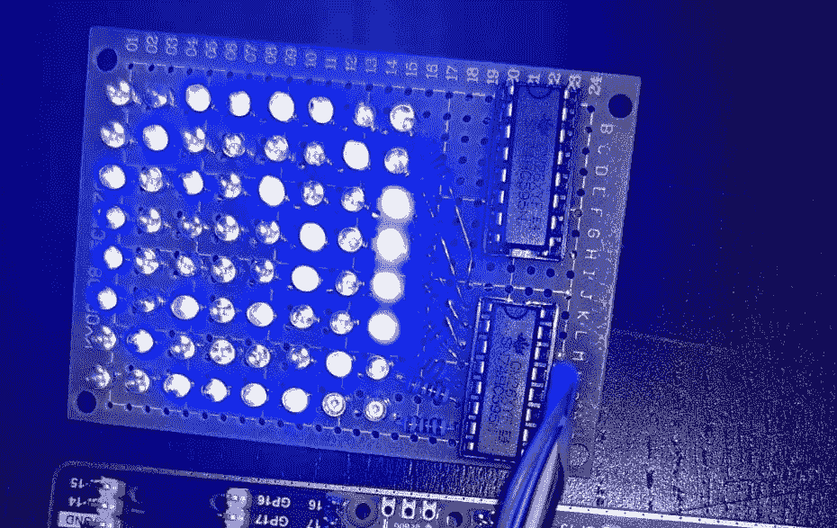

# 从头开始构建 Raspberry Pi Pico 供电的 8x8 LED 矩阵

> 原文：<https://medium.com/nerd-for-tech/build-a-raspberry-pi-pico-powered-8x8-led-matrix-from-scratch-8caf9ef04116?source=collection_archive---------0----------------------->

有很多 LED 矩阵教程，但大多数都使用 Arduino。由于 Raspberry Pi Pico 是一个较小的微控制器，而且相对便宜，所以我决定用它来创建一个 LED 矩阵。

# 硬件计划

驱动 LED 矩阵最常见的方式是使用移位寄存器 74HC595 ( [数据表](https://www.ti.com/lit/gpn/sn74hc595))。