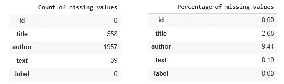
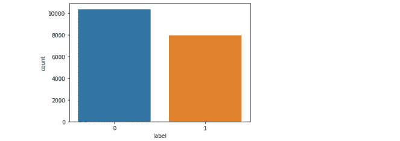
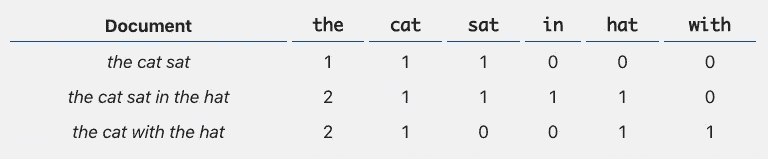
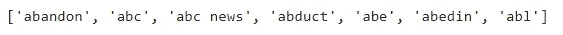
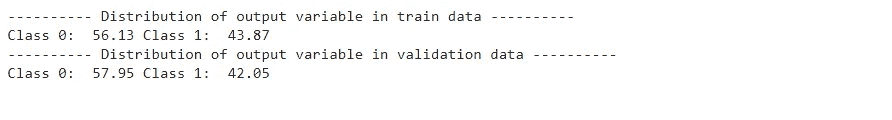
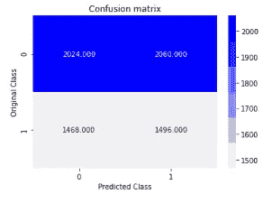
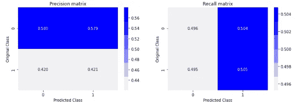
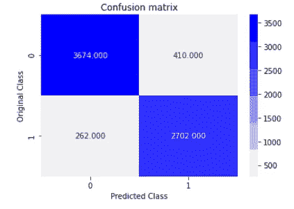
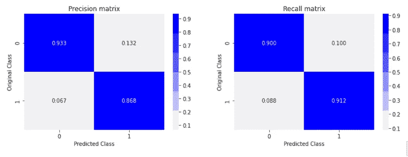
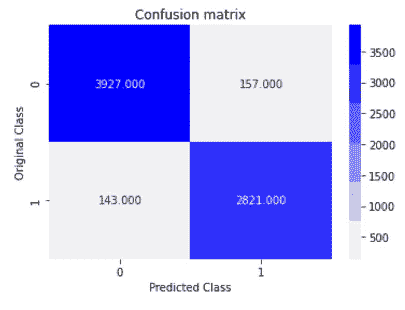

# 建立识别假新闻文章的系统！

> 原文：<https://medium.com/nerd-for-tech/build-a-system-to-identify-fake-news-articles-6604968043cb?source=collection_archive---------10----------------------->

## 使用文本分析和经典的机器学习方法解决现实世界的问题！


与报纸、杂志、广播和电视等传统大众媒体相比，假新闻的普遍传播是社交网络传播新闻扩张的副作用。人类分辨真假事实的效率低下暴露了假新闻对逻辑真理、民主、新闻和政府机构公信力的威胁。

信息的真实性是其完整性的重要组成部分。对假新闻的打击使得应用层对社交网络信息和数据消费的完整性和准确性检查变得不可分割。虚假内容的披露意味着处理和网络资源的浪费。此外，它还对所提供服务的信息完整性和可信度构成了严重威胁。因此，不真实信息的分享关系到应用于新闻传播的**信任质量(QoT)** ，指的是用户对特定来源的内容的信任程度。


在这篇文章中，我们调查了用自然语言预处理数据、矢量化、降维、机器学习和信息检索质量评估的方法。我们也将假新闻的识别置于语境中。

## 商业问题

开发一个机器学习程序来识别一篇文章何时可能是假新闻。

## 用户指南

[**Colab 笔记本**](https://github.com/Priyanka-Dandale/Fake-News-Kaggle-Competition) 可以在我的 [GitHub](https://github.com/Priyanka-Dandale/Fake-News-Kaggle-Competition) 仓库中获得这个真实世界的用例！

## 理解数据

您可以从[***Kaggle***](https://www.kaggle.com/c/fake-news/data)***下载用例的数据集。***

***什么是假新闻？—*** 假新闻一词最初指的是在相关新闻的幌子下传播的虚假且经常是耸人听闻的信息。然而，这个词的用法已经发生了变化，现在被认为是社交媒体上传播虚假信息的同义词。值得注意的是，根据谷歌趋势，“假新闻”一词在 2017 年非常流行。

> 假新闻被定义为故意和明显虚假的新闻，或任何呈现为事实上不正确的新闻的信息，旨在误导新闻消费者相信它是真实的。

## **数据概述**

数据将在一个文件*中总共有 20800 个*个观测值或行数。它包含 ***5* 列** : id(新闻文章的唯一 id)、title(新闻文章的标题)、author(新闻文章的作者)、text(文章的正文；可能是不完整的)、标签(将物品标记为潜在不可靠的标签)，用 1(不可靠或伪造)或 0(可靠)表示。**

****

**前 10 个数据观察**

```
**import pandas as pd
df = pd.read_csv(r"/content/train.csv",error_bad_lines=False)# error_bad_lines=False -- cause the offending lines to be skipped.print(df.shape)# first 10 lines of the dataprint(df.head(10))**
```

## **ML 问题的类型**

**这是一个 ***二元分类问题*** ，对于一篇给定的新闻文章，我们需要预测它是否可靠。**

## **基本探索性数据分析**

*****训练的观测值总数是多少？****——*20800*。***

*****数据中是否有缺失值？*****

****

*   **缺失值的百分比更小，因此我们可以丢弃那些观察值。**

```
**# Count of missing valuesprint(pd.DataFrame(df.isnull().sum(),columns=['Count of missing values']))# Percentage of missing valuesprint(pd.DataFrame(round(df.isnull().sum()*100/df.shape[0],2),columns=['Percentage of missing values']))# Drop missing observations
df.dropna(inplace=True)
print(df.shape)#resetting the index after dropping missing rows
df.reset_index(inplace=False,drop=True)df.head(10)**
```

*****阶级标签的分布是怎样的？*****

****不可靠文章(假或 1)** 的数量是 7924 篇，**可靠文章(0)** 的数量是 10361 篇，数据不符合不平衡情况，但几乎 43%的文章是假的！😥**

****

```
**import seaborn as sns
sns.countplot(x = df['label']);print("1 : Unreliable or fake")
print("0 : Reliable")
print("\nDistribution of labels is:")
print(df.label.value_counts());print(round(df.label.value_counts(normalize=True),2)*100);**
```

*****假新闻文章的常见作者有哪些？*****

****

```
**from wordcloud import WordCloud, STOPWORDS
from os import path
import matplotlib.pyplot as pltdf_unreliable = df[df['label'] == 1]
df_reliable = df[df['label'] == 0]textp_w = df_unreliable['author']
stopwords = set(STOPWORDS)print ("Word Cloud for Authors of Fake news articles:")
wordcloud = WordCloud().generate(' '.join(textp_w))
plt.figure(figsize=(10,10))# Generate plot
plt.imshow(wordcloud)
plt.axis("off")
plt.show()**
```

*****哪些是可靠新闻文章的常见作者？*****

****

```
**textp_w = df_reliable['author']
stopwords = set(STOPWORDS)print ("Word Cloud for Authors of Reliable news articles:")
wordcloud = WordCloud().generate(' '.join(textp_w))
plt.figure(figsize=(10,10))# Generate plot
plt.imshow(wordcloud)
plt.axis("off")
plt.show()**
```

## **数据预处理**

*****为什么我们需要将文本数据转换成数值数据？*****

*   **计算机只理解数字。**
*   **一旦我们将文本转换成向量，我们就可以利用线性代数的优点。**

**在我们继续之前，让我们先了解一下本帖中会经常用到的两个术语。**

*   ****文档** -它只是一个包含文本数据的文件。就数据集而言，每个记录或数据点都可以被视为一个文档。**
*   ****文集** -一组文档被称为一个文集。就数据集而言，整个数据点或整个数据集可以被认为是一个语料库。**

**现在我们可以走了！！**

**文本预处理的第一步是从“标题”特征中去除特殊字符、词干和停用词。如果你想了解如何在文本预处理上执行上述步骤，那么请查阅 [**Colab 笔记本**](https://github.com/Priyanka-Dandale/Fake-News-Kaggle-Competition) **。我已经用一个例子解释了这些步骤！****

> **注意:对于预处理和模型构建，我只考虑了“标题”和“标签”特性。您还可以包括其他功能。我尝试过保留“文本”,但是性能指标是不可靠的！**

```
**import nltk
nltk.download('stopwords')
import re
from nltk.corpus import stopwordsSTOP_WORDS = stopwords.words("english")
from tqdm import tqdmdef preprocess(documents):
    corpus=[]
    sentences=[]
    for i in tqdm(range(0,len(documents))):
         news = re.sub('[^a-zA-Z]',' ', documents['title'][i])
         news = news.lower()
         tokens = news.split()
         words = [PorterStemmer().stem(token) for token in tokens if    
         token not in set(stopwords.words('english'))] sentences =' '.join(words)
         corpus.append(sentences)
   return corpus
corpus = preprocess(df)**
```

**执行上述预处理步骤后，我们需要将数据转换为数字。为此，我们将使用简单的[****【弓形】****](https://machinelearningmastery.com/gentle-introduction-bag-words-model/) **的方法。****

## ****基于词包的特征提取****

****单词包是描述单词在文档中出现的文本表示。它涉及两件事:****

*   ****已知单词的词汇表。****
*   ****已知单词存在的一种度量。****

****它被称为单词的***包*，因为任何关于文档中单词的顺序或结构的信息都被丢弃了。该模型只关心已知单词是否出现在文档中，而不关心它在文档中的位置。******

> ****句子和文档的一个非常常见的特征提取过程是单词袋方法。在这种方法中，我们查看文本中单词的直方图，即将每个单词计数视为一个特征。****

****让我们从下面的例子中了解一下:****

********

****这里，cat、sat、in、hat、with 是 3 个文档的 6 个特征，条目是这些特征的频率。很简单。不是吗？****

```
****from sklearn.feature_extraction.text import CountVectorizercv = CountVectorizer(max_features=5000,ngram_range=(1,3))
X = cv.fit_transform(corpus).toarray()print(X.shape)
print(cv.get_featurbe_names()[0:7])****
```

****我们将从弓上获得 5000 个特征。****

********

****7 大功能名称****

## ******列车测试分割******

****这里，我们将以 75:25 的比例将我们的数据分成训练验证(测试)。列车数据中的数据点数: *21141* 和验证数据中的数据点数: *7048* 。****

****在将数据分成训练和验证之后，我们将得到下面的类标签分布，这表明数据不遵循不平衡标准。****

********

```
****y_true = df['label']from sklearn.model_selection import train_test_splitX_train,X_test, y_train, y_test = train_test_split(X, y_true, test_size=0.25, random_state=42)print("Number of data points in train data :",X_train.shape)
print("Number of data points in validation data :",X_test.shape)from collections import Counter
print("-"*10, "Distribution of output variable in train data", "-"*10)train_distr = Counter(y_train)
train_len = len(y_train)print("Class 0: ",round(int(train_distr[0])*100/train_len,2),"Class 1: ", round(int(train_distr[1])*100/train_len,2))print("-"*10, "Distribution of output variable in validation data", "-"*10)test_distr = Counter(y_test)
test_len = len(y_test)print("Class 0: ",round(int(test_distr[0])*100/test_len,2), "Class 1: ",round(int(test_distr[1])*100/test_len,2))****
```

## ****随机基线模型****

****基线预测算法提供了一组预测，您可以像对问题的任何预测一样对这些预测进行评估，例如分类准确性或损失。随机预测算法预测在训练数据中观察到的随机结果。这意味着随机模型随机预测标签 0 或 1。当评估所有其他机器学习算法时，这些算法的分数提供了所需的比较点…****

> ******使用随机模型的验证数据的准确度为 50%。**大量提高精度的示波器！****

****************

```
****from sklearn import metrics
from sklearn.metrics import confusion_matrix
from sklearn.metrics.classification import accuracy_score
import numpy as np
import matplotlib.pyplot as plt
import seaborn as sns# we create a output array that has exactly same size as the CV datapredicted_y = np.zeros((test_len,2))
for i in range(test_len):
    rand_probs = np.random.rand(1,2)
    predicted_y[i] = ((rand_probs/sum(sum(rand_probs)))[0])predicted_y =np.argmax(predicted_y, axis=1)print("Accuracy on Validation Data using Random Model",round(accuracy_score(y_test, predicted_y),2))
plot_confusion_matrix(y_test, predicted_y)****
```

## ****多项式朴素贝叶斯分类器****

****多项式朴素贝叶斯算法是一种概率学习方法，主要用于自然语言处理。该算法基于贝叶斯定理，并预测文本(如一封电子邮件或一篇报纸文章)的标签。它计算给定样本中每个标签的概率，然后将概率最高的标签作为输出。****

****朴素贝叶斯分类器是许多算法的集合，其中所有算法共享一个共同的原则，即被分类的每个特征与任何其他特征都不相关。一个特征的存在与否不影响另一个特征的存在与否。****

> ******使用 MNB 模型对列车数据的准确率为 92%******
> 
> ******使用 MNB 模型验证数据的准确率为 90%******

****************

```
****from sklearn.naive_bayes import MultinomialNBclassifier=MultinomialNB()
classifier.fit(X_train,y_train)predicted_y_train = classifier.predict_proba(X_train)
predicted_y_train = np.argmax(predicted_y_train,axis=1)print("Accuracy on Train Data using NB Model",round(metrics.accuracy_score(y_train, predicted_y_train),2))predict_y = classifier.predict_proba(X_test)
predicted_y =np.argmax(predict_y,axis=1)#print("Total number of validation data points :", len(predicted_y))print("Accuracy on Validation Data using NB Model",round(metrics.accuracy_score(y_test,predicted_y),2))# Go to Colab notebook for plot_confusion_matrix function
plot_confusion_matrix(y_test, predicted_y)****
```

## ****被动主动分类器****

****被动攻击算法一般用于大规模学习。这是少数在线学习算法之一。在在线 ML 算法中，输入数据按顺序出现，ML 模型逐步更新。这在存在大量数据的情况下非常有用，并且由于数据的庞大，训练数据在计算上是不可行的。我们可以简单地说，在线学习算法将获得一个训练样本，更新分类器，然后丢弃该样本。一个很好的例子是检测 Twitter 上的假新闻，那里每秒钟都有新数据被添加进来。****

*******这个算法是怎么实现的？*******

****简单来说:****

*   ******被动:**为了正确预测，保持模型，不做任何改变。****
*   ******积极的:**对于不正确的预测，对模型做出改变可能是对模型的某种改变，可以纠正它。****

****要了解更多关于这种算法背后的数学知识，我推荐观看由 Victor Lavrenko 博士制作的关于这种算法工作的精彩视频。****

> ******使用被动回归模型对列车数据的准确率为 100%******
> 
> ******被动回归模型验证数据的准确率为 96%******

****************

```
****from sklearn.linear_model import PassiveAggressiveClassifierlinear_clf=PassiveAggressiveClassifier()# Fitting model
linear_clf.fit(X_train, y_train)predictions=linear_clf.predict(X_test)
predicted_y_train = linear_clf.predict(X_train)print("Accuracy on Train Data using PassiveAgressive Model",round(metrics.accuracy_score(y_train, predicted_y_train),2))pred = linear_clf.predict(X_test)print("Total number of validation data points :", len(predicted_y))
print("Accuracy on Validation Data using PassiveAgressive Model",round(metrics.accuracy_score(y_test,pred),2))plot_confusion_matrix(y_test, pred)****
```

****感谢你阅读❤****

## ****参考****

*   ******文字袋模型**简介作者— [**杰森·布朗利**](https://machinelearningmastery.com/author/jasonb/)****

## ****资源****

*   ******Kaggle 竞赛—**[**https://www.kaggle.com/c/fake-news/data**](https://www.kaggle.com/c/fake-news/data)**。******

****__________________________________________________________________****

****对于任何建议或疑问，请在下面留下您的评论，并关注更新。****

****如果你喜欢这篇文章，请点击👏图标来支持它。这将有助于其他媒体用户找到它。分享一下，让别人也能看！****

****快乐学习！😊****