# 用 Flutter 构建 Android 应用程序:Windows 用户初学者指南

> 原文：<https://medium.com/nerd-for-tech/build-an-android-app-with-flutter-a-beginners-guide-for-windows-users-2c79ff9fb6ab?source=collection_archive---------8----------------------->

谷歌在 2017 年推出了开源 with Flutter，此后一直越来越受欢迎。根据 2020 年栈溢出调查， **Dart，用于在 Flutter 中开发应用的面向对象语言，在“最受开发者喜爱的编程语言”类别**中排名第七，仅高于 C#、Swift 和 JavaScript。你可以点击查看昆西·拉森对堆栈溢出调查[的分析。](https://www.freecodecamp.org/news/stack-overflow-developer-survey-2020-programming-language-framework-salary-data/)

当然，Flutter 的优势在于它能够使用一个代码库进行 Android 和 IOS 开发，但对简单性的强调也值得称赞。我的意思是将小部件包装在小部件中的概念，以拼凑一个既美观又易用的应用程序。

如果你想开始学习 Flutter 和 Dart，请跟我来，让我知道这是否有帮助！

# **安装**

1.  在这里安装颤振。记住你把它安装在电脑的什么地方。
2.  在 Flutter 控制台中使用命令`flutter doctor.`运行 Flutter doctor，这将完成您的下载，并告诉您安装有问题，这与 Android Studio 没有安装有关。在步骤 3 中安装它。

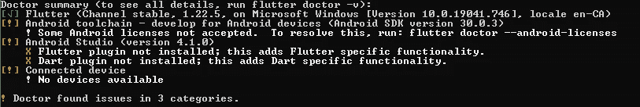

Flutter Doctor 为用户总结了完成设置需要安装的内容

3.在这里安装 Android Studio

4.运行 Android Studio。转到*文件>设置>插件*并搜索 Flutter。安装 Flutter 插件，其中包括 Dart，这对于用户来说非常方便，因为不需要安装 Dart 作为一个单独的 SDK。

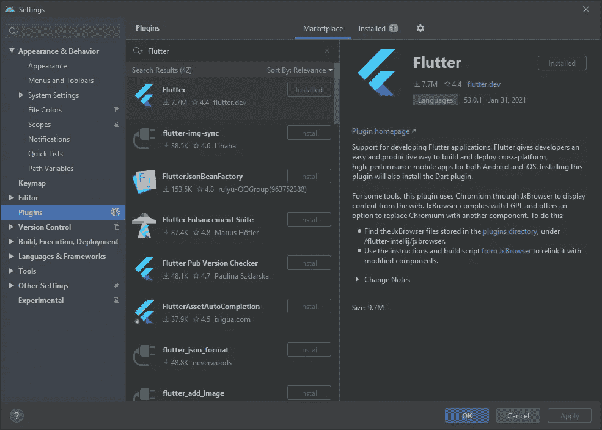

5.开始一个新的颤振项目。进入*文件>新建>新建颤振项目*。

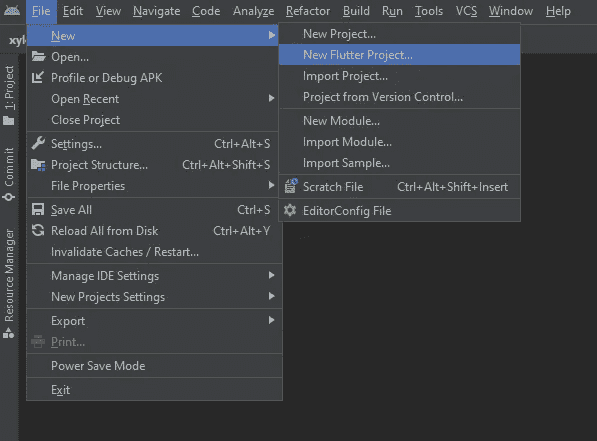

出现提示时，选择颤振应用。接下来，命名您的项目。如果 Flutter SDK 路径是空的，那么您必须在步骤 1 中定位到您安装 Flutter 的位置来输入它。

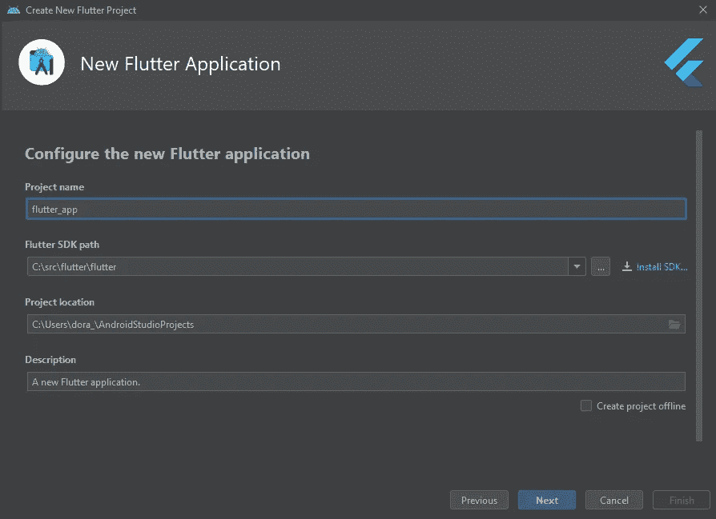

最后，设置您的包名，或者将其保留为 *com.example.flutterapp* 。

6.准备好你的 Android 模拟器，这将允许你看到你的应用程序在移动设备上呈现时的样子。点击 Android Studio 中的 AVD 管理器图标:

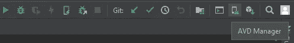

AVD 管理器(从右边数第四个图标)

您可以选择想要模拟的设备和操作系统。**或者，您也可以使用您的真实手机作为模拟器。**用 USB 线将您的设备连接到电脑。在你的设备中找到“内部版本号”并轻按几次，直到一个提示告诉你你已经解锁了“开发者选项”。

对于三星，应该是在*设置>内关于手机>软件信息>建立号码。*当“开发者选项”解锁后，它将显示在*设置*中。

如果提示是否允许计算机访问，请单击“确定”。之后，您应该能够看到您的移动设备作为在 Android Studio 顶部渲染的选择之一。

设置完成！

# **打造应用**

首先我们需要了解什么是 MaterialApp 和 widgets。

**MaterialApp** 是一个组件，它让我们可以访问美化我们的应用程序的元素，比如调色板。实现 MaterialApp 类允许我们使用 [Material Design](https://material.io/design) ，一个 Google UI 设计系统。

小部件是构成我们应用程序主干的部分，具有进一步改变其功能或外观的属性。最后你会得到一个叫做部件树的东西，它只是一个描述部件网络的图表。

让我们开始制作一个应用程序的页面。

1.  新的 Flutter 项目总是在`main.dart`文件中带有样板代码供您使用。将代码替换为:

```
import 'package:flutter/material.dart';

void main() {
  runApp(MaterialApp());
}
```

我们导入`material.dart`来使用 MaterialApp 类。`Void main`表示计算机应该从哪里开始运行程序。

2.在应用程序的主位置添加一个`Scaffold()`小部件。脚手架小部件帮助我们形成一个布局结构。

3.要添加带有文本的应用程序栏(应用程序的标题)，我们首先用小部件`Appbar()`添加属性`appbar`。然后用小部件`Text()`添加属性`title`。在文本小部件中输入任意字符串。在这种情况下，我添加了“我们的应用程序”。

```
import 'package:flutter/material.dart';

void main() {
  runApp(
    MaterialApp(
      home: Scaffold(
        appBar: AppBar(
          title: Text('Our App'),),),),
  );
}
```

我们的代码看起来非常混乱。Flutter 有一个功能可以帮助我们重新格式化代码。在每个括号后面加一个逗号，然后用鼠标右键单击。选择“用 dartfmt 重新格式化代码”。

重新格式化后:

```
import 'package:flutter/material.dart';

void main() {
  runApp(
    MaterialApp(
      home: Scaffold(
        appBar: AppBar(
          title: Text('Our App'),
        ),
      ),
    ),
  );
}
```

4.让我们为我们的应用程序栏增添色彩。在文本小部件后面的逗号之后，使用带有句点的值为`Colors.`的属性`backgroundColor`。这段时间将打开一个调色板，你可以从中选择一种颜色。将鼠标悬停在您选择的颜色上，不同的颜色深浅会显示出来，供您进一步定制 outlook。

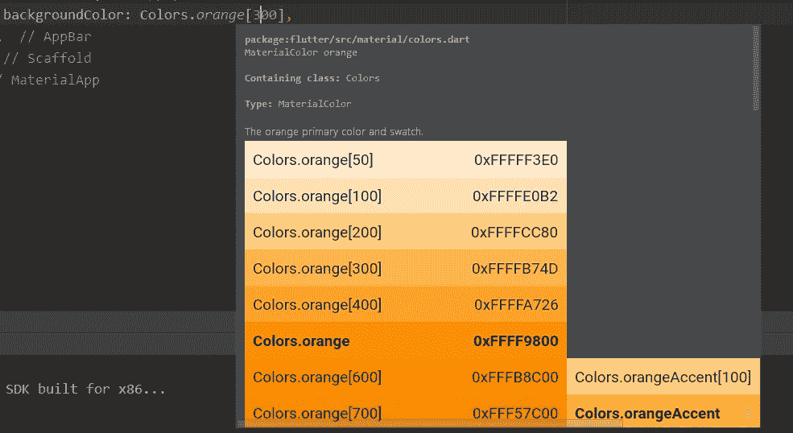

在颜色旁边的方括号中输入数字。例如，`Colors.orange[300]`。

5.向应用程序的主体添加图像。首先折叠 appbar 行。你可以按下这条线旁边的减号。然后，添加一个`body`属性和一个图像小部件。

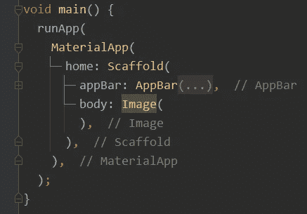

图像可以来自本地文件，也可以来自互联网。使用属性`image`然后:

*   **来自互联网**:数值`NetworkImage()`。在括号内，输入带有源 url 的字符串
*   **来自本地文件**:数值`Image.asset()`。在项目目录下创建一个名为 images 的目录。将图像文件添加到图像目录中。转到`pubspec.yaml`文件，在“资产”下输入您的图像路径。确保单词“assets”前有两个空格，图像路径前的破折号前有两个空格。在`Image.asset()`的括号内，输入带有图像路径的字符串。

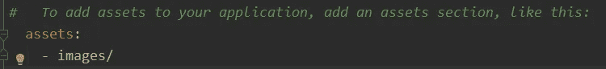

6.让我们的形象居中。快速的方法是将插入点，也就是输入光标，移动到`Image()`小部件的中间。

按 ALT + Enter。应该会出现一个意向列表。选择“用小部件包装”，然后键入`Center`使用`Center()` 小部件。

7.根据定制的不同，我们的最终代码应该如下所示:

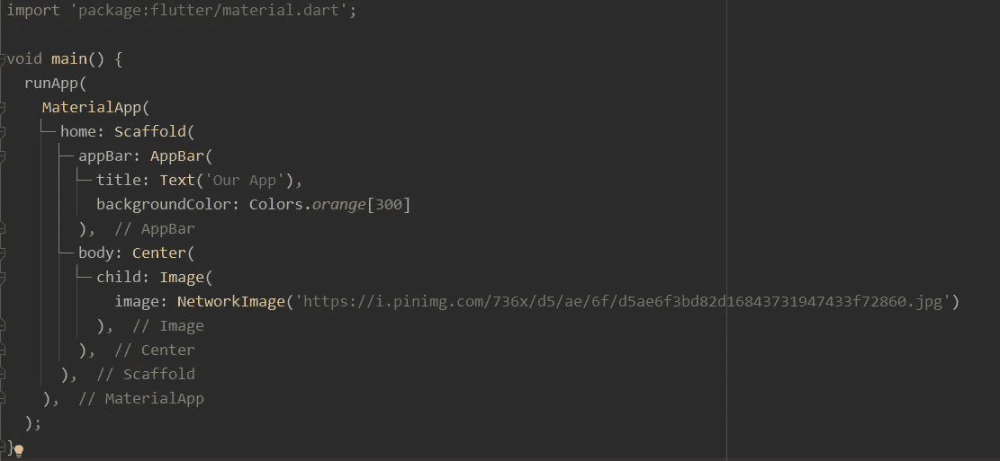

8.在模拟器上运行这个程序，看看效果如何！如果您想在您的物理设备上运行，请确保在窗口顶部的下拉列表中选择您的移动设备。单击绿色三角形图标运行。

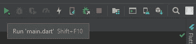

**我们的页面完成了！**

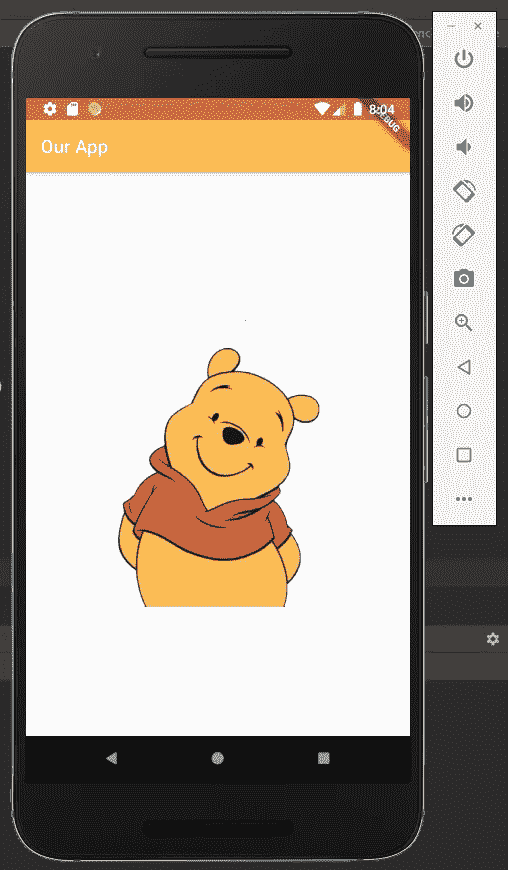