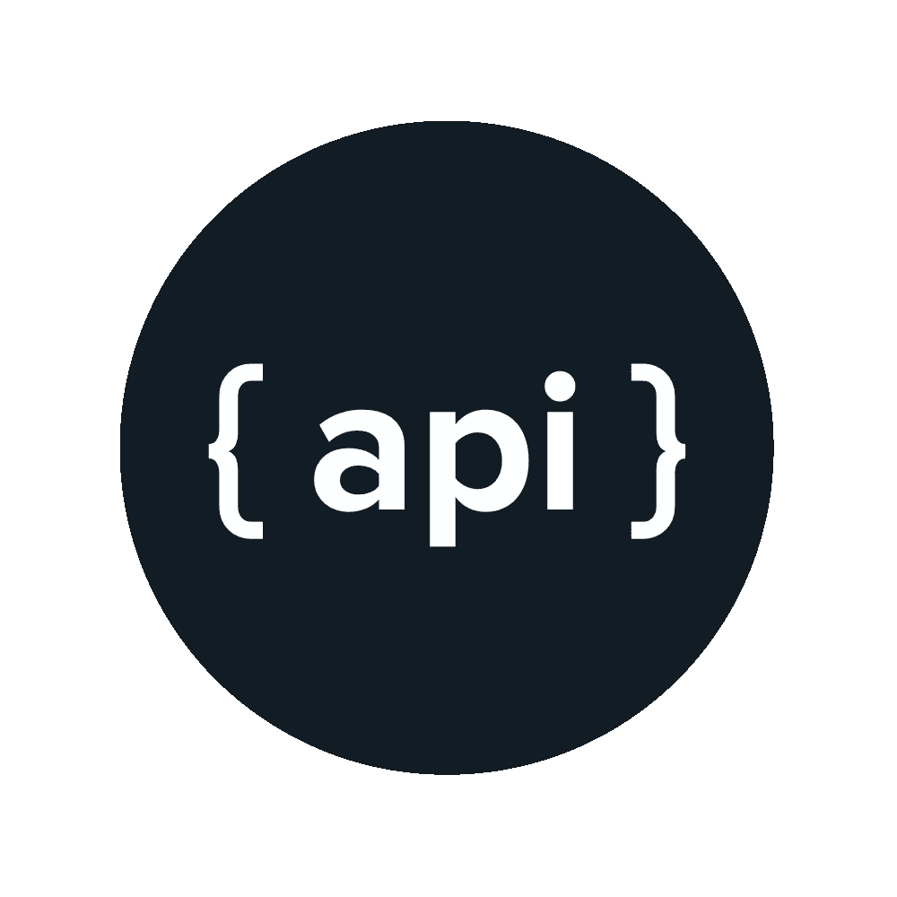

# 构建你不会讨厌的 API

> 原文：<https://medium.com/nerd-for-tech/build-apis-you-wont-hate-21ce27e03351?source=collection_archive---------3----------------------->



应用编程接口或 API 是软件的接口。软件应用程序使用 API 的方式与人类使用应用程序和其他软件的界面的方式非常相似。

今天，以 API 为中心的架构正在崛起，我们比以往任何时候都在构建大量的 API。大多数 Android 和 iPhone 应用程序的前端 javascript 框架都使用 API。一方面，您从数据源获取数据，并以 JSON 的形式显示出来，但是要经受住业务逻辑、数据库模式更新、新特性或不赞成使用的端点等方面的变化会变得非常困难。

当我为我的公司构建一些 API 时，我会利用 Laravel 的雄辩的 ORM、路由、迁移、播种等等。但是随着一些业务逻辑的改变，我会发现很难适应我的 API，我为此奋斗了很久。我对一些 API 的编写方式不满意，我想重新设计它。

在做一个简单的谷歌搜索编写 API 的最佳实践是什么的时候，我看到了菲尔·斯特金写的书 [**《构建你不会讨厌的 API》**](https://www.amazon.in/Build-APIs-You-Wont-Hate-ebook/dp/B07HNFVRNH/ref=sr_1_1?ie=UTF8&qid=1549163352&sr=8-1&keywords=phil+sturgeon)。我读了这本书，理解了一些可以让我的 API 更好的方法，我按照书中提到的所有规则重新设计了我的 API。在这之后，我成了一个快乐的开发者。

在这个故事中，我将给出我从书中学到的一些想法，这些想法帮助我在我们的项目中编写更好的 API。

# #1 用复数命名 API 的路由

例如，给定端点 */place/1* 和 */place* ，最后一个端点返回哪个位置？。当我们对一个端点使用一个单一的名字时，会混淆路由实际返回的内容。所以对端点使用复数名称将有助于更好的理解，并且可以一致地命名子资源。

*   /places-获取地点集合
*   /places/45 —获得一个位置 45
*   /places/45，24 —获取位置 45 和 24

这就解决了很多歧义。

# #2 响应采用 JSON 格式

您可以根据项目需求支持多种响应格式，比如 JSON 或 XML。但是我觉得 JSON 格式的回复更加清晰易读。JSON 更擅长存储类型，占用的空间也更小。

```
{
 "place": {
 "id" : 1,
 "name": "This is a bunch of text.",
 "is_true": false,
 "maybe": null,
 }
}
```

# #3 内容结构

我想没有正确的方法来显示你的数据。有些人会因为这不是他们喜欢的结构而感到恼火。当我们显示单个项目或多个项目时，我们在项目中遵循以下格式:

```
# for multiple items
{
  **"data"**:[
      {
          **"name"**: **"Batman"**,
          **"id"**: 10002,
      },
      {
          **"name"**: **"Superman"**,
          **"id"**: 10003,
      },
  ]
}# for single items
{
  **"data"**:[
      {
          **"name"**: **"Batman"**,
          **"id"**: 10002,
      }
  ]
}
```

这种格式的优点是，响应是一致的，并且总是具有相同的结构。此外，还有分页和一些元数据的空间。

缺点是，一些客户端不喜欢数组中的单个响应。

在书中，作者建议以下面的格式命名单个项目，而不是返回数组中的单个项目:

```
{
  **"data"**:
      {
          **"name"**: **"Batman"**,
          **"id"**: 10002,
      }
}
```

这也是一个很好的方法，但是为了一致性，我在我的项目中在一个数组中同时返回单个和多个项。

# #4 使用带有错误代码的 HTTP 代码

显示错误信息时，不要将 200 OK 代码和错误信息一起使用。使用 HTTP 4xx 或 5xx，这将提醒客户端发生了不好的事情，如果客户端感兴趣，错误代码会提供确切问题的细节。使用不同的 HTTP 代码，不要对所有错误过度使用 4XX HTTP 代码。

```
{
    **"error"**:{
        **"code"**: 1024,//custome error code of your application
        **"message"**:**"You do not have authorization to use this resource",// custom error message** }
}# display this error response with 403(Forbidden) HTTP code
```

如上例所示，使用自定义错误代码和 HTTP 代码。

# #5 分页

当你为一个用户界面构建一个 API 时，很快就会需要分页。而且我们不考虑分页，我们的用户界面将很难加载所有的数据，页面可能会没有反应。因此，在开发 API 时，为 API 中的分页留出空间是很重要的。

这是我从书中学到的几个要点。你可以在这里阅读菲尔·斯特金的 [**一书**](https://www.amazon.in/Build-APIs-You-Wont-Hate-ebook/dp/B07HNFVRNH/ref=sr_1_1?ie=UTF8&qid=1549163352&sr=8-1&keywords=phil+sturgeon) ，获得更多关于如何构建一个你不会讨厌的 API 的见解。

*感谢阅读！！。*