# 使用 Firebase 托管 Flutter Web 项目

> 原文：<https://medium.com/nerd-for-tech/build-deploy-and-host-flutter-web-projects-using-firebase-f32d5a180b59?source=collection_archive---------14----------------------->

这篇文章帮助你用简单的步骤部署和托管 flutter web 项目。希望你已经安装了 **Flutter** 并且你的项目在本地运行。如果你是新手，先从[教程](https://flutter.dev/docs/get-started/install)学习 Flutter。

# **先决条件**

如果您的项目是在启用 flutter web 之前创建的，那么您的项目需要一个带有`index.html`文件的 web 文件夹的副本。如果根目录中没有 web 文件夹，请运行以下命令创建一个:

```
flutter create .
```

如果您在启用 web 后创建了一个项目，它会自动为您创建`web/index.html`文件。

**注意:如果您已经完成了，您可以跳过这些步骤。** 开始了:

# **第一步:创建 Firebase 项目**

您可以从浏览器的 [firebase 控制台](https://console.firebase.google.com/u/0/)创建它，也可以从终端创建它，这将在后续步骤中显示。


创建 firebase 项目，如上图所示，点击**创建**，然后**禁用谷歌分析**，进入第二张图片。之后点击**创建项目**并保持几秒钟，在下面的最后一张图片之后进入**第二步。**

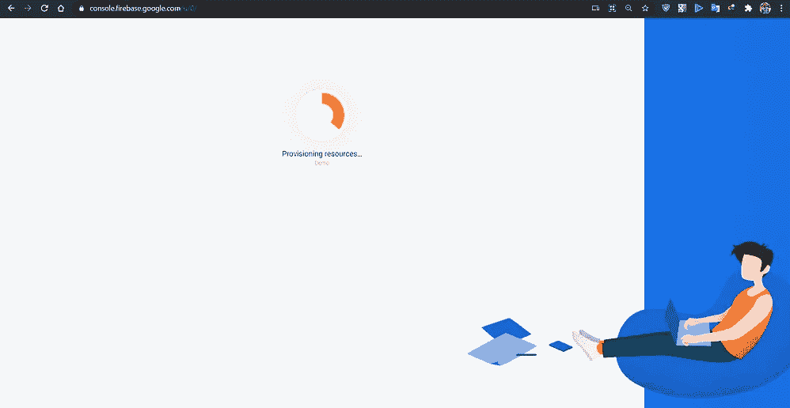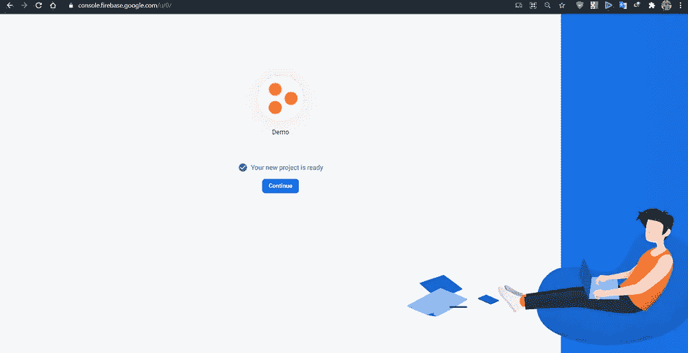

# 第二步:安装 Firebase-tools CLI

如果你的电脑上没有安装 npm(node.js ),那么[安装](https://nodejs.org/en/download/)它。安装 npm 后，运行以下命令来安装 firebase-tools。

```
npm install -g firebase-tools
```

运行后，firebase-tools 将安装在您的电脑上。

# **第三步:初始化 Firebase 来托管你的 web 应用**

> **👉Firebase 登录** 首先在终端中导航到项目的根目录，运行下面的命令来检查您是否登录，并了解哪个帐户登录了。

```
firebase login
```

运行此命令后，您可能会得到一些错误消息:

`firebase : File C:\Users\mada7\AppData\Roaming\npm\firebase.ps1 cannot be loaded because running scripts is disabled on this system. For more information, see about_Execution_Policies at https:/go.microsoft.com/fwlink/?LinkID=135170\. At line:1 char:1
firebase + CategoryInfo : SecurityError: (:) [], PSSecurityException + FullyQualifiedErrorId : UnauthorizedAccess`

要解决这个问题，只需通过访问该本地目录删除 firebase.ps1 文件。从上面的错误，我们已经到了`C:\Users\mada7\AppData\Roaming\npm\firebase.ps1`

并删除 firebase.ps1 文件。
删除后，再次运行上述命令。

> **👉火焰基地初始化** 你必须初始化火焰基地。
> 运行以下命令:

```
firebase init
```

您将看到这样的屏幕👇并按下 **Y**

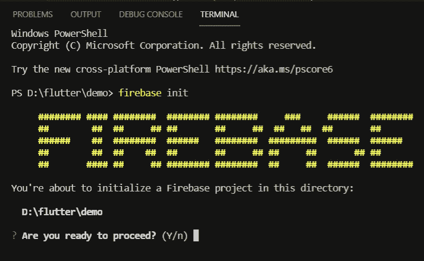

> **👉选择托管**

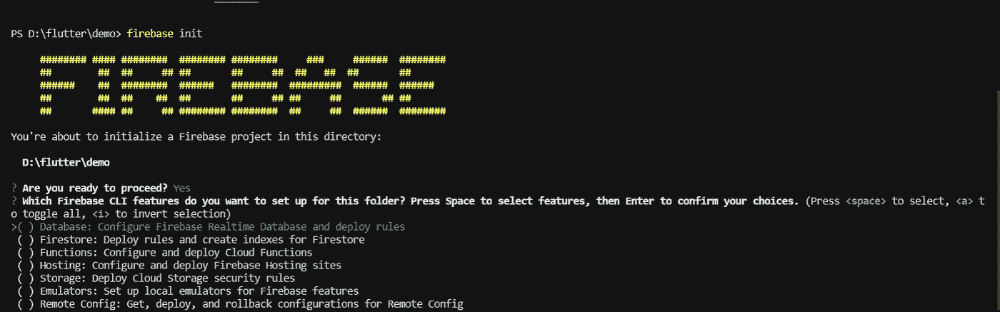

按下 **Y，**后，您将看到此屏幕，并按上下箭头导航至主机选项。


导航到主机选项后，按**空格键**选择该选项，然后按**回车。**你会在屏幕下方看到这个。

> **👉选择项目**

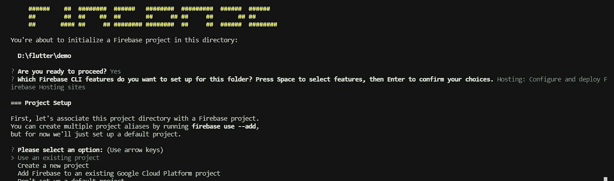

再次使用**向上**和**向下**箭头导航至使用现有项目，并按下**键进入**。
完成上述过程后，您将获得 firebase 帐户中的项目列表，并使用上下箭头选择项目，然后按 enter 键。
因为我们已经在**步骤 I** 中创建了**演示**项目，所以我选择了演示。

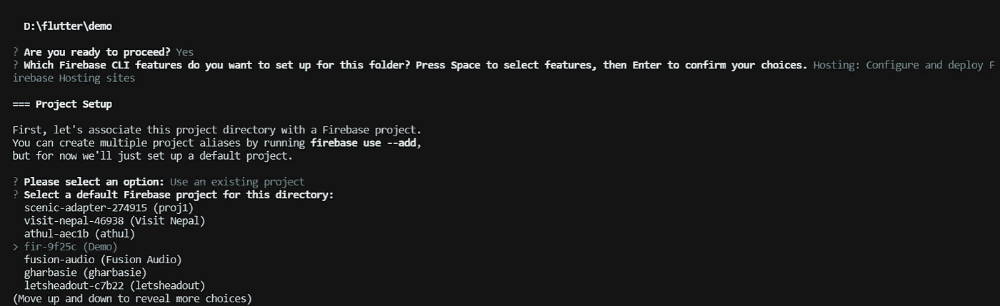

> **👉使用目录**

您将看到这个屏幕询问“**您想将什么用作您的公共目录？**”。在那里输入 **build/web** ，然后按回车键。

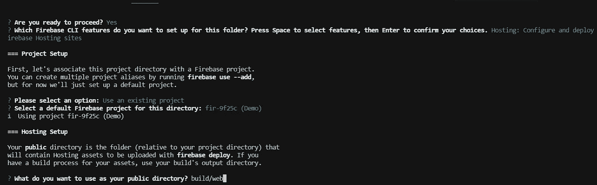

> **👉配置**

在那之后，

*   按“**Y”**配置为单页应用
*   按回车键
*   按下**N**不选择 github 选项。
*   按回车键

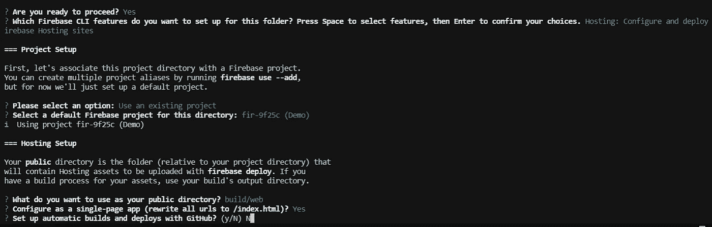

完成上述程序后，两个文件即 **firebase.json** 和**。firebaserc** 将被创建，最后安装过程完成。

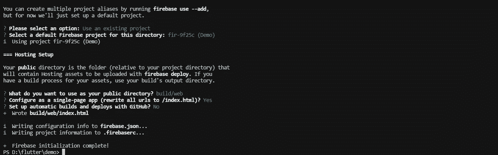

# **第四步:构建网络应用**

在这一步中，您必须运行以下命令来构建 web app。

```
flutter build web
```

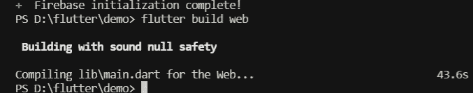

# **步骤五:将 web 应用部署到 firebase**

运行下面的命令将你的 web 应用程序部署到 firebase，最后你会在控制台中得到你托管的 web 应用程序的 url。

```
firebase deploy
```

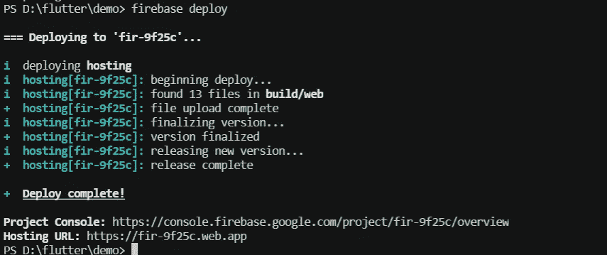

托管文件在 firebase 中完成和托管，并遵循控制台中的 url 链接。通过以上步骤，你的颤振项目将由 firebase 托管。感谢您阅读本文。

你可以联系我 [LinkedIN](https://www.linkedin.com/in/lakshydeep-14/) 然后关注我。
买书**让自己成为软件开发人员:让我们投入到扑扑的&跨国公司**[买书](https://www.amazon.com/dp/B09NNXNT6X/ref=sr_1_1?keywords=make+yourself+the+software&qid=1639582180&sr=8-1)。
敬请反馈。
保持学习和编码。
谢谢！！！