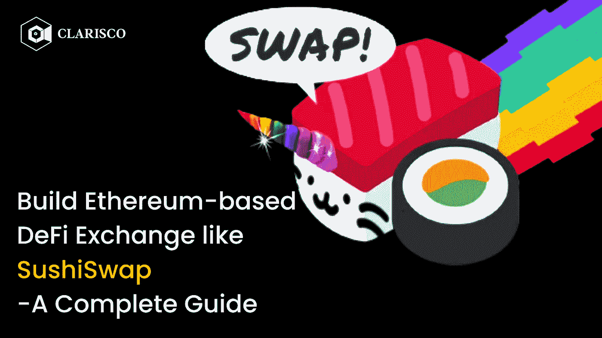
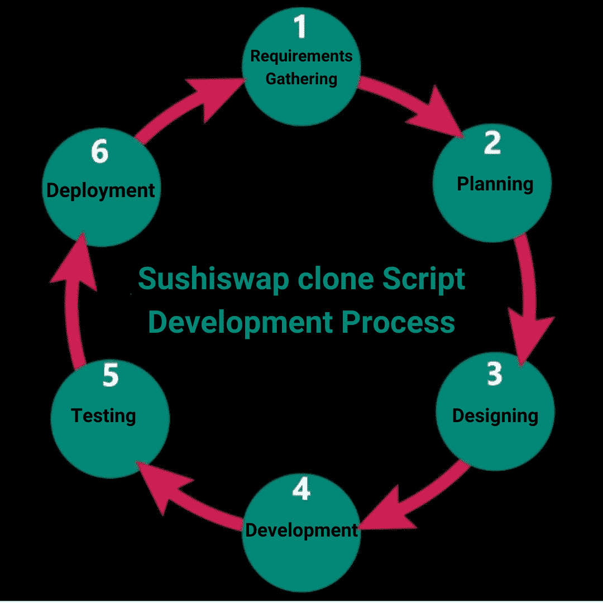

# 像 SushiSwap 一样建立基于以太坊的 DeFi 交换——完全指南

> 原文：<https://medium.com/nerd-for-tech/build-ethereum-based-defi-exchange-like-sushiswap-a-complete-guide-1f3a49ce2163?source=collection_archive---------15----------------------->

Sushiswap 是一个分散的 Defi 软件，被称为“uniswap 的进化”它试图解决当前大多数操作系统中分散的加密交换所带来的挑战。sushiswap 克隆脚本是对 sushiswap 的完全相同的模仿，它通过利用高度受保护的原则和特殊的实用功能提供了一个交易区域。对于 ERC-20 令牌标准交换，像 sushiswap 克隆这样的分散式交换机正在建设中。

使用 sushiswap 克隆软件的用户可以依靠其他用户进行交易，这可以减少在分散式交易所进行交易时可能出现的潜在麻烦。用户可以使用自动做市商功能交换和交易加密令牌，这增加了平台的流动性池。

# **Sushiswap 克隆软件**

SushiSwap 克隆是 sushiSwap 平台的精确复制。SushiSwap 克隆脚本拥有 sushiSwap 平台的所有模块和特性，但是它被打包成一个可以在任何品牌下启动的平台。

建立一个可与 SushiSwap 相媲美的平台有助于企业推出一个现有的成功且受欢迎的平台，该平台可以复制 SushiSwap 的成功，并帮助他们打开新的收入流。

# **你怎么能创建一个像 sushiswap 这样的 Defi 交换？**

从头开始创建:从头创建和实现一个 dex 克隆脚本既耗时又昂贵。因此，许多投资者打算采用预先设计好的 sushiswap 版本作为克隆脚本。创建一个 sushiswap 克隆脚本可以使用 sushiswap 的基本特性进行完美的索引。

创建像 sushiswap 这样的 Defi 交易所是一项明智的投资，将会产生巨大的回报。在启动 sushiswap 克隆之前，您必须执行各种操作。在制作 Sushiswap 克隆之前，您需要做以下工作。

*   拥有出色的商业战略
*   进行市场调查和分析
*   检查你的交换质量
*   创建独特的客户渠道
*   选择区块链网络

# **为什么要建立一个像 sushiswap 克隆软件这样的 DeFi 交易所？**

Sushiswap 克隆脚本是一个定制的、完全去中心化的精英加密交换，100%等同于 Sushiswap 的功能特性和选择。sushiswap 的高级复制品复制了 sushiswap 的精确特征和操作机制。Sushiswap 是一个流行的加密货币交易所，专门用于交易 ERC 20 代币。

Sushiswap 克隆软件由区块链联邦理工学院提供支持，它提供了一个安全的交易环境，用户可以在其中赚取无限的金钱。sushiswap 克隆脚本是完全可适应的，您可以根据自己的需要和业务需求对其进行定制。下面是建立一个新的 DEX 克隆脚本(如 sushiswap)的一些额外优势。

*   仪表板定制
*   可排序的表格
*   每周菜单栏
*   集成分级
*   优先的错误修复
*   迁移的流动性门户
*   有限中继机器人
*   增强型奖励系统
*   Chrome 插件
*   产品组合增强

# **Sushiswap 锥的开发过程:**

# **Sushiswap 克隆脚本:它是如何工作的？**

尖端的 sushi WAP 克隆软件的工作方式与最初的 sushi WAP 平台相同。这个脚本提供了一个吸引人且易于使用的界面，让用户对您的平台保持兴趣。现在，让我们看看 sushiswap 克隆是如何工作的。

*   要参与平台的令牌交换，用户必须首先使用兼容的加密钱包加入，如元掩码钱包、信任钱包或任何其他接受加密钱包。这将有助于用户进行掉期交易并提供流动性。
*   在链接非保管加密钱包后，用户可以选择交易哪些代币或给予流动性以获利。
*   通过选择交换选项，用户可以在 sushiswap 克隆平台中执行无缝和平滑的切换。
*   因为脚本有一个 AMM 模块，用户可以很容易地增加流动性。
*   加入该协议池的用户将获得流动性提供商令牌，这些令牌稍后可能会转化为用户的进一步利益。

这是 sushiswap 克隆的基本操作。

# **Sushiswap 克隆协议**

以下是与高级 sushiswap 克隆相关的协议列表。

*   交换协议
*   高产农业
*   打桩协议
*   自动做市商
*   贷款协议

这个克隆脚本拥有所有这些优秀的协议。

# Sushiswap 克隆的最佳特性

*   建立在最著名的以太坊区块链网络上
*   源代码已经过全面测试，完全可配置。
*   支持多种加密货币钱包。
*   在可行的最短时间内以较低的成本推出一个壮观的 DeFi 交换。
*   使用尖端技术开发

这些都是剧本让人大开眼界的亮点。

# **Sushiswap 克隆软件的好处**

创建像 sushiswap 这样的分散式 exchange 克隆软件有许多独特的特点。sushiswap 克隆脚本是开发基于以太坊的 DEX 克隆脚本的绝佳选择。

# **Sushiswap 商业理念**

汇率利润的 0.25 转入流动性池，0.05%转回平台。

**社区收入分成模式**

sushiswap 社区网络中的所有用户都采用了 sushi 克隆的收入分成概念。

**流动性产品奖励**

为流动性池提供流动性的加密交易者得到奖励，寿司代币被用来提供流动性。

**没有 KYC 政策**

它允许无需授权的交换，允许任何加密交易者参与 sushiswap 克隆脚本的流动性池。

# **Sushiswap 克隆软件**

sushiswap 克隆软件是完全去中心化金融(Defi ),在以太坊区块链网络上运行，智能合约确保交易安全。Sushiswap 克隆软件是一个现成的上市平台，它有助于在一个分散的平台上进行交易，并提供流动性和收入作为交换。

# **白标软件克隆软件**

Sushiswap 是 Uniswap 的一个更复杂的版本。sushiswap 中的令牌是通过智能合约实现的。白色标签 Sushiswap 克隆复制了 Sushiswap 的所有复杂特性和功能。建立一个白标去中心化克隆软件，说服你的密码爱好者群体去赚取无穷无尽的金钱作为交换。

# **如何选择最好的 Sushiswap 克隆软件提供商？**

因为我们生活在数字时代，我们知道在加密领域有超过 100 个克隆脚本供应商。但是，在选择最佳供应商之前，您应该了解几个关键的考虑因素。我附上了一份清单，以帮助你选择一个优秀的软件供应商作为你的技术合作伙伴。

*   投资组合和经验
*   一堆技术
*   意见和建议
*   语言和交流
*   透明开发方法
*   预算
*   免费试用

在选择脚本供应商之前，请考虑这些关键方面。

# **整理完毕**

近年来，分散融资取得了显著进展。人们对 DeFi 部门的兴趣与日俱增。因此，随着区块链以太坊上更多的 DeFi 交易所引入新概念来吸引加密爱好者，对 DeFi 市场的预期变得深不可测。

如果你是一家希望在区块链以太坊推出 DeFi 交易所的加密初创公司，与一家声誉良好的 **SushiSwap 克隆脚本**供应商联系可以帮助你成功开展 DeFi 交易所业务。

我希望这篇文章对你开始 DeFi exchange 商业冒险有用！