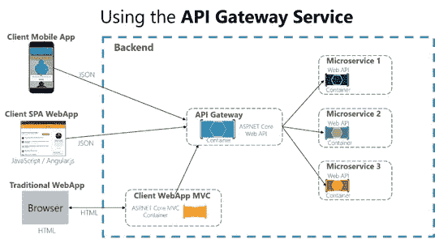
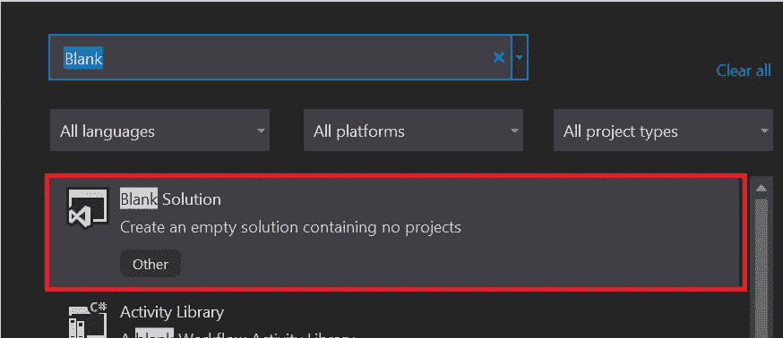
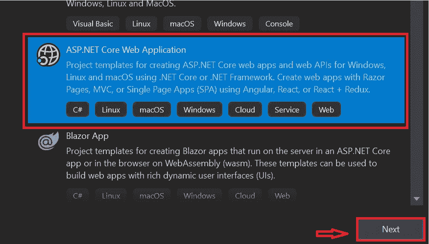
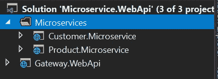
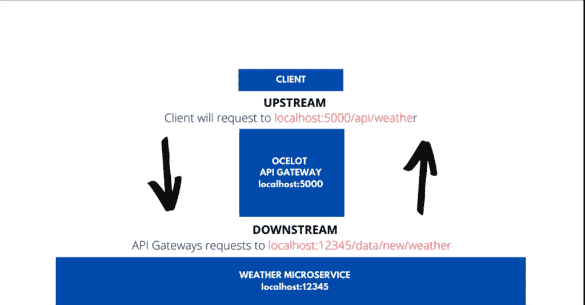
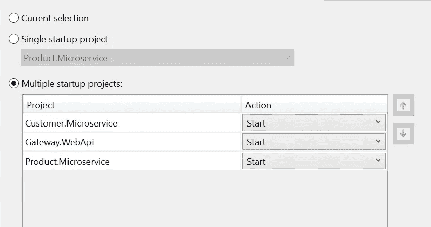
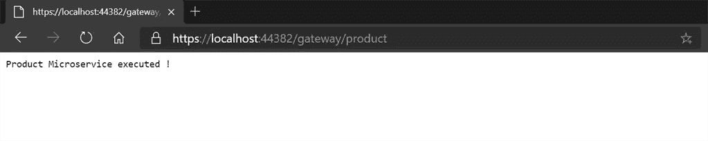
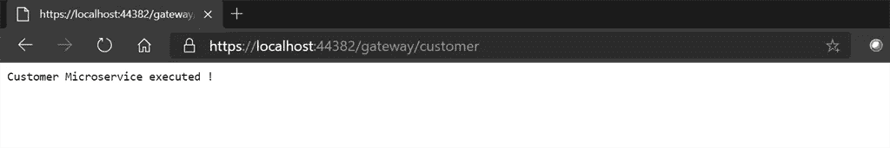

# 用 Ocelot API 网关构建微服务。网络核心

> 原文：<https://medium.com/nerd-for-tech/build-microservices-with-ocelot-api-gateway-in-net-core-d87666a278f4?source=collection_archive---------2----------------------->

Ocelet API 网关微服务

今天我们将学习微服务架构及其在 ASp.Net 核心 3.1 中使用 Ocelot API Gateway 的实现。我们都知道大规模应用使用微服务的好处。

 [## JayKrishnareddy/微服务。WebApi-master

### 微服务架构概述 Monolith 与微服务使用 Ocelot API Gateway 运行和配置微服务…

github.com](https://github.com/JayKrishnareddy/Microservice.WebApi-master) 

# 微服务架构—概述

有两种可能的方法来构建和组织应用程序:

1.  整体建筑
2.  微服务架构

# 整体建筑

Monolith 就像一个大容器，一个 app 的所有软件组件都在里面组装，紧密耦合；即每个组件完全依赖于另一个组件。整体式有优点也有缺点。与微服务相比，整体架构的优势较少。

# 整体材料的缺点:

**发展缓慢**

如果我们修改任何模块或组件，我们需要重新部署整个应用程序，而不是更新它的一部分。在缓慢的开发中消耗更多的时间。

**不可靠**

如果一个服务关闭，那么整个应用程序将停止工作，因为应用程序的所有服务都是相互连接的。

**大型复杂应用**

对于大规模的应用来说，由于相互依赖，很难维护。

它会消耗更多的内存，其中每个组件都将访问整个数据，它会消耗更多的内存，并且还会重新构建应用程序。除此之外，我们需要改变整个应用程序，这使得这个过程有点困难。

# 微服务架构

微服务架构是指一种技术，它通过将应用程序分解为实现特定业务功能的离散服务，为现代开发人员提供了一种设计高度可伸缩、灵活的应用程序的方法。这些服务通常被称为“松散耦合”，可以独立构建、部署和扩展。

**设置项目**

**创建空白溶液**

**创建一个名为 Microservices** 的新解决方案文件夹

> 右键单击微服务文件夹
> 
> 点击添加
> 
> 点击新项目

**创建客户微服务**

> 输入项目名称
> 
> 选择 API 作为模板，我们将继续使用。网芯 3.1 版本。
> 
> 点击创建

**创建产品微服务**

遵循我们为客户微服务所做的相同流程。

**创建 API 网关**

选择 Empty 作为具有相同。网芯 3.1 版本。

**文件夹结构**

**配置 Ocelot API 网关**

这就是 Ocelot API 网关在我们项目中的工作方式。

要了解 Ocelot 及其特性，请点击此链接 [Ocelot API Gateway](https://dzone.com/articles/ocelot-the-api-gateway-framework-for-net#:~:text=Ocelot%20is%20an%20API%20Gateway%20for%20.NET%20platform.,runs%20on%20any%20platform%20supported%20by%20ASP.NET%20Core.)

在网关下安装软件包。WebAPI

> 安装包 Ocelot

在启动时添加配置设置。铯

**Startup.cs**

创建配置。网关下的 Json 文件。WebAPI 来定义微服务所必需的路线。

**配置。Json**

**DownstreampathTemplate —** 定义微服务实际端点的路径

**下游方案**—HTTPS 微服务方案

**DownstreamHostsandPorts—**微服务的主机和端口将在此定义。

**UpstreampathTemplate —** 客户端请求 Ocelot API 网关的路径

**UpstreamHttpmethod—**API 网关支持的 HTTP 方法。基于传入的方法，Ocelot 也向微服务发送类似的 HTTP 方法请求。

让我们测试应用程序，它将在网关下运行。我们已经在 configuration.json 文件中定义的 WebAPI 端口号

**launchsettings.json(网关 API)**

在测试应用程序之前，确保一次性运行多个项目。

> 右键单击解决方案
> 
> 点击属性

运行项目以检查结果。

**输出**

产品微服务—端点

客户微服务—端点

**注**

我还在其中实现了 Swagger 来检查单个微服务的结果。

如果你发现这篇文章对你有帮助，请给它一个👏🏻

继续学习！！！