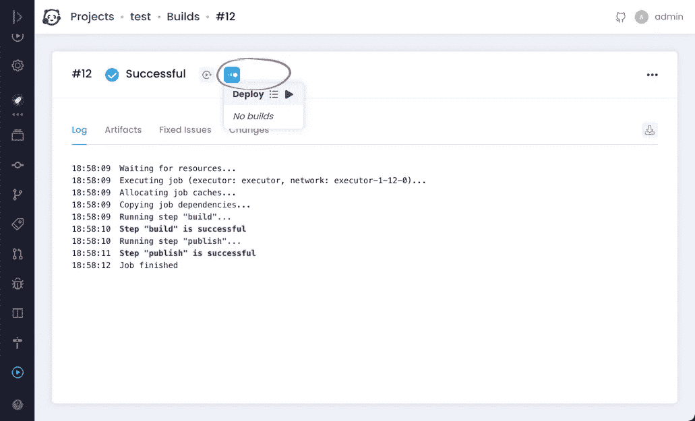
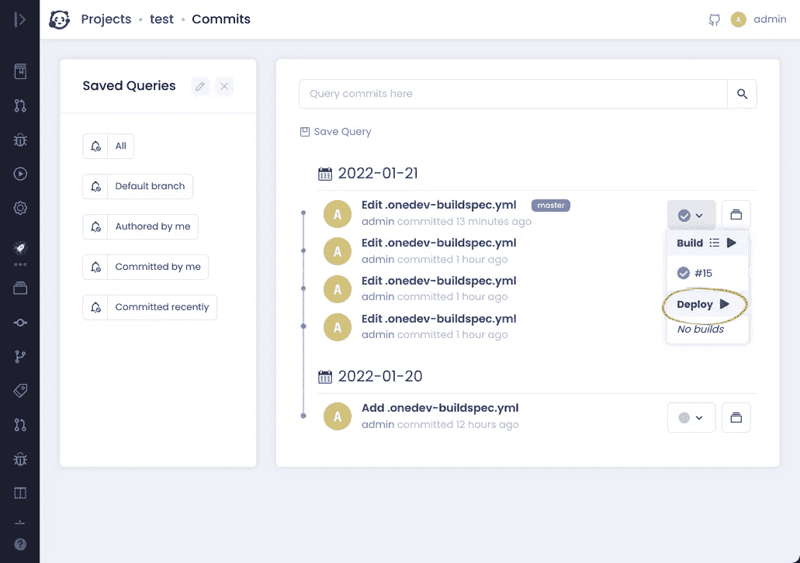

# 使用 OneDev 构建促销

> 原文：<https://medium.com/nerd-for-tech/build-promotion-with-onedev-ce6c275aa1b8?source=collection_archive---------5----------------------->


在 OneDev 中，您可以请求好的/经过验证的构建在管道中进一步处理。这是构建升级，可以从构建详细信息页面完成，如下所示:



上面的升级菜单列出了所有依赖于当前构建的下游作业。作业依赖可以在作业的*依赖&服务*部分定义。对于上面的例子，部署作业依赖于构建作业来检索其发布的工件，以便进一步处理。过度简化的构建规范如下(需要 OneDev 6.2.3 或更高版本):

```
version: 15
jobs:
- name: Build
  steps:
  - !CommandStep
    name: build
    runInContainer: true
    image: alpine
    interpreter: !DefaultInterpreter
      commands:
      - '# build our awesome app'
      - echo [@build_number](http://twitter.com/build_number)@ > app.txt
    useTTY: false
    condition: ALL_PREVIOUS_STEPS_WERE_SUCCESSFUL
  - !PublishArtifactStep
    name: publish
    artifacts: app.txt
    condition: ALL_PREVIOUS_STEPS_WERE_SUCCESSFUL
  triggers:
  - !BranchUpdateTrigger {}
  retryCondition: never
  maxRetries: 3
  retryDelay: 30
  cpuRequirement: 500
  memoryRequirement: 256
  timeout: 3600
- name: Deploy
  steps:
  - !CommandStep
    name: deploy
    runInContainer: true
    image: alpine
    interpreter: !DefaultInterpreter
      commands:
      - '# let''s verify the app content'
      - cat app.txt
      - '# continue to deploy the app'
    useTTY: false
    condition: ALL_PREVIOUS_STEPS_WERE_SUCCESSFUL
  jobDependencies:
  - jobName: Build
    requireSuccessful: true
    artifacts: '**'
  retryCondition: never
  maxRetries: 3
  retryDelay: 30
  cpuRequirement: 500
  memoryRequirement: 256
  timeout: 3600
```

您可能想知道为什么不像下面这样直接从提交中运行部署作业:



原因是在这里运行部署作业会触发一个新的管道。构建作业将在此管道中重新运行，部署作业将从这个新生成的构建中检索工件，该构建仍未经过验证。OTOH，升级一个构建继续该构建的管道。上面的构建规范示例将展示这种差异:

1.  如果从现有版本升级，部署作业将通过检索的 app.txt 打印升级版本的版本号
2.  如果直接从提交运行部署作业，它将打印新生成的构建作业的构建号

仅此而已。感谢阅读！