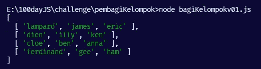
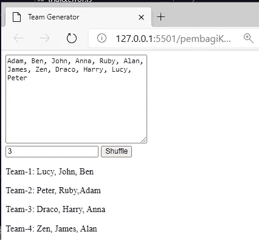
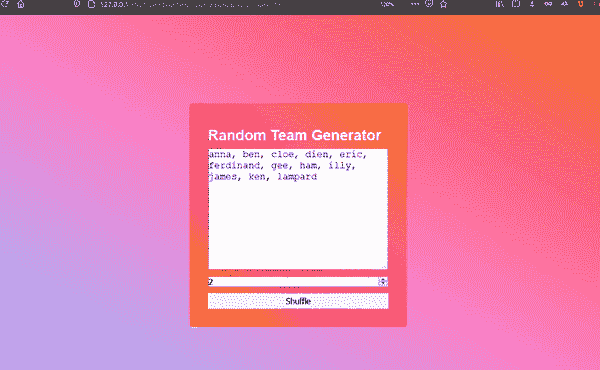

# 使用 HTML、CSS 和 JavaScript 构建团队生成器

> 原文：<https://medium.com/nerd-for-tech/build-team-generator-using-html-css-and-javascript-d811781027d5?source=collection_archive---------0----------------------->

马文·迈耶在 [Unsplash](https://unsplash.com/s/photos/team?utm_source=unsplash&utm_medium=referral&utm_content=creditCopyText) 上的照片

嗨，连续三天，我试图解决一个问题，用 JavaScript 构建一个简单的团队生成器。我接受这个挑战的原因是因为我认为它不会太难，不会让我感到不安。也不要太容易使人厌烦。是的，这是一个小而伟大的项目。

# **第一天——构建算法**

我记得我建造它的动机。因为，我的朋友已经建立了相同的项目，但他使用 Python。正如你所知，python 使用 CLI(命令行界面)来执行程序，我认为这是不好的分享给朋友。

因为，渴望使传播内容变得更容易。我想做网页版的团队生成器。但是是的，我不用 Python，我用的是 JavaScript。第一天，我试图解决制作团队生成器的算法。

这是我在第一天完成的事情

输出将是这样的

那天我非常高兴，但不久之后，我的大脑认为如果我能在 web 应用程序中打印出来，会更漂亮。所以第一天的结论是我能找到算法。

# 第 2 天——用 HTML 连接算法

第二天，我学习了 DOM(文档对象模型)，DOM 很容易学，但是需要时间在实际项目中实现它。所以对某些人来说，这比我还新鲜。我的大建议是通过实践学习编码。否则就什么都不是。下面是源代码。

**HTML**

**JavaScript**

**输出**

当我完成第二天的时候，我是如此的兴奋。作为结论，我可以把算法和 DOM 联系起来。因此，它可以给我一个非常简单的 HTML 和 JavaScript 的团队生成器。

# 第 3 天—用 CSS 完成项目

我是在星期天的第三天完成这个项目的。这一天的重点是用程序进行造型，并制作一个重启按钮。重新开始按钮用于重新开始输入新名称。

过了一段时间，我发现如何激活重启按钮。它曾经。reload()函数。因此页面将被重置并再次提示新的团队生成器。在 CSS 的帮助下，我的使用 JavaScript 的小项目构建团队生成器完成了。

**HTML**

**CSS**

**JavaScript**

**输出**

我真的很享受这个短暂的挑战。如果您想查看托管项目。这是链接

 [## 团队生成器

### 编辑描述

kangbakso.my.id](http://kangbakso.my.id/team-generator/) 

您也可以在这里找到源代码

 [## 主页面上的 javaScript-projects/basic-projects/the dreamer 911-random-team-generator…

### 这个项目是一个随机团队生成器，使用 HTML、CSS 和普通 Javascript 构建。它可以用来…

github.com](https://github.com/Tamanna-S/javaScript-projects/tree/main/basic-projects/theDreamer911-random-team-generator) 

最后，我认为这个项目只是简单，但对我来说，这个项目足以给我作为问题解决者思考的可靠性。是的，我只是想分享我的经验，并希望可能有一些人发现这个帖子，并可以帮助他们的项目。

有一个好的代码😇