# 构建 Python 系列中的森林:AVL 树

> 原文：<https://medium.com/nerd-for-tech/build-the-forest-in-python-series-avl-tree-73f09abc0e1?source=collection_archive---------36----------------------->

在[红黑树](https://shunsvineyard.info/2021/04/30/build-the-forest-in-python-series-red-black-tree/)的讨论之后，本文将实现自平衡二叉查找树的另一个变种:AVL 树。

# 项目设置

遵循与[构建森林系列](https://shunsvineyard.info/build-the-forest-series/)中其他文章相同的风格和假设，实现假设为 Python 3.9 或更新版本。本文为我们的项目添加了两个模块: *avl_tree.py* 用于 avl 树实现，以及 *test_avl_tree.py* 用于其单元测试。添加这两个文件后，我们的项目布局如下:

```
forest-python
├── forest
│   ├── __init__.py
│   ├── binary_trees
│   │   ├── __init__.py
│   │   ├── avl_tree.py
│   │   ├── binary_search_tree.py
│   │   ├── double_threaded_binary_tree.py
│   │   ├── red_black_tree.py
│   │   ├── single_threaded_binary_trees.py
│   │   └── traversal.py
│   └── tree_exceptions.py
└── tests
    ├── __init__.py
    ├── conftest.py
    ├── test_avl_tree.py
    ├── test_binary_search_tree.py
    ├── test_double_threaded_binary_tree.py
    ├── test_red_black_tree.py
    ├── test_single_threaded_binary_trees.py
    └── test_traversal.py
```

(完整代码可从 [forest-python](https://github.com/shunsvineyard/forest-python) 获得)

# 什么是 AVL 树？

AVL 树(以发明家阿德尔森-维尔斯基和兰迪斯命名)是一种自我平衡的二叉查找树。除了二进制搜索树属性之外，AVL 树维护 AVL 树属性以保持其平衡:

*   对于 AVL 树中的每个节点，其左侧子树和右侧子树的高度最多相差一。

该属性也称为**平衡因子**，可以改写为以下公式:

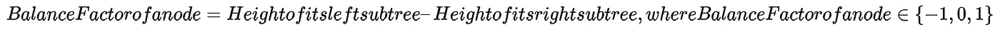

如果一个节点的平衡因子> 0，我们称之为**左重**。如果一个节点的平衡因子<为 0，我们称之为**右重**。如果一个节点的平衡因子= 0，称为**平衡**。

(注意，有人把平衡因子定义为它的右子树的高度——它的左子树的高度。在这种情况下，左重成为节点的平衡因子< 0, whereas right-heavy happens when a node’s balance factor > 0。然而，无论使用哪种定义，AVL 树的概念都是相同的。)

下图显示了一个典型的 AVL 树。

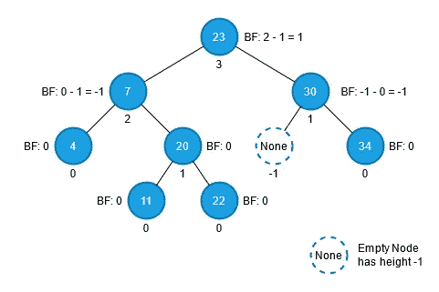

在上图中，BF 表示一个节点的平衡因子。节点下的数字是节点的高度。如果节点为空，即 *None* ，则其高度为-1。这种方式使得计算节点的平衡因子更加容易。

# 构建 AVL 树

本节将介绍 AVL 树的实现，以及实现选择背后的一些想法。

# 结节

我们不是每次需要时都计算节点的高度，而是将高度存储在每个节点中。因此，该节点的结构比二叉查找树节点多一个字段。

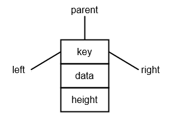

存储高度节省了计算时间，因此我们不需要每次检查平衡系数时都计算高度。但是，这是有代价的——当 AVL 树被修改时，比如插入一个节点或者删除一个节点，我们需要保持高度是最新的。关于高度更新的更多细节将在插入和删除部分提供。

像其他二叉树节点一样，我们利用[数据类](https://www.python.org/dev/peps/pep-0557/)来定义 AVL 树节点。

```
from dataclasses import dataclass

@dataclass
class Node:
    """AVL Tree node definition."""

    key: Any
    data: Any
    left: Optional["Node"] = None
    right: Optional["Node"] = None
    parent: Optional["Node"] = None
    height: int = 0
```

# 课程概述

像[构建森林](https://shunsvineyard.info/build-the-forest-series/)项目中的其他类型的二叉树一样，AVL tree 类也有类似的功能。

```
class AVLTree:

    def __init__(self) -> None:
        self.root: Optional[Node] = None

    def __repr__(self) -> str:
        """Provie the tree representation to visualize its layout."""
        if self.root:
            return (
                f"{type(self)}, root={self.root}, "
                f"tree_height={str(self.get_height(self.root))}"
            )
        return "empty tree"

    def search(self, key: Any) -> Optional[Node]:
        …

    def insert(self, key: Any, data: Any) -> None:
        …

    def delete(self, key: Any) -> None:
        …

    @staticmethod
    def get_leftmost(node: Node) -> Node:
        …

    @staticmethod
    def get_rightmost(node: Node) -> Node:
        …

    @staticmethod
    def get_successor(node: Node) -> Optional[Node]:
        …

    @staticmethod
    def get_predecessor(node: Node) -> Optional[Node]:
        …

    @staticmethod
    def get_height(node: Optional[Node]) -> int:
        …

    def _get_balance_factor(self, node: Optional[Node]) -> int:
        …

    def _left_rotate(self, node_x: Node) -> None:
        …

    def _right_rotate(self, node_x: Node) -> None:
        …

    def _insert_fixup(self, new_node: Node) -> None:
        …

    def _transplant(self, deleting_node: Node, replacing_node: Optional[Node]) -> None:
        …

    def _delete_no_child(self, deleting_node: Node) -> None:
        …

    def _delete_one_child(self, deleting_node: Node) -> None:
        …

    def _delete_fixup(self, fixing_node: Node) -> None:
        …
```

我们可以像常规二叉查找树一样精确地实现 AVL 树的大部分功能，例如搜索和大部分辅助功能。我们也可以使用[二叉树遍历](https://shunsvineyard.info/2021/03/17/build-the-forest-in-python-series-binary-tree-traversal/)中的遍历函数来遍历 AVL 树。

插入和删除是可能导致 AVL 树不平衡的两种操作。因此， *AVLTree* 类有帮助保持树平衡的方法，包括 *_left_rotate()* 、 *_right_rotate()* 、 *_insert_fixup()* 和 *_delete_fixup()* 。由于这些助手方法主要保持 AVL 树的平衡，我们将它们定义为私有函数，对客户端代码透明。

# 旋转

插入或删除后恢复违反的 AVL 树属性的方法是旋转(类似于[红黑树:旋转](https://shunsvineyard.info/2021/04/30/build-the-forest-in-python-series-red-black-tree/#6-rotations))。

下图演示了 AVL 树属性可能被破坏的四种情况:左-左、左-右、右-左和右-右。

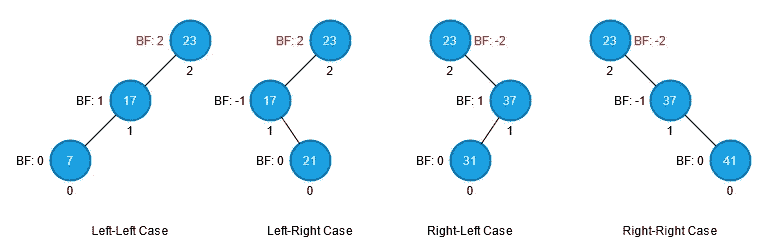

当我们处理一个不平衡的 AVL 树时，我们总是从最底层的不平衡节点开始(即，节点要么是 *BF > 1* 要么是 *BF < -1* )。例如，上图中的节点 23 是最底部的不平衡节点。然后检查其具有较高高度的**子节点的平衡系数。如果最底层的不平衡节点是左重的(即 BF > 0)，而其高度较高的子节点是左重的，则为左-左情况(上图中最左边的情况)。如果身高较高的孩子的平衡系数为右重(即 BF < 0)，则为左右情况(上图中第二个最左边的情况)。图中的其他情况(左右和左右)与左右情况和左右情况对称。**

下面的小节展示了旋转是如何重新平衡不平衡的。

## 右旋转(左-左情况)

对于左-左的情况，我们在最底部的不平衡节点(本例中的节点 23)上执行右旋转。旋转后，节点 17 成为节点 23 的父节点。此外，节点 17 和节点 23 的高度和平衡因子在旋转后都发生了变化。

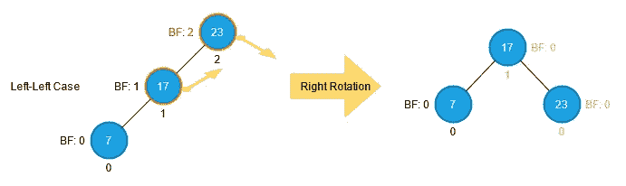

## 左右旋转(左右情况)

如果最底部的不平衡节点是左重的，但是它的子节点(具有更高的高度)是右重的，我们首先在子节点(本例中为节点 17)上执行左旋转，然后在最底部的不平衡节点(节点 23)上执行右旋转。

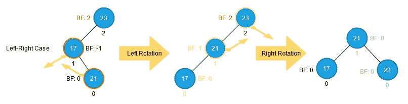

请注意，只有涉及旋转的节点才会更改其平衡系数和高度。例如，向左旋转后，节点 17 和节点 21 会更改其高度和平衡因子(以黄色高亮显示)。向右旋转后，只有节点 21 和节点 23 更改其高度和平衡因子(绿色的高度)。

## 左右旋转(左右旋转)

左右情况与左右情况对称。因此，我们先执行右旋转，然后执行左旋转。

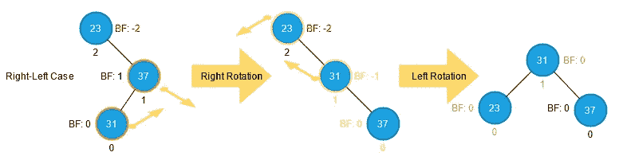

## 向左旋转(右-右情况)

右-右的情况与左-左的情况对称。所以我们可以进行左旋转使其平衡。

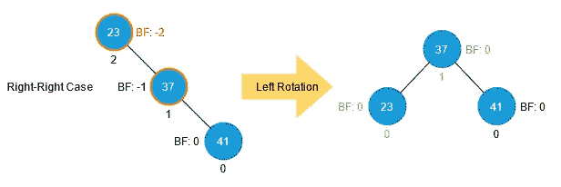

## 摘要

下表总结了不平衡情况及其解决方案。

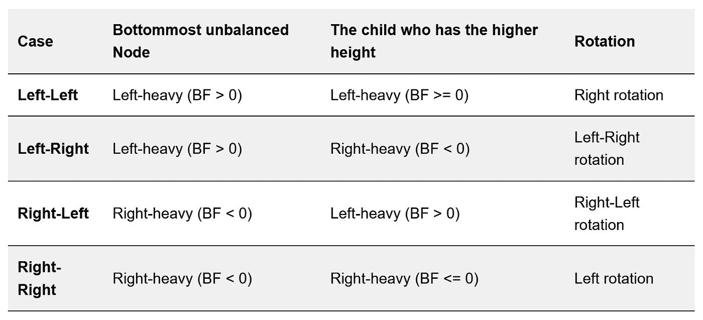

# 插入

在 AVL 树中插入有一个实质性的效果:更新高度。因此，当我们将一个节点插入 AVL 树时，新节点可能会改变树的高度，从而违反 AVL 树属性。当这种情况发生时，我们执行特定的旋转来重新平衡树。

在实现插入函数之前，我们需要理解插入是如何改变高度的。首先，注意要插入的新节点在插入后必须成为叶节点。因此，新节点的高度必须为 0，其平衡因子也为 0。此外，如果新节点的父节点在新节点插入之前有一个子节点，则父节点和整个树的高度保持不变:没有高度变化，没有 AVL-tree-property 冲突。

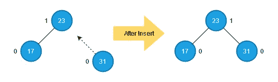

第二，只有当新节点的父节点在插入之前没有子节点时，高度才会发生变化。在这种情况下，我们将新节点的祖先的高度一直更新到根节点(如下图所示)，只有新节点的祖先有高度更新。当高度改变时，这意味着可能会发生潜在的 AVL 树属性冲突。


(上图不违反 AVL-tree-property。然而，我们将在以下部分处理 AVL 树在插入后变得不平衡的情况。)

插入算法由常规的二叉查找树插入算法修改而来。

1.  以与二叉查找树插入相同的方式插入高度为 0 的新节点:通过从根开始遍历树并沿途将新节点的键与每个节点的键进行比较，找到插入新节点的正确位置(即新节点的父节点)。
2.  更新高度，并通过从新节点追溯到根节点来检查违反的 AVL-tree-property 是否发生。在返回到根的过程中，如果需要的话，在途中更新每个节点的高度。如果我们发现一个不平衡的节点，执行一定的旋转来平衡它。旋转后，插入结束。如果没有找到不平衡的节点，则插入在到达根节点并更新其高度后完成。

```
def insert(self, key: Any, data: Any) -> None:
    new_node = Node(key=key, data=data)
    parent: Optional[Node] = None
    current: Optional[Node] = self.root
    while current:
        parent = current
        if new_node.key < current.key:
            current = current.left
        elif new_node.key > current.key:
            current = current.right
        else:
            raise tree_exceptions.DuplicateKeyError(key=new_node.key)
    new_node.parent = parent
    # If the tree is empty, set the new node to be the root.
    if parent is None:
        self.root = new_node
    else:
        if new_node.key < parent.key:
            parent.left = new_node
        else:
            parent.right = new_node

        # After the insertion, fix the broken AVL-tree-property.
        # If the parent has two children after inserting the new node,
        # it means the parent had one child before the insertion.
        # In this case, neither AVL-tree property breaks nor
        # heights update requires.
        if not (parent.left and parent.right):
            self._insert_fixup(new_node)
```

## 固定

正如轮换部分提到的，有四种潜在的不平衡情况。并且我们执行特定的旋转来恢复 AVL 树属性。在我们修正了 AVL 树属性之后，AVL 树就变得平衡了。不需要继续追踪祖先的平衡因子。以下小节描述了每种情况下的修复。

左-左格

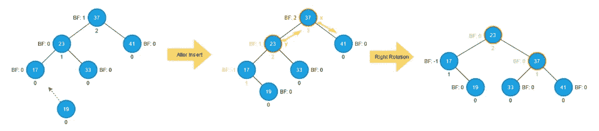

在上图中，我们添加了节点 19。插入后，我们开始检查从节点 17 开始的节点 19 的祖先的平衡因子。然后，我们发现节点 37 的平衡因子不平衡且左倾。我们还需要检查其具有更高高度的子对象，以确定要执行哪个旋转。在插入的情况下，具有更高高度的子节点必须出现在包含新节点的路径中，即在这种情况下的节点 23，因为节点 23 的平衡因子在插入后是 1。我们认为这是一个左-左病例。

所以我们在节点 37 上执行右旋转。右旋转后，节点 23 成为新的根，节点 37 成为节点 23 的右子节点。请注意，只有参与旋转的节点的高度和平衡系数会发生变化。所以，在这种情况下，只有节点 23 和节点 37 有高度，平衡因子改变了。

**为什么不需要在旋转后继续检查祖先的平衡系数？**

在插入之前，节点 37 的高度是 2，节点 23 的高度是 1。插入后，节点 37 的高度变为 3，节点 23 的高度变为 2。然后我们进行了轮换。旋转后，节点 23 占据了节点 37 的原始位置，节点 23 的高度变为 2，节点 37 的高度变为 1。因此，相同位置的高度保持不变，即根(节点 37)在插入之前具有高度 2；旋转后，根(节点 23)的高度仍为 2。换句话说，如果节点 37 在旋转之前有一个父节点(比如说 *x* ，那么在旋转之后， *x* 的左子节点就变成了节点 23，但是 x 的高度不受影响。所以，我们不需要在旋转之后继续检查 x 的祖先的高度。

左右格

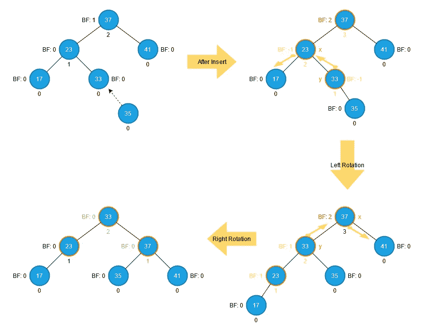

在我们通过检查最底部的不平衡节点(节点 37)及其具有更高高度的子节点(节点 23)的平衡因子来识别这是左右情况之后，我们在节点 23 上执行向左旋转，因此它变成了左右情况。然后，我们在不平衡的节点(节点 37)上执行右旋转。之后，我们恢复被侵犯的 AVL 树属性。

左右格

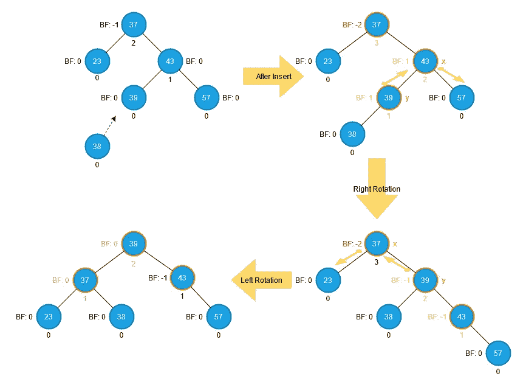

这种情况与左右情况是对称的，所以我们在不平衡节点(节点 37)的右子节点(节点 43)上执行右，所以它变成了右-右情况。然后，我们在不平衡节点(节点 37)上执行向左旋转。之后，我们修复被违反的 AVL 树属性。

右-右格

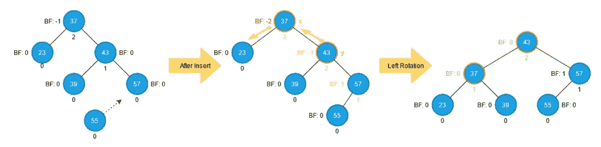

右-右的情况与左-左的情况是对称的，所以我们可以通过执行左旋转来恢复它的 AVL-tree 属性。

在修复分析之后，我们可以像下面这样实现 *_insert_fixup* 函数。注意，我们总是在沿着树向上走的时候和旋转之前更新节点的高度。

```
def _insert_fixup(self, new_node: Node) -> None:
    parent = new_node.parent

    while parent:
        parent.height = 1 + max(
            self.get_height(parent.left), self.get_height(parent.right)
        )
        grandparent = parent.parent
        # grandparent is unbalanced
        if grandparent:
            if self._get_balance_factor(grandparent) > 1:
                # Case Left-Left
                if self._get_balance_factor(parent) >= 0:
                    self._right_rotate(grandparent)
                # Case Left-Right
                elif self._get_balance_factor(parent) < 0:
                    self._left_rotate(parent)
                    self._right_rotate(grandparent)
                # Since the fixup does not affect the ancestor of the unbalanced
                # node, exit the loop to complete the fixup process.
                break
            elif self._get_balance_factor(grandparent) < -1:
                # Case Right-Right
                if self._get_balance_factor(parent) <= 0:
                    self._left_rotate(grandparent)
                # Case Right-Left
                elif self._get_balance_factor(parent) > 0:
                    self._right_rotate(parent)
                    self._left_rotate(grandparent)
                # Since the fixup does not affect the ancestor of the unbalanced
                # node, exit the loop to complete the fixup process.
                break
        parent = parent.parent
```

# 搜索

搜索功能与[二叉查找树:搜索](https://shunsvineyard.info/2021/03/13/build-the-forest-in-python-series-binary-search-tree/#8-search)相同。

# 删除

AVL 树删除的基本思想类似于常规二叉查找树。要删除的节点有三种情况:没有子节点、只有一个子节点和两个子节点。我们也使用同样的*移植*方法，将*删除节点*的子树替换为*替换节点*的子树。

**移植**

*移植*方法与[二叉查找树相同:删除](https://shunsvineyard.info/2021/03/13/build-the-forest-in-python-series-binary-search-tree/#9-delete)。

```
def _transplant(self, deleting_node: Node, replacing_node: Optional[Node]) -> None:
    if deleting_node.parent is None:
        self.root = replacing_node
    elif deleting_node == deleting_node.parent.left:
        deleting_node.parent.left = replacing_node
    else:
        deleting_node.parent.right = replacing_node

    if replacing_node:
        replacing_node.parent = deleting_node.parent
```

与插入类似，AVL 树删除可能会更新树的高度，并可能违反 AVL 树属性，因此我们需要检查 AVL 树是否变得不平衡，并在删除后修复它。

整个删除过程类似于常规的二叉查找树，只是做了一些修改。

1.  找到要删除的节点( *deleting_node* )。
2.  如果 *deleting_node* 没有子节点，使用*移植*方法将 *deleting_node* 替换为 *None* 。然后，执行修复操作。
3.  如果 *deleting_node* 只有一个子节点，使用*移植*方法替换只有一个子节点的 *deleting_node* 。然后执行修复操作。
4.  如果*删除节点*有两个子节点，找到*删除节点*的后继节点作为*替换节点*。然后，将 *deleting_node* 的键和数据替换为 *replacing_node* 的键和数据，这样 *deleting_node* 被 *replacing_node* 替换，但保持其原来的平衡因子和高度(即没有高度和平衡因子的改变意味着没有 AVL-tree-property 违例)。之后删除 *replacing_node* ，与步骤 2(无子节点)或步骤 3(只有一个子节点)相同。

为了使实现更加清晰，我们定义了 *_delete_no_child* 方法用于待删除节点没有子节点的情况，而 *_delete_one_child* 方法用于待删除节点只有一个子节点的情况。如果删除的节点有两个子节点，我们可以相应地重用 *_delete_no_child* 和 *_delete_one_child* 。此外，由于要删除的节点有两个子节点，分别使用 *_delete_no_child* 和 *_delete_one_child* ，所以只有这两个方法需要调用 *_delete_fixup* 函数来修复不平衡的节点。因此，我们可以如下实现 *delete* 、 *_delete_no_child* 和 *_delete_one_child* 函数。

```
def delete(self, key: Any) -> None:
    if self.root and (deleting_node := self.search(key=key)):
        # Case: no child
        if (deleting_node.left is None) and (deleting_node.right is None):
            self._delete_no_child(deleting_node=deleting_node)
        # Case: Two children
        elif deleting_node.left and deleting_node.right:
            replacing_node = self.get_leftmost(node=deleting_node.right)
            # Replace the deleting node with the replacing node,
            # but keep the replacing node in place.
            deleting_node.key = replacing_node.key
            deleting_node.data = replacing_node.data
            if replacing_node.right:  # The replacing node cannot have left child.
                self._delete_one_child(deleting_node=replacing_node)
            else:
                self._delete_no_child(deleting_node=replacing_node)
        # Case: one child
        else:
            self._delete_one_child(deleting_node=deleting_node)

def _delete_no_child(self, deleting_node: Node) -> None:
    parent = deleting_node.parent
    self._transplant(deleting_node=deleting_node, replacing_node=None)
    if parent:
        self._delete_fixup(fixing_node=parent)

def _delete_one_child(self, deleting_node: Node) -> None:
    parent = deleting_node.parent
    replacing_node = (
        deleting_node.right if deleting_node.right else deleting_node.left
    )
    self._transplant(deleting_node=deleting_node, replacing_node=replacing_node)
    if parent:
        self._delete_fixup(fixing_node=parent)
```

## 固定

我们知道删除操作可能会改变高度并违反 AVL-tree-property。像插入一样，有四种潜在的不平衡情况。并且我们执行特定的旋转来恢复 AVL 树属性。我们还从最底层的不平衡节点开始修复过程。最底层的不平衡节点必须是要删除的节点的祖先之一。然而，与插入修正不同，不平衡平衡因子可能会在我们执行旋转的节点上传播。因此，在我们恢复最底层的不平衡节点后，我们需要检查它的父节点。如果它的父代变得不平衡，修复它。重复这个过程，直到我们到达根，根也是平衡的。

没有孩子

就像我们在 rotations 部分提到的，有四种情况会违反 AVL-tree-property。下图显示了这四种情况，以及如果要删除的节点没有子节点，如何恢复它们的平衡因子。

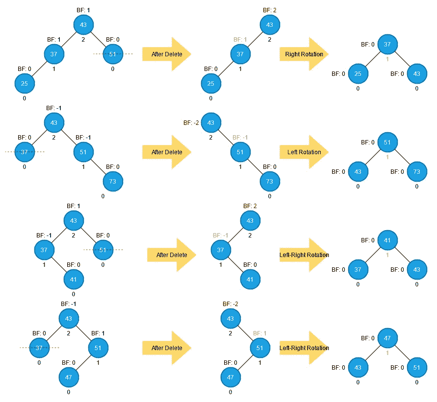

一个孩子

下面两张图片演示了这四种情况。

**不平衡节点偏左**

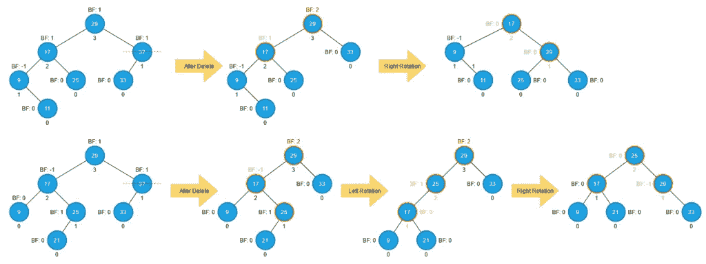

**不平衡节点偏右**

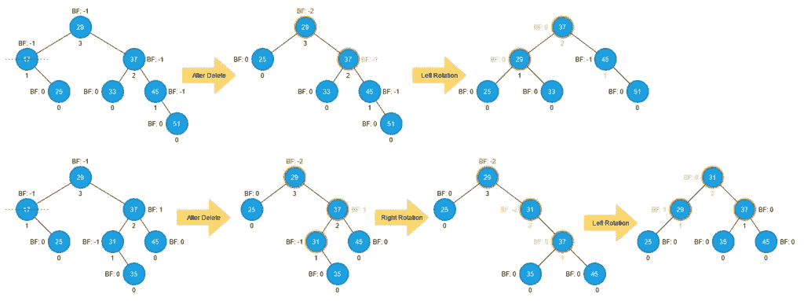

两个孩子

像其他二叉树的删除一样，我们可以将两个子案例看作两个子案例:替换节点是 *deleting_node* 的直接子节点，而 *replacing_node* 是 deleting_node 的最左边的节点。在任何一种情况下，我们都可以通过将 *deleting_node* 替换为 *replacing_node* 来将两个孩子的情况转换为非孩子的情况或一个孩子的情况，但保持原来的高度和平衡因子。这样做，我们不会改变高度和平衡系数。之后，我们删除*替换 _ 节点*，它就变成了无子案例或者有子案例。下图显示了两个孩子删除是如何工作的，以及如何修复它的不平衡。

**替换节点是删除节点的直接子节点**

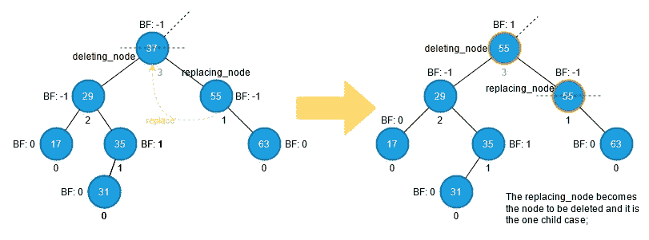

**替换节点是删除节点最左边的节点**

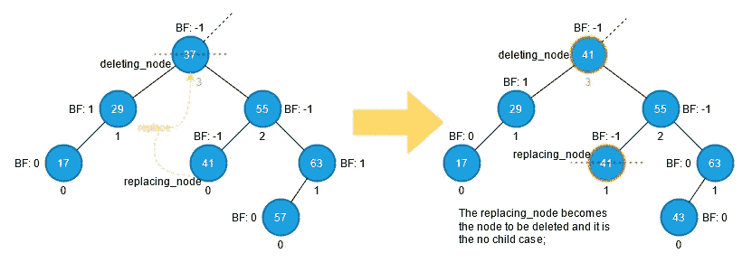

完整修复操作的实现如下。类似于插入，我们在沿着树向上走的时候更新节点的高度。

```
def _delete_fixup(self, fixing_node: Node) -> None:
    while fixing_node:
        fixing_node.height = 1 + max(
            self.get_height(fixing_node.left), self.get_height(fixing_node.right)
        )

        if self._get_balance_factor(fixing_node) > 1:
            # Case Left-Left
            if self._get_balance_factor(fixing_node.left) >= 0:
                self._right_rotate(fixing_node)
            # Case Left-Right
            elif self._get_balance_factor(fixing_node.left) < 0:
                # The fixing node's left child cannot be empty
                self._left_rotate(fixing_node.left)
                self._right_rotate(fixing_node)
        elif self._get_balance_factor(fixing_node) < -1:
            # Case Right-Right
            if self._get_balance_factor(fixing_node.right) <= 0:
                self._left_rotate(fixing_node)
            # Case Right-Left
            elif self._get_balance_factor(fixing_node.right) > 0:
                # The fixing node's right child cannot be empty
                self._right_rotate(fixing_node.right)
                self._left_rotate(fixing_node)

        fixing_node = fixing_node.parent
```

# 辅助功能

辅助功能，如获取最左边的节点和获取节点的后继者，与[二叉查找树:辅助功能](https://shunsvineyard.info/2021/03/13/build-the-forest-in-python-series-binary-search-tree/#13-auxiliary-functions)相同，实现可在 [Github 库](https://github.com/shunsvineyard/forest-python/blob/main/forest/binary_trees/avl_tree.py)获得。唯一不同于二叉查找树的辅助功能是获取高度的功能。

## 获得高度

因为每个节点都存储了它的高度，所以获取节点的高度变得非常简单:只需返回高度。

```
@staticmethod
def get_height(node: Optional[Node]) -> int:
    if node:
        return node.height
    # None has height -1
    return -1
```

# 横越

尽管 AVL 树节点比正常的二叉查找树节点多了一个字段(即*高度*，我们仍然可以使用我们在[二叉树遍历](https://shunsvineyard.info/2021/03/17/build-the-forest-in-python-series-binary-tree-traversal/)中所做的精确实现来遍历 AVL 树。我们需要做的唯一修改是添加 AVL 树作为支持的类型。

```
# Alisa for the supported node types. For type checking.
SupportedNode = Union[None, binary_search_tree.Node, avl_tree.Node]

SupportedTree = Union[binary_search_tree.BinarySearchTree, avl_tree.AVLTree]
"""Alisa for the supported tree types. For type checking."""
```

(完整源代码见 [traversal.py](https://github.com/shunsvineyard/forest-python/blob/main/forest/binary_trees/traversal.py) )

支持的类型用于类型检查，正如我们在[二叉树遍历:函数接口](https://shunsvineyard.info/2021/03/17/build-the-forest-in-python-series-binary-tree-traversal/#1-function-interface)中讨论的。

# 试验

和往常一样，我们应该尽可能多地对代码进行单元测试。检查 [test_avl_tree.py](https://github.com/shunsvineyard/forest-python/blob/main/tests/test_avl_tree.py) 进行完整的单元测试。

# 分析

AVL 树是一种自平衡二叉查找树，它的高度为 O(lg n)，其中 n 是节点的数量(这可以通过利用斐波那契数来证明。更多细节见 [AVL 树维基百科](https://en.wikipedia.org/wiki/AVL_tree#Properties)。因此，AVL 树的时间复杂度可以总结在下表中。

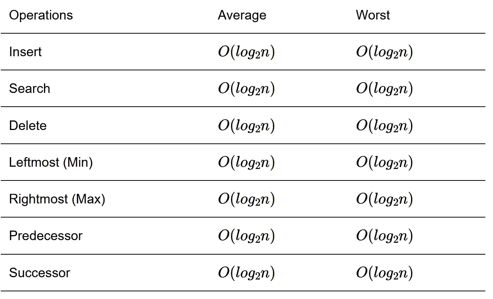

# 例子

像红黑树一样，AVL 树由于其自平衡能力而被广泛应用于软件程序中。例如，本节使用我们在这里实现的 AVL 树来实现一个键值映射*。*

```
from typing import Any, Optional

from forest.binary_trees import avl_tree
from forest.binary_trees import traversal

class Map:
    """Key-value Map implemented using AVL Tree."""

    def __init__(self) -> None:
        self._avlt = avl_tree.AVLTree()

    def __setitem__(self, key: Any, value: Any) -> None:
        """Insert (key, value) item into the map."""
        self._avlt.insert(key=key, data=value)

    def __getitem__(self, key: Any) -> Optional[Any]:
        """Get the data by the given key."""
        node = self._avlt.search(key=key)
        if node:
            return node.data
        return None

    def __delitem__(self, key: Any) -> None:
        """Remove a (key, value) pair from the map."""
        self._avlt.delete(key=key)

    def __iter__(self) -> traversal.Pairs:
        """Iterate the data in the map."""
        return traversal.inorder_traverse(tree=self._avlt)

    @property
    def empty(self) -> bool:
        """Return `True` if the map is empty; `False` otherwise."""
        return self._avlt.empty

if __name__ == "__main__":

    # Initialize the Map instance.
    contacts = Map()

    # Add some items.
    contacts["Mark"] = "mark@email.com"
    contacts["John"] = "john@email.com"
    contacts["Luke"] = "luke@email.com"

    # Retrieve an email
    print(contacts["Mark"])

    # Delete one item.
    del contacts["John"]

    # Check the deleted item.
    print(contacts["John"])  # This will print None

    # Iterate the items.
    for contact in contacts:
        print(contact)
```

(完整示例可从 [avlt_map.py](https://github.com/shunsvineyard/forest-python/blob/main/examples/avlt_map.py) 获得)

# 摘要

与红黑树一样，AVL 树在插入和删除操作上引入了一些复杂性以保持其平衡，但 AVL 树的自平衡能力为基本操作提供了 O(lg n)的时间复杂性，这比常规二叉查找树的性能更好。

*原载于 2021 年 6 月 6 日*[*https://shunsvineyard . info*](https://shunsvineyard.info/2021/06/06/build-the-forest-in-python-series-avl-tree/)*。*