# 用 Python 建造森林系列:二叉查找树

> 原文：<https://medium.com/nerd-for-tech/build-the-forest-in-python-series-binary-search-tree-43fdf3ddfd47?source=collection_archive---------25----------------------->

构建软件项目是困难的，它还需要广泛的知识，如编写代码、理解算法、设置环境、测试和部署。此外，每种语言都有其实现事物的方式，即使所有的语言都是面向对象的编程语言。养成从各种角度思考软件开发的习惯需要时间。这个项目，Build the Forest Series，试图通过用 Python 的方式用面向对象编程构建一些树数据结构(the Forest)来提供一个学习软件开发和树数据结构的不同视角。

为什么是树？

树是解决软件中许多问题的基本数据结构。此外，几乎所有的软件工程师职位面试都会问到与树相关的问题。尽管我们在日常工作中可能不需要从头开始实现树数据结构，但是对树数据结构有一个坚实的理解有助于我们解决许多问题。

# 假定

该项目假设 Python 3.9 或更新版本，读者对 Python 编程和数据结构有基本的了解。此外，为了简单起见，实现没有考虑多线程，即不是线程安全的。

# 项目设置

该项目有以下基本布局。

```
forest-python
├── forest
│   ├── __init__.py
│   ├── binary_trees
│   │   ├── __init__.py
│   │   └── binary_search_tree.py
│   └── tree_exceptions.py
└── tests
    ├── __init__.py
    ├── conftest.py
    └── test_binary_search_tree.py
```

(该项目可在 [forest-python](https://github.com/shunsvineyard/forest-python) 获得)

与编译语言(如 C++和 Java)不同，Python 没有为我们检查错误的编译器，所以我们需要使用额外的工具。在这个项目中，我们使用以下工具来确保代码的质量。

*   [Flake8](https://flake8.pycqa.org/en/latest/index.html) 是一款在 Python 源代码中寻找 bug 和风格问题的工具。
*   [Mypy](http://mypy-lang.org/) 是 Python 程序的静态类型检查器。尽管 Python 是一种动态语言，但类型检查有助于防止潜在的错误和问题。
*   [Pydocstyle](https://pypi.org/project/pydocstyle/) 用于文档样式检查
*   [黑色](https://black.readthedocs.io/en/stable/)用于编码风格检查
*   [pytest](https://docs.pytest.org/en/stable/) 用于单元测试

此外，代码还遵循了[我的 Python 编码风格和原则](https://shunsvineyard.info/2019/01/05/my-python-coding-style-and-principles/)。

# 什么是二叉查找树？

二叉查找树是一棵二叉树，其关键字总是满足二进制搜索树属性:

*   设 x 是二叉查找树中的一个节点。
*   如果 y 是 x 的左子树中的一个节点，那么 y.key < x.key.
*   If y is a node in the right subtree of x, then y.key > x.key。

请注意，如果二叉查找树允许重复键，y.key = x.key 是一种特殊情况。为了简单起见，这个项目不允许重复的键，即所有的键必须是唯一的。

二叉查找树数据结构支持许多动态操作。最基本的功能是*搜索*、*插入*、*删除*。还可以支持其他辅助操作，包括获取最小键、最大键、节点的前任和继任者。

# 建造二叉查找树

本节将介绍实现以及实现选择背后的一些想法。

# 结节

二叉查找树节点是二叉查找树的组成部分。

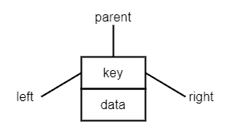

树节点可以出现在上图中，并具有以下属性:

*   **键**是构建二叉查找树的基本字段，必须满足二叉查找树属性，其值必须具有可比性。
*   **左侧**属性指向左侧节点，
*   **右**属性指向右节点，
*   **父**属性指向父节点，并且
*   **数据**字段用于包含任何数据。

数据结构的目的是管理数据。尽管许多教科书为了简单起见省略了数据字段，但在现实世界中，如果一个树节点不包含任何数据，那么它就没有什么用处。这就是为什么我们的节点定义有数据字段。

为什么是父母？根据二叉查找树定义，父节点不是必需的，但是它简化了实现，所以我们在进行树操作时不需要跟踪父节点。如果考虑空间使用，可以用没有父字段的树节点来实现二叉查找树。

有了上述想法，我们可以用下面的方式定义节点类。

```
@dataclasses.dataclass
class Node:
    key: Any
    data: Any
    left: Optional["Node"] = None
    right: Optional["Node"] = None
    parent: Optional["Node"] = None
```

为什么使用 dataclass？

Python 在 3.7 版本中引入了 [dataclass](https://www.python.org/dev/peps/pep-0557/) ，它主要用于只包含数据的类。当一个类被定义为 dataclass 时，dataclass decorator 为我们提供了一些基本的功能，比如 *__init__()* 和 *__repr__()* 函数。因此，dataclass 提供了一种方便的方法来定义一个主要用于数据的类，并增加可读性。因为我们的树节点仅用于数据，所以我们将其定义为 dataclass 是有意义的。

# 例外

在我们的二叉查找树中，有一种情况我们想引发一个异常，当我们试图插入一个键已经存在于树中的节点时就会发生这种情况。Python 提供了几个内置的异常。然而，它们都没有解决复制密钥的情况。因此，我们为此定义了异常。在 *tree_exceptions.py* 中，我们添加异常。

```
class DuplicateKeyError(Exception):
    def __init__(self, key: str) -> None:
        Exception.__init__(self, f"{key} already exists.")
```

这个对象清楚地说明了异常的原因，并告诉我们哪个键是重复的。

# 核心功能

就像一棵真正的有根、有枝、有叶的树一样，我们把树当作一个物体。因此，我们将二叉查找树定义为一个类，并用它来声明二叉查找树对象。 *BinarySearchTree* 类应该具有最少的功能——插入、删除和搜索，这样我们就可以增长、修剪和查找树。

```
class BinarySearchTree:

    def __init__(self) -> None:
        self.root: Optional[Node] = None

    def search(self, key: Any) -> Optional[Node]:
        …

    def insert(self, key: Any, data: Any) -> None:
        …

    def delete(self, key: Any) -> None:
        …
```

## 插入

为了构建 *BinarySearchTree* ，我们首先需要在树中插入一个树节点，新节点总是被添加到叶子级别。以下步骤总结了插入算法。

```
1\. Find the proper location (i.e., the new node's parent) to insert the new node by walking through the tree from the root and comparing the new node's key with each node's key along the way.
2\. After finding the parent node, update the parent's left (or right depends on the location) to point to the new node.
3\. Update the new node's parent attribute to point to the parent node.
```

下图可视化了插入算法的每一步。


该接口将*键*和*数据*作为参数，并使用它们来构造一个新的树节点。然后，根据二叉搜索树属性找到合适的位置来插入节点。因此，我们以下面的方式实现插入函数。

```
def insert(self, key: Any, data: Any) -> None:
    new_node = Node(key=key, data=data)
    parent: Optional[Node] = None
    current: Optional[Node] = self.root
    while current:
        parent = current
        if new_node.key < current.key:
            current = current.left
        elif new_node.key > current.key:
            current = current.right
        else:
            raise
                tree_exceptions.DuplicateKeyError(key=new_node.key)
    new_node.parent = parent
    # If the tree is empty
    if parent is None:
        self.root = new_node
    elif new_node.key < parent.key:
        parent.left = new_node
    else:
        parent.right = new_node
```

## 搜索

搜索算法类似于插入。我们通过给定的键寻找节点。

```
1\. Walk through the tree from the root and compare the key with each node's key along the tree walk
2\. If a key matches, we found the node. 
3\. If no key matches after we reach the leaf level, the node does not exist in the tree.
```

我们可以通过下面的图片来形象化搜索步骤。

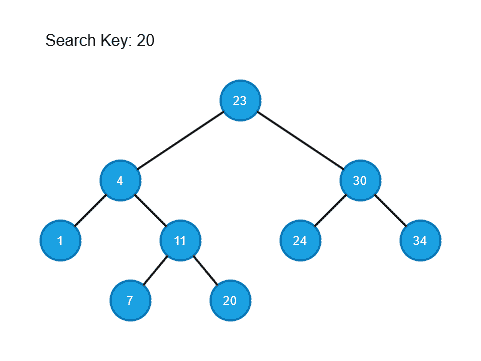

并按如下方式实现搜索方法。

```
def search(self, key: Any) -> Optional[Node]:
    current = self.root

    while current:
        if key < current.key:
            current = current.left
        elif key > current.key:
            current = current.right
        else:
            return current
    return None
```

需要注意的一点是，如果节点不存在，我们返回 *None* 。检查搜索函数是否返回 *None* 是客户端的责任，给定的键不在树中是正常的。

## 删除

二叉查找树的删除有三种情况—要删除的节点没有子节点、一个子节点或两个子节点。

删除节点的想法是用要删除的节点替换子树。该技术来自[算法简介](https://en.wikipedia.org/wiki/Introduction_to_Algorithms)。在本书中，作者定义了一个*移植*方法来在二叉查找树中移动子树。使用*移植*方法，我们可以利用该方法实现三种删除情况。因此，本节从移植函数开始，然后是三个删除案例。

**移植**

*移植*方法用根在节点*替换 _ 节点*的子树替换根在节点*删除 _ 节点*的子树。在*替换 _ 节点*替换*删除 _ 节点*后，*删除 _ 节点*的父节点成为*替换 _ 节点*的父节点，*删除 _ 节点*的父节点最终以*替换 _ 节点*为其子节点。由于函数是内部的，我们用前导下划线定义函数，即 *_transplant* 。

```
def _transplant(self, deleting_node: Node, replacing_node: Optional[Node]) -> None:
    if deleting_node.parent is None:
        self.root = replacing_node
    elif deleting_node == deleting_node.parent.left:
        deleting_node.parent.left = replacing_node
    else:
        deleting_node.parent.right = replacing_node

    if replacing_node:
        replacing_node.parent = deleting_node.parent
```

案例 1:没有孩子

如果要删除的节点没有子节点，使用*移植*功能将节点替换为*无*。

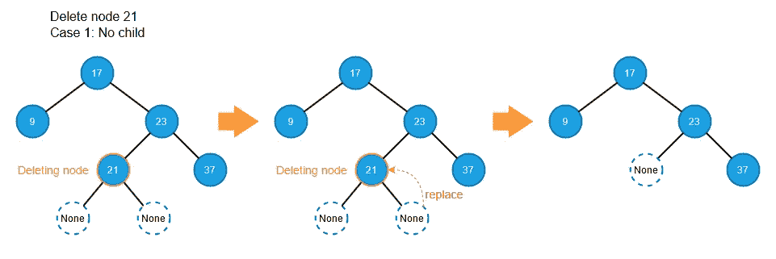

案例二:只有一个孩子

如果要删除的节点只有一个子节点，不管这个子节点是左还是右，使用*移植*功能替换子节点。

**留下一个孩子**

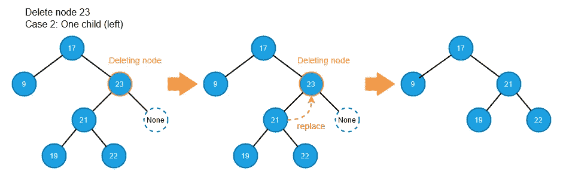

**一个右孩子**

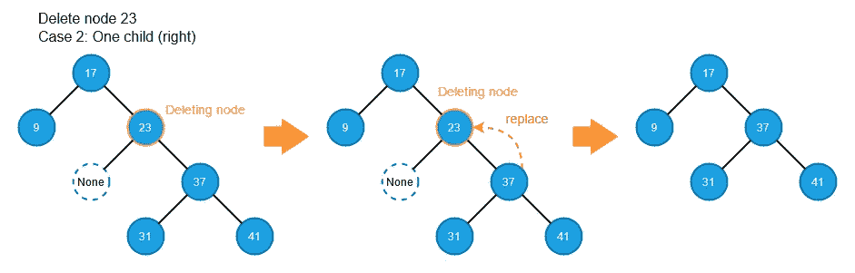

案例 3:两个孩子

要删除的节点有两个子节点的情况可以分解为两个子情况:

3.a 删除节点的右边子节点也是右边子树中最左边的节点。

在这种情况下，正确的孩子必须只有一个正确的孩子。否则，它不能是最左边的节点。因此，我们可以将删除节点替换为它的右子节点，如下图所示。


3.b .删除节点的右子节点也有两个子节点。

在这种情况下，我们从右边的子树中找到最左边的节点来替换要删除的节点。注意，当我们从右边的子树中取出最左边的节点时，它也属于删除情况:情况 1:没有子节点或情况 2:只有一个右边的子节点。否则，它不能是最左边的节点。

因此，我们使用了两次*移植*函数:一次是取出最左边的节点，另一次是用原来最左边的节点替换删除的节点。下图演示了这个案例的步骤。

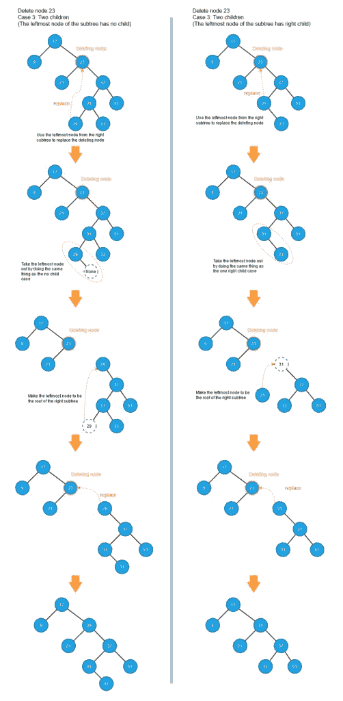

以下是删除过程的步骤:

```
1\. Find the node to be deleted
2\. If the deleting node has no child, replace the node with None
3\. If the deleting node has only one child, replace the node with its child
4\. If the deleting node has two children,
    a. Find the leftmost node from the right subtree
    b. If the leftmost node is also the direct child of the deleting node, replace the deleting node with the child
    c. If the right child also has two children, do 
        1\. Take out the leftmost node by doing the same thing as cases: no child or only one right child. 
        2\. Take the leftmost node as the new root of the right subtree. 
        3\. Replace the deleting node with the new root of the right subtree
```

使用该算法，我们可以如下实现删除方法。

```
def delete(self, key: Any) -> None:
    if self.root and (deleting_node := self.search(key=key)):

        # Case 1: no child or Case 2a: only one right child
        if deleting_node.left is None:
            self._transplant(
                deleting_node=deleting_node, replacing_node=deleting_node.right
            )

        # Case 2b: only one left left child
        elif deleting_node.right is None:
            self._transplant(
                deleting_node=deleting_node, replacing_node=deleting_node.left
            )

        # Case 3: two children
        else:
            replacing_node = BinarySearchTree.get_leftmost(node=deleting_node.right)
            # The leftmost node is not the direct child of the deleting node
            if replacing_node.parent != deleting_node:
                self._transplant(
                    deleting_node=replacing_node,
                    replacing_node=replacing_node.right,
                )
                replacing_node.right = deleting_node.right
                replacing_node.right.parent = replacing_node
            self._transplant(
                deleting_node=deleting_node, replacing_node=replacing_node
            )
            replacing_node.left = deleting_node.left
            replacing_node.left.parent = replacing_node
```

# 辅助功能

除了核心功能，二叉查找树可能还有其他有用的功能，如获取最左边的节点，获取节点的后继节点，以及获取树的高度。这些函数不依赖于特定的树对象。相反，它们可以应用于任何树和任何给定的子树。因此，我们将这些函数定义为独立的函数，而不是 *BinarySearchTree* 类的方法。

在这个项目中，我们将辅助函数实现为 *BinarySearchTree* 类的静态方法。

为什么 [@staticmethod](https://docs.python.org/3/library/functions.html#staticmethod) ？

当一个方法被定义为静态方法时，意味着这个方法执行一些与类相关的功能，但是不需要任何类实例来完成这些工作。静态方法定义完美地匹配了执行绑定到 *BinarySearchTree* 类而不是 *BinarySearchTree* 对象的操作的辅助函数的情况。

为什么不直接定义一个正则函数呢？

使用静态方法不仅在逻辑上有意义，而且提高了可读性。当客户端(即人类)读取代码时，函数定义告诉客户端该函数绑定到任何类型为 *BinarySearchTree* 的对象。

下一节重点介绍这些辅助功能。

## 获得高度

树(子树)的高度是从根部到叶子的最大长度。同样，一棵树只有一个节点，它的高度为零。例如，下图显示树的高度为 4，根为 11 和 30 的子树的高度分别为 2 和 1。

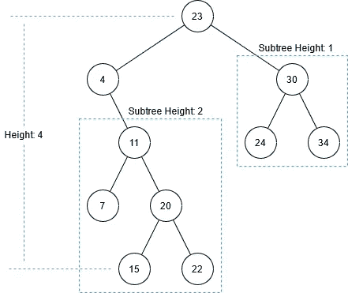

采油树高度是决定二叉查找树作业绩效的关键因素(详见分析部分)。

为了计算树的高度，我们可以为每个孩子的高度递归地增加 1。如果一个节点有两个子节点，我们使用 [max](https://docs.python.org/3/library/functions.html#max) 函数从子节点中获取较大的高度，并将最大值增加 1。

```
@staticmethod
def get_height(node: Node) -> int:
    if node.left and node.right:
        return max(
            BinarySearchTree.get_height(node=node.left),
            BinarySearchTree.get_height(node=node.right),
        ) + 1

    if node.left:
        return BinarySearchTree.get_height(node=node.left) + 1

    if node.right:
        return BinarySearchTree.get_height(node=node.right) + 1

    # If reach here, it means the node is a leaf node.
    return 0
```

## 获取最左边和最右边的节点

由于二进制搜索树属性，最左边的节点包含给定(子)树中的最小键。类似地，最右边节点的键是给定(sub)中的最大值。找到最左边和最右边很简单——沿着路径走。

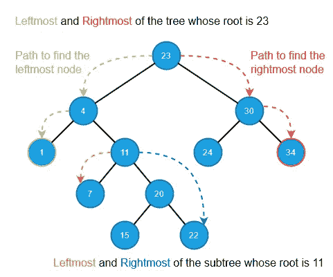

因为我们可以从任何给定的子树(如果不是整个树)中检索最左边或最右边的节点，所以参数是给定(子)树的根。

**得到最左边的**

```
@staticmethod
def get_leftmost(node: Node) -> Node:
    current_node = node
    while current_node.left:
        current_node = current_node.left
    return current_node
```

**获取最右边的**

```
@staticmethod
def get_rightmost(node: Node) -> Node:
    current_node = node
    while current_node.right:
        current_node = current_node.right
    return current_node
```

## 前任和继任者

当我们遍历二叉查找树时，节点的**前任**是位于给定节点之前的节点，而**继任**是正好位于给定节点之后的节点。穿越二叉查找树有很多方法。在这个项目中，前置任务和后续任务是按顺序遍历的。有序遍历以排序的方式遍历二叉查找树。因此，该节点的前任节点将是排序顺序中恰好在给定节点之前的节点，而后继节点将是排序顺序中恰好在给定节点之后的节点。因为按序遍历产生排序的结果，所以使用给定节点的按序前导和后继是最有用的。

**前任**

查找给定节点的前任有两种情况:

*   如果给定节点的左侧子节点不为空，则左侧子树的最右侧节点是其前任。
*   如果给定节点(x)的左子节点是空的，那么我们从给定节点(x)向上，直到我们遇到一个节点(y ),它是其父节点(z)的右子节点。父节点(z)是给定节点(x)的前身。

下图显示了这两种情况。

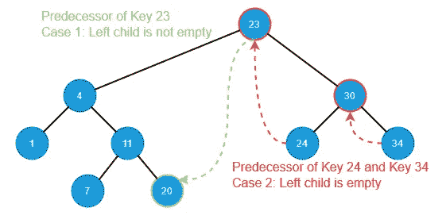

案例 1 很简单。对于情况 2，让我们以节点 24 和节点 34 为例。

在节点 24 的前身的情况下，节点 24 是 x。由于节点 24 (x)没有左子节点，我们从节点 24 (x)向上，我们发现节点 30 (y)是其父节点 23 (z)的右子节点。该算法告诉我们，节点 23 (z)是节点 24 (x)的前身。

关于节点 34 的前任的情况，节点 34 是 x。由于节点 34 (x)没有左孩子，我们从节点 34 (x)向上，我们发现节点 34 (y)也是其父节点 30 (z)的右孩子。因此，节点 34 (x)的前身是节点 30 (z)。注意，如果一个节点是正确的子节点，它可以同时是 x 和 y。

**获取前任**

```
@staticmethod
def get_predecessor(node: Node) -> Optional[Node]:
    if node.left:  # Case 1: left child is not empty
        return BinarySearchTree.get_rightmost(node=node.left)
    # Case 2: left child is empty
    parent = node.parent
    while parent and (node == parent.left):
        node = parent
        parent = parent.parent
    return parent
```

**继任者**

获得后继的算法与获得前任的算法是对称的，并且它也有两种寻找给定节点的后继的情况:

*   如果给定节点的右子节点不为空，那么右子树最左边的节点就是后继节点。
*   如果给定节点(x)的右子节点为空，那么我们从节点(x)向上，直到遇到一个节点(y ),它是其父节点(z)的左子节点。父节点(z)是给定节点(x)的后继节点。

下图显示了这两种情况。

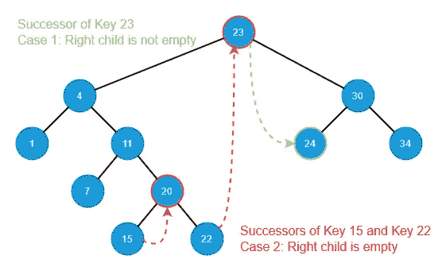

与前一种情况一样，如果一个节点是左子节点，则该节点可以同时是 x 和 y。

在节点 15 的后继节点的情况下，节点 15 是 x 和 y，节点 20 是 z，它是节点 15 的后继节点。

对于节点 22 的后继，节点 22 是 x，节点 4 是 y，节点 23 是 z。所以节点 23 是节点 22 (x)的后继。

**得到接班人**

```
@staticmethod
def get_successor(node: Node) -> Optional[Node]:
    if node.right:  # Case 1: right child is not empty
        return BinarySearchTree.get_leftmost(node=node.right)
    # Case 2: right child is empty
    parent = node.parent
    while parent and (node == parent.right):
        node = parent
        parent = parent.parent
    return parent
```

# 特殊函数

根据 Python 文档， [__repr__()](https://docs.python.org/3.9/reference/datamodel.html#object.__repr__) 用于计算对象的正式字符串表示。文档还说，“这通常用于调试，…”。因此，在我们的 *BinarySearchTree* 类中，我们利用这个函数来提供树细节，这将帮助我们调试问题。

```
def __repr__(self) -> str:
    if self.root:
        return (
            f"{type(self)}, root={self.root}, "
            f"tree_height={str(self.get_height(self.root))}"
        )
    return "empty tree"
```

当我们在一个 *BinarySearchTree* 对象上打印 [repr()](https://docs.python.org/3.9/library/functions.html#repr) 时，我们可以查看如下所示的树细节。

```
<class '__main__.BinarySearchTree'>, root=Node(key=23, data='23', left=Node(key=4, data='4', left=Node(key=1, data='1', left=None, right=None, parent=...), right=Node(key=11, data='11', left=Node(key=7, data='7', left=None, right=None, parent=...), right=Node(key=20, data='20', left=Node(key=15, data='15', left=None, right=None, parent=...), right=Node(key=22, data='22', left=None, right=None, parent=...), parent=...), parent=...), parent=...), right=Node(key=30, data='30', left=Node(key=24, data='24', left=None, right=None, parent=...), right=Node(key=34, data='34', left=None, right=None, parent=...), parent=...), parent=None), tree_height=4
```

这些信息可以帮助我们调试问题。

# 试验

单元测试是软件项目保证质量的最低要求。pytest 框架是 Python 程序的一个流行的测试框架。在我们的项目中，我们在以下设置中使用它:

请查看每个链接了解详细信息。

# 分析

一个能够工作的软件程序，正确性和性能都是必要的。然而，我认为正确性比性能更重要。当我们实现一个软件程序时，我们应该总是确保程序正常工作，然后调整它的性能。没有正确性，程序就没有用。这也是为什么本文是按这个顺序写的:测试部分在分析部分之前。在测试部分(并确保*二进制搜索树*工作)之后，这一部分重点关注它的性能。本节的分析适用于一般的二叉查找树(不仅仅是我们实现的*二进制搜索树*)。

二叉查找树的空间复杂度是 O(n)，其中 n 是节点的总数。

二叉查找树每次操作的运行时间高度依赖于树的高度。如果树的高度是 h，我们可以得到每个操作的运行时间如下:

对于插入操作，我们首先需要找到从根到叶层插入节点的位置，这需要运行时间 T(h)对树高 h，然后更新节点属性，这需要恒定的运行时间。因此，插入操作的总运行时间是 T(h) +常数，这也相当于 O(h)，因为 big-O 符号是运行时间的上限。

类似地，搜索和删除操作也需要从根开始遍历树，直到找到节点或要删除的节点。因此，它们的运行时间也是 O(h)其中 h 是树高。

为了找到最左边和最右边的节点，我们还需要从给定节点到叶层遍历树，因为最左边和最右边的节点必须在叶层中。运行时间也是 O(h ),其中 h 是(子)树的高度。

给定节点的前任有两种情况:1 .给定节点有一个左子节点，2。给定节点的左子节点为空。

由于如果给定的节点有一个左子节点，那么左子树最右边的节点就是前任节点，所以情况 1 的运行时间相当于得到最左边的节点，也就是 O(h)其中 h 是树高。

对于案例 2，我们需要找到父节点的右子节点。换句话说，如果前一个在最顶层，它的代价可能是 O(h)。

所以前任的运行时间是两种情况的组合:O(h) + O(h) = 2 * O(h) = O(h)。

后继者与前任是对称的，它也有运行时间 O(h ),其中 h 是树的高度。

现在，我们知道每个操作的运行时间取决于树的高度。接下来我们想知道的是，当一棵树有 n 个节点时，它能有多高。

如果一棵树是完整的，那么它的高度是 O(lg n)。但是，如果二叉树是线性链式的，那么它的高度就变成 O(n)。

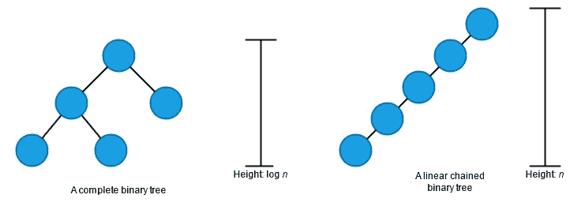

基于定理“在 n 个不同的键上随机构造的二叉查找树的期望高度是 O(lg n)”，平均情况下每个操作的时间复杂度为 O(lg n)。这个定理的细节和证明在[算法介绍](https://en.wikipedia.org/wiki/Introduction_to_Algorithms)第 12.4 章中讨论。

因此，我们可以在表中总结每个操作的运行时间。n 是节点的数量。

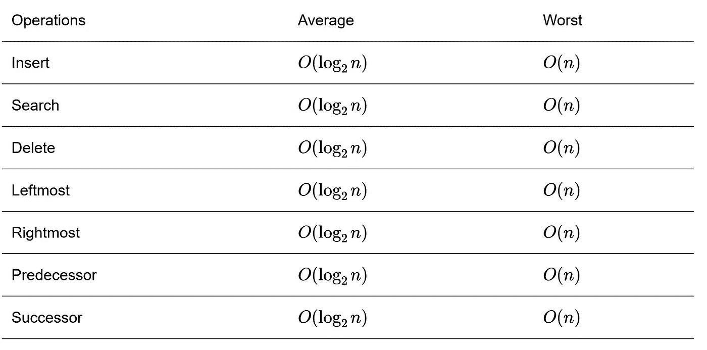

# 例子

树数据结构在软件中被广泛使用，包括实现其他数据结构。例如， *BinarySearchTree* 提供的操作允许我们使用搜索树作为键值映射。本节通过使用我们在这个项目中实现的 *BinarySearchTree* 演示了一个键值*映射*。

key-value *Map* 类支持插入一个 key-value 项、通过键获取一个项以及通过键删除一个项等操作。为了支持这些操作，我们需要实现用于插入键值项的 [__setitem__](https://docs.python.org/3/reference/datamodel.html#object.__setitem__) 函数、用于按键检索项的 [__getitem__](https://docs.python.org/3/reference/datamodel.html#object.__getitem__) 函数和用于按键删除项的 [__delitem__](https://docs.python.org/3/reference/datamodel.html#object.__delitem__) 函数。因此，我们有如下的实现:

```
from typing import Any, Optional

from forest.binary_trees import binary_search_tree

class Map:
    """Key-value Map implemented by the Binary Search Tree."""

    def __init__(self) -> None:
        self._bst = binary_search_tree.BinarySearchTree()

    def __setitem__(self, key: Any, value: Any) -> None:
        self._bst.insert(key=key, data=value)

    def __getitem__(self, key: Any) -> Optional[Any]:
        node = self._bst.search(key=key)
        if node:
            return node.data
        return None

    def __delitem__(self, key: Any) -> None:
        self._bst.delete(key=key)

    @property
    def empty(self) -> bool:
        """Return `True` if the map is empty; `False` otherwise."""
        return self._bst.empty

if __name__ == "__main__":

    # Initialize the Map instance.
    contacts = Map()

    # Add some items.
    contacts["Mark"] = "mark@email.com"
    contacts["John"] = "john@email.com"
    contacts["Luke"] = "luke@email.com"

    # Retrieve an email
    print(contacts["Mark"])

    # Delete one item.
    del contacts["John"]

    # Check the deleted item.
    print(contacts["John"])  # This will print None
```

(完整示例可从 [bst_map.py](https://github.com/shunsvineyard/forest-python/blob/main/examples/bst_map.py) 获得)

# 摘要

在一般情况下，二叉查找树提供了良好的空间利用率和相对较好的操作性能，比如插入、搜索和删除。然而，我们不能保证树在大多数情况下是平衡的。正因为如此，二叉查找树没有被广泛用于解决现实世界的问题。为了解决不平衡问题和提高某些操作的性能，引入了二叉查找树的几种变体，例如红黑树和 AVL 树。因此，充分理解二叉查找树是高级树数据结构的坚实基础。

*原载于 2021 年 3 月 13 日*[*https://shunsvineyard . info*](https://shunsvineyard.info/2021/03/12/build-the-forest-in-python-series-binary-search-tree/)*。*