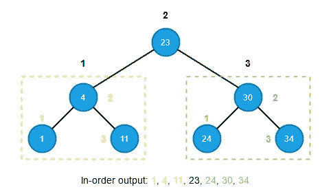
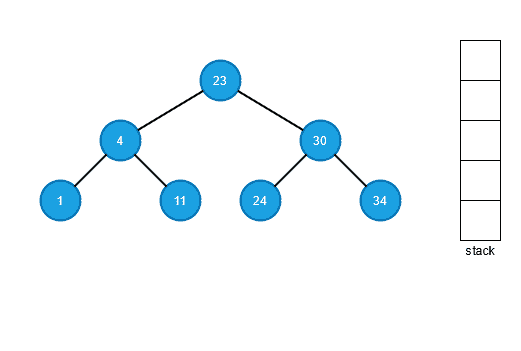
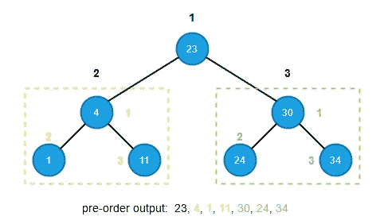
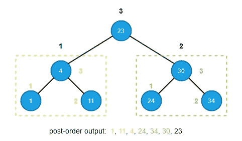
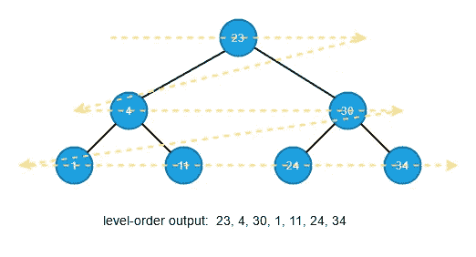
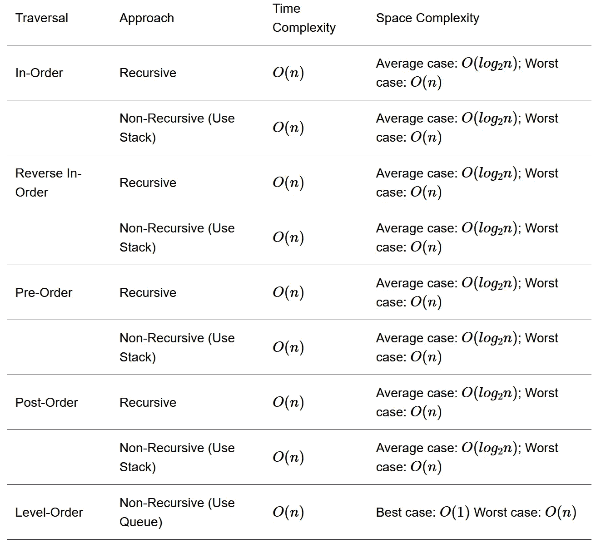

# 构建 Python 系列中的森林:二叉树遍历

> 原文：<https://medium.com/nerd-for-tech/build-the-forest-in-python-series-binary-tree-traversal-e4f88bfb9ddf?source=collection_archive---------16----------------------->

本文是[营造森林系列](https://shunsvineyard.info/build-the-forest-series/)的第二篇。在本文中，我们不打算构建一棵树。相反，我们将实现遍历二叉树的函数。当我们使用数据结构来管理数据时，一个重要的用例是检查我们管理的所有数据。这就是为什么树遍历是必不可少的。

遍历是一种系统地检查树的节点的方法，只访问每个节点一次。遍历二叉树有很多种方法:按序、前序、后序和层次序。这些名字来自根到其子树的相对位置。树遍历也是图遍历的一种形式。有序、前序和后序遍历是深度优先遍历的类型，而级别顺序遍历是广度优先遍历的类型。本文将以递归和迭代的方式介绍这些遍历函数的实现。

# 项目设置

与[构建二叉查找树](https://shunsvineyard.info/2021/03/13/build-the-forest-in-python-series-binary-search-tree/)相同，实现假设 Python 3.9 或更新版本。此外，我们在项目中添加了两个模块: *traversal.py* 用于遍历函数，以及 *test_traversal.py* 用于其单元测试。添加这两个文件后，我们的项目布局如下:

```
Forest-python
├── forest
│   ├── __init__.py
│   ├── binary_trees
│   │   ├── __init__.py
│   │   ├── binary_search_tree.py
│   │   └── traversal.py
│   └── tree_exceptions.py
└── tests
    ├── __init__.py
    ├── conftest.py
    ├── test_binary_search_tree.py
    └── test_traversal.py
```

(完整代码可从 [forest-python](https://github.com/shunsvineyard/forest-python) 获得)

# 功能界面

我们在这里实现的遍历方法尽量通用。理论上，我们可以将遍历方法应用于任何二叉树，只要它们的节点有左和右域，这是正确的。然而，对于不同类型的二叉树，它们的节点可能具有附加信息。例如，一个线程二叉树节点有信息告诉我们这个节点是一片叶子还是一个线程。在这种情况下，当我们遍历一个线程二叉树时，我们需要检查额外的信息来确定我们是否到达了叶子。换句话说，我们不能只检查节点的左或右字段是否为空。

我们没有为每个树类型的不同条件添加逻辑，而是定义了受支持的树类型，因此客户端(即，人或 linter)将知道某个树类型是否受支持。我们支持的类型定义如下所示:

```
from typing import Union
from forest.binary_trees import binary_search_tree
SupportedNode = Union[None, binary_search_tree.Node]
SupportedTree = Union[binary_search_tree.BinarySearchTree]
```

目前，我们对节点支持类型 *None* 和 *Node* ，对树只支持类型*BinarySearchTree*；当我们实现其他类型的二叉树时，我们会添加更多。

有了类型定义，我们可以利用类型注释来定义我们的遍历函数(以有序遍历为例)。

```
from typing import Any, Iterator, Optional

Pairs = Iterator[tuple[Any, Any]]
"""Iterator of Key-Value pairs, yield by traversal functions. For type checking"""

def inorder_traverse(tree: SupportedTree, recursive: bool = True) -> Pairs:
    …
```

注意，我们还为 return 定义了一个自定义类型*对*。尽管我们需要以这种方式编写更多的代码，正如[Python 的禅宗](https://www.python.org/dev/peps/pep-0020/)所建议的，“显式比隐式好。”这样，客户端可以清楚地看到输入的正确参数类型和函数返回的类型，类型检查工具(如 [mypy](http://mypy-lang.org/) )可以防止类型不匹配问题。此外，对于深度优先遍历，我们将以递归和非递归方式实现它们，这就是为什么我们有第二个参数，*递归*。

为什么不是[@过载](https://docs.python.org/3/library/typing.html#typing.overload)？

Python 是动态类型语言，[函数重载](https://en.wikipedia.org/wiki/Function_overloading)在 Python 中没有太大意义。但是我们可以利用类型注释来防止类型不匹配的问题。

从 Python 3.5 开始， [PEP-484](https://www.python.org/dev/peps/pep-0484/) 引入了@ *重载*装饰器。根据官方[文档](https://docs.python.org/3/library/typing.html#typing.overload),“@ overload decorator 允许描述支持参数类型的多种不同组合的函数和方法。”听起来很棒。然而，这只是为了类型检查器的好处。在运行时，客户端代码仍然可以向函数传递任何参数。该文档还说，“重载的一个例子给出了一个比使用联合或类型变量更精确的类型。”因此，我们使用[联合](https://docs.python.org/3/library/typing.html#typing.Union)来定义*支持的树*类型。使用 *SupportedTree* 也比定义几个@overload 修饰的定义代码少。

为什么返回类型*对*是迭代器？

想法是将遍历函数实现为[生成器](https://docs.python.org/3/glossary.html#term-generator-iterator)。这样做的一个主要好处是，当生成器迭代器返回时，它从停止的地方继续。当树很大时，这种方法可以节省大量内存。遍历函数的客户端代码可以一次处理一个项目。此外，客户端代码将更简单，更容易阅读。

# 有序遍历

有序遍历通过以下方法访问二叉树，每个节点可以表示为子树的根。

1.  遍历左边的子树。
2.  访根。
3.  遍历右边的子树。

下图演示了有序遍历的思想。黄色部分是根 23 的左子树，绿色部分是根 23 的右子树。节点旁边的小数字(即 1，2，3)表示遍历顺序。



如果二叉树也是一个二叉查找树，二叉搜索树属性允许我们通过有序遍历产生排序的顺序键值，如上图所示。

二叉树遍历可以通过使用递归或辅助堆栈来完成。如前一节所述，我们以递归和非递归的方式实现它们。

```
def inorder_traverse(tree: SupportedTree, recursive: bool = True) -> Pairs:
    if recursive:
        return _inorder_traverse(node=tree.root)
    return _inorder_traverse_non_recursive(root=tree.root)
```

因为我们想隐藏实现细节，我们用前导下划线命名实际的实现函数( *_inorder_traverse* 和*_ in order _ traverse _ non _ recursive*)，这意味着它们是内部函数。

**递归实现**

由于有序遍历的定义，递归遍历是遍历树的最自然的方式，可以按如下方式实现。

```
def _inorder_traverse(node: SupportedNode) -> Pairs:
    if node:
        yield from _inorder_traverse(node.left)
        yield (node.key, node.data)
        yield from _inorder_traverse(node.right)
```

注意，我们使用来自的 [yield 来递归调用 *_inorder_traverse* 。那是因为 _ *inorder_traverse* 是生成器；为了允许一个生成器将其部分操作委托给另一个生成器，我们需要使用来自的 *yield。*](https://docs.python.org/3/whatsnew/3.3.html#pep-380)

**非递归实现**

关于有序遍历，我们首先访问左子树，然后是根，最后是右子树。因此，在访问左子树之前，我们先推右边的子树，然后是根。推入顺序是因为堆栈是一种先入后出的数据结构。在我们访问左边的子树之后，我们弹出栈来访问根，然后再次弹出来访问右边的子树。重复这些步骤，直到堆栈为空。



为了实现有序遍历函数，我们需要一个堆栈来保存我们稍后将访问的子树的根。做非递归遍历时，关键是:1。我们什么时候把一个节点压入栈中，什么时候从栈中取出一个节点，2。当我们遍历的时候，什么时候产生(即访问)节点。

1.  当我们正在访问的节点有一个右子节点时，我们将它的右子节点推到堆栈中，然后将该节点推到堆栈中。
2.  当从堆栈中弹出一个节点时，如果该节点没有右子节点或者它的右子节点与顶部节点相同，我们就生成该节点。

我们使用 Python 内置的 [list](https://docs.python.org/3/tutorial/datastructures.html) 作为栈来实现非递归的有序遍历，因为内置的 list 具有先进后出的能力: *list.append(x)* 在 list 的末尾添加一项， *list.pop()* 从 list 中移除并返回最后一项。

```
def _inorder_traverse_non_recursive(root: SupportedNode) -> Pairs:
    if root is None:
        raise StopIteration

    stack = []
    if root.right:
        stack.append(root.right)
    stack.append(root)
    current = root.left

    while True:

        if current:
            if current.right:
                stack.append(current.right)
                stack.append(current)
                current = current.left
                continue
            stack.append(current)
            current = current.left

        else:  # current is None

            if len(stack) > 0:
                current = stack.pop()

                if current.right is None:
                    yield (current.key, current.data)
                    current = None
                    continue
                else:  # current.right is not None
                    if len(stack) > 0:
                        if current.right == stack[-1]:
                            yield (current.key, current.data)
                            current = stack.pop() if len(stack) > 0 else None
                            continue
                        else:  # current.right != stack[-1]:
                            # This case means there are more nodes on the right
                            # Keep the current and go back to add them.
                            continue

            else:  # stack is empty
                break
```

# 反向有序遍历

当遍历一种类型的二叉查找树时，按序遍历产生升序排序的输出。如果以反向顺序遍历的方式遍历二叉树，排序后的结果将是降序。为了以相反的顺序遍历，我们首先访问右边的子树，最后访问左边的子树。

1.  遍历右边的子树。
2.  访根。
3.  遍历左边的子树。

反向有序遍历也可以通过递归和非递归的方式实现。并且实现与按序遍历是对称的。

```
def reverse_inorder_traverse(tree: SupportedTree, recursive: bool = True) -> Pairs:
    if recursive:
        return _reverse_inorder_traverse(node=tree.root)
    return _reverse_inorder_traverse_non_recursive(root=tree.root)
```

**递归反向有序遍历**

```
def _reverse_inorder_traverse(node: SupportedNode) -> Pairs:
    if node:
        yield from _reverse_inorder_traverse(node.right)
        yield (node.key, node.data)
        yield from _reverse_inorder_traverse(node.left)
```

**非递归反向有序遍历**

```
def _reverse_inorder_traverse_non_recursive(root: SupportedNode) -> Pairs:
    if root is None:
        raise StopIteration

    stack = []
    if root.left:
        stack.append(root.left)
    stack.append(root)
    current = root.right

    while True:

        if current:
            if current.left:
                stack.append(current.left)
                stack.append(current)
                current = current.right
                continue
            stack.append(current)
            current = current.right

        else:  # current is None

            if len(stack) > 0:
                current = stack.pop()

                if current.left is None:
                    yield (current.key, current.data)
                    current = None
                    continue
                else:  # current.right is not None
                    if len(stack) > 0:
                        if current.left == stack[-1]:
                            yield (current.key, current.data)
                            current = stack.pop() if len(stack) > 0 else None
                            continue
                        else:  # current.right != stack[-1]:
                            # This case means there are more nodes on the right
                            # Keep the current and go back to add them.
                            continue

            else:  # stack is empty
                break
```

# 前序遍历

前序遍历通过以下方法访问二叉树。

1.  访根。
2.  遍历左边的子树。
3.  遍历右边的子树。

下图是前序遍历的思路。黄色部分是根 23 的左子树，绿色部分是根 23 的右子树。与按序遍历相同，节点旁边的小数字(即 1、2、3)表示遍历顺序。



我们还以递归和非递归的方式实现了前序遍历。

```
def preorder_traverse(tree: SupportedTree, recursive: bool = True) -> Pairs:
    if recursive:
        return _preorder_traverse(node=tree.root)
    return _preorder_traverse_non_recursive(root=tree.root)
```

**递归前序遍历**

递归实现很简单，只需遵循遍历顺序。

```
def _preorder_traverse(node: SupportedNode) -> Pairs:
    if node:
        yield (node.key, node.data)
        yield from _preorder_traverse(node.left)
        yield from _preorder_traverse(node.right)
```

**非递归前序遍历**

关于非递归实现，下图演示了非递归前序遍历。


非递归前序遍历比非递归有序遍历简单。因为我们首先访问根，所以这个过程可以看作是以下步骤:

1.  当我们访问一个节点时，我们将它的右子节点推到堆栈中(如果它有一个的话)，然后将它的左子节点推到堆栈中(如果它有一个的话)。
2.  当一个节点从堆栈中弹出时，我们产生这个节点。

```
def _preorder_traverse_non_recursive(root: SupportedNode) -> Pairs:
    if root is None:
        raise StopIteration

    stack = [root]

    while len(stack) > 0:
        temp = stack.pop()
        yield (temp.key, temp.data)

        # Because stack is FILO, insert right child before left child.
        if temp.right:
            stack.append(temp.right)

        if temp.left:
            stack.append(temp.left)
```

# 后序遍历

后序遍历通过以下方法访问二叉树。

1.  遍历左边的子树。
2.  遍历右边的子树。
3.  访根。

下图是后序遍历的思路。与前面的遍历类似，节点旁边的小数字(即 1、2、3)表示遍历顺序。



同样，我们用递归和非递归方法来构建后序遍历。

```
def postorder_traverse(tree: SupportedTree, recursive: bool = True) -> Pairs:
    if recursive:
        return _postorder_traverse(node=tree.root)
    return _postorder_traverse_non_recursive(root=tree.root)
```

**递归后序遍历**

类似于有序和前序遍历，递归实现很简单。

```
def _postorder_traverse(node: SupportedNode) -> Pairs:
    if node:
        yield from _postorder_traverse(node.left)
        yield from _postorder_traverse(node.right)
        yield (node.key, node.data)
```

**非递归后序遍历**

然而，后序遍历的非递归实现有点复杂。下图以非递归的方式演示了后序遍历。


1.  与非递归有序遍历一样，当我们执行非递归后序遍历时，如果我们访问的节点有一个右子节点，我们将它的右子节点推送到堆栈，然后也将该节点推送到堆栈。
2.  当该节点从堆栈中弹出时，我们产生该节点，并且它没有正确的子节点，或者堆栈变空。此外，如果从堆栈中弹出的节点有一个正确的子节点，并且该子节点不同于堆栈中的顶部节点，这意味着我们已经访问了正确的子树。在这种情况下，我们可以生成节点。否则，我们将堆栈中的顶部节点与当前节点交换，并遍历右边的子树。

```
def _postorder_traverse_non_recursive(root: SupportedNode) -> Pairs:
    if root is None:
        raise StopIteration

    stack = []
    if root.right:
        stack.append(root.right)
    stack.append(root)
    current = root.left

    while True:

        if current:
            if current.right:
                stack.append(current.right)
                stack.append(current)
                current = current.left
                continue
            else:  # current.right is None
                if current.left:
                    stack.append(current)
                else:
                    yield (current.key, current.data)

                current = current.left

        else:  # current is None
            if len(stack) > 0:
                current = stack.pop()

                if current.right is None:
                    yield (current.key, current.data)
                    current = None
                else:  # current.right is not None
                    if len(stack) > 0:
                        if current.right != stack[-1]:
                            yield (current.key, current.data)
                            current = None
                        else:  # current.right == stack[-1]
                            temp = stack.pop()
                            stack.append(current)
                            current = temp

                    else:  # stack is empty
                        yield (current.key, current.data)
                        break
            else:  # stack is empty
                break
```

# 层次顺序遍历

与前面的深度优先遍历不同，级别顺序遍历是广度优先的。在这种情况下，我们先访问一个级别上的每个节点，然后再访问下一个级别。想法如下图所示。



我们不使用堆栈，而是使用队列来实现层次顺序遍历函数。队列是一种先进先出的数据结构。对于每个节点，首先访问该节点，然后将其子节点放入队列中。将节点从队列中出队，首先访问该节点，然后将该节点的子节点入队。重复直到队列为空。

我们还使用 Python 的内置[列表](https://docs.python.org/3/tutorial/datastructures.html)作为队列来实现 level-order 函数，因为内置列表也具有先进先出的能力: *list.append(x)* 在列表的末尾添加一项，而 *list.pop(0)* 从列表中移除并返回第一项。

```
def levelorder_traverse(tree: SupportedTree) -> Pairs:
    queue = [tree.root]

    while len(queue) > 0:
        temp = queue.pop(0)
        if temp:
            yield (temp.key, temp.data)
            if temp.left:
                queue.append(temp.left)

            if temp.right:
                queue.append(temp.right)
```

# 试验

和往常一样，我们应该尽可能多地对代码进行单元测试。这里，我们使用在[构建二叉查找树](https://shunsvineyard.info/2021/03/13/build-the-forest-in-python-series-binary-search-tree/)中创建的 [conftest.py](https://github.com/shunsvineyard/forest-python/blob/main/tests/conftest.py) 中的 *basic_tree* 函数来测试我们的遍历函数。在 *test_traversal.py* 中，我们可以像下面这样进行单元测试:我们检查遍历输出是否和预期的一样(以 test*post order _ traverse*为例)。

```
def test_binary_search_tree_traversal(basic_tree):
    """Test binary search tree traversal."""
    tree = binary_search_tree.BinarySearchTree()

    for key, data in basic_tree:
        tree.insert(key=key, data=data)

    assert [item for item in traversal.postorder_traverse(tree)] == [
        (1, "1"), (7, "7"), (15, "15"), (22, "22"), (20, "20"), (11, "11"),
        (4, "4"), (24, "24"), (34, "34"), (30, "30"), (23, "23")
    ]
```

(检查 [test_traversal.py](https://github.com/shunsvineyard/forest-python/blob/main/tests/test_traversal.py) 以获得完整的单元测试)

# 分析

## 深度优先遍历:按序、反向按序、前序和后序

**按序运行时间、按序保留、按序前和按序后遍历**

在图算法中，深度优先搜索的运行时间为 O(V+E)，其中 V 是顶点数，E 是边数。(运行时间为 O(V+E)的原因，请参考[算法介绍](https://en.wikipedia.org/wiki/Introduction_to_Algorithms)第 22.3 章)。由于有序、逆有序、前序和后序遍历是深度优先遍历的类型，我们可以将这些遍历映射到深度优先搜索。因此，这些遍历的运行时间为 O(V+E)。二叉树中的顶点是一个节点。此外，对于一棵二叉树，如果该树有 n 个节点，它必须有 n-1 条边。因此，我们可以将运行时间改写为 O(n+(n-1))=O(2n-1)=O(n)，其中 n 是节点数。因此，它们的运行时间变成 O(n)。

关于空间复杂度，我们需要根据我们的方法来分析:递归或非递归。

**递归方法中的空间复杂度**

当我们进行递归方法时，空间使用是调用栈，即函数调用自身的深度。我们从根层到叶层遍历一棵二叉树，所以树的高度决定了函数调用自身的深度。因此，如果一棵二叉树有 n 个节点，我们知道当随机建立该树时，平均情况是 O(LG n)；当树是线性链接时，最坏的情况是 O(n)。

**非递归方法中的空间复杂度**

如果我们使用非递归方法，空间使用量就是堆栈的大小。与递归方法相同，堆栈大小由树的高度决定。因此，对于一个有 n 个节点的二叉树，我们知道当树被随机建立时，平均情况是 O(lg n );当树是线性链接时，最坏的情况是 O(n)。

## 广度优先遍历:层次顺序

广度优先搜索算法的时间复杂度为 O(V+E)，其中 V 为顶点数，E 为边数(详见[算法介绍](https://en.wikipedia.org/wiki/Introduction_to_Algorithms)第 22.2 章)。所以层次顺序遍历的运行时间也是 O(n)，其中 n 是节点数。原因与上面讨论的顺序和其余深度优先类型遍历相同。

因为我们使用队列来实现层次顺序遍历，所以空间开销就是队列的大小。我们在层级顺序遍历中使用队列的原因是为了跟踪同一层级的节点。可以在队列中的节点的最大数量是叶级，这是 2^h，其中 h 是树的高度(这可以通过数学归纳法容易地证明)，并且队列大小的最坏情况发生在树平衡时，即，叶节点的最大数量。我们还知道，平衡树也是树高的最佳情况，即(lg n)，其中 n 是节点的数量。因此，队列大小的最坏情况变成 o(2^h)=o(2^(lg n)= o(n)，其中 n 是节点数。

然而，队列大小的最佳情况发生在每个级别只有一个节点时，即树是线性链接的。在这种情况下，空间复杂度变为常数，即 O(1)。

下表总结了每个遍历实现的复杂性。



# 例子

既然我们已经实现了遍历例程，我们可以使用这些遍历函数来实现来自[二叉查找树示例](https://shunsvineyard.info/2021/03/13/build-the-forest-in-python-series-binary-search-tree/#20-example)的*地图*类的 *__iter__* 方法，并迭代地图对象的数据。

```
from typing import Any, Optional

from forest.binary_trees import binary_search_tree
from forest.binary_trees import traversal

class Map:
    """Key-value Map implemented by a Binary Search Tree."""

    def __init__(self) -> None:
        self._bst = binary_search_tree.BinarySearchTree()

    def __setitem__(self, key: Any, value: Any) -> None:
        """Insert (key, value) item into the map."""
        self._bst.insert(key=key, data=value)

    def __getitem__(self, key: Any) -> Optional[Any]:
        """Get the data by the given key."""
        node = self._bst.search(key=key)
        if node:
            return node.data
        return None

    def __delitem__(self, key: Any) -> None:
        """Remove a (key, value) pair from the map."""
        self._bst.delete(key=key)

    def __iter__(self) -> traversal.Pairs:
        """Iterate the data in the map."""
        return traversal.inorder_traverse(tree=self._bst)

    @property
    def empty(self) -> bool:
        """Return `True` if the map is empty; `False` otherwise."""
        return self._bst.empty

if __name__ == "__main__":

    # Initialize the Map instance.
    contacts = Map()

    # Add some items.
    contacts["Mark"] = "mark@email.com"
    contacts["John"] = "john@email.com"
    contacts["Luke"] = "luke@email.com"

    # Retrieve an email
    print(contacts["Mark"])

    # Delete one item.
    del contacts["John"]

    # Check the deleted item.
    print(contacts["John"])  # This will print None

    # Iterate the items.
    for contact in contacts:
        print(contact)
```

(完整示例可从 [bst_map.py](https://github.com/shunsvineyard/forest-python/blob/main/examples/bst_map.py) 获得)

# 摘要

二叉树遍历是系统地访问二叉树的每个节点的方法，并且每个节点只被访问一次。它们是图搜索算法的特例，例如深度优先搜索和宽度优先搜索，并且可以通过不同的方法来实现，并且每种方法都有其优点和缺点。下面的文章将介绍改进的二分搜索法树、线程二分搜索法树，它们允许我们在不使用堆栈或递归方法的情况下遍历树，即遍历的空间复杂度总是恒定的。

*原载于 2021 年 3 月 18 日*[*https://shunsvineyard . info*](https://shunsvineyard.info/2021/03/17/build-the-forest-in-python-series-binary-tree-traversal/)*。*