# 用 Python 构建森林系列:双线程二叉查找树

> 原文：<https://medium.com/nerd-for-tech/build-the-forest-in-python-series-double-threaded-binary-search-tree-a639f5b2e304?source=collection_archive---------27----------------------->

继续讨论[线程二叉树](https://shunsvineyard.info/2021/04/02/build-the-forest-in-python-series-single-threaded-binary-search-trees/)；本文将实现双线程二叉查找树，它结合了左右单线程二叉树，具有两者的优点，但也增加了复杂性。

# 项目设置

遵循与[构建森林系列](https://shunsvineyard.info/build-the-forest-series/)中其他文章相同的风格和假设，实现假设为 Python 3.9 或更新版本。本文为我们的项目添加了两个模块:*double _ threaded _ binary _ trees . py*用于双线程二叉查找树实现，以及*test _ double _ threaded _ binary _ tree . py*用于其单元测试。添加这两个文件后，我们的项目布局如下:

```
forest-python
├── forest
│   ├── __init__.py
│   ├── binary_trees
│   │   ├── __init__.py
│   │   ├── binary_search_tree.py
│   │   ├── double_threaded_binary_tree.py
│   │   ├── single_threaded_binary_trees.py
│   │   └── traversal.py
│   └── tree_exceptions.py
└── tests
    ├── __init__.py
    ├── conftest.py
    ├── test_binary_search_tree.py
    ├── test_double_threaded_binary_tree.py
    ├── test_single_threaded_binary_trees.py
    └── test_traversal.py
```

(完整代码可从 [forest-python](https://github.com/shunsvineyard/forest-python) 获得)

# 什么是双线程二叉树？

正如我们在[中谈到的什么是线程二叉树](https://shunsvineyard.info/2021/04/02/build-the-forest-in-python-series-single-threaded-binary-search-trees/#1-what-is-threaded-binary-trees)，双线程二叉树具有单线程二叉树的两个特征:对于任何空的左或右属性，空属性被线程化到有序的前任或继任者:如果左属性为空，左属性指向节点的前任；如果右属性为空，则右属性指向该节点的后继节点。

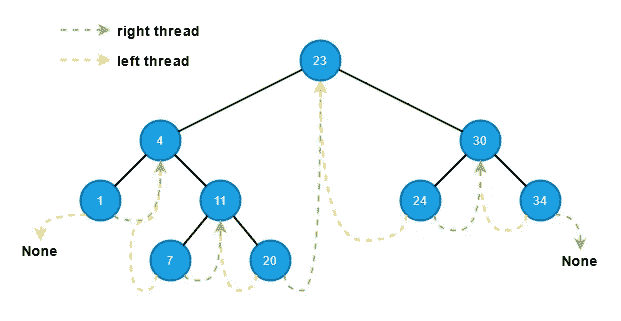

虽然增加左右线程增加了复杂性，但是双线程树具有单线程树的优点。

*   快速后继和前任访问
*   对于按序、前序和反向按序遍历，没有辅助堆栈或递归方法
*   因为不需要辅助堆栈或递归，所以减少了内存消耗。
*   利用浪费的空间。由于节点的空左和空右属性不存储任何东西，所以我们可以将空左和空右属性用作线程。

# 构建双螺纹二叉查找树

正如我们在[构建单线程二分搜索法树](https://shunsvineyard.info/2021/04/02/build-the-forest-in-python-series-single-threaded-binary-search-trees/#3-build-single-threaded-binary-search-trees)一节中所做的，这一节将遍历实现并讨论实现选择背后的一些想法。

# 结节

因为一个节点可能有一个左线程、一个右线程或者两者都有，所以这个节点比[二叉查找树节点](https://shunsvineyard.info/2021/03/13/build-the-forest-in-python-series-binary-search-tree/#4-node)多了两个字段——*左线程*和*右线程*。

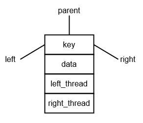

*left_thread* 和 *right_thread* 属性都是布尔变量: *True* 如果属性是线程；*假*否则。

```
@dataclass
class Node:
    key: Any
    data: Any
    left: Optional["Node"] = None
    right: Optional["Node"] = None
    parent: Optional["Node"] = None
    left_thread: bool = False
    right_thread: bool = False
```

作为二叉查找树节点，我们将线程二叉树的节点类定义为[数据类](https://www.python.org/dev/peps/pep-0557/)。

双线程二叉树具有构建和修改的核心函数(插入、删除和搜索)以及不与特定树相关的其他辅助函数，例如获取最左边的节点和获取树的高度。我们在二叉查找树中实现的同一个 *__repr__()* 函数也可以用于调试目的。

由于双线程二叉树既有左线程又有右线程，所以我们可以实现不使用堆栈也不使用递归方法的按序、前序和反向按序遍历。下面是双线程二叉树的类概述。

```
class DoubleThreadedBinaryTree:

    def __init__(self) -> None:
        self.root: Optional[Node] = None

    def __repr__(self) -> str:
        """Provie the tree representation to visualize its layout."""
        if self.root:
            return (
                f"{type(self)}, root={self.root}, "
                f"tree_height={str(self.get_height(self.root))}"
            )
        return "empty tree"

    def search(self, key: Any) -> Optional[Node]:
        …

    def insert(self, key: Any, data: Any) -> None:
        …

    def delete(self, key: Any) -> None:
        …

    @staticmethod
    def get_leftmost(node: Node) -> Node:
        …

    @staticmethod
    def get_rightmost(node: Node) -> Node:
        …

    @staticmethod
    def get_successor(node: Node) -> Optional[Node]:
        …

    @staticmethod
    def get_predecessor(node: Node) -> Optional[Node]:
        …

    @staticmethod
    def get_height(node: Optional[Node]) -> int:
        …

    def preorder_traverse(self) -> traversal.Pairs:
        …

    def inorder_traverse(self) -> traversal.Pairs:
        …

    def reverse_inorder_traverse(self) -> traversal.Pairs:
        …
```

# 插入

插入操作类似于单线程二叉树，但是双线程树需要考虑左右线程更新。

1.  通过从根开始遍历树，并将新节点的键与沿途每个节点的键进行比较，找到插入新节点的适当位置(即新节点的父节点)。当走到右边的子树时，也检查 *right_thread* 变量。如果变量*为真*，我们到达叶节点，那就是父节点。同样，当走到左子树时，我们检查 *left_thread* 。如果*为真*，我们到达叶节点，找到要插入的节点的父节点。
2.  更新新节点的父属性以指向父节点。
3.  如果新节点是父节点的左子节点，则将父节点的左属性复制到新节点的左属性中(父节点的左属性必须是插入前的线程)，并将 *left_thread* 变量设置为 *True* 。更新父节点的 left 属性指向新节点，并将父节点的 *left_thread* 设置为 *False* 。
4.  如果新节点是其父节点的右子节点，则将父节点的右属性复制到新节点的右属性中(父节点的右属性必须是插入前的线程)，并将 *right_thread* 变量设置为 *True* 。更新父节点的 right 属性以指向新节点，并将父节点的 *right_thread* 设置为 *False* 。

下图演示了节点插入的步骤。

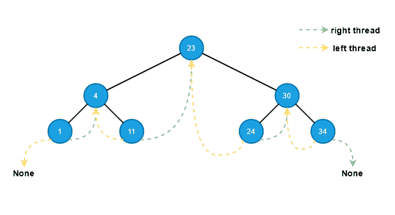

实现必须检查和更新左右线程。

```
def insert(self, key: Any, data: Any) -> None:
    node = Node(key=key, data=data)
    if self.root is None:
        self.root = node
    else:
        temp = self.root
        while temp:
            # Move to left subtree
            if node.key < temp.key:
                if temp.left_thread is False and temp.left:
                    temp = temp.left
                    continue
                else:
                    node.left = temp.left
                    temp.left = node
                    node.right = temp
                    node.right_thread = True
                    node.parent = temp
                    temp.left_thread = False
                    if node.left:
                        node.left_thread = True
                    break
            # Move to right subtree
            elif node.key > temp.key:
                if temp.right_thread is False and temp.right:
                    temp = temp.right
                    continue
                else:
                    node.right = temp.right
                    temp.right = node
                    node.left = temp
                    node.left_thread = True
                    temp.right_thread = False
                    node.parent = temp
                    if node.right:
                        node.right_thread = True
                    break
            else:
                raise tree_exceptions.DuplicateKeyError(key=key)
```

# 搜索

搜索操作类似于单线程树，但是我们检查 *left_thread* 和 *right_thread* 变量来确定我们是否到达了叶子。

1.  从根开始遍历树，并沿着树遍历将键与每个节点的键进行比较
2.  如果一个键匹配，我们就找到了节点。
3.  如果当 *left_thread* 或 *right_thread* 为真时没有关键字匹配，则该节点在树中不存在。

其实现类似于单线程二叉树的搜索，只是做了简单的修改——检查*左线程*和*右线程*。

```
def search(self, key: Any) -> Optional[Node]:
    current = self.root
    while current:
        if key == current.key:
            return current
        elif key < current.key:
            if current.left_thread is False:
                current = current.left
            else:
                break
        else:  # key > current.key
            if current.right_thread is False:
                current = current.right
            else:
                break
    return None
```

# 删除

像任何其他二叉树中的删除一样，双线程二叉树的删除可以分解为三种子情况:要删除的节点没有子节点，只有一个子节点，或者两个子节点。我们还使用我们在[二叉查找树中使用的移植技术:删除](https://shunsvineyard.info/2021/03/13/build-the-forest-in-python-series-binary-search-tree/#9-delete)来用要删除的节点替换子树。虽然基本思想是相同的，但是*移植*函数和*删除*函数都需要将右线程和左线程纳入计数。我们需要记住的最重要的事情是，当我们删除一个节点时，如果有其他节点的右或左属性指向要删除的节点，我们需要更新那些节点的线程(即右或左属性)。

## 案例 1:没有孩子

如果要删除的节点没有子节点，则 left 和 right 属性都为空，并且 *left_thread* 和 *right_thread* 都为 *True* 。关于线程，我们需要考虑两种情况。见下图。

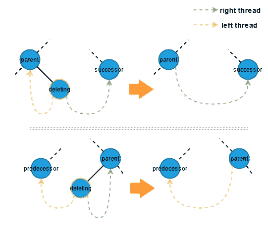

## 案例二:只有一个孩子

如果要删除的节点只有一个子节点，不管是左子节点还是右子节点，我们总是需要更新它的线程:如果删除节点是左子节点，更新删除节点与之交互的右线程。如果删除的节点是右子节点，更新指向它的左线程。我们需要更新线程的情况如下图所示。

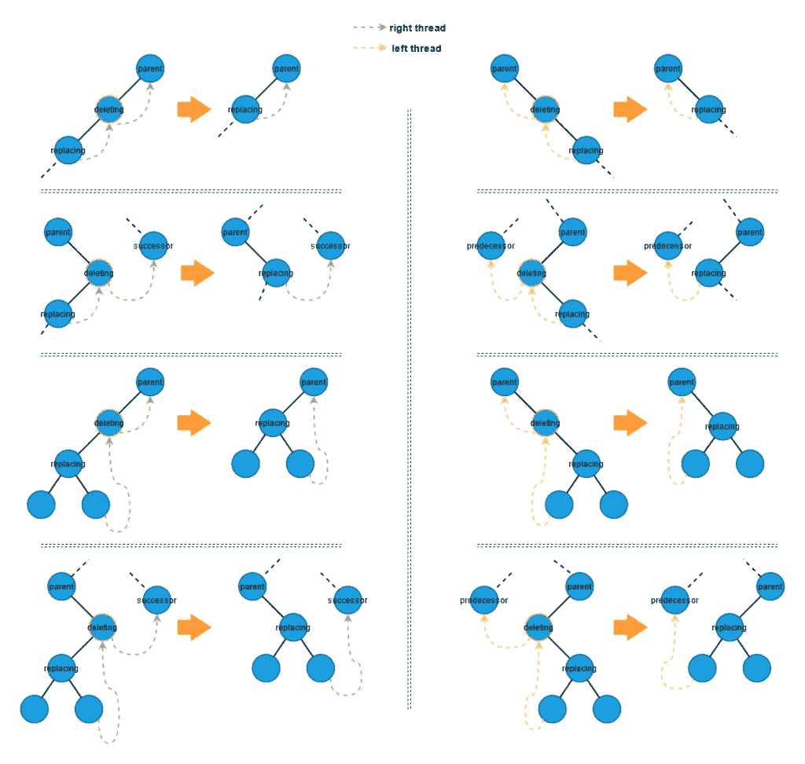

## 案例 3:两个孩子

类似于二叉查找树删除，要删除的节点有两个孩子的情况可以分解成两个子情况:

3.a 删除节点的右边子节点也是右边子树中最左边的节点。在这种情况下，正确的孩子必须只有一个正确的孩子。因此，我们可以将删除节点替换为它的右子节点，如下图所示。

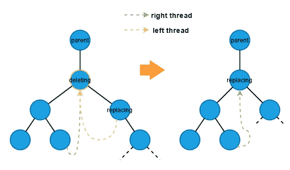

3.b .删除节点的右子节点也有两个子节点。

在这种情况下，我们从右边的子树中找到最左边的节点来替换要删除的节点。注意，当我们从右边的子树中取出最左边的节点时，它也属于删除情况:情况 1:没有子节点或情况 2:只有一个右边的子节点。否则，它不能是最左边的节点。

所以我们使用了两次*移植*函数:一次是取出最左边的节点，另一次是用原来最左边的节点替换删除的节点。下图展示了我们执行删除时的线程考虑。

**替换节点没有子节点:**

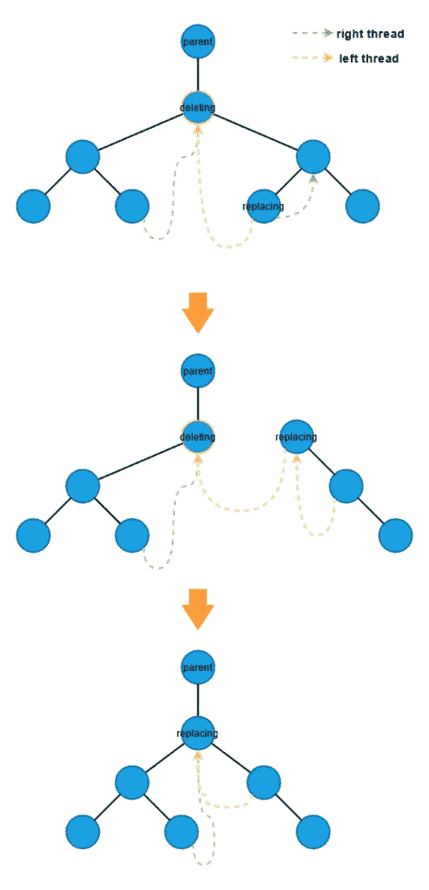

**替换节点只有一个右子节点**:

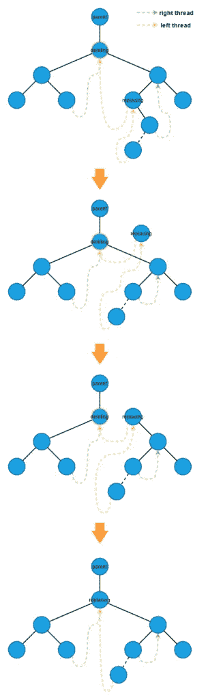

基于上面的图片，我们可以实现如下的删除和移植功能。

```
def delete(self, key: Any) -> None:
    if self.root and (deleting_node := self.search(key=key)):

        # Case 1: no child
        if (deleting_node.left_thread or deleting_node.left is None) and (
            deleting_node.right_thread or deleting_node.right is None
        ):
            self._transplant(deleting_node=deleting_node, replacing_node=None)

        # Case 2a: only one right child
        elif (
            deleting_node.left_thread or deleting_node.left is None
        ) and deleting_node.right_thread is False:

            successor = self.get_successor(node=deleting_node)
            if successor:
                successor.left = deleting_node.left
            self._transplant(
                deleting_node=deleting_node, replacing_node=deleting_node.right
            )

        # Case 2b: only one left child,
        elif (
            deleting_node.right_thread or deleting_node.right is None
        ) and deleting_node.left_thread is False:

            predecessor = self.get_predecessor(node=deleting_node)
            if predecessor:
                predecessor.right = deleting_node.right
            self._transplant(
                deleting_node=deleting_node, replacing_node=deleting_node.left
            )

        # Case 3: two children
        elif deleting_node.left and deleting_node.right:
            predecessor = self.get_predecessor(node=deleting_node)
            replacing_node: Node = self.get_leftmost(node=deleting_node.right)
            successor = self.get_successor(node=replacing_node)

            # the leftmost node is not the direct child of the deleting node
            if replacing_node.parent != deleting_node:
                if replacing_node.right_thread:
                    self._transplant(
                        deleting_node=replacing_node, replacing_node=None
                    )
                else:
                    self._transplant(
                        deleting_node=replacing_node,
                        replacing_node=replacing_node.right,
                    )
                replacing_node.right = deleting_node.right
                replacing_node.right.parent = replacing_node
                replacing_node.right_thread = False

            self._transplant(
                deleting_node=deleting_node, replacing_node=replacing_node
            )
            replacing_node.left = deleting_node.left
            replacing_node.left.parent = replacing_node
            replacing_node.left_thread = False
            if predecessor and predecessor.right_thread:
                predecessor.right = replacing_node

            if successor and successor.left_thread:
                successor.left = replacing_node
        else:
            raise RuntimeError("Invalid case. Should never happened")

def _transplant(self, deleting_node: Node, replacing_node: Optional[Node]) -> None:
    if deleting_node.parent is None:
        self.root = replacing_node
        if self.root:
            self.root.left_thread = False
            self.root.right_thread = False
    elif deleting_node == deleting_node.parent.left:
        deleting_node.parent.left = replacing_node

        if replacing_node:
            if deleting_node.left_thread:
                if replacing_node.left_thread:
                    replacing_node.left = deleting_node.left

            if deleting_node.right_thread:
                if replacing_node.right_thread:
                    replacing_node.right = replacing_node.right
        else:
            deleting_node.parent.left = deleting_node.left
            deleting_node.parent.left_thread = True

    else:  # deleting_node == deleting_node.parent.right
        deleting_node.parent.right = replacing_node

        if replacing_node:
            if deleting_node.left_thread:
                if replacing_node.left_thread:
                    replacing_node.left = deleting_node.left

            if deleting_node.right_thread:
                if replacing_node.right_thread:
                    replacing_node.right = replacing_node.right
        else:
            deleting_node.parent.right = deleting_node.right
            deleting_node.parent.right_thread = True

    if replacing_node:
        replacing_node.parent = deleting_node.parent
```

# 获得高度

为了计算一个双线程二叉树的树高，我们可以像在[二叉查找树:获取高度](https://shunsvineyard.info/2021/03/13/build-the-forest-in-python-series-binary-search-tree/#14-get-the-height)中所做的那样，为每个孩子的高度递归地增加 1。如果一个节点有两个子节点，我们使用 [max](https://docs.python.org/3/library/functions.html#max) 函数从子节点中获取较大的高度，并将最大值增加 1。主要区别是我们使用 *left_thread* 和 *right_thread* 来检查一个节点是否有子节点。

```
@staticmethod
def get_height(node: Optional[Node]) -> int:
    if node:
        if node.left_thread is False and node.right_thread is False:
            return (
                max(
                    DoubleThreadedBinaryTree.get_height(node.left),
                    DoubleThreadedBinaryTree.get_height(node.right),
                )
                + 1
            )

        if node.left_thread and node.right_thread is False:
            return DoubleThreadedBinaryTree.get_height(node.right) + 1

        if node.right_thread and node.left_thread is False:
            return DoubleThreadedBinaryTree.get_height(node.left) + 1

    return 0
```

# 获取最左边和最右边的节点

由于双线程树节点可能有左线程、右线程或者两者都有，为了得到最右边的节点和最左边的节点，我们需要检查 *right_thread* 和 *left_thread* 是否为 *True* 。*get _ leftsmall*的实现如下。

```
@staticmethod
def get_leftmost(node: Node) -> Node:
    current_node = node
    while current_node.left and current_node.left_thread is False:
        current_node = current_node.left
    return current_node
```

*get_rightmost* 实现与 *get_leftmost* 对称。

```
@staticmethod
def get_rightmost(node: Node) -> Node:
    current_node = node
    if current_node:
        while current_node.right and current_node.right_thread is False:
            current_node = current_node.right
    return current_node
```

# 前任和继任者

双线索树既有左线索又有右线索，因此它具有快速的有序后继和前趋访问。

```
@staticmethod
def get_predecessor(node: Node) -> Optional[Node]:
    if node.left_thread:
        return node.left
    else:
        if node.left:
            return DoubleThreadedBinaryTree.get_rightmost(node=node.left)
        return None
```

*获取 _ 继任者*与*获取 _ 前任*对称。

```
@staticmethod
def get_successor(node: Node) -> Optional[Node]:
    if node.right_thread:
        return node.right
    else:
        if node.right:
            return DoubleThreadedBinaryTree.get_leftmost(node=node.right)
        return None
```

# 按序、前序和反向按序遍历

双线索树具有左线索树和右线索树的优点，因此它可以在不使用堆栈或递归方法的情况下执行按序、前序和反向按序遍历。

**有序遍历**

下图中的红色箭头演示了线程树中的有序遍历。

1.  从整个树的最左边的节点开始。
2.  如果右属性是线程，则跟随右属性；如果右边的属性不是线程，那么转到子树最左边的节点。
3.  重复步骤 2，直到右侧属性为*无*。

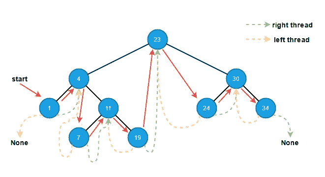

并且在不使用辅助堆栈或递归的情况下实现函数。

```
def inorder_traverse(self) -> traversal.Pairs:
    if self.root:
        current: Optional[Node] = self.get_leftmost(node=self.root)
        while current:
            yield (current.key, current.data)
            if current.right_thread:
                current = current.right
            else:
                if current.right is None:
                    break
                current = self.get_leftmost(current.right)
```

**前序遍历**

下图中下面的红色箭头显示了线程化方式的前序遍历。

1.  从根开始。
2.  如果 left 属性不为空，则转到左边的子元素。
3.  如果左边的属性是空的或者是一个线程，那么跟随右边的线程到右边。
4.  重复步骤 2 和 3，直到右侧属性为空。

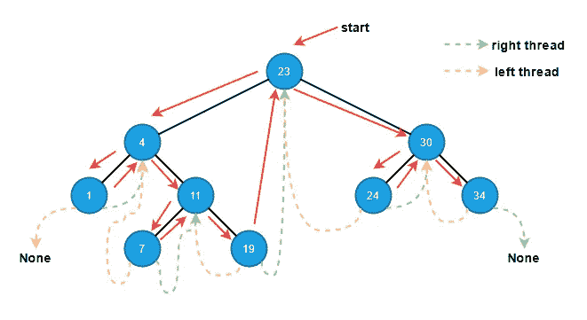

前序遍历可以如下实现。

```
def preorder_traverse(self) -> traversal.Pairs:
    current = self.root
    while current:
        yield (current.key, current.data)
        if current.right_thread:
            # If it is right thread, it must have a right child.
            current = current.right.right  # type: ignore
        elif current.left_thread is False:
            current = current.left
        else:
            break
```

**反向顺序遍历**

下图中的红色箭头演示了反向顺序遍历的线程方式。

1.  从整个树的最右边的节点开始。
2.  如果左边的属性是线程，则跟随线程；如果左边的属性不是线程，那么转到子树最右边的节点。
3.  重复步骤 2，直到左侧属性为*无*。

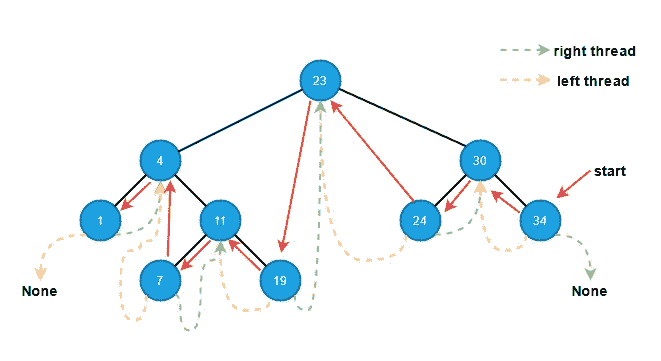

下面是实现。

```
def reverse_inorder_traverse(self) -> traversal.Pairs:
    if self.root:
        current: Optional[Node] = self.get_rightmost(node=self.root)
        while current:
            yield (current.key, current.data)
            if current.left_thread:
                current = current.left
            else:
                if current.left is None:
                    break
                current = self.get_rightmost(current.left)
```

# 试验

和往常一样，我们应该尽可能多地对代码进行单元测试。这里，我们使用在[构建二叉查找树](https://shunsvineyard.info/2021/03/13/build-the-forest-in-python-series-binary-search-tree/)中创建的 [conftest.py](https://github.com/shunsvineyard/forest-python/blob/main/tests/conftest.py) 中的 *basic_tree* 函数来测试我们的双线程二叉树。检查[test _ double _ threaded _ binary _ tree . py](https://github.com/shunsvineyard/forest-python/blob/main/tests/test_double_threaded_binary_tree.py)进行完整的单元测试。

# 分析

由于双线程树是单线程二叉树的组合，其操作的运行时间与单线程二叉树以及普通二叉查找树相同。

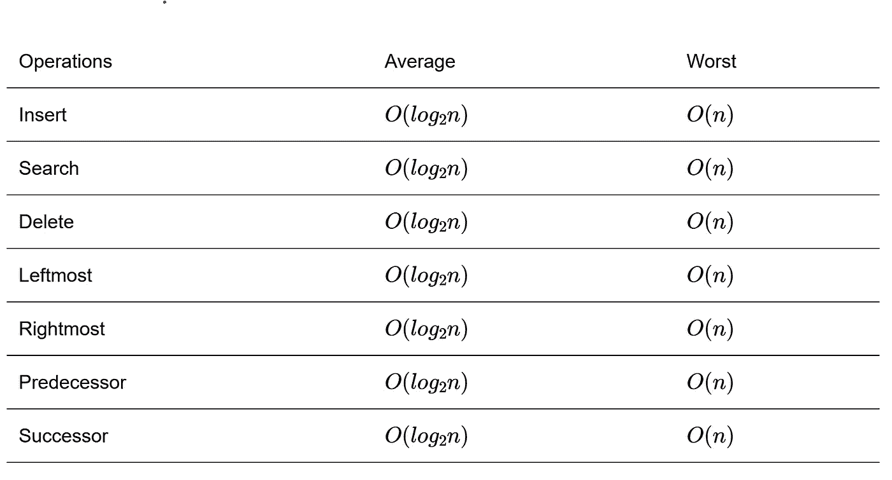

并且它在有序、前序和逆有序遍历上具有恒定的空间复杂度。

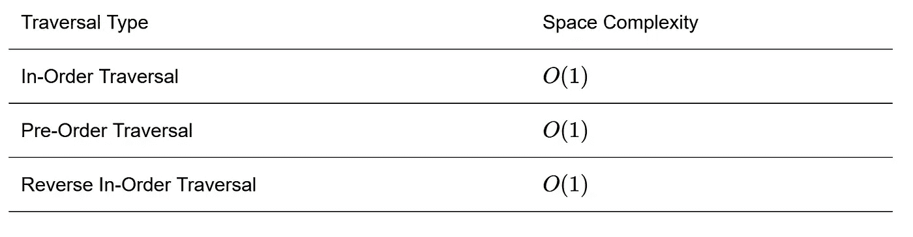

# 例子

虽然双线程二叉树比单线程二叉树更复杂，但当遍历很关键时，它可能是一种解决方案，但空间消耗是关注的，并且对于需要快速访问节点的前任和继任者的用户来说可能更简单。因此，我们在单线程二叉树中讨论的[示例](https://shunsvineyard.info/2021/04/02/build-the-forest-in-python-series-single-threaded-binary-search-trees/#32-example)可以简化如下:

```
from typing import Any

from forest.binary_trees import double_threaded_binary_tree
from forest.binary_trees import traversal

class MyDatabase:
    """Example using threaded binary trees to build index."""

    def __init__(self) -> None:
        self._double_bst = double_threaded_binary_tree.DoubleThreadedBinaryTree()

    def _persist(self, payload: Any) -> str:
        """Fake function pretent storing data to file system.

        Returns
        -------
        str
            Path to the payload.
        """
        return f"path_to_{payload}"

    def insert_data(self, key: Any, payload: Any) -> None:
        """Insert data.

        Parameters
        ----------
        key: Any
            Unique key for the payload
        payload: Any
            Any data
        """
        path = self._persist(payload=payload)
        self._double_bst.insert(key=key, data=path)

    def dump(self, ascending: bool = True) -> traversal.Pairs:
        """Dump the data.

        Parameters
        ----------
        ascending: bool
            The order of data.

        Yields
        ------
        `Pairs`
            The next (key, data) pair.
        """
        if ascending:
            return self._double_bst.inorder_traverse()
        else:
            return self._double_bst.reverse_inorder_traverse()

if __name__ == "__main__":

    # Initialize the database.
    my_database = MyDatabase()

    # Add some items.
    my_database.insert_data("Adam", "adam_data")
    my_database.insert_data("Bob", "bob_data")
    my_database.insert_data("Peter", "peter_data")
    my_database.insert_data("David", "david_data")

    # Dump the items in ascending order.
    print("Ascending...")
    for contact in my_database.dump():
        print(contact)

    print("\nDescending...")
    # Dump the data in decending order.
    for contact in my_database.dump(ascending=False):
        print(contact)
```

(完整示例可从 [double_tbst_database.py](https://github.com/shunsvineyard/forest-python/blob/main/examples/double_tbst_database.py) 获得)

输出将如下所示。

```
Ascending...
('Adam', 'path_to_adam_data')
('Bob', 'path_to_bob_data')
('David', 'path_to_david_data')
('Peter', 'path_to_peter_data')

Descending...
('Peter', 'path_to_peter_data')
('David', 'path_to_david_data')
('Bob', 'path_to_bob_data')
('Adam', 'path_to_adam_data')
```

# 摘要

双线程树确实提供了单线程二叉树的优点，但是它的实现比单线程二叉树更复杂。此外，运行时性能没有显著提高。然而，在某些情况下，例如考虑到空间复杂性，并且特定遍历(例如，有序遍历)是关键的，双线程二叉树可以是一个选项。

*原载于 2021 年 4 月 10 日*[*https://shunsvineyard . info*](https://shunsvineyard.info/2021/04/09/build-the-forest-in-python-series-double-threaded-binary-search-tree/)*。*