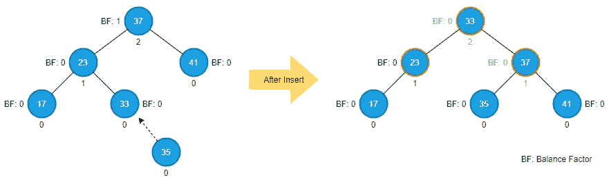
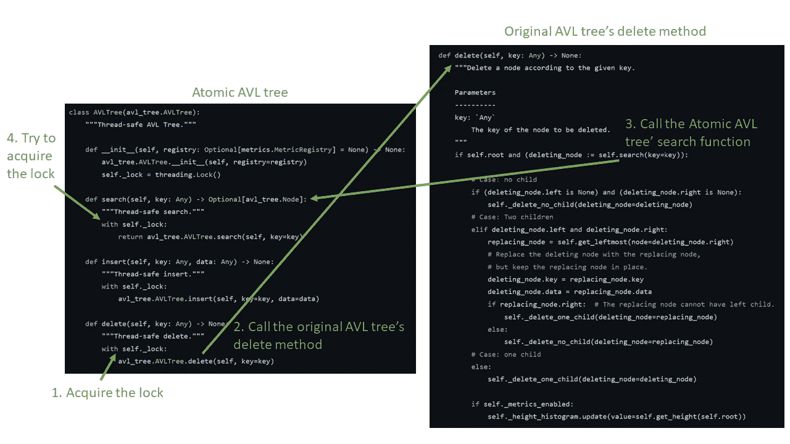

# 在 Python 系列中构建森林:使森林线程安全

> 原文：<https://medium.com/nerd-for-tech/build-the-forest-in-python-series-make-the-forest-thread-safe-b70517beb50f?source=collection_archive---------4----------------------->

多线程是提高性能的一种常用方法。然而，如果共享的状态或数据是可变的，那么线程之间的共享状态和数据就容易被破坏。我们在[构建森林系列](/nerd-for-tech/build-the-forest-in-python-series-binary-search-tree-43fdf3ddfd47)中构建的树不是线程安全的。当多个线程同时执行写操作(例如，插入或删除)时，树可能被破坏或不正确地构建。当多个线程同时执行写入和读取操作时，即使是读取操作也可能返回不正确的结果。本文的主题是让树变得线程安全，并讨论线程安全的影响。

# Python 中的多线程和 GIL

[全局解释器锁(GIL)](https://docs.python.org/3/glossary.html#term-global-interpreter-lock) 是 [CPython](https://github.com/python/cpython) 解释器(我们从 [Python 官网](https://www.python.org/downloads/)下载的就是 CPython)使用的机制，保证一次只有一个线程可以执行 Python [字节码](https://docs.python.org/3/glossary.html#term-bytecode)。尽管 GIL 保证一次只有一个线程执行 Python 字节码，但这并不意味着我们编写的 Python 程序自动是线程安全的。这是因为保护只发生在字节码级别。例如，下面的代码片段是 AVL 树的插入函数的部分反汇编字节码。(注意，我们可以使用 [dis](https://docs.python.org/3/library/dis.html) 模块反汇编 Python 字节码)

```
Disassembly of <code object insert at 0x7f136b391920, file "forest/binary_trees/avl_tree.py", line 112>:
128           0 LOAD_GLOBAL              0 (Node)
              2 LOAD_FAST                1 (key)
              4 LOAD_FAST                2 (data)
              6 LOAD_CONST               1 (('key', 'data'))
              8 CALL_FUNCTION_KW         2
             10 STORE_FAST               3 (new_node)

129          12 LOAD_CONST               2 (None)
             14 STORE_FAST               4 (parent)

130          16 LOAD_FAST                0 (self)
             18 LOAD_ATTR                1 (root)
             20 STORE_FAST               5 (current)

…                                                                                                

147     >>  128 LOAD_FAST                3 (new_node)
            130 LOAD_FAST                4 (parent)
            132 STORE_ATTR               4 (right)

154     >>  134 LOAD_FAST                4 (parent)
            136 LOAD_ATTR                3 (left)
            138 POP_JUMP_IF_FALSE      146
            140 LOAD_FAST                4 (parent)
            142 LOAD_ATTR                4 (right)
            144 POP_JUMP_IF_TRUE       156

155     >>  146 LOAD_FAST                0 (self)
            148 LOAD_METHOD              8 (_insert_fixup)
            150 LOAD_FAST                3 (new_node)
            152 CALL_METHOD              1
            154 POP_TOP
…
```

当多个线程调用 AVL 树的插入函数时，Python 解释器可能会在一个线程执行 *_insert_fixup* (即 *148 LOAD_METHOD* )指令之前切换出该线程。同时，另一个线程出现并执行插入函数的一些字节码指令。无论插入是否完成，第二个线程都会中断前面的插入函数。这种情况可能会导致一个不正确的 AVL 树，甚至更糟，程序崩溃。

# 线程不安全的示例

根据上面的讨论，有两种情况多线程可能变得不安全:写争用和读写争用。前者意味着多个写操作同时操作共享的可变资源；后者意味着读操作正在读取写操作同时更新的一些资源。

## 场景 1 —写入争用

为了模拟这个场景，我们需要并发执行一些写操作。在本例中，我们将使用五个线程同时插入 500 个非重复数据。例如，第一个线程插入从 0 到 99 的数据，第二个线程插入从 100 到 199 的数据，依此类推。所有插入完成后，添加的节点总数将是 500。

**切换间隔**

从 [Python 3.2](https://python.freelycode.com/doc/python_3_5_0/whatsnew/3.2.html#multi-threading) 开始，引入了 [setswitchinterval](https://docs.python.org/3/library/sys.html#sys.setswitchinterval) 函数，允许我们设置解释器的线程切换间隔。该值确定分配给并发运行线程的时间片的持续时间。为了使多线程问题(例如，竞争条件)快速发生，我们使用 *setswitchinterval* 函数将切换间隔减少到一个很小的值，这样线程切换将在字节码指令之间更快地发生。

以下代码是使用我们在[构建森林系列:AVL 树](/nerd-for-tech/build-the-forest-in-python-series-avl-tree-73f09abc0e1)中构建的 AVL 树来模拟问题的示例。

**线程不安全示例代码**

```
import threading
import sys

from typing import List

from forest.binary_trees import avl_tree
from forest.binary_trees import traversal

# Use a very small thread switch interval to increase the chance that
# we can reveal the multithreading issue easily.
sys.setswitchinterval(0.0000001)

def insert_data(tree: avl_tree.AVLTree, data: List) -> None:
    """Insert data into a tree."""
    for key in data:
        tree.insert(key=key, data=str(key))

def multithreading_simulator(tree: avl_tree.AVLTree) -> None:
    """Use five threads to insert data into a tree with non-duplicate data."""
    try:
        thread1 = threading.Thread(
            target=insert_data, args=(tree, [item for item in range(100)])
        )
        thread2 = threading.Thread(
            target=insert_data, args=(tree, [item for item in range(100, 200)])
        )
        thread3 = threading.Thread(
            target=insert_data, args=(tree, [item for item in range(200, 300)])
        )
        thread4 = threading.Thread(
            target=insert_data, args=(tree, [item for item in range(300, 400)])
        )
        thread5 = threading.Thread(
            target=insert_data, args=(tree, [item for item in range(400, 500)])
        )

        thread1.start()
        thread2.start()
        thread3.start()
        thread4.start()
        thread5.start()

        thread1.join()
        thread2.join()
        thread3.join()
        thread4.join()
        thread5.join()

        result = [item for item in traversal.inorder_traverse(tree=tree)]

        incorrect_node_list = list()
        for index in range(len(result)):
            if index > 0:
                if result[index] < result[index - 1]:
                    incorrect_node_list.append(
                        f"{result[index - 1]} -> {result[index]}"
                    )

        if len(result) != 500 or len(incorrect_node_list) > 0:
            print(f"total_nodes: {len(result)}")
            print(f"incorrect_order: {incorrect_node_list}")
    except:
        print("Tree built incorrectly")

if __name__ == "__main__":
    tree = avl_tree.AVLTree()
    multithreading_simulator(tree=tree)
```

在线程插入 500 个数据(从 0 到 499)后，此示例执行一些检查:

1.  如果总节点数为 500。
2.  如果有序遍历的输出是有序的。
3.  没有例外。

如果这些检查中的任何一项失败，则树构建不正确。因此，我们证明了之前实现的 AVL 树不是线程安全的。

如果我们运行这个例子足够多次(多线程问题是时间问题；它们可能不总是发生)，检查最终会失败，看起来像下面的示例。

```
total_nodes: 454
incorrect_order: ["(459, '459') -> (319, '319')"]
```

同样的情况也适用于我们之前在构建森林系列中构建的所有其他树。完整的线程不安全代码可从[多线程 _ 非 _ 安全. py](https://github.com/shunsvineyard/forest-python/blob/main/examples/multithreading_not_safe.py) 获得。

## 场景 2 —读写争用

虽然读操作不会修改任何资源的状态，但是读操作正在读取时，状态可能会受到写操作的影响。例如，线程 A 正在搜索节点 N，而线程 B 正在删除节点 M，在删除过程中，线程 B 也将节点 N 移动到不同的位置。在这种情况下，线程 A 可能无法找到节点 n。

```
import threading
import sys

from typing import Any, List
from forest.binary_trees import avl_tree

# Use a very small thread switch interval to increase the chance that
# we can reveal the multithreading issue easily.
sys.setswitchinterval(0.0000001)

flag = False   # Flag to determine if the read thread stops or continues.

def delete_data(tree: avl_tree.AVLTree, data: List) -> None:
    """Delete data from a tree."""
    for key in data:
        tree.delete(key=key)

def find_node(tree: avl_tree.AVLTree, key: Any) -> None:
    """Search a specific node."""
    while flag:
        if not tree.search(key):
            print(f"  Fail to find node: {key}")

def multithreading_simulator(tree: avl_tree.AVLTree, tree_size: int) -> None:
    """Use one thread to delete data and one thread to query at the same time."""
    global flag
    flag = True
    delete_thread = threading.Thread(
        target=delete_data, args=(tree, [item for item in range(20, tree_size)])
    )
    query_node_key = 17
    query_thread = threading.Thread(target=find_node, args=(tree, query_node_key))

    delete_thread.start()
    query_thread.start()

    delete_thread.join()
    flag = False
    query_thread.join()
    print(f"Check if the node {query_node_key} exist?")
    if tree.search(key=query_node_key):
        print(f"{query_node_key} exists")

if __name__ == "__main__":
    print("Build an AVL Tree")
    tree = avl_tree.AVLTree()
    tree_size = 200
    for key in range(tree_size):
        tree.insert(key=key, data=str(key))
    print("Multithreading Read/Write Test")
    multithreading_simulator(tree=tree, tree_size=tree_size) 
```

在这个例子中，我们首先构建一个有 200 个节点的树，然后使用一个线程继续搜索节点 17，而另一个线程删除从 20 到 200 的节点。因为该示例没有删除节点 17，所以搜索线程应该一直找到节点 17。同样，在删除线程完成之后，我们再次查询节点 17，以确保节点 17 仍然存在于树中。如果在任何时候，搜索线程都找不到节点 17，这意味着我们证明了先前实现的 AVL 树在读写争用的情况下不是线程安全的。当我们运行这个例子足够多次时，这很容易发生。发生这种情况时，将显示以下输出。

```
Build an AVL Tree
Multithreading Read/Write Test
  Fail to find node: 17
Check if node 17 exist?
17 exists
```

# 项目设置

遵循与构建森林系列中的其他文章相同的风格和假设，实现假设为 Python 3.9 或更高版本。本文为我们的项目添加了两个模块: *atomic_trees.py* 用于原子树的实现，以及 *test_automic_trees.py* 用于单元测试。添加这两个文件后，我们的项目布局如下:

```
forest-python
├── forest
│   ├── __init__.py
│   ├── binary_trees
│   │   ├── __init__.py
│   │   ├── atomic_trees.py
│   │   ├── avl_tree.py
│   │   ├── binary_search_tree.py
│   │   ├── double_threaded_binary_tree.py
│   │   ├── red_black_tree.py
│   │   ├── single_threaded_binary_trees.py
│   │   └── traversal.py
│   ├── metrics.py
│   └── tree_exceptions.py
└── tests
    ├── __init__.py
    ├── conftest.py
    ├── test_atomic_trees.py
    ├── test_avl_tree.py
    ├── test_binary_search_tree.py
    ├── test_double_threaded_binary_tree.py
    ├── test_metrics.py
    ├── test_red_black_tree.py
    ├── test_single_threaded_binary_trees.py
    └── test_traversal.py
```

(完整代码可在[森林-python](https://github.com/shunsvineyard/forest-python) 获得)

# 构建原子树

为了使森林线程安全，我们需要防止写争用和读写争用。

## 我们想保护什么？

我们首先要问的是要保护什么？一般来说，我们需要覆盖任何共享的可变状态和数据。树数据结构是树节点的组合。对节点的任何更改都会更新树的状态，并且树节点是共享的和可变的。因此，为了线程安全，我们需要确保树节点的转换是不可中断的。

## 什么能改变这个状态？

一般来说，我们不需要担心只读操作，因为读操作不会修改任何东西。只有两个函数会改变我们在本系列中构建的树的状态:插入和删除。以 AVL 树的插入为例。下图突出显示了我们插入节点 35 后接触到的节点。



从这个例子中，我们可以看到在插入操作中更新了多个节点。如果在插入期间有任何其他线程接触这些节点(即，23、33 和 37)或修改其他节点，这些节点也影响节点 22、33 和 37 的属性(例如，高度和平衡因子)，则插入将产生不正确的 AVL 树或更糟的情况——程序崩溃。

相同的场景也可以应用于删除。因此，我们需要确保插入和删除都可以不受任何干扰地完成。换句话说，插入和删除函数是不能被多个线程同时执行的关键部分。

修复、移植和旋转功能怎么样？

这些函数也更新树的状态。然而，它们的目的是支持插入和删除，这就是它们被定义为内部函数的原因(也就是说，客户端代码不应该直接调用它们)。只要我们确保一次执行一个插入或删除操作，这些辅助函数一次只能被一个线程访问——不需要保护它们。

**如何保护？**

防止同时访问共享资源的一个常见解决方案是互斥。我们可以使用 Python 内置的[锁对象](https://docs.python.org/3/library/threading.html#lock-objects)来保护一个临界区:一个线程需要[在进入临界区之前获取](https://docs.python.org/3/library/threading.html#threading.Lock.acquire)一个锁，在离开临界区之后[释放](https://docs.python.org/3/library/threading.html#threading.Lock.release)这个锁。以 [AVL 树的插入](/nerd-for-tech/build-the-forest-in-python-series-avl-tree-73f09abc0e1)为例。通过添加这些步骤，我们可以将插入算法更新为线程安全的。

1.  获得一把锁。
2.  以与二叉查找树插入相同的方式插入高度为 0 的新节点:通过从根开始遍历树并沿途将新节点的键与每个节点的键进行比较，找到插入新节点的正确位置(即新节点的父节点)。
3.  更新高度，并通过从新节点追溯到根节点来检查违反的 AVL-tree-property 是否发生。在返回到根的过程中，如果需要的话，在途中更新每个节点的高度。如果我们发现一个不平衡的节点，执行一定的旋转来平衡它。旋转后，插入结束。如果没有找到不平衡的节点，则插入在到达根节点并更新其高度后完成。
4.  打开锁。

第二步和第三步是关键部分，现在受到锁机制的保护。由于原子插入函数不改变其原始功能，我们可以将原子 AVL 树实现为原始 AVL 树的派生类，并扩展插入，如下所示。

```
import threading

from typing import Any, Optional
from forest.binary_trees import avl_tree

class AVLTree(avl_tree.AVLTree):
    def __init__(self, registry: Optional[metrics.MetricRegistry] = None) -> None:
        avl_tree.AVLTree.__init__(self, registry=registry)
        self._lock = threading.Lock()  # The lock object

    def insert(self, key: Any, data: Any) -> None:
        self._lock.acquire()
        # The original insertion function is the critical section, and
        # is protected by the lock.
        avl_tree.AVLTree.insert(self, key=key, data=data)
        self._lock.release()
```

**使用*中的锁与*-语句**

Python 编程中的一个良好实践是，如果代码块需要管理资源(例如，打开/关闭文件或获取/释放锁)，我们应该总是使用带语句上下文管理器的[。用带有语句的*包装的代码块保证释放资源(例如，锁)，即使在带有*语句的*中抛出异常(更多细节见*](https://docs.python.org/3/reference/datamodel.html#with-statement-context-managers)*[在带有](https://docs.python.org/3/library/threading.html#using-locks-conditions-and-semaphores-in-the-with-statement)语句中使用锁)。考虑到最佳实践，我们可以利用*with*-语句来管理锁资源，从而更新上面的实现。我们也可以用同样的方法保护删除。此外，语法还简化了实现，如下所示。*

```
import threading

from typing import Any, Optional
from forest.binary_trees import avl_tree

class AVLTree(avl_tree.AVLTree):
    def __init__(self, registry: Optional[metrics.MetricRegistry] = None) -> None:
        avl_tree.AVLTree.__init__(self, registry=registry)
        self._lock = threading.Lock()

    def insert(self, key: Any, data: Any) -> None:
        with self._lock:
            avl_tree.AVLTree.insert(self, key=key, data=data)

    def delete(self, key: Any) -> None:
        with self._lock:
            avl_tree.AVLTree.delete(self, key=key)
```

## 读写争用怎么样？

到目前为止，我们在上面所做的更改保护了树免受写争用情况的影响，但是它不能防止读写争用。最简单的解决方案与插入和删除功能相同——使用锁机制。但是，如果我们不小心使用锁机制，可能会出现死锁情况。下图为案例。左侧是带有搜索功能锁的原子 AVL 树，右侧是原子 AVL 树派生的原始 AVL 树。



当客户端调用原子 AVL 树的删除函数时，它首先获取锁，然后调用其父代的删除函数(即，来自原始 AVL 树的删除函数)。当我们实现[原始 AVL 树的删除功能](/nerd-for-tech/build-the-forest-in-python-series-avl-tree-73f09abc0e1)时，我们利用树的搜索功能来识别要删除的节点。然而，由于删除函数是从原子 AVL 树(即，派生类)调用的，所以要调用的搜索函数将是原子 AVL 树的搜索函数。并且原子 AVL 树的搜索试图做的第一件事是获取锁，这将永远不会发生，因为调用者(即原子 AVL 树的删除函数)仍然持有锁。僵局就是这样产生的。

有许多方法可以处理死锁情况。我们要使用的解决方案是在原来的 AVL 树中分离 *search* 函数的接口和实现——新的 *_search* 函数包含 search 实现，接口 *search* 函数调用 *_search* 函数，如下面的代码片段所示。

```
def search(self, key: Any) -> Optional[Node]:
    return self._search(key=key)

def _search(self, key: Any) -> Optional[Node]:
    current = self.root
    while current:
        if key < current.key:
            current = current.left
        elif key > current.key:
            current = current.right
        else:  # Key found
            return current
    return None
```

任何需要调用搜索函数的方法都会调用实现函数 *_search* 而不是接口 *search* 。因此，原始 AVL 树的删除函数变成如下。

```
def delete(self, key: Any) -> None:
    if self.root and (deleting_node := self._search(key=key)):
        # The rest of the code remains the same
        … 
```

这样做的几个原因。首先，由于接口保持不变，所以调用原始 AVL 树的客户端代码不会受到影响。第二，我们避免代码重复。第三，我们简化了原子 AVL 树的线程安全搜索功能的实现。下面是原子 AVL 树实现。

```
class AVLTree(avl_tree.AVLTree):
    """Thread-safe AVL Tree."""

    def __init__(self, registry: Optional[metrics.MetricRegistry] = None) -> None:
        avl_tree.AVLTree.__init__(self, registry=registry)
        self._lock = threading.Lock()

    def search(self, key: Any) -> Optional[avl_tree.Node]:
        """Thread-safe search."""
        with self._lock:
            return avl_tree.AVLTree.search(self, key=key)

    def insert(self, key: Any, data: Any) -> None:
        """Thread-safe insert."""
        with self._lock:
            avl_tree.AVLTree.insert(self, key=key, data=data)

    def delete(self, key: Any) -> None:
        """Thread-safe delete."""
        with self._lock:
            avl_tree.AVLTree.delete(self, key=key)
```

同样的情况也发生在我们之前实现的其他树中。因此，我们可以应用相同的思想来实现其余的树。完整的原子树可在 [atomic_trees.py](https://github.com/shunsvineyard/forest-python/blob/main/forest/binary_trees/atomic_trees.py) 获得，它们的父树也通过分离搜索功能的接口和实现进行了修改。参见[文件更改列表](https://github.com/shunsvineyard/forest-python/pull/32/files)了解已完成的更新。

# 试验

我们应该尽可能地对我们的代码进行单元测试。因为我们已经证明了原始 AVL 树(以 AVL 树为例)不是线程安全的，所以我们可以运行相同的测试来确保原子 AVL 树对于写争用和读写争用都是线程安全的。同样，我们可以对其余的原子树运行相同的测试。检查 [test_atomic_trees.py](https://github.com/shunsvineyard/forest-python/blob/main/tests/test_atomic_trees.py) 以获得完整的单元测试。

# 分析

尽管原子树是线程安全的，但是使用锁是有代价的。该机制迫使临界区(例如，插入和删除功能)被顺序访问。多线程编程的动机是为了有更好的性能。当代码必须顺序运行时，我们就失去了多线程的好处。此外，在 Python 世界中(具体来说就是 CPython)，GIL 在多线程编程中也起着至关重要的作用。在某些情况下，GIL 会降低多线程方法获得的性能。本节的其余部分将使用 AVL 树(原始 AVL 树(即非线程安全 AVL 树)和原子 AVL 树)来评估锁机制和 GIL 在多线程情况下的性能影响。

此外，我们只能比较原始 AVL 树和原子 AVL 树的搜索功能，因为插入和删除在原始 AVL 树中不是线程安全的。为了衡量性能影响，我们将执行以下操作:

1.  定义一个有 200，000 个节点的原始 AVL 树，用单线程搜索每个节点。并测量所需的时间。
2.  使用步骤 2 中的同一个 AVL 树，但是使用两个线程来搜索 200，000 个节点，一个线程搜索节点 0 到 99，999，另一个线程查询 100，000 到 199，999。并测量所需的时间。
3.  定义一个具有 200，000 个节点的原子 AVL 树，并使用两个线程来搜索 200，000 个节点。另外，一个线程用于 0 到 99，999，另一个线程用于 100，000 到 199，999。并测量所需的时间。

通过比较步骤 1 和步骤 2 的结果，我们可以看到 GIL 的影响。第 2 步和第 3 步结果的比较提供了使用锁机制对性能影响的概念。以下是示例代码。

```
import threading
import time

from typing import List
from forest.binary_trees import avl_tree
from forest.binary_trees import atomic_trees

def query_data(tree: avl_tree.AVLTree, data: List) -> None:
    """Query nodes from a tree."""
    for key in data:
        tree.search(key=key)

def multithreading_simulator(tree: avl_tree.AVLTree, total_nodes: int) -> float:
    """Use two threads to query nodes with different ranges."""
    thread1 = threading.Thread(
        target=query_data, args=(tree, [item for item in range(total_nodes // 2)])
    )

    thread2 = threading.Thread(
        target=query_data,
        args=(tree, [item for item in range(total_nodes // 2, total_nodes)]),
    )

    start = time.time()
    thread1.start()
    thread2.start()

    thread1.join()
    thread2.join()
    end = time.time()

    return end - start

if __name__ == "__main__":

    total_nodes = 200000

    original_avl_tree = avl_tree.AVLTree()

    # Single thread case
    for key in range(total_nodes):
        original_avl_tree.insert(key=key, data=str(key))

    data = [item for item in range(total_nodes)]
    start = time.time()
    query_data(tree=original_avl_tree, data=data)
    end = time.time()
    delta = end - start
    print("Single Thread Case")
    print(f"Time in seconds: {delta}")

    # Multithreads case
    delta_with_threads = multithreading_simulator(
        tree=original_avl_tree, total_nodes=total_nodes
    )
    print("Multithread Case")
    print(f"Time in seconds: {delta_with_threads}")

    # Multithread with lock case
    avl_tree_with_lock = atomic_trees.AVLTree()
    for key in range(total_nodes):
        avl_tree_with_lock.insert(key=key, data=str(key))

    delta_with_lock = multithreading_simulator(
        tree=avl_tree_with_lock, total_nodes=total_nodes
    )
    print("Multithread with Lock Case")
    print(f"Time in seconds: {delta_with_lock}")
```

在我们运行这个例子之后，我们将获得每个案例的运行时间。

```
Single Thread Case
Time in seconds: 0.3944363594055176
Multithread Case
Time in seconds: 0.4100222587585449
Multithread with Lock Case
Time in seconds: 2.7478058338165283
```

(请注意，结果数字因机器而异。然而，在任何设备上，这三种情况之间的比较应该是相似的。)

这里我们可以看到，两个线程的性能提升非常有限，甚至从一个线程到两个线程是负的(第一个和第二个线程的结果)。通过比较第二个和第三个结果，我们也意识到使用锁机制的成本相对较高。

# 例子

使用原子树与使用原始树是一样的。例如，如果我们想使用原子 AVL 树，我们需要导入 *atomic_trees* 并在这个模块中使用原子 AVL 树，如下面的代码片段——这与使用原始 AVL 树是一样的。

```
from forest.binary_trees import atomic_trees

if __name__ == "__main__":
    tree = atomic_trees.AVLTree()
    tree.insert(key=17, data="data")
    tree.insert(key=21, data="other_data")
    tree.delete(key=17)
```

# 摘要

在本文中，我们实现了二叉树的线程安全版本。我们还意识到，让事情线程安全的成本不是免费的。然而，程序的正确性比它的性能更重要。在某些情况下，我们需要牺牲性能来确保正确性。

*原载于 2022 年 1 月 9 日*[*https://shunsvineyard . info*](https://shunsvineyard.info/2022/01/09/build-the-forest-in-python-series-make-the-forest-thread-safe/)*。*