# 在 Python 系列中建造森林:红黑树

> 原文：<https://medium.com/nerd-for-tech/build-the-forest-in-python-series-red-black-tree-ac59cf66d744?source=collection_archive---------13----------------------->

从[二叉查找树:分析](https://shunsvineyard.info/2021/03/13/build-the-forest-in-python-series-binary-search-tree/#19-analysis)中，我们知道树的高度是二叉查找树表现的关键因素。这篇文章和下一篇文章将实现二叉查找树的一个变种，它将保持树的平衡:红黑树。

# 项目设置

遵循与[构建森林系列](https://shunsvineyard.info/build-the-forest-series/)中其他文章相同的风格和假设，实现假设为 Python 3.9 或更新版本。本文为我们的项目添加了两个模块: *red_black_tree.py* 用于红黑树实现，以及 *test_red_black_tree.py* 用于其单元测试。添加这两个文件后，我们的项目布局如下:

```
forest-python
├── forest
│   ├── __init__.py
│   ├── binary_trees
│   │   ├── __init__.py
│   │   ├── binary_search_tree.py
│   │   ├── double_threaded_binary_tree.py
│   │   ├── red_black_tree.py
│   │   ├── single_threaded_binary_trees.py
│   │   └── traversal.py
│   └── tree_exceptions.py
└── tests
    ├── __init__.py
    ├── conftest.py
    ├── test_binary_search_tree.py
    ├── test_double_threaded_binary_tree.py
    ├── test_red_black_tree.py
    ├── test_single_threaded_binary_trees.py
    └── test_traversal.py
```

(完整代码可从 [forest-python](https://github.com/shunsvineyard/forest-python) 获得)

# 什么是红黑树？

红黑树通过自平衡能力改变二叉查找树，它的节点有一个额外的属性:颜色，可以是红色或黑色。除了二分搜索树属性之外，红黑树还满足以下红黑树属性:

*   每个节点不是红色就是黑色
*   根是黑色的
*   每片叶子都是黑色的
*   如果一个节点是红色的，那么它的两个子节点都是黑色的
*   每个节点从节点到叶子的所有路径包含相同数量的黑节点

红黑树通过约束从一个节点到其后代叶子的任何简单路径上的节点颜色来确保没有路径比其他路径长两倍。换句话说，红黑树是近似平衡的。

典型的红黑树如下图所示。

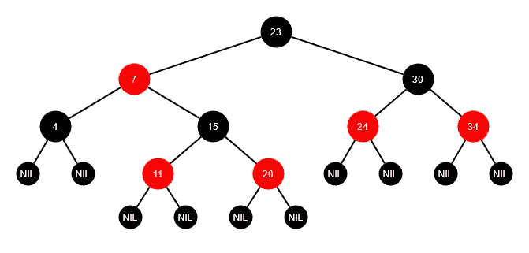

树数据结构的叶节点通常指没有任何子节点的节点。然而，我们使用 *NIL* 来表示红黑树的叶子，它们总是黑色的。此外，叶节点不保存任何数据，主要用于维护红黑树属性的目的。

我们使用**黑色高度**来表示从一个节点到叶子的黑色节点的数量(如果节点是黑色的，则排除该节点)。下图显示了每个节点的黑色高度。

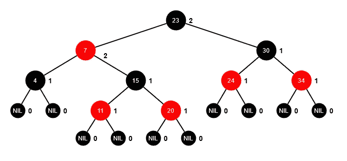

每个节点旁边是该节点的黑色高度，叶节点(NIL)的黑色高度为零。

# 建立红黑树

正如我们在前面的树中所做的那样，本节将遍历实现并讨论实现选择背后的一些想法。

由于所有的叶子都是 *NIL* 并且根的父节点也可以指向 *NIL* ，当我们实现红黑树时，我们可以定义一个 NIL 节点，让根的父节点和所有支持的节点指向一个 *NIL* 节点，指向 *NIL* 节点。因此，上一节中显示的红黑树如下所示:

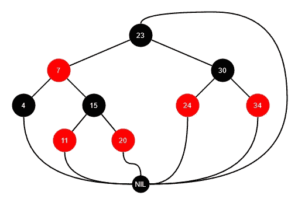

这种方式简化了实现并节省了空间(即在实现中只需要一个 *NIL* 节点实例)。

为了简单起见，本文其余部分将省略 *NIL* 节点，因此上面的红黑树将如下所示(但在实现中，NIL 节点必须在那里；否则会违反红黑树属性)。

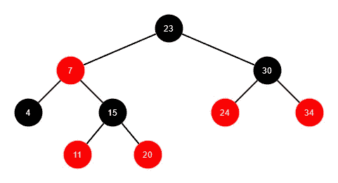

# 结节

红黑树节点类似于二叉查找树节点，但是多了一个属性——颜色。

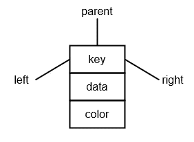

由于颜色必须是红色或黑色，我们可以将其定义为一个[枚举](https://docs.python.org/3/library/enum.html)类。

```
import enum

class Color(enum.Enum):
    RED = enum.auto()
    BLACK = enum.auto()
```

**为什么使用枚举？**

根据 [PEP-435](https://www.python.org/dev/peps/pep-0435/) ，“枚举是一组绑定到唯一常量值的符号名。在一个枚举中，值可以通过标识进行比较，枚举本身可以迭代。我们将颜色属性定义为枚举类是有意义的，因为它的值(红色或黑色)是恒定的，我们可以识别颜色属性并对其进行比较。此外，枚举类提供了更健壮的类型安全。如果我们不使用枚举，我们可以将颜色属性定义为常量字符串。然而，类型检查工具(如 [mypy](http://mypy-lang.org/) )将无法检查值是颜色属性还是常规字符串。另一种方法是将颜色属性定义为常规类或数据类，如下所示:

```
@dataclass
class Color:
    RED: str = "red"
    BLACK: str = "black"
```

这种方法仍然有一些缺点。例如，下划线类型仍然是字符串。我们可以和任何字符串进行比较。此外，类是可变的。换句话说，我们可以在运行时修改与颜色定义相矛盾的*颜色*类。因此，使用枚举来定义颜色属性是最有意义的。它增加了类型安全性并简化了实现。

**红黑树节点**

像其他二叉树节点一样，我们利用[数据类](https://www.python.org/dev/peps/pep-0557/)来定义红黑树节点。

```
from dataclasses import dataclass

@dataclass
class Node:
    """Red-Black Tree non-leaf node definition."""

    key: Any
    data: Any
    left: Union["Node", Leaf] = Leaf()
    right: Union["Node", Leaf] = Leaf()
    parent: Union["Node", Leaf] = Leaf()
    color: Color = Color.RED
```

**叶节点**

在[红黑树定义](https://shunsvineyard.info/2021/04/30/build-the-forest-in-python-series-red-black-tree/#1-what-is-a-red-black-tree)中提到，我们用 *NIL* 来表示叶子节点，可以简单定义如下。

```
from dataclasses import dataclass

@dataclass
class Leaf:
    color = Color.BLACK
```

# 课程概述

像构建森林项目中的其他类型的二叉树一样，红黑树类也有类似的功能。

```
class RBTree:

    def __init__(self) -> None:
        self._NIL: Leaf = Leaf()
        self.root: Union[Node, Leaf] = self._NIL

    def __repr__(self) -> str:
        """Provie the tree representation to visualize its layout."""
        if (self.root is None) or (self.root == self._NIL):
            return "empty tree"
        return (
            f"{type(self)}, root={self.root}, "
            f"tree_height={str(self.get_height(self.root))}"
        )

    def search(self, key: Any) -> Optional[Node]:
        …

    def insert(self, key: Any, data: Any) -> None:
        …

    def delete(self, key: Any) -> None:
        …

    @staticmethod
    def get_leftmost(node: Node) -> Node:
        …

    @staticmethod
    def get_rightmost(node: Node) -> Node:
        …

    @staticmethod
    def get_successor(node: Node) -> Union[Node, Leaf]:
        …

    @staticmethod
    def get_predecessor(node: Node) -> Union[Node, Leaf]:
        …

    @staticmethod
    def get_height(node: Union[Leaf, Node]) -> int:
        …

    def inorder_traverse(self) -> traversal.Pairs:
        …

    def preorder_traverse(self) -> traversal.Pairs:
        …

    def postorder_traverse(self) -> traversal.Pairs:
        …

    def _transplant(
        self, deleting_node: Node, replacing_node: Union[Node, Leaf]
    ) -> None:
        …

    def _left_rotate(self, node_x: Node) -> None:
        …

    def _right_rotate(self, node_x: Node) -> None:
        …

    def _insert_fixup(self, fixing_node: Node) -> None:
        …

    def _delete_fixup(self, fixing_node: Union[Leaf, Node]) -> None:
        …
```

注意，除了所有二叉树的通用方法外， *RBTree* 类还有一些额外的方法。 *_left_rotate()* ， *_right_rotate()* ， *_insert_fixup()* ， *_delete_fixup()* 是插入删除后维护红黑树属性的辅助函数。插入和删除操作都会修改树；因此，这些操作可能会违反红黑树属性。这就是为什么我们需要这些功能。

叶节点是 *NIL* ，所以[二叉树遍历](https://shunsvineyard.info/2021/03/17/build-the-forest-in-python-series-binary-tree-traversal/)中的遍历例程(使用 *None* 来确定是否到达叶节点)不能与 *RBTree* 类一起工作(需要使用 *Leaf* 来确定是否到达叶节点)。因此， *RBTree* 类需要提供它的遍历例程。

# 插入

因为插入操作修改红黑树，所以结果可能违反红黑树属性(对于删除也是如此)。为了恢复红黑树的属性，我们需要改变一些节点的颜色，并更新红黑树的结构。更新二叉树结构的方法叫做旋转。修复被违反的红黑树属性的技术来自[算法简介](https://en.wikipedia.org/wiki/Introduction_to_Algorithms)，红黑树插入的思想可以总结如下:

1.  以与二叉查找树插入相同的方式插入颜色为红色的新节点:通过从根开始遍历树并沿途将新节点的键与每个节点的键进行比较，找到插入新节点的正确位置(即新节点的父节点)。
2.  通过旋转和着色修复损坏的红黑树属性。

由于新节点是红色的，我们可以违反红黑树属性——如果一个节点是红色的，那么它的两个子节点都是黑色的，我们可以在插入后修复这种违反。

我们可以以类似于普通二叉查找树插入的方式实现红黑树插入。

```
def insert(self, key: Any, data: Any) -> None:
    # Color the new node as red.
    new_node = Node(key=key, data=data, color=Color.RED)
    parent: Union[Node, Leaf] = self._NIL
    current: Union[Node, Leaf] = self.root
    while isinstance(current, Node):  # Look for the insert location
        parent = current
        if new_node.key < current.key:
            current = current.left
        elif new_node.key > current.key:
            current = current.right
        else:
            raise tree_exceptions.DuplicateKeyError(key=new_node.key)
    new_node.parent = parent
    # If the parent is a Leaf, set the new node to be the root.
    if isinstance(parent, Leaf):
        new_node.color = Color.BLACK
        self.root = new_node
    else:
        if new_node.key < parent.key:
            parent.left = new_node
        else:
            parent.right = new_node

        # After the insertion, fix the broken red-black-tree-property.
        self._insert_fixup(new_node)
```

与[二叉查找树:Insert](https://shunsvineyard.info/2021/03/13/build-the-forest-in-python-series-binary-search-tree/#7-insert) 的一个区别是，我们使用 [isinstance](https://docs.python.org/3.8/library/functions.html#isinstance) 来检查一个节点是正常的*节点*还是*叶节点*，而不是检查它是否为 *None* 。这是因为我们有用于叶节点的*叶*类型和用于常规节点的*节点*类型。

一旦一个新节点被插入到红黑树中，我们需要修复损坏的红黑树属性。以下小节将讨论使用旋转和着色来修复损坏的红黑树。

## 旋转

旋转操作是为了改变红黑树的结构，同时保持它的二进制搜索属性。有两种类型的旋转:左旋和右旋。

**向左旋转**

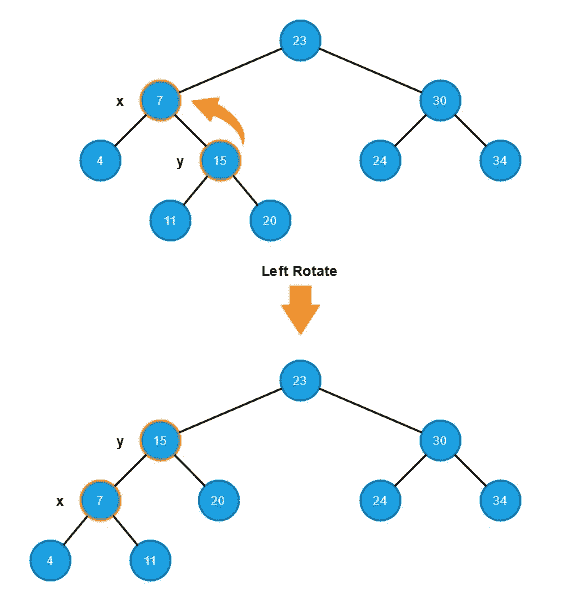

向左旋转将两个节点(图片中的 x 和 y)从图片的顶部树转移到底部树，并保留其二叉搜索树属性。

```
def _left_rotate(self, node_x: Node) -> None:
    node_y = node_x.right  # Set node y
    if isinstance(node_y, Leaf):  # Node y cannot be a Leaf
        raise RuntimeError("Invalid left rotate")

    # Turn node y's subtree into node x's subtree
    node_x.right = node_y.left
    if isinstance(node_y.left, Node):
        node_y.left.parent = node_x
    node_y.parent = node_x.parent

    # If node's parent is a Leaf, node y becomes the new root.
    if isinstance(node_x.parent, Leaf):
        self.root = node_y
    # Otherwise, update node x's parent.
    elif node_x == node_x.parent.left:
        node_x.parent.left = node_y
    else:
        node_x.parent.right = node_y

    node_y.left = node_x
    node_x.parent = node_y
```

注意，节点 x 的右子节点不能是*叶*(即*NIL*)；旋转一片*叶子*毫无意义。

**右旋转**

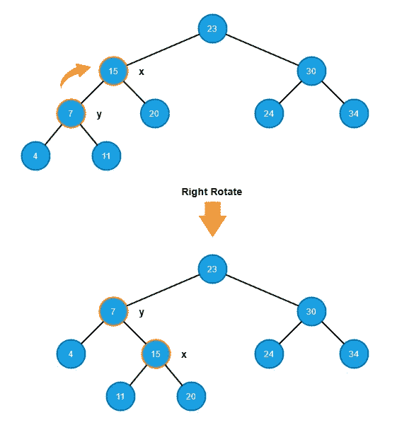

右旋转与左旋转是对称的，可以按如下方式实现。

```
def _right_rotate(self, node_x: Node) -> None:
    node_y = node_x.left  # Set node y
    if isinstance(node_y, Leaf):  # Node y cannot be a Leaf
        raise RuntimeError("Invalid right rotate")
    # Turn node y's subtree into node x's subtree
    node_x.left = node_y.right
    if isinstance(node_y.right, Node):
        node_y.right.parent = node_x
    node_y.parent = node_x.parent

    # If node's parent is a Leaf, node y becomes the new root.
    if isinstance(node_x.parent, Leaf):
        self.root = node_y
    # Otherwise, update node x's parent.
    elif node_x == node_x.parent.right:
        node_x.parent.right = node_y
    else:
        node_x.parent.left = node_y

    node_y.right = node_x
    node_x.parent = node_y
```

## 固定

为了恢复红黑树属性，我们需要知道在插入后哪些红黑树属性会被破坏。

红黑树属性:

1.  每个节点非红即黑(**不能断**)。
2.  根是黑色的。
3.  每片叶子都是黑色的(**不能断开，因为每个新节点的子节点都指向*叶子*** *)* 。
4.  如果一个节点是红色的，那么它的两个子节点都是黑色的。
5.  从节点到叶子的每个节点的所有路径包含相同数量的黑色节点(也称为黑色高度)。

对于 5 th 属性，黑高还是一样的。新节点(颜色为红色)替换了一个*叶* ( *NIL* )，但是它的子节点也是*叶* ( *NIL* )。因此，黑色高度属性在插入后保持不变。

因此，由于新节点的颜色是红色，只有属性 2 和属性 4 可能被违反。如果新节点的父节点也是红色的，则属性 4 被破坏。关于属性 2，如果一个新节点是根节点，或者在修复属性 4 时根节点变成红色，则可能会违反属性 2。我们可以通过在修复例程结束时将属性 2 涂成黑色来修复它。

关于固定属性 4，我们可以将其分解为六种情况(对称的两种三种情况)。这六种情况由新节点的父节点和父节点的同级节点的位置和颜色决定。

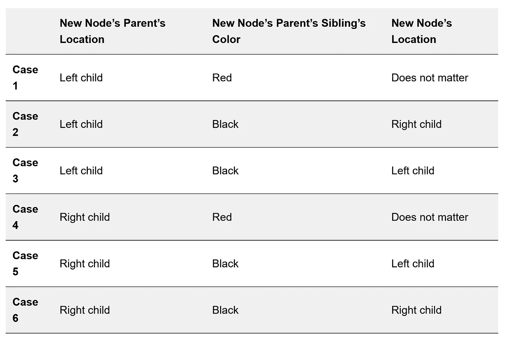

从新节点开始( *fixing_node* )。

**案例一**

*   将 *fixing_node* 的父节点及其同级节点的颜色改为**黑色**
*   将 *fixing_node* 的祖父颜色改为**红色**
*   将当前位置移动到 *fixing_node* 的祖父

请注意，新节点的位置无关紧要。下图为案例 1。新节点(7)是左边的子节点，2。新节点(18)是正确的子节点。

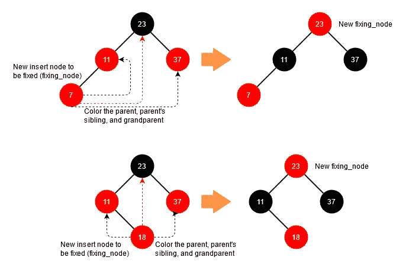

**案例二**

*   在*固定节点*的母节点上执行**左旋转**(该操作将**情况 2 转移到情况 3**

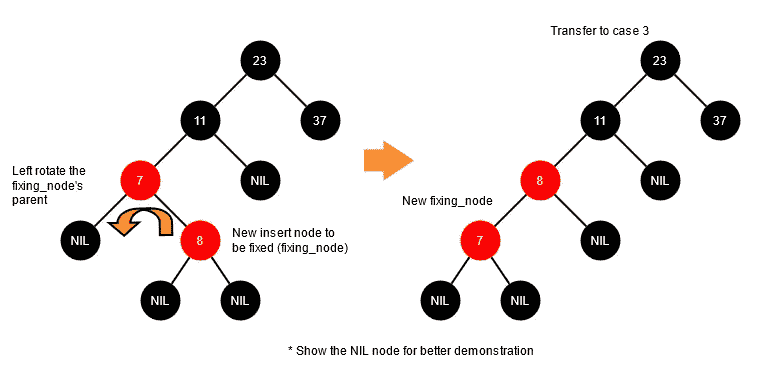

**案例三**

*   将 *fixing_node* 的父节点颜色改为**黑色**
*   将 *fixing_node* 的祖父颜色改为**红色**
*   在*固定节点*的祖父上执行**右旋转**

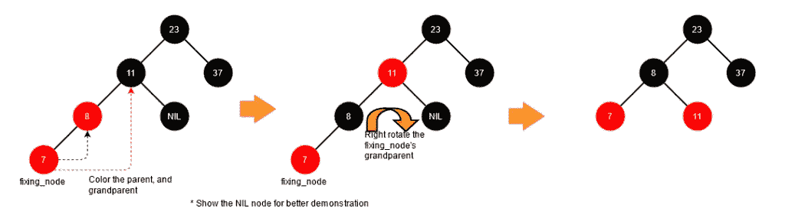

**案例 4(与案例 1 相同)**

*   将 *fixing_node* 的父节点和父节点的同级节点的颜色改为**黑色**
*   将*固定节点*的祖父颜色改为**红色**
*   将当前位置移动到 *fixing_node* 的祖父

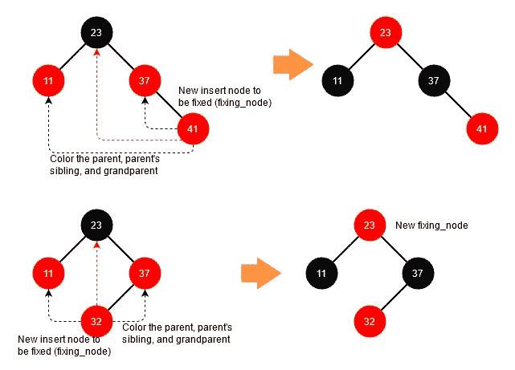

**案例 5**

*   在*固定节点*的母节点上执行**右旋转**(此操作将**情况 5 转移到情况 6** )

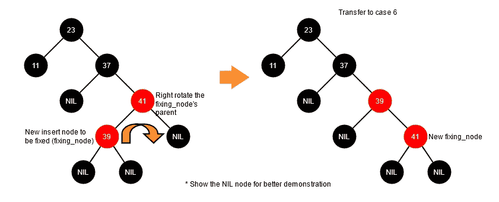

**案例六**

*   将 *fixing_node* 的父节点颜色改为**黑色**
*   将 *fixing_node* 的祖父颜色改为**红色**

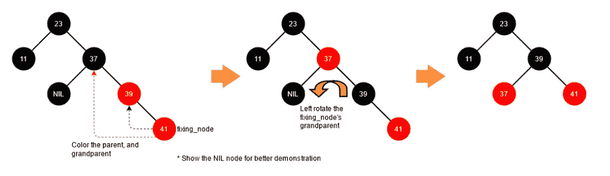

为 *fixing_node* 修复损坏的红黑树属性时，修复过程可能会导致 *fixing_node* 的父节点或祖父节点(视情况而定)违反红黑树属性。当这种情况发生时， *fixing_node* 的父节点(或祖父节点)成为新的 *fixing_node* 。然后我们就可以按照六种情况来解决了。重复这一步，直到我们到达根。如果根在修复操作后变成红色(违反了属性 2)，我们可以通过将根涂成黑色来修复它。

下图演示了构建红黑树的完整插入操作。

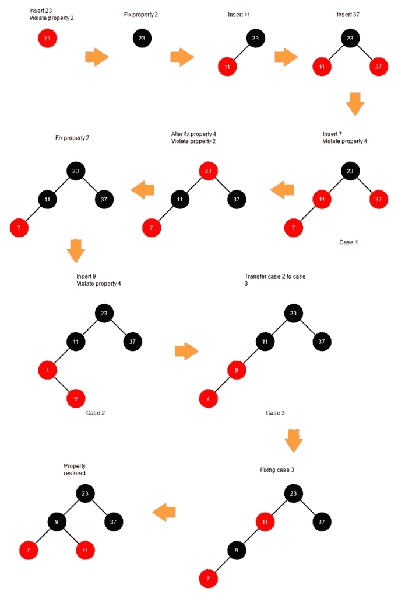

插入修正的实现如下所示。

```
def _insert_fixup(self, fixing_node: Node) -> None:
    while fixing_node.parent.color == Color.RED:
        if fixing_node.parent == fixing_node.parent.parent.left:
            parent_sibling = fixing_node.parent.parent.right
            if parent_sibling.color == Color.RED:  # Case 1
                fixing_node.parent.color = Color.BLACK
                parent_sibling.color = Color.BLACK
                fixing_node.parent.parent.color = Color.RED
                fixing_node = fixing_node.parent.parent
            else:
                # Case 2
                if fixing_node == fixing_node.parent.right:
                    fixing_node = fixing_node.parent
                    self._left_rotate(fixing_node)
                # Case 3
                fixing_node.parent.color = Color.BLACK
                fixing_node.parent.parent.color = Color.RED
                self._right_rotate(fixing_node.parent.parent)
        else:
            parent_sibling = fixing_node.parent.parent.left
            if parent_sibling.color == Color.RED:  # Case 4
                fixing_node.parent.color = Color.BLACK
                parent_sibling.color = Color.BLACK
                fixing_node.parent.parent.color = Color.RED
                fixing_node = fixing_node.parent.parent
            else:
                # Case 5
                if fixing_node == fixing_node.parent.left:
                    fixing_node = fixing_node.parent
                    self._right_rotate(fixing_node)
                # Case 6
                fixing_node.parent.color = Color.BLACK
                fixing_node.parent.parent.color = Color.RED
                self._left_rotate(fixing_node.parent.parent)

    self.root.color = Color.BLACK
```

# 搜索

搜索操作类似于[二叉查找树:搜索](https://shunsvineyard.info/2021/03/13/build-the-forest-in-python-series-binary-search-tree/#8-search)，但是我们使用*叶子* ( *零*)来确定我们是否到达叶子。

1.  从根开始遍历树，并沿着树遍历将该键与每个节点的键进行比较。
2.  如果一个键匹配，我们就找到了节点。
3.  如果我们到达*叶*，则该节点在树中不存在。

搜索的实现类似于二叉查找树搜索功能。

```
def search(self, key: Any) -> Optional[Node]:
    current = self.root

    while isinstance(current, Node):
        if key < current.key:
            current = current.left
        elif key > current.key:
            current = current.right
        else:  # Key found
            return current
    # If the tree is empty (i.e., self.root == Leaf()), still return None.
    return None
```

# 删除

类似于红黑树插入，删除修改红黑树，并且结果可能违反红黑树属性。因此，我们需要在删除一个节点后恢复红黑树属性。

红黑树删除的基本思路类似于普通的[二叉查找树:删除](https://shunsvineyard.info/2021/03/13/build-the-forest-in-python-series-binary-search-tree/#9-delete)。我们有一个*移植*方法，用根在*替换 _ 节点*的子树替换根在*删除 _ 节点*的子树。我们也有三种基本的删除情况:没有孩子，只有一个孩子，两个孩子。最后，我们需要修复损坏的红黑树属性。

**移植**

*移植*方法由[二叉查找树修改而来:删除](https://shunsvineyard.info/2021/03/13/build-the-forest-in-python-series-binary-search-tree/#9-delete)，因此它适用于红黑树。修改是我们用 [isinstance](https://docs.python.org/3.8/library/functions.html#isinstance) 来检查一个节点是正常*节点*还是*叶子*而不是检查它是否 *None* 。

```
def _transplant(
    self, deleting_node: Node, replacing_node: Union[Node, Leaf]
) -> None:
    if isinstance(deleting_node.parent, Leaf):
        self.root = replacing_node
    elif deleting_node == deleting_node.parent.left:
        deleting_node.parent.left = replacing_node
    else:
        deleting_node.parent.right = replacing_node

    if isinstance(replacing_node, Node):
        replacing_node.parent = deleting_node.parent
```

整个删除过程类似于普通的二叉查找树，只是做了一些修改。

1.  找到要删除的节点(*删除 _ 节点*)。
2.  保持*删除 _ 节点*的颜色。
3.  如果 *deleting_node* 没有或者只有一个子节点，使用*移植*方法将 *deleting_node* 替换为 *NIL* 或者只有一个子节点。
4.  如果*删除节点*有两个子节点，找到*删除节点*的后继节点作为*替换节点*。保持*替换 _ 节点*的颜色。用移植的方法取出 *replacing_node* 并继续追踪该节点来替换 *replacing_node，*或者是 *NIL* 或者是 *replacing_node* 原来的右子节点。使用移植方法将*删除 _ 节点*替换为*替换 _ 节点*。将*替换节点*涂成*删除节点*的颜色。
5.  通过改变颜色和执行旋转来修复损坏的红黑树属性。

基于上面的删除过程，我们可以如下实现删除方法。

```
def delete(self, key: Any) -> None:
    if (deleting_node := self.search(key=key)) and (
        not isinstance(deleting_node, Leaf)
    ):
        original_color = deleting_node.color

        # Case 1: no children or Case 2a: only one right child
        if isinstance(deleting_node.left, Leaf):
            replacing_node = deleting_node.right
            self._transplant(
                deleting_node=deleting_node, replacing_node=replacing_node
            )
            # Fixup
            if original_color == Color.BLACK:
                if isinstance(replacing_node, Node):
                    self._delete_fixup(fixing_node=replacing_node)

        # Case 2b: only one left child
        elif isinstance(deleting_node.right, Leaf):
            replacing_node = deleting_node.left
            self._transplant(
                deleting_node=deleting_node, replacing_node=replacing_node
            )
            # Fixup
            if original_color == Color.BLACK:
                self._delete_fixup(fixing_node=replacing_node)

        # Case 3: two children
        else:
            replacing_node = self.get_leftmost(deleting_node.right)
            original_color = replacing_node.color
            replacing_replacement = replacing_node.right
            # The replacing node is not the direct child of the deleting node
            if replacing_node.parent != deleting_node:
                self._transplant(replacing_node, replacing_node.right)
                replacing_node.right = deleting_node.right
                replacing_node.right.parent = replacing_node

            self._transplant(deleting_node, replacing_node)
            replacing_node.left = deleting_node.left
            replacing_node.left.parent = replacing_node
            replacing_node.color = deleting_node.color
            # Fixup
            if original_color == Color.BLACK:
                if isinstance(replacing_replacement, Node):
                    self._delete_fixup(fixing_node=replacing_replacement)
```

值得一提的是:

*   我们保留*删除 _ 节点*的原始颜色( *original_color* )。
*   如果要删除的节点有两个子节点，我们将 *original_color* 更新为节点的颜色( *replacing_node* )。
*   在每个案例的结尾，如果 *original_color* 是黑色的，这意味着一些红黑树属性被破坏了，我们需要修复它们。

在恢复被违反的红黑树属性之前，我们需要知道在删除例程中哪些红黑树属性会被破坏。

红黑树属性:

1.  每个节点不是红色就是黑色(不能断开)。
2.  根是黑色的
3.  每片叶子都是黑色的(因为每个新节点的子节点都指向*叶子*，所以不能被断开)。
4.  如果一个节点是红色的，那么它的两个子节点都是黑色的
5.  从节点到叶子的每个节点的所有路径包含相同数量的黑色节点(也称为黑色高度)

**情况 1:要删除的节点没有子节点**

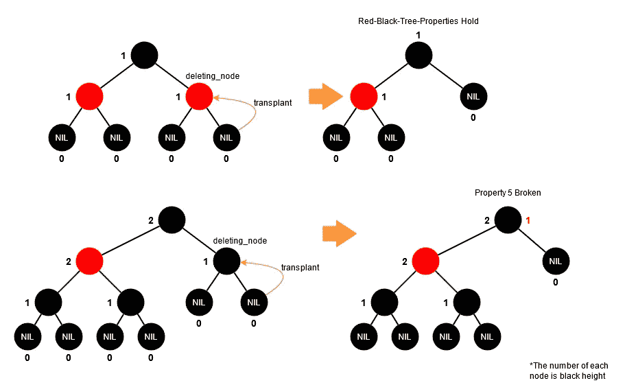

如果*删除节点*的颜色是红色，则没有红黑树属性被破坏。如果 *deleting_node* 的颜色是黑色，则违反属性 5。

**情况 2:要删除的节点只有一个子节点**

由于红黑树属性，一个红色节点不可能只有一个黑色子节点。黑色节点也不可能只有一个黑色子节点。因此，如果 *deleting_node* 只有一个子节点，则其颜色必须为黑色，而 *replacing_node* 的颜色必须为红色。

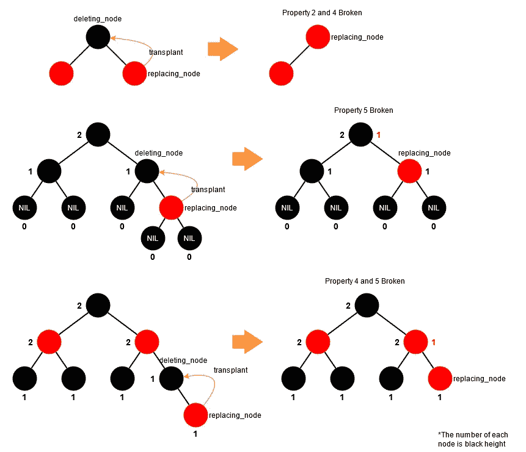

根据上图，如果 *deleting_node* 是黑色的，那么属性 4 和属性 5 以及属性 2 都可以被打破，如果 *deleting_node* 是根的话。

**情况 3:要删除的节点有两个子节点**

在这种情况下，我们执行以下步骤:

1.  从 *deleting_node* 的右子树中找到最左边的节点( *replacing_node* )作为替换 *deleting_node* 的节点。
2.  执行*移植*操作，取出*替换节点*。
3.  将*替换节点*设置为*删除节点*右子树的新根。
4.  执行*移植*操作，将 *deleting_node* 替换为以 replacing_node 为根的子树。
5.  将*替换节点*涂成*删除节点*的颜色

在步骤 5 之后，*替换 _ 节点*的颜色与*删除 _ 节点*的颜色相同，因此不会破坏红黑树属性。唯一可能破坏红黑树属性的步骤是步骤 2。当我们在 *replacing_node* 上执行*移植*操作时，结果不是情形 1 就是情形 2。

下面的图片演示了删除一个有两个子节点的节点可能违反也可能不违反红黑树属性。

*替换 _ 节点*是*删除 _ 节点*的直接子节点的情况。

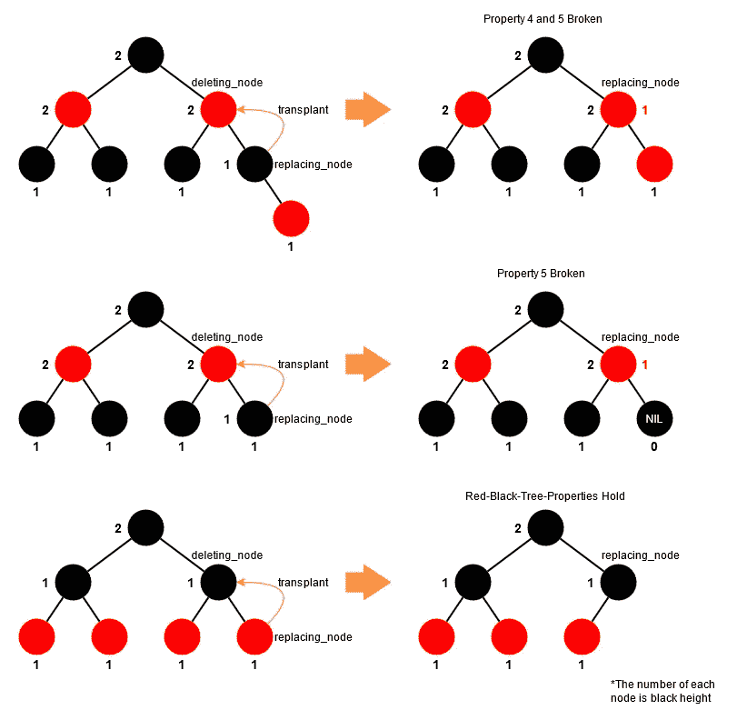

*替换 _ 节点*为黑色且不是*删除 _ 节点*的直接子节点的情况。

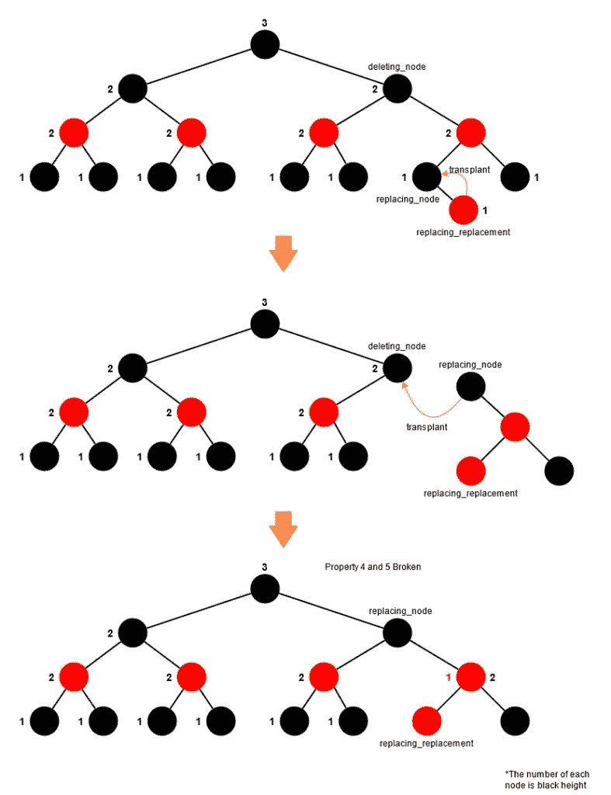

*替换 _ 节点*为红色且不是*删除 _ 节点*的直接子节点的情况。


因此，我们可以总结出需要修复损坏的红黑树属性的情况。


该摘要还暗示红-黑-树属性在以下情况下仍然成立。

1.  删除节点是红色的，它的子节点不到两个。
2.  删除节点有两个子节点，替换节点是红色的。

原因是:

*   黑色高度没有变化。财产 5 持有。
*   对于第一种情况，如果要删除的节点是根节点，它不能是红色的；对于第二种情况，最左边的节点不能是根。财产 2 成立。
*   如果节点(第一种或第二种情况)是红色的，则其父节点和子节点不能是红色的。因此，在移除或移动它之后，不会出现连续的红色节点。财产 4 成立。

## 固定

为了修复损坏的红黑树属性，我们使用来自[算法简介](https://en.wikipedia.org/wiki/Introduction_to_Algorithms)的思想，修复过程首先通过引入双黑和红黑树的概念来修复属性 5(从节点到叶子的每个节点的黑色高度都是相同的)。对于黑色高度，双黑和红黑分别贡献 2 或 1。我们用下面的图标来表示双黑和红黑节点。


当我们使用*移植*函数将一个节点替换为另一个节点时，我们保留两个节点的颜色，并使用双黑和红黑来表示其颜色。因此，如果要删除的节点少于两个子节点，在*移植*功能后，替换节点的颜色会变成双黑或红黑。如果要删除的节点有两个子节点，当我们使用*移植*函数取出要删除的节点所生成的子树的最左边的节点时，最左边的节点的替换颜色要么变成双黑，要么变成红黑。为了简单起见，我们使用 *fixing_node* 来表示节点的颜色是双黑或者红黑。注意，在代码实现中，我们并没有真正将 *fixing_node* 涂成双黑色或红黑色。我们只是假设 *fixing_node* 多了一个黑色或红色。

这样一来，无效黑高就解决了，潜在的破例变成了如下:

**要删除的节点没有子节点**

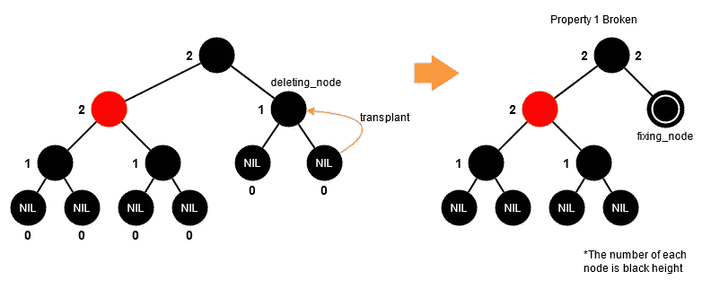

**要删除的节点只有一个子节点**

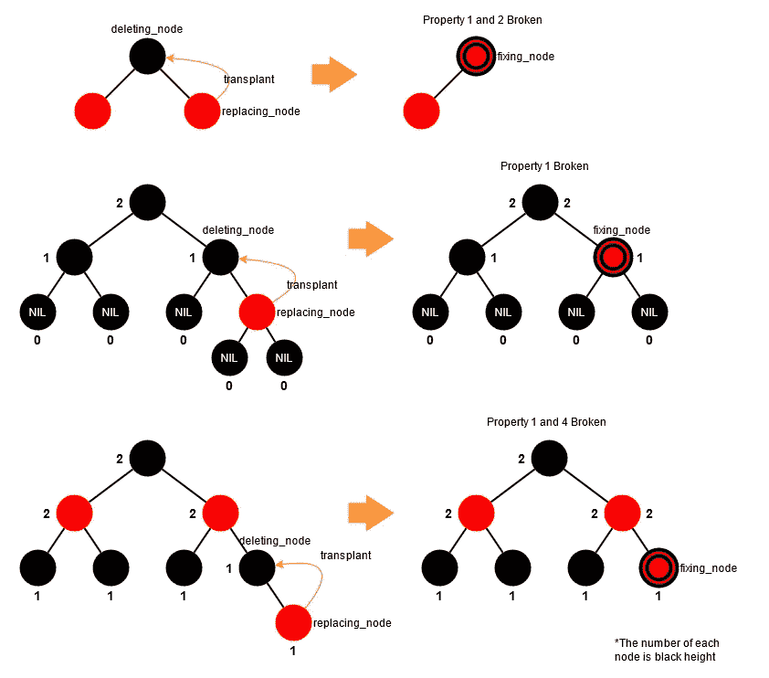

**要删除的节点有两个子节点**

如果要删除的节点有两个子节点，则占据最左侧节点位置的节点会破坏红黑树属性。

*替换节点*是*删除节点*的直接子节点。

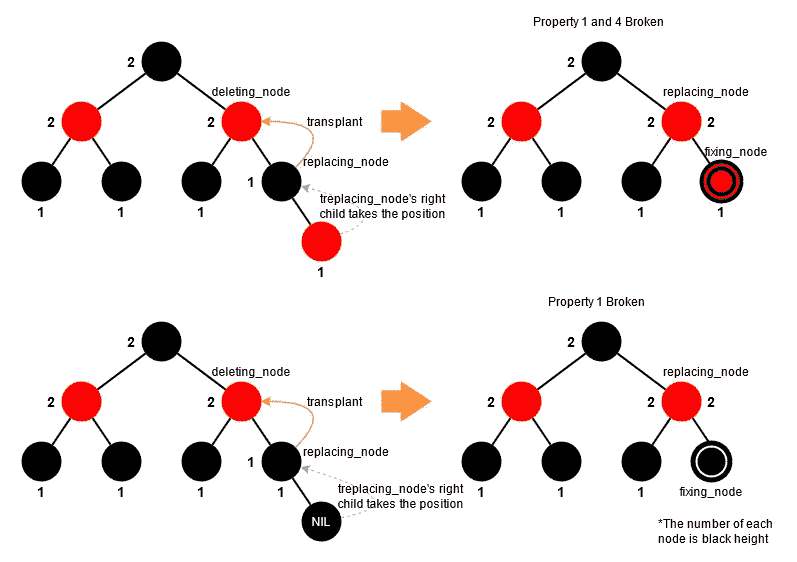

*替换节点*不是*删除节点*的直接子节点。

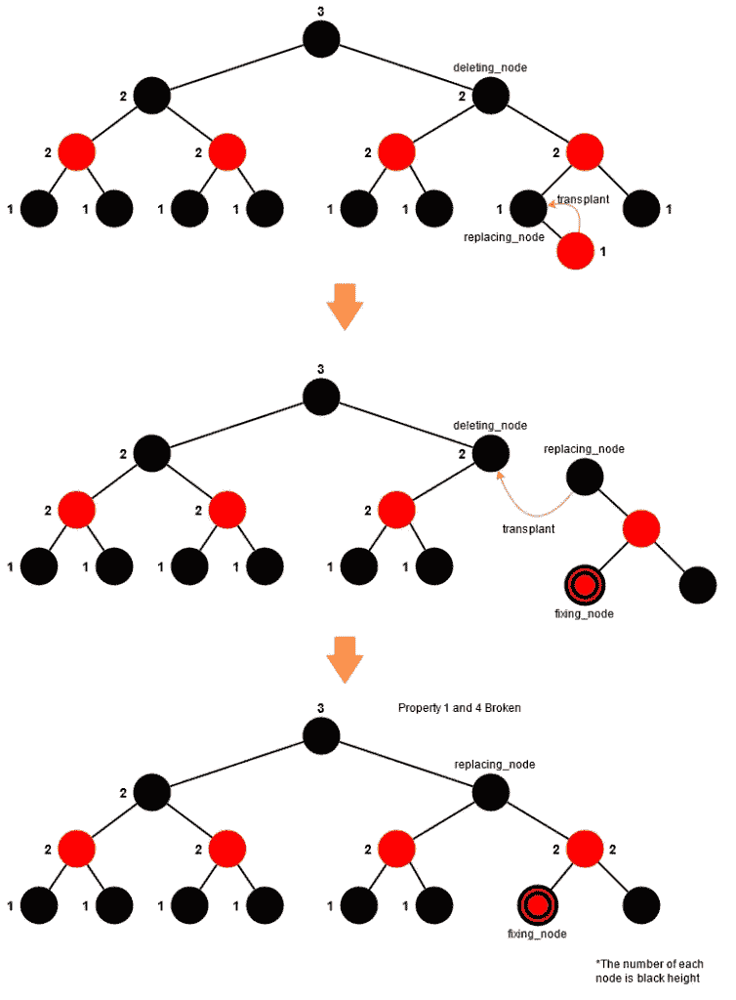

因为 *fixing_node* 的颜色既不是红色也不是黑色，所以属性 1 也坏了。现在，我们需要恢复红黑树属性 1、2 和 4。

如果 *fixing_node* 的颜色是红色和黑色，我们可以通过将它涂成黑色来修复它。所有被破坏的红黑树属性被恢复。

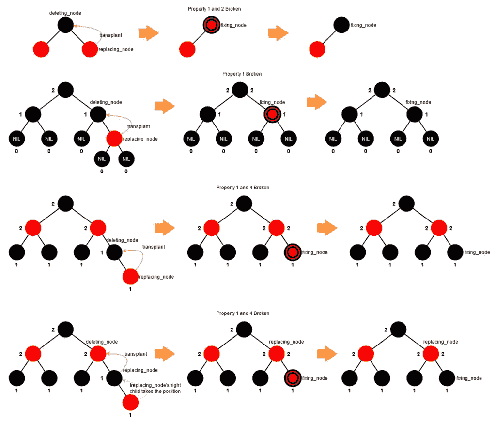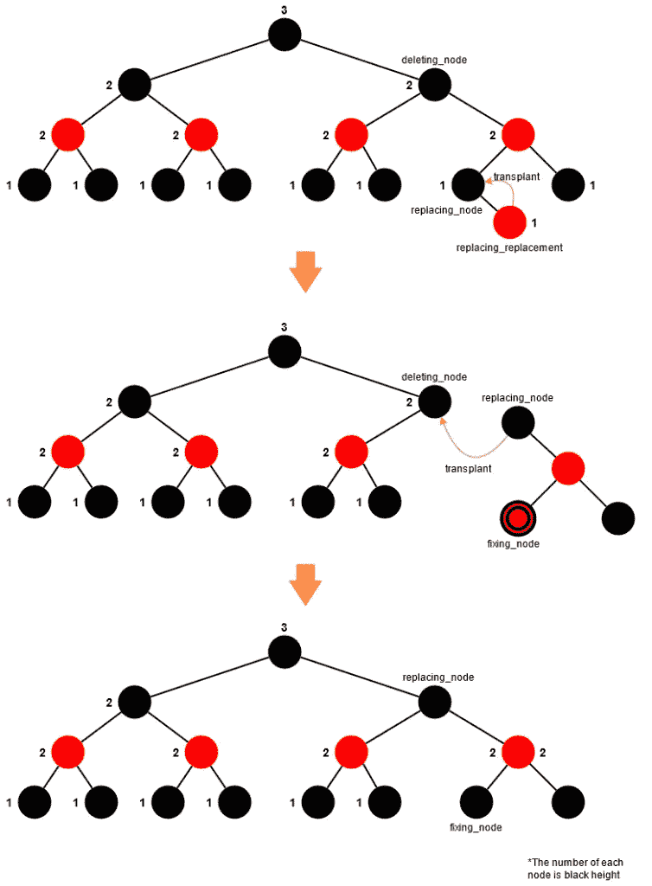

剩下的破局是双黑。修复过程可以分为四种对称的情况。

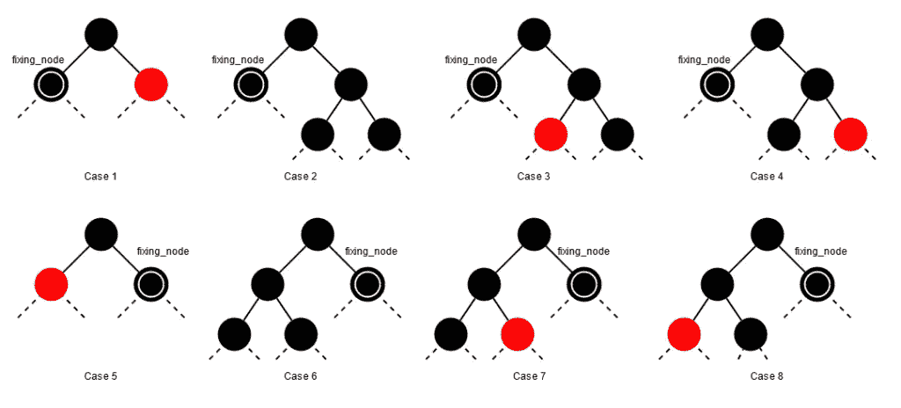

案例由 *fixing_node* 的位置、 *fixing_node* 的同级的颜色以及同级的子级的颜色来标识。

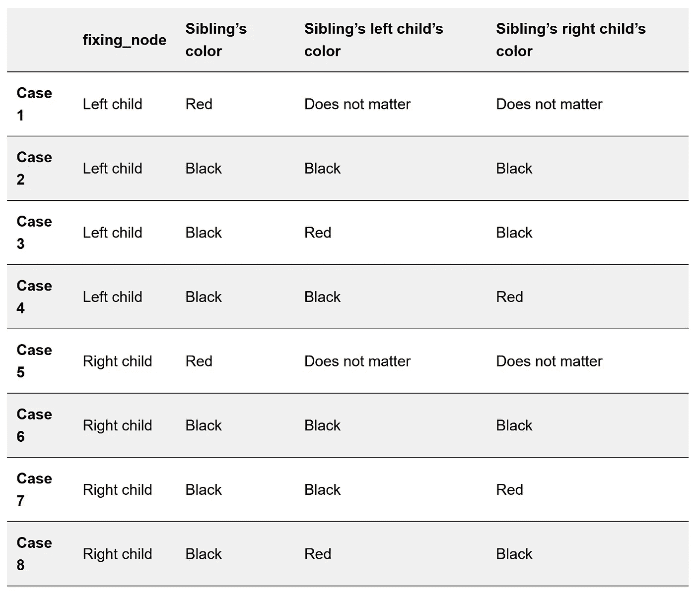

从*固定节点*开始。

**案例 1**

*   将同级节点的颜色更改为**黑色**
*   将*固定节点*的父节点颜色改为**红色**
*   对*固定节点*的父节点进行左旋转
*   更新同级节点(同级因向左旋转而改变)
*   完成上述操作后，案例 1 转移到**案例 2、案例 3 或案例 4**

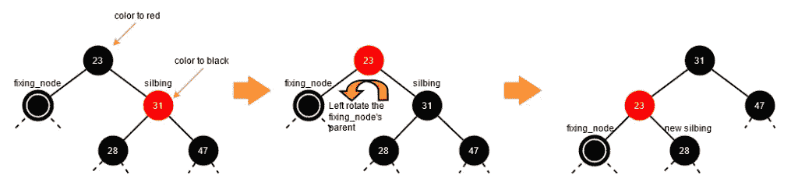

**案例二**

*   将兄弟的颜色更改为**红色**
*   将*固定节点*上移，即新的*固定节点*成为原*固定节点*的父节点

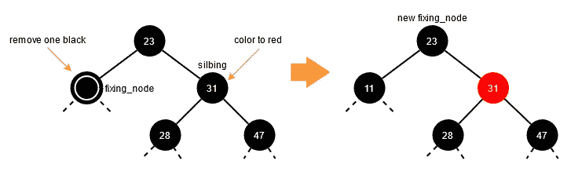

**案例 3**

*   将兄弟姐妹的左孩子的颜色更改为**黑色**
*   将同级的颜色更改为**红色**
*   在同级节点上执行右旋转
*   完成上述操作后，案例 3 转移到**案例 4**

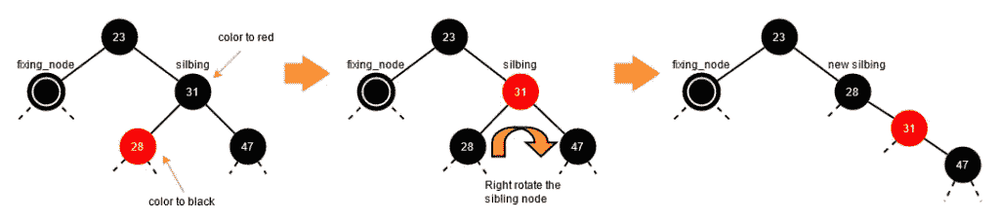

**案例 4**

*   将同级的颜色更改为与 *fixing_node* 的父级相同
*   将 *fixing_node* 的父节点颜色改为**黑色**
*   将同级节点的右子节点的颜色更改为**黑色**
*   在 *fixing_nopde* 的母节点上向左旋转
*   经过以上操作，所有被侵犯的红黑树属性都被恢复。

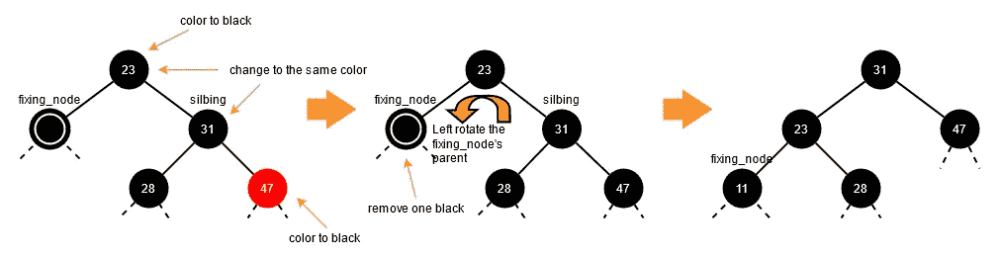

**案例五**

*   将同级节点的颜色更改为**黑色**
*   将 *fixing_node* 的父节点颜色改为**红色**
*   在*固定节点*的父节点上执行右旋转
*   更新同级节点(同级因右旋转而改变)
*   完成上述操作后，案例 1 转移到**案例 6、案例 7 或案例 8**

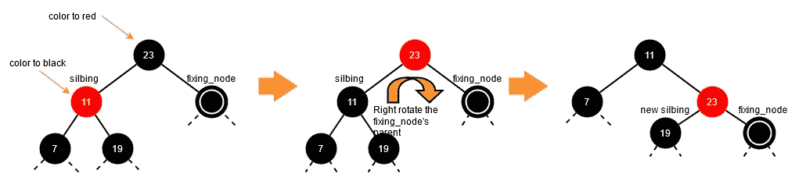

**案例 6**

*   将同级的颜色更改为**红色**
*   将*固定节点*上移，即新的*固定节点*成为原*固定节点*的父节点

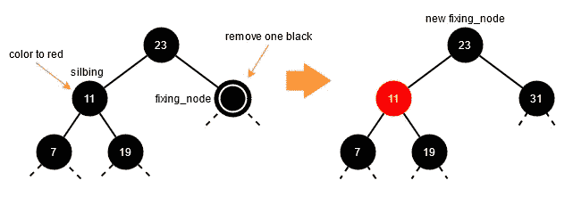

**案例 7**

*   将兄弟姐妹的右孩子的颜色更改为**黑色**
*   将兄弟的颜色更改为**红色**
*   在同级节点上执行左旋转
*   完成上述操作后，案例 7 转移到**案例 8**

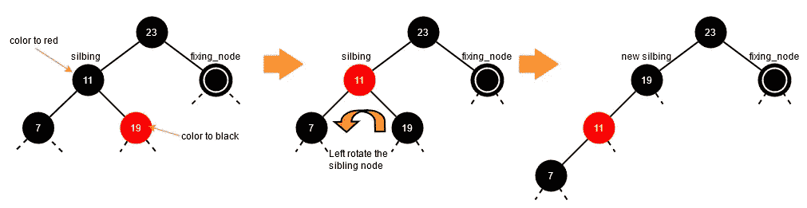

**案例 8**

*   将同级的颜色更改为与 *fixing_node* 的父级相同
*   将 *fixing_node* 的父节点颜色改为**黑色**
*   将同级节点的左侧子节点的颜色更改为**黑色**
*   在 *fixing_nopde* 的父件上执行右旋转
*   经过以上操作，所有被侵犯的红黑树属性都被恢复。

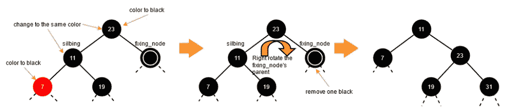

下面的实现总结了上面讨论的修正过程。

```
def _delete_fixup(self, fixing_node: Union[Leaf, Node]) -> None:
    while (fixing_node is not self.root) and (fixing_node.color == Color.BLACK):
        if fixing_node == fixing_node.parent.left:
            sibling = fixing_node.parent.right

            # Case 1: the sibling is red.
            if sibling.color == Color.RED:
                sibling.color == Color.BLACK
                fixing_node.parent.color = Color.RED
                self._left_rotate(fixing_node.parent)
                sibling = fixing_node.parent.right

            # Case 2: the sibling is black and its children are black.
            if (sibling.left.color == Color.BLACK) and (
                sibling.right.color == Color.BLACK
            ):
                sibling.color = Color.RED
                fixing_node = fixing_node.parent  # new fixing node

            # Cases 3 and 4: the sibling is black and one of
            # its child is red and the other is black.
            else:
                # Case 3: the sibling is black and its left child is red.
                if sibling.right.color == Color.BLACK:
                    sibling.left.color = Color.BLACK
                    sibling.color = Color.RED
                    self._right_rotate(node_x=sibling)

                # Case 4: the sibling is black and its right child is red.
                sibling.color = fixing_node.parent.color
                fixing_node.parent.color = Color.BLACK
                sibling.right.color = Color.BLACK
                self._left_rotate(node_x=fixing_node.parent)
                # Once we are here, all the violation has been fixed, so
                # move to the root to terminate the loop.
                fixing_node = self.root
        else:
            sibling = fixing_node.parent.left

            # Case 5: the sibling is red.
            if sibling.color == Color.RED:
                sibling.color == Color.BLACK
                fixing_node.parent.color = Color.RED
                self._right_rotate(node_x=fixing_node.parent)
                sibling = fixing_node.parent.left

            # Case 6: the sibling is black and its children are black.
            if (sibling.right.color == Color.BLACK) and (
                sibling.left.color == Color.BLACK
            ):
                sibling.color = Color.RED
                fixing_node = fixing_node.parent
            else:
                # Case 7: the sibling is black and its right child is red.
                if sibling.left.color == Color.BLACK:
                    sibling.right.color = Color.BLACK
                    sibling.color = Color.RED
                    self._left_rotate(node_x=sibling)
                # Case 8: the sibling is black and its left child is red.
                sibling.color = fixing_node.parent.color
                fixing_node.parent.color = Color.BLACK
                sibling.left.color = Color.BLACK
                self._right_rotate(node_x=fixing_node.parent)
                # Once we are here, all the violation has been fixed, so
                # move to the root to terminate the loop.
                fixing_node = self.root

    fixing_node.color = Color.BLACK
```

# 辅助功能

除了核心功能(即插入、搜索和删除)，红黑树还可以有其他有用的功能，如获取最左边的节点、获取节点的后继节点以及获取树的高度，这些功能的实现与[二叉查找树:辅助功能](https://shunsvineyard.info/2021/03/13/build-the-forest-in-python-series-binary-search-tree/#13-auxiliary-functions)类似，但有一些修改。

## 获得高度

为了计算一棵红黑树的树高，我们可以像在[二叉查找树:获取高度](https://shunsvineyard.info/2021/03/13/build-the-forest-in-python-series-binary-search-tree/#14-get-the-height)中所做的那样，为每个孩子的高度递归地增加 1。如果一个节点有两个子节点，我们使用 [max](https://docs.python.org/3/library/functions.html#max) 函数从子节点中获取较大的高度，并将最大值增加 1。主要的区别是我们使用 [isinstance](https://docs.python.org/3.8/library/functions.html#isinstance) 来检查一个节点是否有叶子。

```
@staticmethod
def get_height(node: Union[Leaf, Node]) -> int:
    if isinstance(node, Node):
        if isinstance(node.left, Node) and isinstance(node.right, Node):
            return (
                max(RBTree.get_height(node.left), RBTree.get_height(node.right)) + 1
            )

        if isinstance(node.left, Node):
            return RBTree.get_height(node=node.left) + 1

        if isinstance(node.right, Node):
            return RBTree.get_height(node=node.right) + 1

    return 0
```

## 获取最左边和最右边的节点

红黑树做的事情和[二叉查找树一样:获取最左最右节点](https://shunsvineyard.info/2021/03/13/build-the-forest-in-python-series-binary-search-tree/#15-get-the-leftmost-and-rightmost-nodes)获取给定(子)树最右节点和给定(子)树最左节点。我们再次使用 [isinstance](https://docs.python.org/3.8/library/functions.html#isinstance) 来检查一个节点是常规的红黑树节点还是树叶。

**最左边的**

```
@staticmethod
def get_leftmost(node: Node) -> Node:
    current_node = node
    while isinstance(current_node.left, Node):
        current_node = current_node.left
    return current_node
```

**最右边**

```
@staticmethod
def get_rightmost(node: Node) -> Node:
    current_node = node
    while isinstance(current_node.right, Node):
        current_node = current_node.right
    return current_node
```

## 前任和继任者

红黑树做与[二叉查找树:前任和继任者](https://shunsvineyard.info/2021/03/13/build-the-forest-in-python-series-binary-search-tree/#16-predecessor-and-successor)相同的事情来获得一个节点的前任和继任者。

**前任**

```
@staticmethod
def get_predecessor(node: Node) -> Union[Node, Leaf]:
    if isinstance(node.left, Node):
        return RBTree.get_rightmost(node=node.left)
    parent = node.parent
    while isinstance(parent, Node) and node == parent.left:
        node = parent
        parent = parent.parent
    return node.parent
```

**继任者**

```
@staticmethod
def get_successor(node: Node) -> Union[Node, Leaf]:
    if isinstance(node.right, Node):
        return RBTree.get_leftmost(node=node.right)
    parent = node.parent
    while isinstance(parent, Node) and node == parent.right:
        node = parent
        parent = parent.parent
    return parent
```

# 遍历

由于叶节点，我们不能使用我们在[二叉树遍历](https://shunsvineyard.info/2021/03/17/build-the-forest-in-python-series-binary-tree-traversal/)中实现的遍历函数。但是，遍历的概念是一样的。我们只需要一个简单的修改:使用 [isinstance](https://docs.python.org/3.8/library/functions.html#isinstance) 来检查一个节点是常规的红黑树节点还是叶子。

**有序遍历**

```
def inorder_traverse(self) -> traversal.Pairs:
    return self._inorder_traverse(node=self.root)

def _inorder_traverse(self, node: Union[Node, Leaf]) -> traversal.Pairs:
    if isinstance(node, Node):
        yield from self._inorder_traverse(node.left)
        yield (node.key, node.data)
        yield from self._inorder_traverse(node.right)
```

**前序遍历**

```
def preorder_traverse(self) -> traversal.Pairs:
    return self._preorder_traverse(node=self.root)

def _preorder_traverse(self, node: Union[Node, Leaf]) -> traversal.Pairs:
    if isinstance(node, Node):
        yield (node.key, node.data)
        yield from self._preorder_traverse(node.left)
        yield from self._preorder_traverse(node.right)
```

**后序遍历**

```
def postorder_traverse(self) -> traversal.Pairs:
    return self._postorder_traverse(node=self.root)

def _postorder_traverse(self, node: Union[Node, Leaf]) -> traversal.Pairs:
    if isinstance(node, Node):
        yield from self._postorder_traverse(node.left)
        yield from self._postorder_traverse(node.right)
        yield (node.key, node.data)
```

注意返回类型(`traversal.Pairs`)是在[遍历. py](https://github.com/shunsvineyard/forest-python/blob/main/forest/binary_trees/traversal.py) 从[二叉树遍历](https://shunsvineyard.info/2021/03/17/build-the-forest-in-python-series-binary-tree-traversal/)定义的。

# 试验

和往常一样，我们应该尽可能多地对代码进行单元测试。这里，我们使用在[构建二叉查找树](https://shunsvineyard.info/2021/03/13/build-the-forest-in-python-series-binary-search-tree/)中创建的 [conftest.py](https://github.com/shunsvineyard/forest-python/blob/main/tests/conftest.py) 中的 *basic_tree* 函数来测试我们的红黑树。检查 [test_red_black_tree.py](https://github.com/shunsvineyard/forest-python/blob/main/tests/test_red_black_tree.py) 进行完整的单元测试。

# 分析

正如我们在[二叉查找树:分析](https://shunsvineyard.info/2021/03/13/build-the-forest-in-python-series-binary-search-tree/#19-analysis)中讨论的，我们知道二叉查找树的运行时间是基于树的高度。红黑树是自平衡二叉查找树，高度至多为 2 * lg (n+1) = O(lg n)，其中 n 是节点数。(证明可参考[算法导论](https://en.wikipedia.org/wiki/Introduction_to_Algorithms)引理 13.1)。所以红黑树的时间复杂度可以总结在下表中。

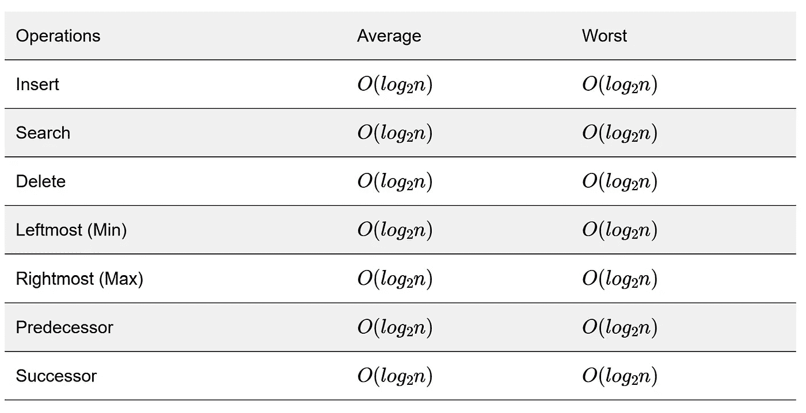

# 例子

由于具有自平衡能力，红黑树被广泛应用于软件程序中，包括实现其他数据结构。例如，C++ STL 映射实现为红黑树。这个部分使用我们在这里实现的红黑树来实现一个键值映射。

```
from typing import Any, Optional

from forest.binary_trees import red_black_tree
from forest.binary_trees import traversal

class Map:
    """Key-value Map implemented using Red-Black Tree."""

    def __init__(self) -> None:
        self._rbt = red_black_tree.RBTree()

    def __setitem__(self, key: Any, value: Any) -> None:
        """Insert (key, value) item into the map."""
        self._rbt.insert(key=key, data=value)

    def __getitem__(self, key: Any) -> Optional[Any]:
        """Get the data by the given key."""
        node = self._rbt.search(key=key)
        if node:
            return node.data
        return None

    def __delitem__(self, key: Any) -> None:
        """Remove a (key, value) pair from the map."""
        self._rbt.delete(key=key)

    def __iter__(self) -> traversal.Pairs:
        """Iterate the data in the map."""
        return self._rbt.inorder_traverse()

if __name__ == "__main__":

    # Initialize the Map instance.
    contacts = Map()

    # Add some items.
    contacts["Mark"] = "mark@email.com"
    contacts["John"] = "john@email.com"
    contacts["Luke"] = "luke@email.com"

    # Retrieve an email
    print(contacts["Mark"])

    # Delete one item.
    del contacts["John"]

    # Check the deleted item.
    print(contacts["John"])  # This will print None

    # Iterate the items.
    for contact in contacts:
        print(contact)
```

(完整示例可从 [rbt_map.py](https://github.com/shunsvineyard/forest-python/blob/main/examples/rbt_map.py) 获得)

# 摘要

虽然维护红黑树属性很复杂，但是它的自平衡能力使得红黑树比二叉查找树具有更好的性能。在许多情况下，保持树的平衡是至关重要的，所以红黑树的复杂性是值得的。在下面的文章中，我们将实现另一个著名的自平衡树，AVL 树。

*原载于 2021 年 5 月 1 日*[*https://shunsvineyard . info*](https://shunsvineyard.info/2021/04/30/build-the-forest-in-python-series-red-black-tree/)*。*