# 在 Python 系列中构建森林:单线程二分搜索法树

> 原文：<https://medium.com/nerd-for-tech/build-the-forest-in-python-series-single-threaded-binary-search-trees-323465dd70db?source=collection_archive---------18----------------------->

本文是[营造森林系列](https://shunsvineyard.info/build-the-forest-series/)的第三篇。在上一篇文章[二叉树遍历](https://shunsvineyard.info/2021/03/17/build-the-forest-in-python-series-binary-tree-traversal/)中，我们讨论了使用递归方法和辅助堆栈的二叉树遍历。本文将构建二叉查找树的一个变体——线程二叉查找树。线程二分搜索法树利用空的左或右节点的属性来实现某些遍历，而不使用堆栈或递归方法。

# 项目设置

像[构建森林系列](https://shunsvineyard.info/build-the-forest-series/)中的其他文章一样，实现假设使用 Python 3.9 或更新版本。本文为我们的项目添加了两个模块:*single _ threaded _ binary _ trees . py*用于线程化二叉查找树实现，以及*test _ single _ threaded _ binary _ trees . py*用于其单元测试。添加这两个文件后，我们的项目布局如下:

```
forest-python
├── forest
│   ├── __init__.py
│   ├── binary_trees
│   │   ├── __init__.py
│   │   ├── binary_search_tree.py
│   │   ├── single_threaded_binary_trees.py
│   │   └── traversal.py
│   └── tree_exceptions.py
└── tests
    ├── __init__.py
    ├── conftest.py
    ├── test_binary_search_tree.py
    ├── test_single_threaded_binary_trees.py
    └── test_traversal.py
```

(完整代码可从 [forest-python](https://github.com/shunsvineyard/forest-python) 获得)

# 什么是线索二叉树？

线程二叉树是一种二叉树变体，它通过利用节点的空左或空右属性来优化特定顺序的遍历。有两种类型的线索二叉树:

**单线程二叉树**:对于一个节点的任何一个空的左或右属性，空属性被线程化到有序的前一个或后一个。换句话说，不是让 left 或 right 属性为空，而是 left 或 right 属性指向节点的前任或继任者。单线程二叉树有两种实现方式:左单线程二叉树和右单线程二叉树。

*   **右单线程二叉树**:一个节点的空右属性指向该节点的**后继节点**，如果一个节点有空左属性，则该属性保持为空。
*   **左单线程二叉树**:一个节点的空左属性指向该节点的**前任**，如果一个节点有空右属性，则该属性保持为空。

**双线索二叉树**:对于任意空的左属性或右属性，空属性被线索化到有序的前一个或后一个:如果左属性为空，则左属性指向该节点的前一个；如果右属性为空，则右属性指向该节点的后继节点。

尽管线程可以被添加到任何二叉树，但是将线程添加到二叉查找树或其变体，即满足[二叉搜索树属性](https://shunsvineyard.info/2021/03/13/build-the-forest-in-python-series-binary-search-tree/#2-what-is-the-binary-search-tree)的树，是最有益的。因此，在这个项目中，我们将实现的线程二叉树是带线程的二分搜索法树(线程二分搜索法树)。在本文的其余部分，我们提到的所有线索二叉树也是二分搜索法树，以避免冗长的阶段。

此外，线程不需要指向其有序的前任或继任者。也可以是预购或后购。但是，按序是二叉查找树中的一种排序顺序，因此指向其按序前导或后继的线程是最常见的。

# 为什么我们需要线？

向二叉树添加线程会增加复杂性，那么我们为什么需要线程呢？有几个原因:

*   快速后继或前任访问
*   对于某些遍历，没有辅助堆栈或递归方法
*   减少了执行遍历时的内存消耗，因为不需要辅助堆栈或递归
*   利用浪费的空间。由于节点的空 left 或 right 属性不存储任何东西，我们可以将它们用作线程

对于每种类型的线程二叉树，我们可以总结如下添加线程的好处。

*   右线程二叉树可以在不使用堆栈或递归方法的情况下执行有序和前序遍历。它还具有快速后继访问。
*   左线程二叉树可以在没有堆栈或递归方法的情况下执行反向有序遍历，并且具有快速的前任访问。
*   双线程二叉树具有两种单线程二叉树的优点。

# 构建单线程二分搜索法树

正如我们在[构建二叉查找树](https://shunsvineyard.info/2021/03/13/build-the-forest-in-python-series-binary-search-tree/#3-build-the-binary-search-tree)一节中所做的，这一节将遍历实现并讨论实现选择背后的一些想法。

# 结节

节点结构类似于[二叉查找树节点](https://shunsvineyard.info/2021/03/13/build-the-forest-in-python-series-binary-search-tree/#4-node)，除了它有一个额外的字段*是 _ 线程*。 *is_thread* 属性的目的是知道左或右属性是否是线程。

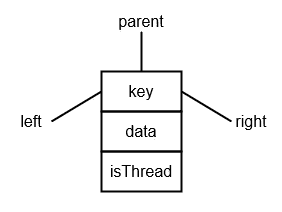

*is_thread* 属性为布尔变量: *True* 如果属性(左或右取决于单线程二叉树的类型)为线程；*假*否则。

```
@dataclasses.dataclass
class Node:
    key: Any
    data: Any
    left: Optional["Node"] = None
    right: Optional["Node"] = None
    parent: Optional["Node"] = None
    is_thread: bool = False
```

作为二叉查找树节点，我们将线程二叉树的节点类定义为[数据类](https://www.python.org/dev/peps/pep-0557/)。

# 右单线程二叉查找树

顾名思义，我们可以把右边的单线程二叉树形象化为下图。

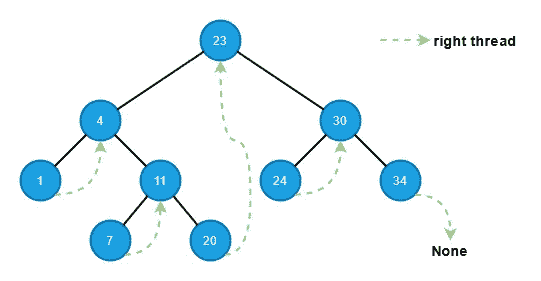

每个节点的空右属性指向其有序后继，其 *is_thread* 变量设置为 *True* 除了最右边的节点。最右边的节点的 right 属性保持为空，它的 is_thread 为 False，所以我们知道它是最右边的节点(即没有后续节点)。

像二叉查找树一样，右线程二叉树具有构建和修改的核心函数(插入、删除和搜索)以及其他不依赖于特定树的辅助函数，例如获取最左边的节点和树的高度。我们在二叉查找树中实现的同一个 *__repr__()* 函数也可以用于调试目的。

这里的主要区别是，我们实现了不使用堆栈或递归方法的有序和预序遍历。

```
class RightThreadedBinaryTree:

    def __init__(self) -> None:
        self.root: Optional[Node] = None

    def __repr__(self) -> str:
        """Provie the tree representation to visualize its layout."""
        if self.root:
            return (
                f"{type(self)}, root={self.root}, "
                f"tree_height={str(self.get_height(self.root))}"
            )
        return "empty tree"

    def search(self, key: Any) -> Optional[Node]:
        …

    def insert(self, key: Any, data: Any) -> None:
        …

    def delete(self, key: Any) -> None:
        …

    @staticmethod
    def get_leftmost(node: Node) -> Node:
        …

    @staticmethod
    def get_rightmost(node: Node) -> Node:
        …

    @staticmethod
    def get_successor(node: Node) -> Optional[Node]:
        …

    @staticmethod
    def get_predecessor(node: Node) -> Optional[Node]:
        …

    @staticmethod
    def get_height(node: Optional[Node]) -> int:
        …

    def inorder_traverse(self) -> traversal.Pairs:
        …

    def preorder_traverse(self) -> traversal.Pairs:
        …
```

## 插入

插入操作类似于二叉查找树的[插入](https://shunsvineyard.info/2021/03/13/build-the-forest-in-python-series-binary-search-tree/#7-insert)。不同的是，线程二叉树需要考虑线程更新。因此，插入步骤如下。

1.  通过从根开始遍历树，并将新节点的键与沿途每个节点的键进行比较，找到插入新节点的适当位置(即新节点的父节点)。当走到右边的子树时，同样检查 *is_thread* 变量。如果变量为 *True* ，我们到达叶子层，叶子节点就是新节点的父节点。
2.  更新新节点的父属性以指向父节点。
3.  如果新节点是父节点的左子节点，则将新节点的右属性设置为父节点，并将 *is_thread* 变量设置为 *True* 。更新父节点的 left 属性以指向新节点。
4.  如果新节点是其父节点的右子节点，则将父节点的右属性复制到新节点的右属性中(父节点的右属性必须是插入前的线程)，并将 *is_thread* 变量设置为 *True* 。更新父节点的 right 属性指向新节点，并将父节点的 *is_thread* 设置为 *False* 。

下图演示了节点插入的步骤。

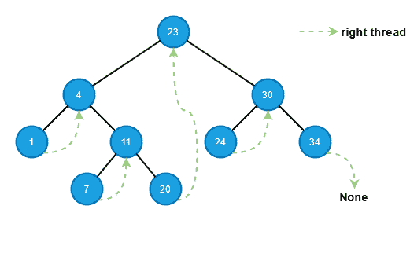

我们可以如下实现插入。

```
def insert(self, key: Any, data: Any) -> None:
    new_node = Node(key=key, data=data)
    parent: Optional[Node] = None
    current: Optional[Node] = self.root

    while current:
        parent = current
        if new_node.key < current.key:
            current = current.left
        elif new_node.key > current.key:
            # If the node is thread, meaning it's a leaf node.
            if current.is_thread:
                current = None
            else:
                current = current.right
        else:
            raise tree_exceptions.DuplicateKeyError(key=new_node.key)
    new_node.parent = parent
    # If the tree is empty
    if parent is None:
        self.root = new_node
    elif new_node.key < parent.key:
        parent.left = new_node

        # Update thread
        new_node.right = parent
        new_node.is_thread = True

    else:
        # Update thread
        new_node.is_thread = parent.is_thread
        new_node.right = parent.right
        parent.is_thread = False
        # Parent's right must be set after thread update
        parent.right = new_node
```

## 搜索

搜索操作也类似于二叉查找树的搜索，但是它需要检查 *is_thread* 变量来确定我们是否到达了叶级。

1.  从根开始遍历树，并沿着树遍历将键与每个节点的键进行比较
2.  如果一个键匹配，我们就找到了节点。
3.  如果到达叶子后没有键匹配(如果 is_thread 为 True，则表示该节点是叶子节点)，则它不存在于树中。

该工具类似于我们在[二叉查找树中制作的二叉查找树:搜索](https://shunsvineyard.info/2021/03/13/build-the-forest-in-python-series-binary-search-tree/#8-search)并进行简单修改——检查 *is_thread* 。

```
def search(self, key: Any) -> Optional[Node]:
    current = self.root
    while current:
        if key == current.key:
            return current
        elif key < current.key:
            current = current.left
        else:  # key > current.key
            if current.is_thread:
                break
            current = current.right
    return None
```

## 删除

像二叉查找树一样，要删除的右线程树节点有三种情况:没有孩子、只有一个孩子、两个孩子。我们还使用我们在[二叉查找树中使用的移植技术:删除](https://shunsvineyard.info/2021/03/13/build-the-forest-in-python-series-binary-search-tree/#9-delete)来用要删除的节点替换子树。虽然基本思想是相同的，但是*移植*函数和*删除*函数都需要将正确的线程放入计数中。我们需要记住的最重要的事情是，当我们删除一个节点时，如果有另一个节点的右属性指向要删除的节点，我们需要更新该节点的线程(即右属性)。

案例 1:没有孩子

如果要删除的节点没有子节点，则其 left 属性为空，其*为 _thread* 为 *True* 。关于线程，我们需要考虑两种情况。见下图。

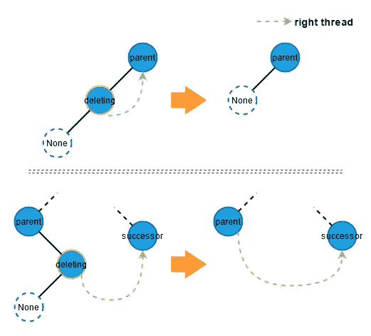

案例 2a:只剩下一个孩子

如果要删除的节点只有一个左子节点，则表示该节点的 *is_thread* 为 *True* (例外情况是当要删除的节点是根节点且只有一个左子节点时；这种情况下，节点的*为 _thread* 为 *False* ，其右属性为 *None* 。我们需要更新线程的情况如下图所示。

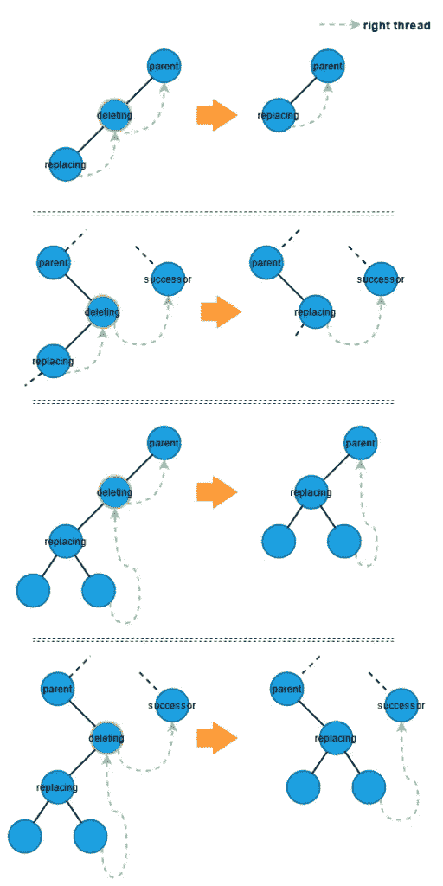

案例 2b:只有一个正确的孩子

如果要删除的节点只有一个右子节点，则表示该节点的左属性为空， *is_thread* 为 False。由于要删除的节点没有左子节点，这意味着没有人指向该节点。

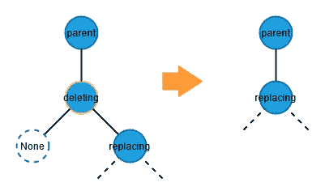

案例 3:两个孩子

类似于二叉查找树删除，要删除的节点有两个孩子的情况可以分解成两个子情况:

3.a 删除节点的右边子节点也是右边子树中最左边的节点。在这种情况下，正确的孩子必须只有一个正确的孩子。因此，我们可以将删除节点替换为它的右子节点，如下图所示。

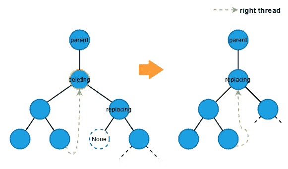

3.b .删除节点的右子节点也有两个子节点。

在这种情况下，我们从右边的子树中找到最左边的节点来替换要删除的节点。注意，当我们从右边的子树中取出最左边的节点时，它也属于删除情况:情况 1:没有子节点或情况 2:只有一个右边的子节点。否则，它不能是最左边的节点。

因此，我们使用了两次*移植*函数:一次取出最左边的节点，另一次用原来最左边的节点替换删除的节点。下图展示了我们执行删除时的线程考虑。

**替换节点没有子节点:**

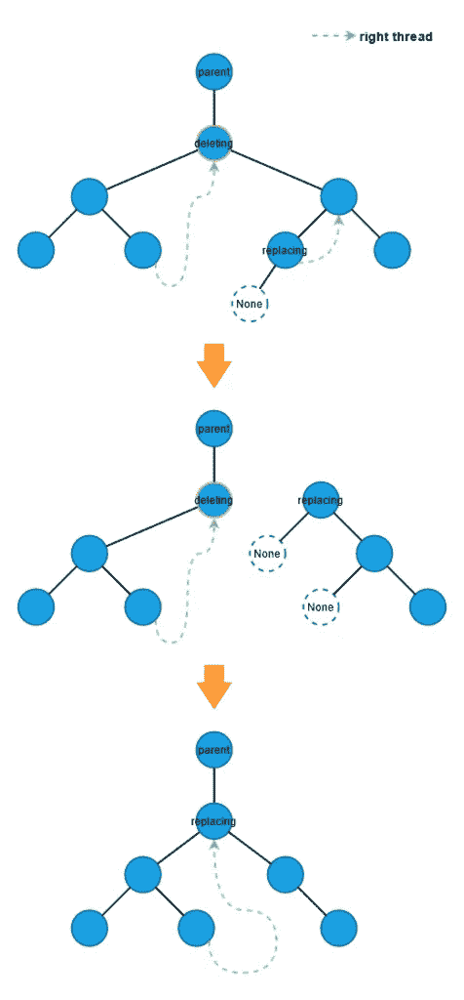

**替换节点只有一个右子节点**:

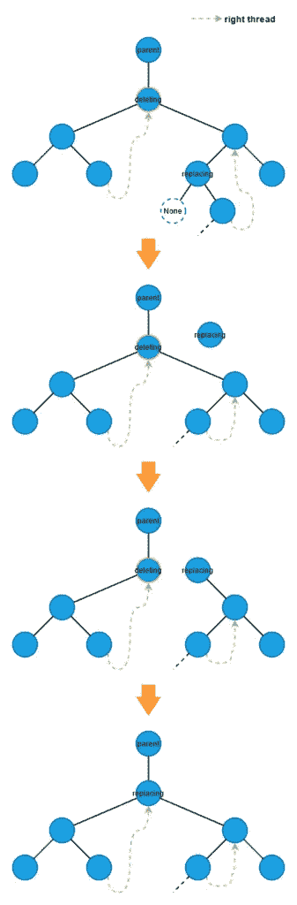

基于上面的图片，我们可以实现如下的删除和移植功能。

```
def delete(self, key: Any) -> None:
    if self.root and (deleting_node := self.search(key=key)):
        # Case 1: no child
        if deleting_node.left is None and (
            deleting_node.right is None or deleting_node.is_thread
        ):
            self._transplant(deleting_node=deleting_node, replacing_node=None)

        # Case 2a: only one left child
        elif deleting_node.left and (
            deleting_node.is_thread or deleting_node.right is None
            # deleting_node.right is None means the deleting node is the root.
        ):
            predecessor = self.get_predecessor(node=deleting_node)
            if predecessor:
                predecessor.right = deleting_node.right
            self._transplant(
                deleting_node=deleting_node, replacing_node=deleting_node.left
            )

        # Case 2b: only one right child
        elif deleting_node.left is None and deleting_node.is_thread is False:
            self._transplant(
                deleting_node=deleting_node, replacing_node=deleting_node.right
            )

        # Case 3: two children
        elif (
            deleting_node.left
            and deleting_node.right
            and deleting_node.is_thread is False
        ):
            predecessor = self.get_predecessor(node=deleting_node)
            replacing_node: Node = self.get_leftmost(node=deleting_node.right)
            # the leftmost node is not the direct child of the deleting node
            if replacing_node.parent != deleting_node:
                if replacing_node.is_thread:
                    self._transplant(
                        deleting_node=replacing_node, replacing_node=None
                    )
                else:
                    self._transplant(
                        deleting_node=replacing_node,
                        replacing_node=replacing_node.right,
                   )
                replacing_node.right = deleting_node.right
                replacing_node.right.parent = replacing_node
                replacing_node.is_thread = False

            self._transplant(
                deleting_node=deleting_node, replacing_node=replacing_node
            )
            replacing_node.left = deleting_node.left
            replacing_node.left.parent = replacing_node
            if predecessor and predecessor.is_thread:
                predecessor.right = replacing_node
        else:
            raise RuntimeError("Invalid case. Should never happened")

def _transplant(self, deleting_node: Node, replacing_node: Optional[Node]) -> None:
    if deleting_node.parent is None:
        self.root = replacing_node
        if self.root:
            self.root.is_thread = False
    elif deleting_node == deleting_node.parent.left:
        deleting_node.parent.left = replacing_node
        if replacing_node:
            if deleting_node.is_thread:
                if replacing_node.is_thread:
                    replacing_node.right = replacing_node.right
    else:  # deleting_node == deleting_node.parent.right
        deleting_node.parent.right = replacing_node
        if replacing_node:
            if deleting_node.is_thread:
                if replacing_node.is_thread:
                    replacing_node.right = replacing_node.right
        else:
            deleting_node.parent.right = deleting_node.right
            deleting_node.parent.is_thread = True

    if replacing_node:
        replacing_node.parent = deleting_node.parent
```

## 获得高度

为了计算一个线程二叉树的树高，我们可以像在[二叉查找树:获取高度](https://shunsvineyard.info/2021/03/13/build-the-forest-in-python-series-binary-search-tree/#14-get-the-height)中所做的那样，为每个孩子的高度递归地增加 1。如果一个节点有两个子节点，我们使用 [max](https://docs.python.org/3/library/functions.html#max) 函数从子节点中获取较大的高度，并将最高值增加 1。主要区别是我们使用 *is_thread* 来检查一个节点是否有一个正确的子节点。

```
@staticmethod
def get_height(node: Optional[Node]) -> int:
    if node:
        if node.left and node.is_thread is False:
            return (
                max(
                    RightThreadedBinaryTree.get_height(node.left),
                    RightThreadedBinaryTree.get_height(node.right),
                )
                + 1
            )

        if node.left:
            return RightThreadedBinaryTree.get_height(node=node.left) + 1

        if node.is_thread is False:
            return RightThreadedBinaryTree.get_height(node=node.right) + 1
    return 0
```

## 获取最左边和最右边的节点

获取最左最右节点的实现类似于[二叉查找树:获取最左最右节点](https://shunsvineyard.info/2021/03/13/build-the-forest-in-python-series-binary-search-tree/#15-get-the-leftmost-and-rightmost-nodes)。要得到最右边的节点，除了检查 right 属性是否为空，我们还需要检查 *is_thread* 是否为 *True* 。所以，我们可以像下面这样修改 *get_rightmost* 函数。

```
@staticmethod
def get_rightmost(node: Node) -> Node:
    current_node = node
     while current_node.is_thread is False and current_node.right:
        current_node = current_node.right
    return current_node
```

*get _ leftsmall*的实现与二叉查找树中的*get _ leftsmall*相同。

```
@staticmethod
def get_leftmost(node: Node) -> Node:
    current_node = node
    while current_node.left:
        current_node = current_node.left
    return current_node
```

## 前任和继任者

由于右线程树提供了快速的有序后继访问(如果节点的右属性是线程，则右属性指向节点的有序后继)，如果右属性是线程，则我们可以通过跟随其右属性来获得节点的后继。否则，该节点的后继节点是该节点的右子树的最左边的节点。

```
@staticmethod
def get_successor(node: Node) -> Optional[Node]:
    if node.is_thread:
        return node.right
    else:
        if node.right:
            return RightThreadedBinaryTree.get_leftmost(node=node.right)
        # if node.right is None, it means no successor of the given node.
        return None
```

*get_predecessor* 的实现与[二叉查找树:Predecessor](https://shunsvineyard.info/2021/03/13/build-the-forest-in-python-series-binary-search-tree/#16-predecessor-and-successor) 相同。

```
@staticmethod
def get_predecessor(node: Node) -> Optional[Node]:
    if node.left:
        return RightThreadedBinaryTree.get_rightmost(node=node.left)
    parent = node.parent
    while parent and node == parent.left:
        node = parent
        parent = parent.parent
    return parent
```

## 有序遍历

右线索树提供的一个好处是，我们可以在不使用辅助或递归方法的情况下进行有序遍历。算法如下:

1.  从整个树的最左边的节点开始。
2.  如果右属性是线程，则跟随右属性；如果右边的属性不是线程，那么转到子树最左边的节点。
3.  重复步骤 2，直到正确的属性为*无*。

下图中的红色箭头演示了线程的有序遍历。

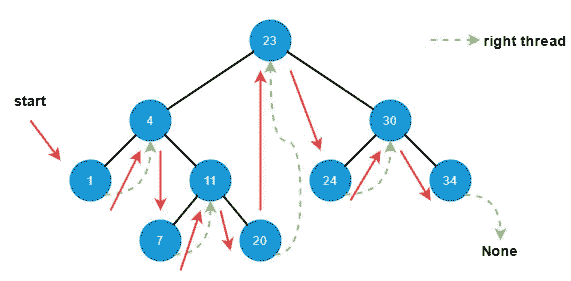

并且在不使用辅助堆栈或递归的情况下实现函数。

```
def inorder_traverse(self) -> traversal.Pairs:
    if self.root:
        current: Optional[Node] = self.get_leftmost(node=self.root)
        while current:
            yield (current.key, current.data)

            if current.is_thread:
                current = current.right
            else:
                if current.right is None:
                    break
                current = self.get_leftmost(current.right)
```

## 前序遍历

右线程树还提供了一种更简单的方法来进行前序遍历，并且比按序遍历更简单。

1.  从根开始。
2.  如果 left 属性不为空，则转到左边的子元素。
3.  如果 left 属性为空，则跟随线程到右边。
4.  重复步骤 2 和 3，直到右侧属性为空。

下图中下面的红色箭头表示的是线程化方式的有序遍历。

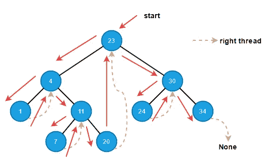

前序遍历可以如下实现。

```
def preorder_traverse(self) -> traversal.Pairs:
    current = self.root
    while current:
        yield (current.key, current.data)

        if current.is_thread:
            # If a node is thread, it must have a right child.
            current = current.right.right  # type: ignore
        else:
            current = current.left
```

# 左单线程二叉查找树

左线索树与右线索树对称。如果左线程树中任一节点的左属性为空，则左属性为线程并指向该节点的有序前任，并且 *is_thread* 变量设置为 *True* 。下图中可以看到一个左螺纹树。

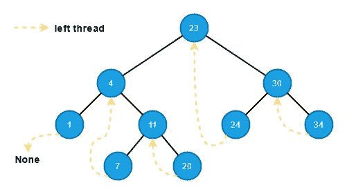

左线程树的类布局与右线程树几乎相同。唯一的区别是左边的线程树提供了一个简单的反向有序遍历，而不是有序和前序遍历。

```
class LeftThreadedBinaryTree:

    def __init__(self) -> None:
        self.root: Optional[Node] = None

    def __repr__(self) -> str:
        """Provie the tree representation to visualize its layout."""
        if self.root:
            return (
                f"{type(self)}, root={self.root}, "
                f"tree_height={str(self.get_height(self.root))}"
            )
        return "empty tree"

    def search(self, key: Any) -> Optional[Node]:
        …

    def insert(self, key: Any, data: Any) -> None:
        …

    def delete(self, key: Any) -> None:
        …

    @staticmethod
    def get_leftmost(node: Node) -> Node:
        …

    @staticmethod
    def get_rightmost(node: Node) -> Node:
        …

    @staticmethod
    def get_successor(node: Node) -> Optional[Node]:
        …

    @staticmethod
    def get_predecessor(node: Node) -> Optional[Node]:
        …

    @staticmethod
    def get_height(node: Optional[Node]) -> int:
        …

    def reverse_inorder_traverse(self) -> traversal.Pairs:
        …
```

## 插入

插入操作类似于右螺纹树。不同的是线在左边。

1.  通过从根开始遍历树，并将新节点的键与沿途每个节点的键进行比较，找到插入新节点的适当位置(即新节点的父节点)。当走到左边的子树时，同样检查 *is_thread* 变量。如果变量*为真*，我们到达叶级，叶节点就是父节点。
2.  找到父节点后，更新父节点的左侧(或右侧，取决于关键点)以指向新节点。
3.  更新新节点的父属性以指向父节点。
4.  如果新节点是其父节点的右子节点，将新节点的左属性指向父节点，并将 *is_thread* 变量设置为 *True* 。
5.  如果新节点是父节点的左子节点，则将父节点的左属性复制到新节点的左属性中(父节点的左属性在插入前必须是线程)，并设置*为 _ 线程* *真*。更新父节点的 left 属性以指向新节点。

下图演示了节点插入的步骤。

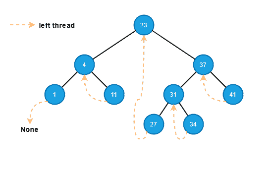

实现如下。

```
def insert(self, key: Any, data: Any) -> None:
    new_node = Node(key=key, data=data)
    parent: Optional[Node] = None
    current: Optional[Node] = self.root

    while current:
        parent = current
        if new_node.key < current.key:
            # If the node is thread, meaning it's a leaf node.
            if current.is_thread:
                current = None
            else:
                current = current.left
        elif new_node.key > current.key:
            current = current.right
        else:
            raise tree_exceptions.DuplicateKeyError(key=new_node.key)
    new_node.parent = parent
    # If the tree is empty
    if parent is None:
        self.root = new_node
    elif new_node.key > parent.key:
        parent.right = new_node
        # Update thread
        new_node.left = parent
        new_node.is_thread = True

    else:
        # Update thread
        new_node.is_thread = parent.is_thread
        new_node.left = parent.left
        parent.is_thread = False
        # Parent's left must be set after thread update
        parent.left = new_node
```

## 搜索

搜索操作类似于右线程二叉树，所以我们需要检查 *is_thread* 变量来确定我们是否到达了叶子。

1.  从根开始遍历树，并沿着树遍历将键与每个节点的键进行比较
2.  如果一个键匹配，我们就找到了节点。
3.  如果到达叶子后没有匹配的键(如果 is_thread 为 True，也意味着该节点是叶子节点)，则它不存在于树中。

该实现非常类似于右边的线索树中的搜索。

```
def search(self, key: Any) -> Optional[Node]:
    current = self.root

    while current:
        if key == current.key:
            return current
        elif key < current.key:
            if current.is_thread is False:
                current = current.left
            else:
                break
        else:  # key > current.key:
            current = current.right
    return None
```

## 删除

类似地，左线索二叉树的删除与右线索二叉树对称，并且有三种情况:没有孩子、只有一个孩子、两个孩子。

案例 1:没有孩子

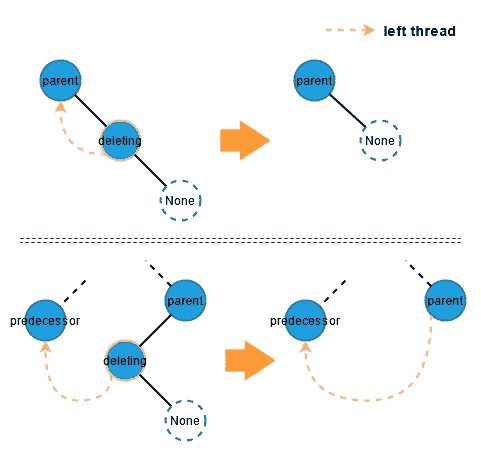

案例 2a:只剩下一个孩子

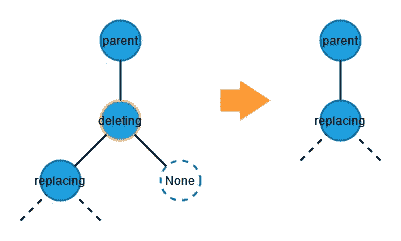

案例 2b:只有一个正确的孩子

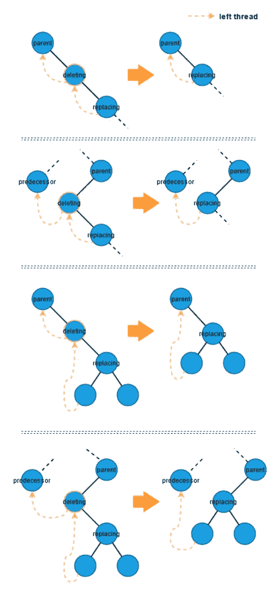

案例 3:两个孩子

3.a 删除节点的右边子节点也是右边子树中最左边的节点。

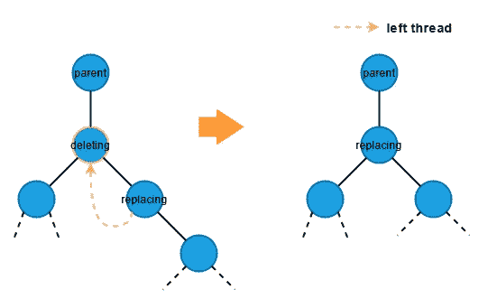

3.b .删除节点的右子节点也有两个子节点。

**替换节点没有子节点:**


**替换节点只有一个右子节点**:

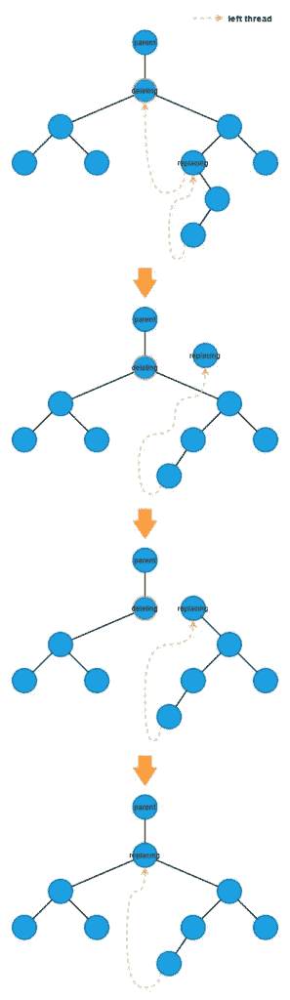

像右线程二叉树一样，我们也使用在[二叉查找树删除](https://shunsvineyard.info/2021/03/13/build-the-forest-in-python-series-binary-search-tree/#9-delete)中使用的移植技术，用要删除的节点替换子树。

```
def delete(self, key: Any) -> None:
    if self.root and (deleting_node := self.search(key=key)):
        # Case 1: no child
        if deleting_node.right is None and (
            deleting_node.left is None or deleting_node.is_thread
        ):
            self._transplant(deleting_node=deleting_node, replacing_node=None)

        # Case 2a: only one left child
        elif (deleting_node.right is None) and (deleting_node.is_thread is False):
            self._transplant(
                deleting_node=deleting_node, replacing_node=deleting_node.left
            )

        # Case 2b: only one right child
        elif deleting_node.right and (
            deleting_node.is_thread or deleting_node.left is None
            # deleting_node.left is None means the deleting node is the root.
        ):
            successor = self.get_successor(node=deleting_node)
            if successor:
                successor.left = deleting_node.left
            self._transplant(
                deleting_node=deleting_node, replacing_node=deleting_node.right
            )

        # Case 3: two children
        elif deleting_node.right and deleting_node.left:
            replacing_node: Node = self.get_leftmost(node=deleting_node.right)
            successor = self.get_successor(node=replacing_node)
            # the leftmost node is not the direct child of the deleting node
            if replacing_node.parent != deleting_node:
                self._transplant(
                    deleting_node=replacing_node,
                    replacing_node=replacing_node.right,
                )
                replacing_node.right = deleting_node.right
                replacing_node.right.parent = replacing_node

            self._transplant(
                deleting_node=deleting_node, replacing_node=replacing_node
            )
            replacing_node.left = deleting_node.left
            replacing_node.left.parent = replacing_node
            replacing_node.is_thread = False
            if successor and successor.is_thread:
                successor.left = replacing_node
        else:
            raise RuntimeError("Invalid case. Should never happened")

def _transplant(self, deleting_node: Node, replacing_node: Optional[Node]) -> None:
    if deleting_node.parent is None:
        self.root = replacing_node
        if self.root:
            self.root.is_thread = False
    elif deleting_node == deleting_node.parent.left:
        deleting_node.parent.left = replacing_node
        if replacing_node:
            if deleting_node.is_thread:
                if replacing_node.is_thread:
                    replacing_node.left = deleting_node.left
        else:
            deleting_node.parent.left = deleting_node.left
            deleting_node.parent.is_thread = True
    else:  # deleting_node == deleting_node.parent.right
        deleting_node.parent.right = replacing_node
        if replacing_node:
            if deleting_node.is_thread:
                if replacing_node.is_thread:
                    replacing_node.left = deleting_node.left

    if replacing_node:
        replacing_node.parent = deleting_node.parent
```

## 获得高度

*get_height* 函数与右线程二叉树对称。

```
@staticmethod
def get_height(node: Optional[Node]) -> int:
    if node:
        if node.right and node.is_thread is False:
            return (
                max(
                    LeftThreadedBinaryTree.get_height(node.left),
                    LeftThreadedBinaryTree.get_height(node.right),
                )
                + 1
            )

        if node.right:
            return LeftThreadedBinaryTree.get_height(node=node.right) + 1

        if node.is_thread is False:
            return LeftThreadedBinaryTree.get_height(node=node.left) + 1

    return 0
```

## 获取最左边和最右边的节点

由于左线程树与右线程树是对称的，所以我们需要检查 *is_thread* 是否为 *True* ，并在尝试获取最左边的节点时检查 left 属性是否为空。

```
@staticmethod
def get_leftmost(node: Node) -> Node:
    current_node = node

    while current_node.left and current_node.is_thread is False:
        current_node = current_node.left
    return current_node
```

*获取 _ 最右侧*的实现与二叉查找树中的*获取 _ 最右侧*相同。

```
@staticmethod
def get_rightmost(node: Node) -> Node:
    current_node = node
    while current_node.right:
        current_node = current_node.right
    return current_node
```

## 前任和继任者

根据左螺纹树的定义:节点的空左属性指向其有序的前一个节点。如果节点的*是 _ 线程*是*真*，我们可以通过跟踪线程简单地得到节点的前任。

```
@staticmethod
def get_predecessor(node: Node) -> Optional[Node]:
    if node.is_thread:
        return node.left
    else:
        if node.left:
            return LeftThreadedBinaryTree.get_rightmost(node=node.left)
        # if node.left is None, it means no predecessor of the given node.
        return None
```

*get_successor* 的实现与[二叉查找树:Successor](https://shunsvineyard.info/2021/03/13/build-the-forest-in-python-series-binary-search-tree/#16-predecessor-and-successor) 相同。

```
@staticmethod
def get_successor(node: Node) -> Optional[Node]:
    if node.right:
        return LeftThreadedBinaryTree.get_leftmost(node=node.right)
    parent = node.parent
    while parent and node == parent.right:
        node = parent
        parent = parent.parent
    return parent
```

## 反向有序遍历

对于左线程，左线程树执行反向有序遍历既不需要递归也不需要辅助堆栈。

1.  从整个树的最右边的节点开始。
2.  如果左边的属性是线程，则跟随线程；如果左边的属性不是线程，那么转到子树最右边的节点。
3.  重复步骤 2，直到左侧属性为*无*。

下图中的红色箭头演示了反向顺序遍历的线程方式。

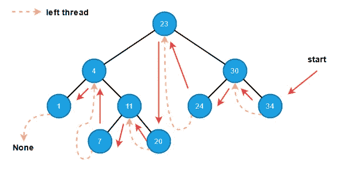

下面是实现。

```
def reverse_inorder_traverse(self) -> traversal.Pairs:
    if self.root:
        current: Optional[Node] = self.get_rightmost(node=self.root)
        while current:
            yield (current.key, current.data)

            if current.is_thread:
                current = current.left
            else:
                if current.left is None:
                    break
                current = self.get_rightmost(current.left)
```

# 试验

和往常一样，我们应该尽可能多地对代码进行单元测试。这里，我们使用在[构建二叉查找树](https://shunsvineyard.info/2021/03/13/build-the-forest-in-python-series-binary-search-tree/)中创建的 [conftest.py](https://github.com/shunsvineyard/forest-python/blob/main/tests/conftest.py) 中的 *basic_tree* 函数来测试我们的单线程二叉树。检查[test _ single _ threaded _ binary _ trees . py](https://github.com/shunsvineyard/forest-python/blob/main/tests/test_single_threaded_binary_trees.py)进行完整的单元测试。

# 分析

线程二叉树操作的运行时间与普通二叉查找树相同。

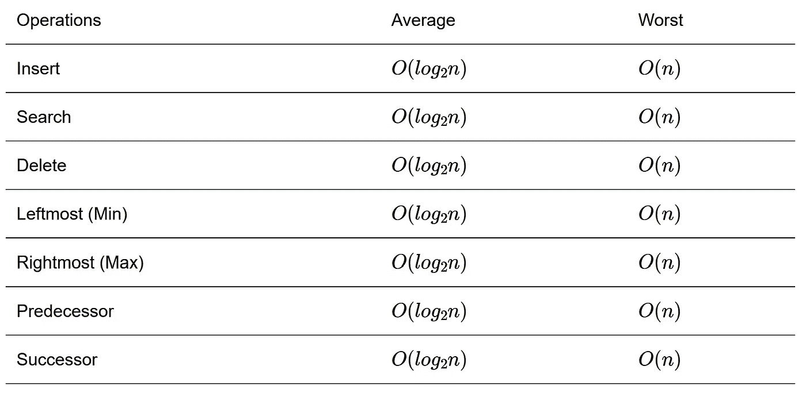

尽管右线程树提供了一种更容易的方法来检索节点的后继节点，而左线程树提供了一种更直接的方法来获得节点的前任节点，但是线程并没有节省很多运行时间。主要原因是这些函数还需要调用 *get_leftmost* 和 *get_rightmost* 函数，平均运行时间为 O(lg n)，最坏情况下运行时间为 O(n)。

然而，线程确实有助于特定遍历的空间复杂度。

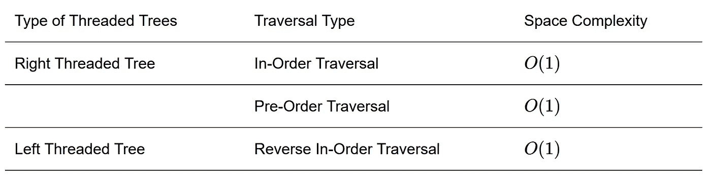

# 例子

向二叉查找树添加线程会使其实现变得更加复杂，但当遍历非常重要，但又涉及到空间消耗时，它们可能是一种解决方案。例如，我们希望构建一个数据库，用户可以频繁地以升序或降序访问数据，但是我们的内存有限(即，由于空间消耗的原因，无法使用辅助堆栈或递归方法)。在这种情况下，我们可以使用线程二叉树来实现升序和降序访问的索引。

```
from typing import Any

from forest.binary_trees import single_threaded_binary_trees
from forest.binary_trees import traversal

class MyDatabase:
    """Example using threaded binary trees to build an index."""

    def __init__(self) -> None:
        self._left_bst = single_threaded_binary_trees.LeftThreadedBinaryTree()
        self._right_bst = single_threaded_binary_trees.RightThreadedBinaryTree()

    def _persist(self, payload: Any) -> str:
        """Fake function pretent storing data to file system.

        Returns
        -------
        str
            Path to the payload.
        """
        return f"path_to_{payload}"

    def insert_data(self, key: Any, payload: Any) -> None:
        """Insert data.

        Parameters
        ----------
        key: Any
            Unique key for the payload
        payload: Any
            Any data
        """
        path = self._persist(payload=payload)
        self._left_bst.insert(key=key, data=path)
        self._right_bst.insert(key=key, data=path)

    def dump(self, ascending: bool = True) -> traversal.Pairs:
        """Dump the data.

        Parameters
        ----------
        ascending: bool
            The order of data.

        Yields
        ------
        Pairs
            The next (key, data) pair.
        """
        if ascending:
            return self._right_bst.inorder_traverse()
        else:
            return self._left_bst.reverse_inorder_traverse()

if __name__ == "__main__":

    # Initialize the database.
    my_database = MyDatabase()

    # Add some items.
    my_database.insert_data("Adam", "adam_data")
    my_database.insert_data("Bob", "bob_data")
    my_database.insert_data("Peter", "peter_data")
    my_database.insert_data("David", "david_data")

    # Dump the items in ascending order.
    print("Ascending...")
    for contact in my_database.dump():
        print(contact)

    print("\nDescending...")
    # Dump the data in decending order.
    for contact in my_database.dump(ascending=False):
        print(contact)
```

(完整示例可从 [single_tbst_database.py](https://github.com/shunsvineyard/forest-python/blob/main/examples/single_tbst_database.py) 获得)

输出将如下所示。

```
Ascending...
('Adam', 'path_to_adam_data')
('Bob', 'path_to_bob_data')
('David', 'path_to_david_data')
('Peter', 'path_to_peter_data')

Descending...
('Peter', 'path_to_peter_data')
('David', 'path_to_david_data')
('Bob', 'path_to_bob_data')
('Adam', 'path_to_adam_data')
```

# 摘要

尽管添加线程会增加复杂性，并且不会提高运行时性能，但是线程二叉树利用了浪费的左或右属性，并且提供了一种简单的方法来检索前一个或后一个，并且提供了一种不使用堆栈或递归方法来执行特定遍历的解决方案。当涉及到空间复杂性，并且特定遍历(例如，有序遍历)很关键时，线程二叉树可能是一种解决方案。

下一篇文章将构建具有单线程二叉树优点的双线程二叉树，也更复杂。

*原载于 2021 年 4 月 2 日*[*https://shunsvineyard . info*](https://shunsvineyard.info/2021/04/02/build-the-forest-in-python-series-single-threaded-binary-search-trees/)*。*