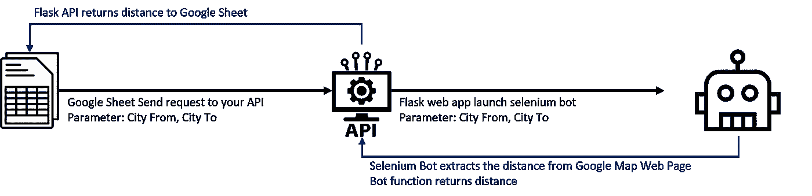
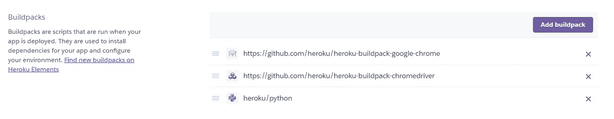
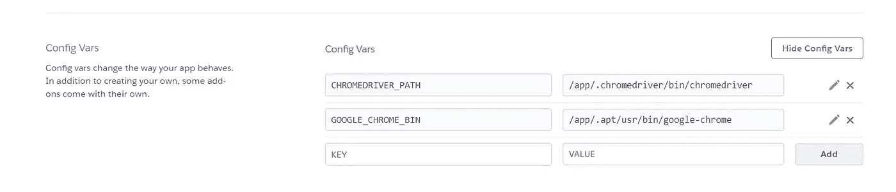
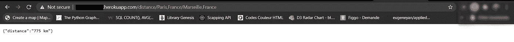
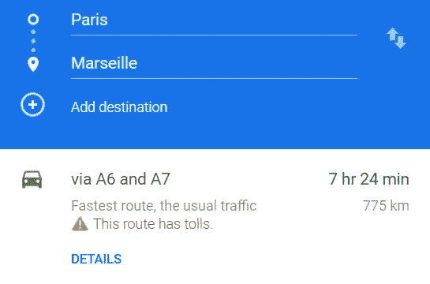
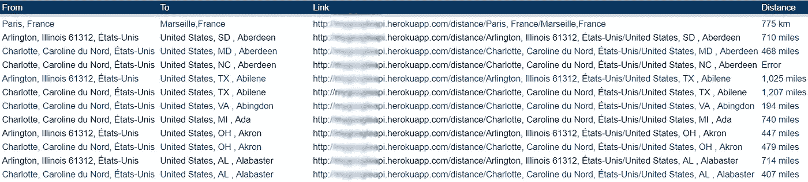
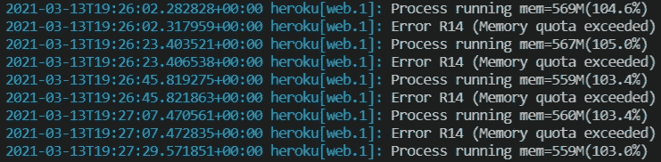
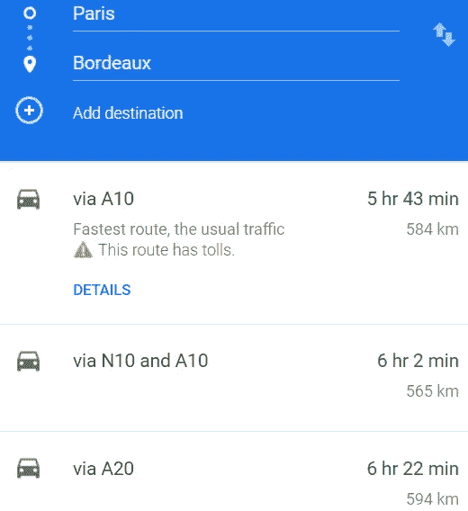

# 用 Python Flask 构建 GPS 路由 API

> 原文：<https://medium.com/nerd-for-tech/build-your-free-gps-routing-api-to-calculate-road-distances-143632cc4917?source=collection_archive---------5----------------------->

使用 Flask 创建一个自由距离矩阵 API，在 Heroku 上部署一个 Selenium Bot


在 [Unsplash](/s/photos/maps?utm_source=unsplash&utm_medium=referral&utm_content=creditCopyText) 上由 [Samantha Gollnick](https://unsplash.com/@samgollnick?utm_source=unsplash&utm_medium=referral&utm_content=creditCopyText) 拍照

我的第一个使用 GPS 路线的项目是在 4 年前。我想优化一个运输计划，每月从一个跨站台运送 1200 辆卡车，覆盖 50 家商店。

我已经使用 Excel-VBA 建立了一个交通路线优化工具——主要用于使用从谷歌地图 API 收集的距离进行交通计划设计。

这是我第一次使用 API 谷歌地图 API 是免费的，每天最多 10，000 次请求。

💌新文章免费直入你的收件箱:[时事通讯](https://www.samirsaci.com/#/portal/signup)

# **现在呢？**

几年后，谷歌改变了它的收费政策，所以你必须从第一次请求开始付费。

如果你从未订阅谷歌云平台(GCP)服务，你可以在设置信用卡后获得 200 美元的免费积分。

但是，如果

*   **你**需要走几千里？
*   **你**不在乎时间长吗？
*   **你**对在非个人项目中使用个人卡(或无法获得公司信用卡)感到不自信？

本文将向您展示一个用连接到 Google 地图网页的 selenium bot 构建的解决方案。

> 你可以在这个资源库中找到上传的完整代码: [Github](https://github.com/samirsaci/geocoding-api)

[](http://samirsaci.com) [## 萨米尔·萨奇

### 数据科学博客，专注于仓储，运输，数据可视化和机器人流程自动化…

samirsaci.com](http://samirsaci.com) 

# 它是如何工作的？

在开始阅读这一部分之前，请忘记你所知道的关于如何在有限的资源下将一个**快速、高效**和**稳定的代码**投入生产以确保**快速响应**的一切。

这将是**简单的**、**、*快速而肮脏的*、**、无意**成为可扩展的解决方案**。性能会比你直接查询官方的 Google API 低很多，但是这里是免费的:)



在谷歌工作表中获取两个城市之间距离的全过程—(图片由作者提供)

# 构建您的 API

让我们分三步走

1.  **构建一个 Selenium Bot** ，它将在谷歌地图网站中查询从城市 A 到城市 B 的距离
2.  设置您的 **Flask API** ，它将接收请求并返回距离
3.  在 Heroku 上部署你的代码

你可以在这个 Github 资源库中找到完整的代码:[链接](https://github.com/samirsaci/geocoding-api)。

## **设置您的 Selenium Bot**

*   设置 ChromeDriver 选项以确保最高的执行速度
*   将在 Heroku 实例中创建的输入环境变量

硒机器人的设置

## **写下你的距离剪贴簿**

```
Google Maps link to get distance from "Paris,France" to "Marseille, France"https://www.google.fr/maps/dir/Paris,France/Marseille, France/data=!4m2!4m1!3e0"/data=!4m2!4m1!3e0" is added to ensure that you take the road transportation distance
```

## **设置您的烧瓶 API**

```
Your API link to get distance from "Paris,France" to "Marseille, France"[http://xxx-xxx.herokuapp.com/distance/Paris,France/Marseille,France](http://xxx-xxx.herokuapp.com/distance/Paris,France/Marseille,France)
(replace xxx-xxx by your heroku app name)<fr> = Paris,France
<to> = Marseille, France
```

# 部署您的 API

我将跳过如何在 Heroku 上创建和部署应用程序的细节。您可以在文章末尾找到 Medium 文章的链接，这些文章解释了创建 Heroku 实例的详细步骤。

## 准备在 Heroku 上部署的文件

准备 requirements.txt 文件，其中列出了 pip 冻结所需的库

```
(env) C:\Users\yourprojectfolder> pip freeze > requirements.txt
```

创建 ProcFile 以启动您的 web 应用程序

```
(env) C:\Users\yourprojectfolder> echo web: gunicorn -t 120 -b :$PORT app:app > ProcfileP.S: Please make sure that your app name is "app" and your python script is named "app.py"
```

## 在 Heroku 上下载构建包来使用 Selenium + ChromeDriver

前往设置>添加构建包



Heroku 应用程序设置中的 Buildpacks 菜单—(图片由作者提供)

输入两个链接

*   [https://github.com/heroku/heroku-buildpack-google-chrome](https://github.com/heroku/heroku-buildpack-google-chrome)
*   [https://github.com/heroku/heroku-buildpack-chromedriver](https://github.com/heroku/heroku-buildpack-chromedriver)

## 设置环境变量



Heroku 应用程序设置中的配置变量菜单—(图片由作者提供)

```
CHROMEDRIVER_PATH: /app/.chromedriver/bin/chromedriver
GOOGLE_CHROME_BIN: /app/.apt/usr/bin/google-chrome
```

[](http://samirsaci.com) [## 萨米尔·萨奇

### 数据科学博客，专注于仓储，运输，数据可视化和机器人流程自动化…

samirsaci.com](http://samirsaci.com) 

# 测试您的 API

## 测试您的 API 来计算距离

出发地:法国巴黎
到法国马赛

**请求链接**
[http://XXX-XXX . herokuapp . com/distance/法国巴黎/法国马赛](http://mygoogleapi.herokuapp.com/distance/Paris,France/Marseille,France)
*(用你的 Heroku app 名代替 XXX-XXX)*

**响应**
{“距离”:“775 公里”}



您的 API 对查询从巴黎到马赛的距离的响应—(图片由作者提供)

## **在谷歌地图中我们能得到什么？**



从巴黎(法国)到马赛(法国)的距离:775 公里—(图片由作者提供)

正在匹配:)

# 结论和下一步措施

*关注我的 medium，了解更多与供应链数据科学相关的见解。*

我在一个免费的 Heroku 实例上部署了这个解决方案，并使用 **Google Sheet** 查询我的 API 以获得 **40 条道路距离**来测试它。



Google Sheet 使用我新创建的地理定位 API 来获取城市之间的距离—(图片由作者提供)

**下一步 1:** 想办法确保你的工作表一次只发送一次查询

否则，您可能会很快超出内存配额



Heroku 日志—(图片由作者提供)

**第二步:**错误管理和提取所有距离



从巴黎(法国)到波尔多(法国)的距离和路线时间

您可以在上面的示例中看到，显示的第一个结果是最短的行驶时间，但可能不是最短的距离。如果您在一天中的不同时间进行查询，路径时间可能会发生变化，因此您最好选择三个距离。

# 关于我

让我们在 [Linkedin](https://www.linkedin.com/in/samir-saci/) 和 [Twitter](https://twitter.com/Samir_Saci_) 上连线，我是一名供应链工程师，正在使用数据分析来改善物流运作和降低成本。

如果你对数据分析和供应链感兴趣，可以看看我的网站

[](https://samirsaci.com) [## Samir Saci |数据科学与生产力

### 专注于数据科学、个人生产力、自动化、运筹学和可持续发展的技术博客

samirsaci.com](https://samirsaci.com) 

# 参考

为了简洁易读，本文跳过了许多细节。你可以在下面列出的优秀文章中找到详细的说明。

[1] [迈克尔·布朗](https://medium.com/u/cae367a9c201?source=post_page-----143632cc4917--------------------------------)，在 Heroku (2019)上使用 Python Selenium 运行 ChromeDriver，[链接](/@mikelcbrowne/running-chromedriver-with-python-selenium-on-heroku-acc1566d161c)

[2] [Moses Gitau](https://medium.com/u/32aeeb8f7212?source=post_page-----143632cc4917--------------------------------) ，在 Heroku (2018)上部署 Flask 应用，[链接](/@gitaumoses4/deploying-a-flask-application-on-heroku-e509e5c76524)