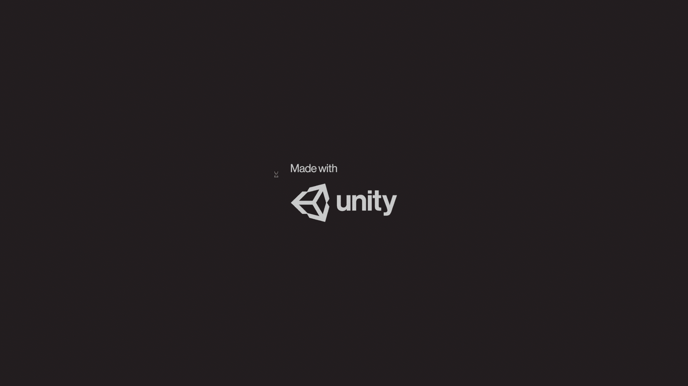
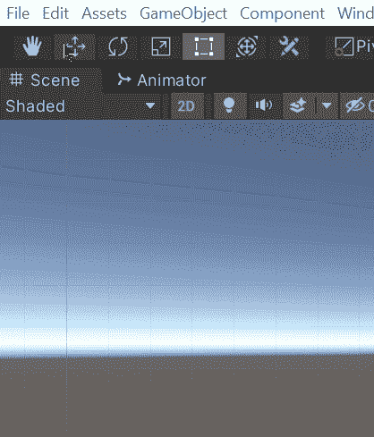
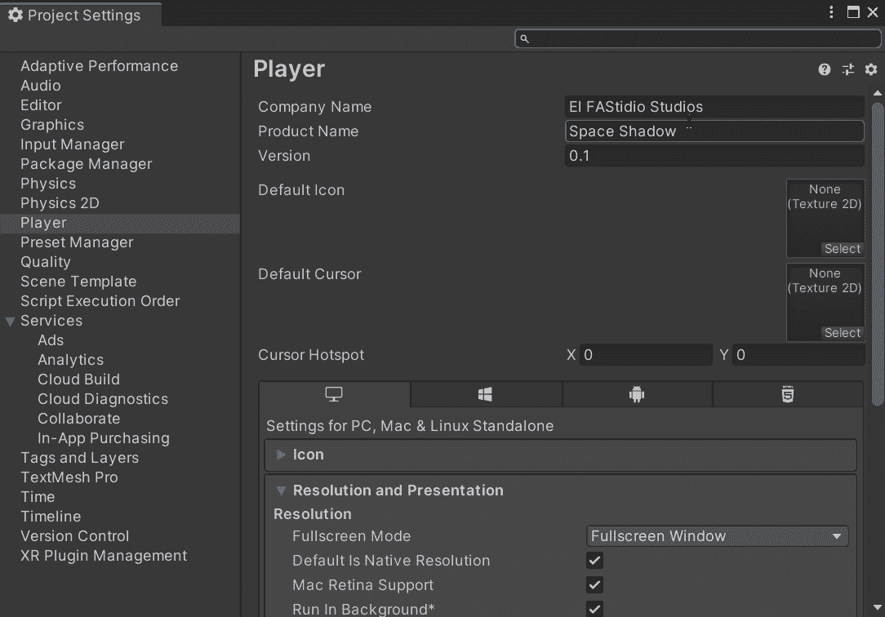
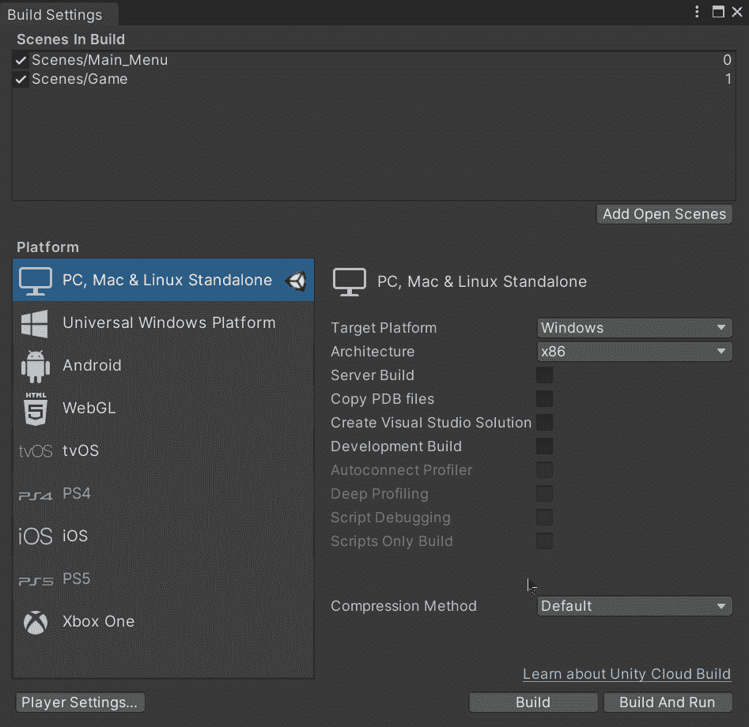
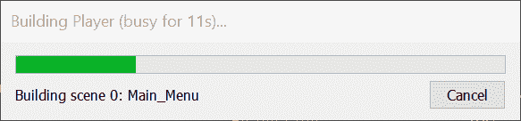
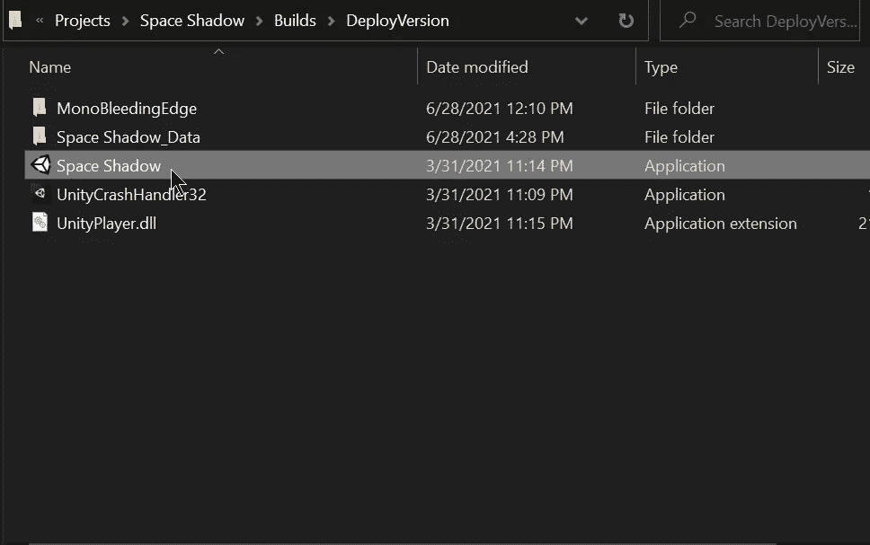
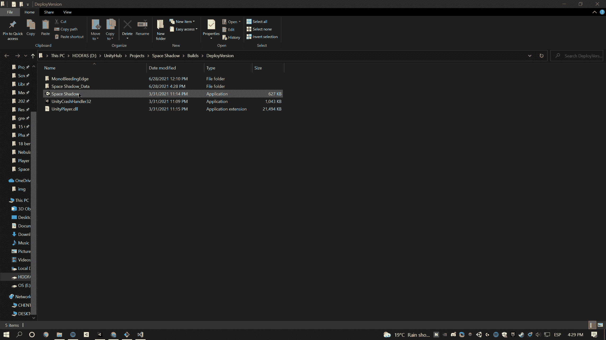

# 用 Unity 打造你的游戏

> 原文：<https://medium.com/nerd-for-tech/build-your-game-with-unity-8d42ab6c66ba?source=collection_archive---------15----------------------->

## 统一指南

## 关于如何用 Unity 制作游戏的快速指南

**目标**:构建并运行一个用 Unity 制作的游戏。

现在我们已经[实现了太空射手](/nerd-for-tech/implementing-space-shooter-game-features-final-boss-a03390c9b327)的最终 boss，让我们做一个可执行的构建来测试并在生产状态下展示游戏。

如果你想玩我的游戏，请访问我的 itch.io 页面:

 [## 空间阴影

### 太空阴影是一个生存空间射击游戏在 2D。在浏览器中播放

fernandoalcasan.itch.io](https://fernandoalcasan.itch.io/space-shadow) 

# 构建设置

为了创建游戏的可执行版本，让我们点击*文件>版本设置*，下一个窗口将会打开。

在此窗口中，我们将能够在顶部看到我们游戏中要构建的场景，如果您看不到任何列出的场景，您可以使用 ***添加打开的场景*** 按钮来添加当前场景，或者您可以从新窗口中的项目文件夹中拖动场景:

一旦要构建的场景被添加到顶部，让我们在左边选择目标平台，在右边选择它的属性。在这种情况下，我将选择使用 ***PC、Mac & Linux 单机*** 选项来构建我的游戏，因为我使用的是 Windows。

如果您使用的是 MAC 或 Linux 操作系统，您可以在窗口右侧选择相应的目标平台:

现在，在构建可执行文件之前，让我们通过点击窗口左侧的按钮打开 ***播放器设置*** 。

将打开一个新窗口，我们将能够看到要构建的可执行文件的属性，如下所示:

*   公司名称
*   产品名称
*   版本
*   默认图标
*   默认光标
*   解决

需要注意的是，如果你在分辨率上选择了*全屏窗口*模式，你的游戏需要一个按钮或按键来退出游戏。如果没有，你需要用另一种方法关闭游戏。

一旦我们修改了可玩属性，让我们回到构建设置窗口，点击右边的 ***构建*** 按钮。将会出现一个文件资源管理器窗口，我们需要选择一个文件夹来存储可执行版本及其文件:

然后，我们需要等待 Unity 编译游戏文件:

完成后，将出现一个新的文件资源管理器窗口，显示我们为构建选择的文件夹:

最后，我们只需要执行**。 *exe*** 文件，我们就可以玩我们的游戏了:

就这样，我们用 Unity 创建了我们游戏的可执行版本！:d .下一篇文章再见，我将展示如何使用代码在 Unity 中关闭游戏。

> *如果你想更多地了解我，欢迎登陆*[***LinkedIn***](https://www.linkedin.com/in/fas444/)**或访问我的* [***网站***](http://fernandoalcasan.com/) *:D**