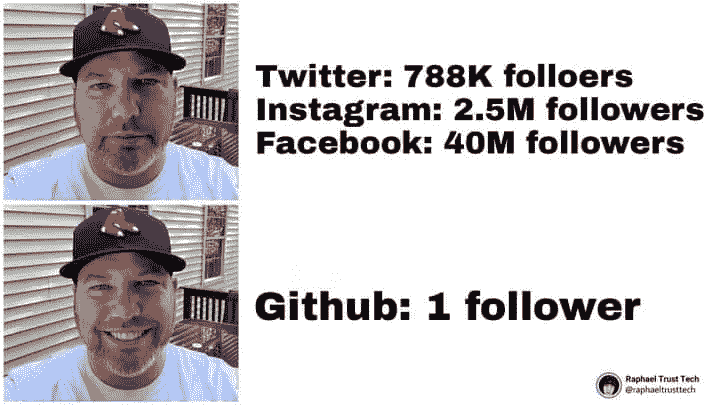
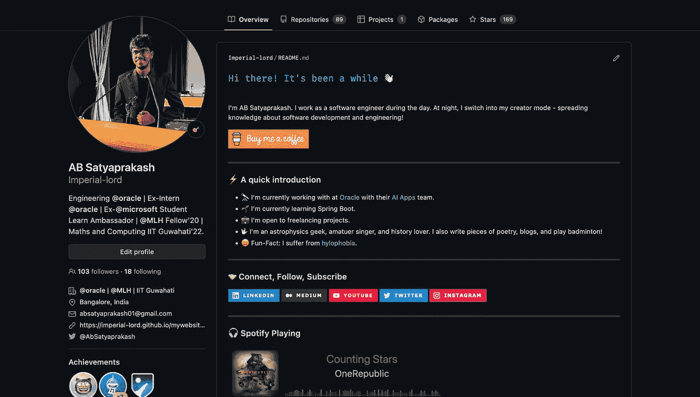
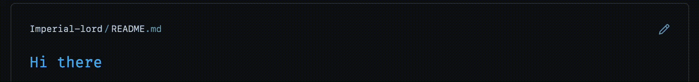
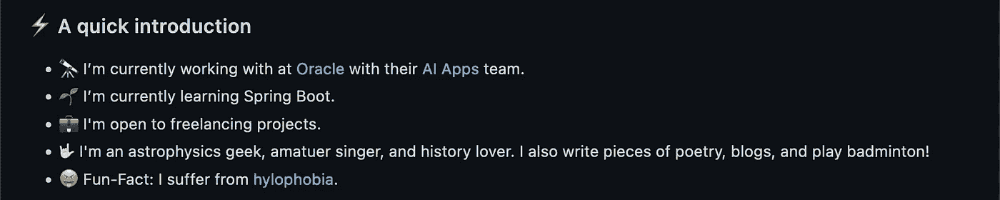
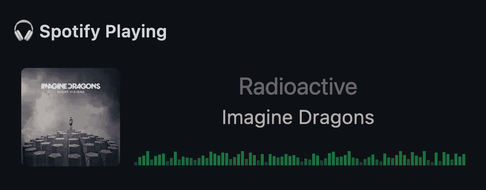
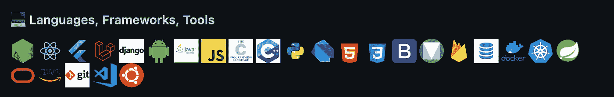
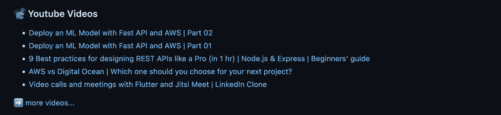
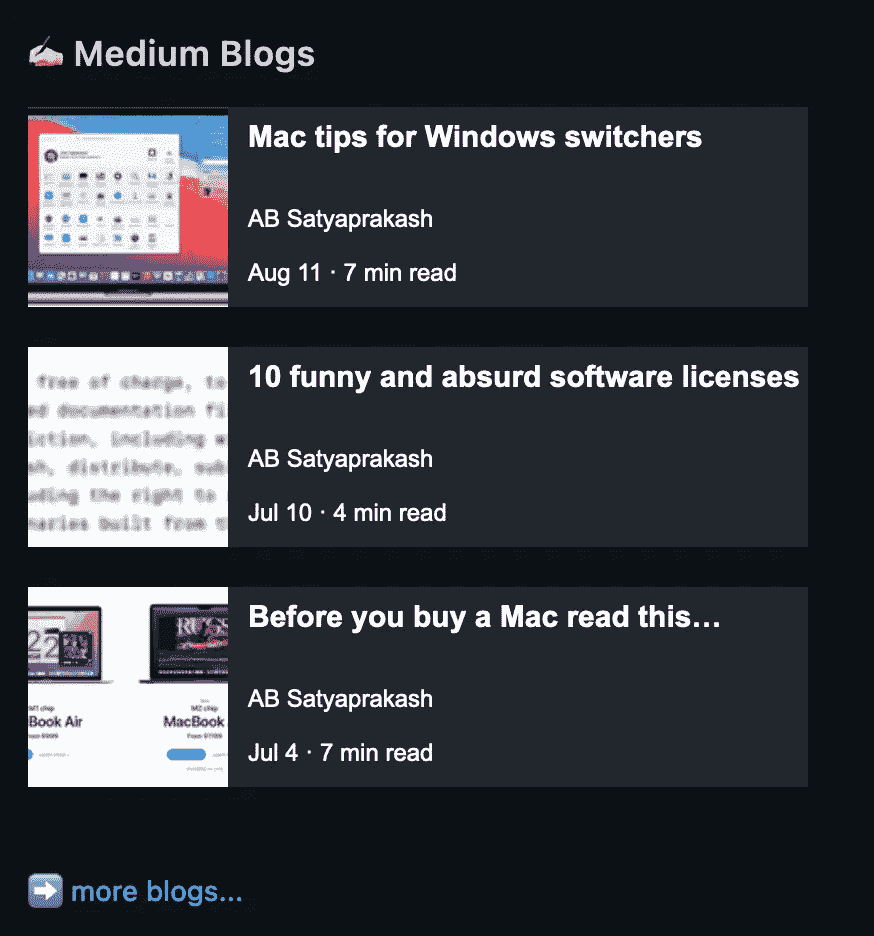
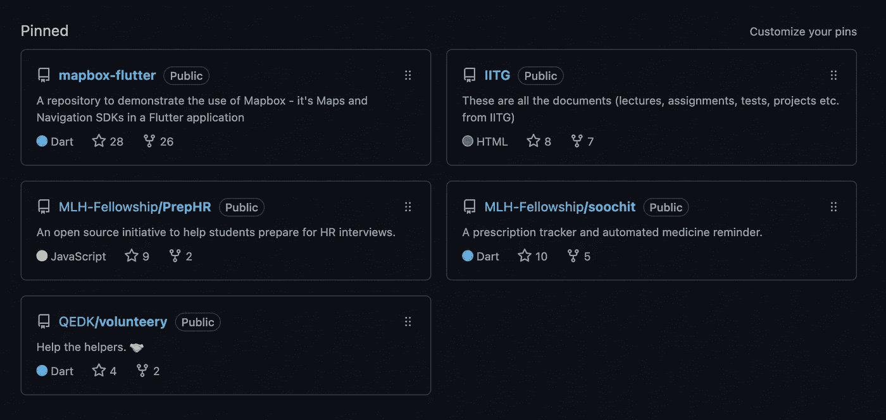

# 用 10 个步骤像专业人士一样建立你的 GitHub 公共档案

> 原文：<https://medium.com/nerd-for-tech/build-your-github-public-profile-like-a-pro-in-10-steps-552876aa26c9?source=collection_archive---------0----------------------->

## 创造一个惊人的脱颖而出的自述

如果你称自己为开发者，你可能听说过 [GitHub](https://medium.com/u/8df3bf3c40ae?source=post_page-----552876aa26c9--------------------------------) 。这是一个数百万开发者共同塑造软件未来的地方。几年前，GitHub 引入了**公共档案**的概念，这是一个与你的用户名同名的独特存储库，其*自述*内容显示在你的档案页面上。

在这篇文章中，我将向你展示我是如何建立自己的公众形象的。我还将带您浏览不同的部分，并提供更多的资源供您探索。

> 哦，顺便说一下，在我写这篇博客的时候，我在 GitHub 上的关注者终于达到了 100+(准确地说是 103 个)!🤩



我在其他地方没有那么多追随者。不要害怕！😂

# 为什么这很重要？

让我们先来解释一下为什么你需要在 GitHub 上有一个体面的(如果不是花哨的)公众形象。这些是最有可能的原因，按照可能性递减的顺序—

1.  你是个书呆子。🤓别担心，你不是一个人！
2.  您意识到许多人，包括招聘人员和寻找自由职业者的客户，都会访问您的 GitHub 个人资料来查看您的工作。你需要一些钱。💸
3.  你想在建立个人档案的过程中学习新的东西。

反正我不介意帮你达到目的，那就这样吧！🚀

# 偷偷摸摸的高峰

这是我的[个人资料](https://github.com/Imperial-lord)的样子。如果您滚动阅读，自述文件中有更多的组件，但是不要担心，我们会涵盖所有这些内容。



# 1.问候你的生命伙伴

第一个组件只是以一种奇特的方式迎接游客。



它是一个动态生成的、可定制的 SVG，提供键入和删除文本的外观。您可以使用一个简单的生成的减价将它添加到您的个人资料中。有关更多详细信息，请查看下面的存储库。

[](https://github.com/DenverCoder1/readme-typing-svg) [## github-denvercoder 1/readme-typing-svg:⚡动态生成的可定制 SVG，它提供了…

### ⚡动态生成，可定制的 SVG，给出了打字和删除文本的外观。键入 SVG 可以…

github.com](https://github.com/DenverCoder1/readme-typing-svg) 

# 2.快速介绍—描述和咖啡

在下一部分，我用几句话描述一下自己，并附上*给我买杯咖啡*链接作为按钮。


这是相同的 HTML。您可以将其粘贴到您的自述文件中。

```
<a href="[https://www.buymeacoffee.com/absatyaprakash](https://www.buymeacoffee.com/absatyaprakash)" target="_blank"></a>
```

一定要把锚标签上的`href`改成你的网址，否则我会收到给你的捐款，当然我不会介意！😂

# 3.快速介绍—项目符号

在这一部分，你可以用表情符号发挥创意，用更吸引眼球的方式向访客介绍自己。



> 此外，如果你想知道你可以利用`---`在你的降价部分之间添加一个水平分隔线。

# 4.连接、关注、订阅

这是将人们重定向到你的社交把手的部分，以便他们联系或关注你的工作。


你可以从 [shields.io](https://shields.io/) 那里建造一个徽章。这是我的 LinkedIn 徽章在 Markdown 中的样子。

```
[](https://www.linkedin.com/in/absatyaprakash/)](https://img.shields.io/badge/LinkedIn-0077B5?style=for-the-badge&logo=linkedin&logoColor=white)](https://www.linkedin.com/in/absatyaprakash/))
```

> 在一个完全不相关的注意事项上，你可以前往本文的结尾，找到所有的社会链接来关注我😇

# 5.Spotify 播放

我喜欢音乐。如果你们有相似的兴趣，那么你可能想让人们知道你的音乐品味🎶。

> 谁知道这会不会给你带来暗恋对象的信息🤷🏻‍♂️



是的，我是❤️的粉丝

这是一个稍微复杂的步骤，你可以访问下面的链接来了解如何操作。如果你更喜欢水平卡，看第二个库。虽然这可能会暴露你肮脏的音乐小秘密，但还是要小心处理。

1.  [https://github.com/novatorem/novatorem](https://github.com/novatorem/novatorem)
2.  [https://github . com/abhisheknaidu/awesome-github-profile-readme](https://github.com/abhisheknaiidu/awesome-github-profile-readme)

# 6.语言、框架、工具

如果你是一个经验丰富的开发人员，你会有很多不同的技术堆栈的经验。为了以简洁的方式展示它们，我使用了这一节。



这些实际上都是取自 GitHub topics 的图片。这是 HTML。

```
<p float="left"><!-- and more such images with different URLs in src --></p>
```

# 7.YouTube 视频

接下来，是我的 YouTube 频道上最新的 5 个视频。我已经添加了更多视频的链接，直接指向我的频道。



这样做也有点复杂，但请耐心听我说。以下是步骤:

*   首先，把它放在你的自述文件中你希望视频列表出现的地方。

```
<!-- YOUTUBE:START -->
<!-- YOUTUBE:END -->
```

*   然后在`.github/workflow`中创建一个名为`youtube-workflow.yml`的工作流，内容如下:

*   最后，运行一次工作流来更新自述文件。该工作流使用 cron 作业每小时获取视频。

# 8.中型博客

我经常在媒体上写博客，所以在这里展示它们也没什么坏处。此外，你可能会在我的个人资料上看到不同的博客，这取决于你阅读这篇博客的时间。



为了展示这一点，您可以参考下面的存储库。

[](https://github.com/omidnikrah/github-readme-medium) [## GitHub-omidnikrah/GitHub-readme-medium:📖动态生成您最新的媒体文章…

### 📖在你的阅读器上展示你最新的媒体文章！将以下减价内容复制粘贴到您的减价内容中，然后…

github.com](https://github.com/omidnikrah/github-readme-medium) 

这就像在你的自述文件中添加一行 markdown 一样简单。

```
[](https://medium.com/@absatyaprakash)](https://github-readme-medium.vercel.app/?username=absatyaprakash&limit=3)](https://medium.com/@absatyaprakash))
```

# 9.GitHub 统计

这个你可能已经听说过了。拥有超过 44k 颗恒星的⭐️，这里是一个值得一看的宝库。它也有许多不同的卡片给你看。

[](https://github.com/anuraghazra/github-readme-stats) [## GitHub-anuraghazra/GitHub-readme-stats:为您的 github readmes 动态生成统计数据

### 获取动态生成的 GitHub 统计数据！查看演示报告 Bug 请求功能提问爱…

github.com](https://github.com/anuraghazra/github-readme-stats) 

# 10.固定项目

有一些自己引以为豪的项目？将它们钉在您的个人资料上，让全世界都知道。这是我的一组固定存储库。



# 遗言…

我喜欢保持事情*的优雅和稍微最小化*。根据你的个性，你也可能喜欢一些华丽的东西。该存储库

[](https://github.com/abhisheknaiidu/awesome-github-profile-readme) [## GitHub-abhisheknaidu/awesome-GitHub-profile-readme:😎令人敬畏的 GitHub 简介的精选列表…

### 代码模式👨🏽‍💻随时欢迎投稿！请先阅读投稿指南。在某种程度上…

github.com](https://github.com/abhisheknaiidu/awesome-github-profile-readme) 

会帮助你找到其他令人敬畏的个人资料的灵感。还有一堆工具和文章供你遵循。

今天就到这里，另文再见！

如果您有任何问题或建议，请随时联系我。您可以在这些社交媒体平台上关注我— [LinkedIn](https://www.linkedin.com/in/ab-satyaprakash/) 、 [YouTube](https://www.youtube.com/channel/UCJ6D0HS8c9Il-eX5lGbAyGg) 、 [Twitter](https://twitter.com/AbSatyaprakash) 、 [Instagram](https://www.instagram.com/absatyaprakash/) 了解更多更新内容！

**一如既往！黑客快乐！😇**

[加入我的电子邮件列表，获得更多精彩的教程和编程博客](https://absatyaprakash01.medium.com/subscribe) ❤️