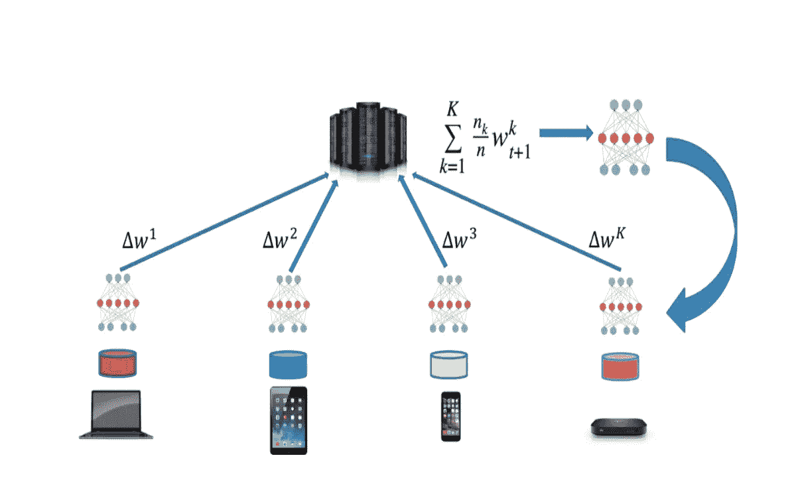
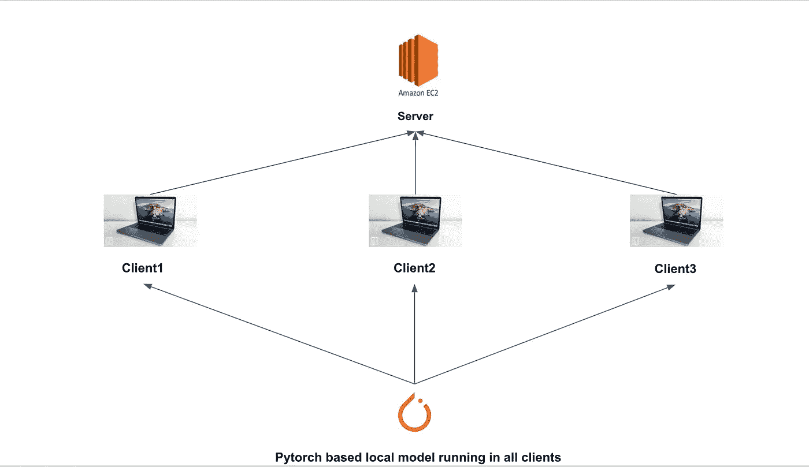

# 花卉概论。

> 原文：<https://medium.com/nerd-for-tech/build-your-own-federated-learning-model-2c882ea8cfde?source=collection_archive---------3----------------------->

在我早先的[帖子](https://ankitasinha0811.medium.com/beginners-guide-to-federated-learning-d529557a1b1e)中，我从广泛的层面上介绍了什么是联合学习。在这里，我将带你了解如何使用一个叫做[花](https://github.com/adap/flower)的框架来建立你自己的基于联合学习的模型。

我们将着眼于跨设备和异步设计。这与 [GBoard](https://ai.googleblog.com/2017/04/federated-learning-collaborative.html) 和 [Siri](https://www.technologyreview.com/2019/12/11/131629/apple-ai-personalizes-siri-federated-learning/) 非常相似，在这种情况下，本地模型驻留在边缘设备(你的手机/ mac)上。



联合学习

让我们直接进入构建您自己的模型所需的组件。联邦学习系统需要两个部分

1.  计算机网络服务器
2.  客户。

数据科学家可以完全控制服务器。服务器托管聚合逻辑，并确保所有设备都具有最新和更新的模型参数。

客户端(设备)有一个在本地数据上运行的本地模型。

在我们的用例中，我们将遵循以下步骤。

1.  我们将构建一个简单的基于 pytorch 的神经网络模型来读取图像并对其进行分类。
2.  我们将首先在客户端的本地数据上训练模型。让我们从 3 个设备开始，因此我们在 3 个独立的设备中有 3 个本地运行的模型。
3.  一旦我们的模型被训练并且我们有了我们的模型参数，我们试着与服务器连接。
4.  然后，服务器根据某种策略接受或拒绝连接邀请。这里我们将简单地使用先来先服务的策略。
5.  如果连接成功，客户端会将模型参数发送给服务器。
6.  服务器等待所有 3 个模型参数，然后聚合它们，从而利用所有模型中的所有数据。
7.  这可以在我们想要训练数据的任意多个时期发生。
8.  然后，服务器将更新的权重参数发送回客户端。
9.  客户端现在将使用权重进行图像分类。



让我们创建一个文件 caller server.py，并添加以下几行:

```
import flwr as fl

# Start Flower server for three rounds of federated learning
if __name__ == "__main__":
    strategy = fl.server.strategy.FedAvg(
        fraction_fit=0.1,
        min_available_clients=3
)fl.server.start_server("[::]:8080", config={"num_rounds": 3}, , strategy=strategy)
```

这就是我们启动一个绑定到本地主机的服务器所需的全部内容。战略是我们的政策。Num_rounds 指定训练将持续 3 轮。根据先连接的设备，每轮可以有不同的客户端集。fraction_fit 在每轮中对所有可用客户端的 10%进行采样。min_available_client 是训练开始时需要连接的最小客户端数量。在这里，您可以找到定义策略的各种方法[。](https://github.com/adap/flower/blob/71f8226f2fb56d0624427f358b6805408945cd95/doc/source/strategies.rst)

您可以在 EC2 或 Sagemaker 的 AWS 中托管您的 server.py。或者在你自己的工作站上运行。

现在让我们写我们的客户。你可以在这里找到 colab 笔记本[，在这里](https://colab.research.google.com/drive/1Gpc_ie2b126476DKRDT4OHe50tIAm7N5?usp=sharing)找到 git [上的代码。Flwr 是基于 GRPC，这是没有在免费的 collab 版本。您可以创建一个 docker 实例或在您的工作站上运行它。](https://github.com/anki08/Build-your-own-Federated-Learning-model)

非基于 FL 的 ANN 和 FL 之间的唯一区别在于连接到服务器并获得更新的权重。我们将在这里查看笔记本的联合学习部分。

```
class CifarClient(fl.client.NumPyClient):def get_parameters(self):
    return [val.cpu().numpy() for _, val in   net.state_dict().items()]def set_parameters(self, parameters):
    params_dict = zip(net.state_dict().keys(), parameters)
    state_dict = OrderedDict({k: torch.Tensor(v) for k, v in params_dict})
    net.load_state_dict(state_dict, strict=True)def fit(self, parameters, config):
    self.set_parameters(parameters)
    train(net, trainloader, epochs=1)
    return self.get_parameters(), len(trainloader), {}def evaluate(self, parameters, config): self.set_parameters(parameters) loss, accuracy = test(net, testloader) return float(loss), len(testloader), {"accuracy": accuracy}
```

这是实现 flowr 的最重要的类。这个功能—

1.  get_parameters:将模型参数作为 NumPy ndarrays 列表返回给服务器。
2.  set_parameters:从 NumPy ndarrays 列表中设置客户端中的模型参数。
3.  fit:设置模型参数，在客户端训练模型，并将更新后的模型参数返回给服务器。
4.  评估:设置模型参数，评估客户端本地测试数据集上的模型，并将结果返回给服务器。

现在，您可以运行最后一个单元，并检查您的模型的准确性如何受到集中训练的影响。(确保有 3 个 client.py 副本，因为我们提到了 min_available_clients = 3。

参考资料:

[](https://flower.dev/docs/installation.html) [## 安装花卉

### Flower 需要 Python 3.6 或以上版本。PyPI 上提供了稳定版本:最新的(潜在的不稳定)变更…

花卉. dev](https://flower.dev/docs/installation.html) 

【https://github.com/adap/flower 