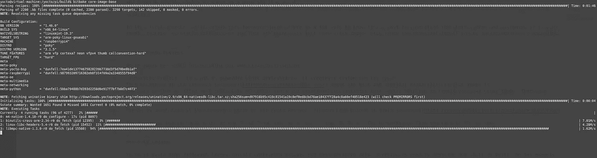
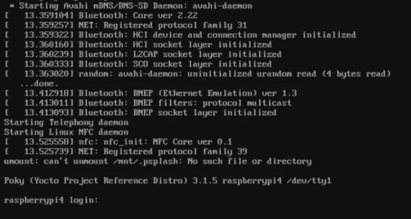

# 为 Raspberry Pi 构建您自己的 Linux 映像

> 原文：<https://medium.com/nerd-for-tech/build-your-own-linux-image-for-the-raspberry-pi-f61adb799652?source=collection_archive---------0----------------------->



树莓派和类似的单板电脑现在很流行。可能性几乎是无穷无尽的。从家庭服务器到媒体站再到物联网项目，应有尽有。使它如此易于使用的两个因素可能是大的社区和像 Raspian 这样的准备启动的 SD 卡图像。从网上抓取最新的图片并在 SD 卡上闪存是最简单快捷的开始方式。如果你只是想玩玩你的覆盆子或者自己做一个一次性项目，这没有什么不好。但是如果你曾经试图在不同的甚至多个系统上复制你的系统，事情就变得复杂了。如果您关心图像的大小和安全性，事情会变得更加复杂。不要认为我能够向你展示一个安全的 Linux 系统的解决方案。但是建立你自己的形象并确切地知道里面有什么是一个很好的起点。最后但并非最不重要的是，学习更多关于 Linux 如何工作的知识，并且能够说，你已经从零开始构建了你自己的 Linux，这是很有趣的。

在第一篇文章中，我们不会做太深入的探讨。如果你想了解整个系统并根据你的需要定制它，还有很多东西需要了解。相反，我们希望快速成功，并开始制作你的第一张图片。如果你有兴趣深入研究，请继续关注更多文章。

# Yocto 项目

我们将使用 Yocto 来构建我们自己的 Linux 发行版。

“Yocto 项目。它不是嵌入式 Linux 发行版，而是为您创建一个自定义发行版。”官方[网站](https://www.yoctoproject.org/)上的这句话可能是对 Yocto 的最好和最短的描述。您必须将 Yocto 看作是一个有用的工具和配置工件的集合，它真正帮助您创建自己的 Linux 映像。还有其他选择，但 Yocto 可能是最受欢迎的选择之一。

为了深入了解 Yocto 项目的不同部分，你可以看看他们的[网站](https://www.yoctoproject.org/software-overview/)。

我们第一张图片接触到的东西是`meta layers`和`BitBake`。这两样东西构成了系统的核心。

# 元层

Yocto 构建在不同的层上，主要包含配方和配置数据。配方是用来描述东西是如何制造的。例如，它包含从哪里下载 Linux 内核的源代码，以及使用哪些命令和工具来正确编译它。例如，使用配置数据来描述 Raspberry Pi 使用的架构，以便配方知道针对哪个目标进行编译。这可能过于简单了，但是知道你需要正确的`meta layers`用于你的目标系统可能就足够了。在这些内部，构建系统需要的一切都是可用的。

# 比特贝克

BitBake 是构建的核心命令行工具。它最初是 OpenEmbedded 项目的一部分，但现在是由 Yocto 项目和 open embedded 项目维护的一个独立工具。

# 设置构建系统

现在是时候树立你的第一个形象了。设置构建环境的步骤相当简单，但是您需要一些时间来完成构建。这就是从头构建 Linux 映像的缺点。一切都必须建立，这是 CPU，内存和硬盘密集型。在普通电脑上，可能需要 8 个小时。但是不要担心，在第一次构建完成后，Yocto 良好的缓存算法就会发挥作用，并且只构建新的和更改过的内容。计算机上的最小可用磁盘空间必须至少为 50 GB。(作为参考:我在大约 1 小时内在一个 16 核 AWS 云实例上构建了这个映像。构建时间严重依赖于 CPU 能力和下载速度。更多关于在云中构建 Yocto 映像的主题可能会在后续文章中出现。)

你可以在 yocto 项目的[大型手册](https://www.yoctoproject.org/docs/3.1/mega-manual/mega-manual.html#detailed-supported-distros)中找到官方测试的 Linux 发行版作为构建系统主机的列表。它也适用于其他发行版，但是您可能会遇到意想不到的问题。对于本文中的所有例子，我将使用 Ubuntu 18.04 LTS。

第一步是安装 Yocto 的先决条件。这个命令在 Ubuntu 或 Debian 上安装所有的包。你可以在[大型手册](https://www.yoctoproject.org/docs/3.1/mega-manual/mega-manual.html#required-packages-for-the-build-host)中找到其他例子。

# 获取元层

所有元层通常都可以通过 git 获得。现在不要担心，如果你不知道 git 是什么意思。我们现在只使用一个命令。`git clone`命令从互联网上获取存储库。我们使用的`-b dunfell`开关指定要获取哪个版本。在撰写本文时，`dunfell`版本是具有长期支持的最新版本。请参见[https://wiki.yoctoproject.org/wiki/Releases](https://wiki.yoctoproject.org/wiki/Releases)了解最新版本的概述。

在获得任何元层之前，我们将为所有元层创建一个名为`yocto`的项目文件夹和一个名为`source`的文件夹。

```
mkdir yocto
cd yocto
mkdir sources
```

我们一直需要的元层很小。它包含了 yocto 工作的所有基本内容。我们通过执行下面的 git 命令来获得它。

```
git clone git://git.yoctoproject.org/poky -b dunfell
```

对于 Raspberry Pi，有一个制作精美的元层，其中包含运行 Raspberry Pi 所需的所有定义。我们用这个命令得到它。

```
git clone git://git.yoctoproject.org/meta-raspberrypi -b dunfell
```

元层总是声明它们依赖于哪个元层。 [meta-raspberrypi](http://git.yoctoproject.org/cgit/cgit.cgi/meta-raspberrypi/tree/README.md?h=dunfell) 的 readme 声明我们需要 poky，我们已经有了，还有`meta-openembedded`。这个元层本身被分成多个层。我们通过这个命令得到它们。

```
git clone [https://git.openembedded.org/meta-openembedded](https://git.openembedded.org/meta-openembedded) -b dunfell
```

这些都是我们需要的元层。让我们回到项目文件夹，初始化构建环境。

```
cd .. 
. sources/poky/oe-init-build-env
```

我们几乎准备好建立我们的第一个图像。我们只需要编辑两个配置文件。

`conf`文件夹中的`bblayers.conf`文件包含了我们将要使用的元层的所有路径。

```
nano conf/bblayers.conf
```

最后但同样重要的是，`conf`文件夹中的`local.conf`文件确实包含一些基本配置，以及对我们来说最重要的构建机器的名称。如果我们想为树莓 Pi 4 构建，我们使用`raspberrypi4`，为树莓 Pi 3 构建`raspberrypi3`。这是使用 Yocto 的一大好处。只需更改一个配置行，为另一个系统构建相同的映像。

```
nano conf/local.conf[...]MACHINE ?= "raspberrypi4"[...]
```

完成所有这些步骤后，是时候开始实际的构建了，在我们等待它完成的时候，喝点(或多杯)咖啡。

```
bitbake core-image-base
```

恭喜你！您已经为 Raspberry Pi 构建了第一个 Linux 映像。你会在`tmp/deploy/images/repberrypi4/core-image-base-raspberrypi4.wic.bz2`下找到完整的图像，这个文件是压缩的。要解压它，使用`bzip2`命令或类似`7zip`的工具。

```
bzip2 -d -f tmp/deploy/images/raspberrypi4/core-image-base-raspberrypi4.wic.bz2
```

你只需要像其他 Raspian 映像一样把它闪存到 SD 卡上，就可以启动了。[https://www . raspberrypi . org/documentation/installation/installing-images/](https://www.raspberrypi.org/documentation/installation/installing-images/)



默认情况下，用户名为 root，密码为空。

# 后续步骤

我希望你为自己归档了这个里程碑而感到骄傲。Yocto 是一个强大的工具，还有很多东西需要学习。如果您想了解更多信息，请关注我，这样您就不会错过 Yocto 的下一篇文章。

在那之前，我会试着给你一个搜索的起点，让你自己继续了解 Yocto。如果你需要在你的图像中添加一个额外的软件，首先从 [OpenEmbedded Layer Index](https://layers.openembedded.org/layerindex/branch/dunfell/recipes/) 开始。在那里，您可以搜索包含软件配方的元层。下载图层并将其添加到您的`bblayers.conf`，如果还没有的话。然后将食谱的名称添加到`local.conf`文件的`IMAGE_INSTALL_append`中。

```
IMAGE_INSTALL_append = " nano"
```

重建你的形象，闪现它，你就可以开始了。