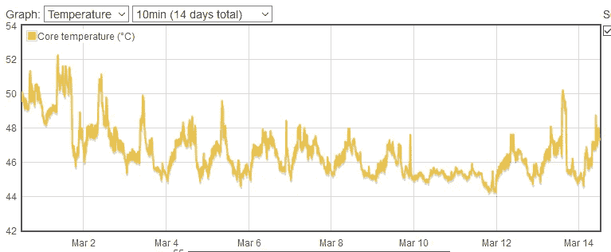

# 用 Linux 构建自己的 Spotify

> 原文：<https://medium.com/nerd-for-tech/build-your-own-spotify-with-linux-d46aa96c251e?source=collection_archive---------3----------------------->

我离开家的时间越来越多，我想把我的音乐带在身边，没有广告或跟踪。


Jellyfin 为我提供了一个很好的音乐流媒体服务的替代品

# 为什么要这么做？

我实际上不使用 Spotify，我使用 Apple Music 来满足我的流媒体音乐需求。我是一个 iPhone 用户，跳槽了，但仍然订阅了苹果音乐，因为我积累了所有的播放列表。今年夏天，作为一个项目，我用一些备用零件(一个树莓派 3B+和一个 USB 1 TB 笔记本电脑硬盘)建造了一个 [Jellyfin](https://jellyfin.org/) 服务器，这非常令人惊讶。这不是理想的设置，3B+缺乏千兆以太网，USB 3.0，以及有效处理流媒体视频的处理器和内存，尽管我确实看了很多视频。然而，它可以毫无问题地处理我的大量音乐库。我以前做过 DJ，收集音乐。我有很多从黑胶唱片上撕下来的专辑。我的数字音乐收藏在 1.1k 左右的专辑。我想通过互联网访问它，这样我就不需要为流媒体音乐付费了。此外，我所听到的将是我和我的服务器之间，没有第三方。

# 这个计划

我不能一直用 3B+，是时候买个 Pi 4B 了。我还需要添加一个代理、一个证书和一个动态 DNS 名称。我订购了一个 Pi 4B、一个 Flirc 外壳和一个带有 USB 3.0 外部外壳的 2 TB 3.5 英寸驱动器。我已经和几个提供商建立了动态 DNS，我建议你也这样做。我为这个项目添加了一个子域到我的 [Dynu](https://www.dynu.com/en-US/) DDNS 配置中。我用 Rasbian Lite 闪存了一个 Micro SD，[为 Nginx](https://engineerworkshop.com/blog/setup-an-nginx-reverse-proxy-on-a-raspberry-pi-or-any-other-debian-os/) 配置了一个备用的 3B+。Pi 4B 一到，我就把它安装在 Flirc 的盒子里，把我所有的数据从旧的 Jellyfin 服务器转移到新的硬盘上，然后把 Jellyfin 安装在 Pi 4B 上。Jellyfin 的文档说主动冷却被推荐用于 Pi 4B，但是他们参考了 Jeff Geerling，并且[他推荐 Flirc 用于大多数用途](https://www.jeffgeerling.com/blog/2019/best-way-keep-your-cool-running-raspberry-pi-4)。


Flirc 的案子很漂亮。

# 把所有的放在一起

我在 Reddit 上找到了这个在 Pi 4B [上安装 Jellyfin 的伟大指南。一旦我在本地测试了我的 Jellyfin 服务器，我就必须配置我的 Ngnix 代理。将 80 和 443 从我的路由器转发到我的 Nginx 代理后，我需要一个证书，所以我安装了 docker 和 docker-compose 并使用了](https://www.reddit.com/r/jellyfin/comments/ei6ew6/rpi4_hardware_acceleration_guide/) [SWAG](https://github.com/linuxserver/docker-swag/blob/master/README.md) 。我只是需要证书，所以我配置了 docker-compose.yml 并运行`docker-compse up`来观察输出。一旦我有了证书，我就停止了集装箱。证书的有效期是三个月，所以我必须停止 Nginx 并再次运行 docker 来更新它。然后我需要一个代理配置。Jellyfin docs 上的那个对我不起作用，所以我用这个来研究我的问题。

```
server {
    server_name TV.EXAMPLE.COM;
    listen 443 ssl http2; # managed by Certbot

    access_log /var/log/nginx/TV.EXAMPLE.COM.access.log;
    error_log /var/log/nginx/TV.EXAMPLE.COM.error.log;

    ssl_certificate /etc/letsencrypt/live/TV.EXAMPLE.COM/fullchain.pem; # managed by Certbot
    ssl_certificate_key /etc/letsencrypt/live/TV.EXAMPLE.COM/privkey.pem; # managed by Certbot
    include /etc/letsencrypt/options-ssl-nginx.conf; # managed by Certbot
    ssl_dhparam /etc/letsencrypt/ssl-dhparams.pem; # managed by Certbot
    ssl_trusted_certificate /etc/letsencrypt/live/TV.EXAMPLE.COM/chain.pem;
    ssl_stapling on;
    ssl_stapling_verify on;
    add_header Strict-Transport-Security "max-age=31536000" always;# Security / XSS Mitigation Headers
    add_header X-Frame-Options "SAMEORIGIN";
    add_header X-XSS-Protection "1; mode=block";
    add_header X-Content-Type-Options "nosniff";# Content Security Policy
    # See: [https://developer.mozilla.org/en-US/docs/Web/HTTP/CSP](https://developer.mozilla.org/en-US/docs/Web/HTTP/CSP)
    # Enforces https content and restricts JS/CSS to origin
    # External Javascript (such as cast_sender.js for Chromecast or YouTube embed JS for external trailers) must be whitelisted.
    add_header Content-Security-Policy "default-src https: data: blob:; style-src 'self' 'unsafe-inline'; script-src 'self' 'unsafe-inline' [https://www.gstatic.com/cv/js/sender/v1/cast_sender.js](https://www.gstatic.com/cv/js/sender/v1/cast_sender.js) [https://www.youtube.com/iframe_api](https://www.youtube.com/iframe_api) [https://s.ytimg.com](https://s.ytimg.com); worker-src 'self' blob:; connect-src 'self'; object-src 'none'; frame-ancestors 'self'";

    location ~ /.well-known {
        allow all;
    }
    location / {
        # Proxy main Jellyfin traffic
        proxy_pass [http://192.168.1.54:8096/](http://192.168.1.54:8096/);
        proxy_set_header Host $host;
        proxy_set_header X-Real-IP $remote_addr;
        proxy_set_header X-Forwarded-For $proxy_add_x_forwarded_for;
        proxy_set_header X-Forwarded-Proto $scheme;
        proxy_set_header X-Forwarded-Protocol $scheme;
        proxy_set_header X-Forwarded-Host $http_host;# Disable buffering when the nginx proxy gets very resource heavy upon streaming
        proxy_buffering off;
    }
    location /socket {
        # Proxy Jellyfin Websockets traffic
        proxy_pass [http://192.168.1.54:8096/socket](http://192.168.1.54:8096/socket);
        proxy_http_version 1.1;
        proxy_set_header Upgrade $http_upgrade;
        proxy_set_header Connection "upgrade";
        proxy_set_header Host $host;
        proxy_set_header X-Real-IP $remote_addr;
        proxy_set_header X-Forwarded-For $proxy_add_x_forwarded_for;
        proxy_set_header X-Forwarded-Proto $scheme;
        proxy_set_header X-Forwarded-Protocol $scheme;
        proxy_set_header X-Forwarded-Host $http_host;
    }
}
server {
    if ($host = TV.EXAMPLE.COM) {
        return 301 [https://$host$request_uri](https://$host$request_uri);
    } # managed by Certbotlisten 80;
    server_name TV.EXAMPLE.COM;

    return 404; # managed by Certbot
}
```

我需要一个`options-ssl-nginx.conf`，所以[我在这里找到了一个例子](https://gist.github.com/cecilemuller/a26737699a7e70a7093d4dc115915de8)。我稍微修改了一下，从 ssl_protocols 中删除了 TLSv1。我启动了 Nginx 服务，一切正常。我可以通过我配置的 DDNS URL 查看我的 Jellyfin 服务器。我用 [digicert 测试页面](https://www.digicert.com/help/)测试了我的 SSL 配置，一切都测试良好。我在手机上重新配置了 [Gelli](https://f-droid.org/en/packages/com.dkanada.gramophone/) ,使用 DDNS 网址和我在 Jellyfin 服务器上创建的一个允许外部登录的登录名。我可以登录并在 4G LTE 上看到我的音乐。所以我点击了播放，并且成功了。

# 这有回报吗？

从那以后，我在步行和乘火车去市中心的办公室时都用手机打电话。我已经从办公室的工作网络浏览器登录到我的服务器。它非常成功，我取消了苹果音乐订阅，卸载了应用程序。所有我喜欢的音乐都可以在我的手机上找到，而且我有数百千兆字节的空间来存放新音乐。Pi 4B 在转码和散热方面的表现也非常出色。这得到了回报。这不是一个容易的项目，但如果你有音乐收藏，我会推荐它。在电视上看你最喜欢的老动漫也很棒。



14 天内 Pi 4B 的核心温度