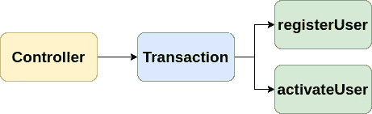

# 使用生态区轻松构建您的 Symfony 和学说 ORM 应用程序

> 原文：<https://medium.com/nerd-for-tech/build-your-symfony-applications-with-ease-using-ecotone-f7bcaa11b5c4?source=collection_archive---------0----------------------->


在本文中，我们将把 Symfony 应用程序的重构推向极限。我们将专注于完全删除样板文件，这样我们就可以只编写重要的代码，使我们能够轻松修改、维护和未来扩展。

我们将从示例功能开始，我们将通过用 Ecotone 扩展我们的 Symfony 应用程序来逐步重构它。
准备一杯好咖啡或茶，享受旅程:)

# 出发点

我们的应用程序将有两个功能:-注册新用户-注册完成后激活用户

我们的*用户控制器*收到请求，调用*用户服务*注册新用户。

我们的用户服务，开始事务并使用实体管理器存储实体。

这就是我们的*用户*的样子。

在我们开始之前，让我们为 Symfony 安装生态区:

> *作曲要求* [*交错带/*](https://packagist.org/packages/ecotone/)*symfony-bundle*

# 丢弃冗余事务管理

伤眼的是交易管理。我们正在为每个动作( *registerUser* ， *activateUser* )做这件事，将来的动作也需要它。让我们移除样板文件并将其放在一个地方。

为此，我们将构建一个管道，在运行任何操作之前，我们将处理事务。



让我们首先将我们的动作注册为[命令处理程序](https://blog.ecotone.tech/cqrs-in-php/)。这将允许我们通过将它们封装在事务中来拦截它们的执行。

> *如果你熟悉 Symfony Messenger，你就知道消息处理程序的概念。
> 命令处理程序是更高层次的概念，描述了负责改变数据或提供副作用(如发送电子邮件)的消息处理程序。*

为了执行命令处理程序，我们需要用*控制器*中的*命令总线*替换我们的*用户服务*。

```
$this->commandBus->sendWithRouting("registerUser", $name);
```

该执行命令处理程序以名称*“register user”注册。*第二个参数是有效载荷，它将作为*第一个参数*传递给我们的处理程序。

> *在这个例子中，有效载荷实际上是一个单一的参数。我们可以很容易地提供数组或对象。生态区让你自由选择，看你的喜好和需求。*

现在让我们将命令处理程序包装在事务中:

```
#[Around(pointcut: CommandHandler::class)]
public function transactional(MethodInvocation $methodInvocation)
```

周围是[拦截器](https://docs.ecotone.tech/modelling/interceptors)，它允许我们在执行处理程序之前和之后添加逻辑。这对于交易之类的事情非常有用。
*切入点*告诉我们要拦截什么。在这个场景中，我们截获了所有的命令处理程序。
为了继续命令处理程序调用，我们使用了*$ method invocation->proceed()；*

# 推向极限

让我们比较激活方法和新的停用方法。

如果你仔细观察，你会看到样板代码:

```
/** @var User $user */
$user = $this->entityManager->find(User::class, $id);// Run some action on the user$this->entityManager->persist($user);
```

为了获取用户并保持更改，我们需要创建单独的类和方法，我们想要做的就是对用户执行方法。如果我们可以直接调用实体的方法，不是更简单吗？幸运生态区解决了这个问题，因为我们被允许将实体标记为命令处理程序。

为了获得对学说 ORM 的支持，我们将安装[econtero Dbal](https://docs.ecotone.tech/modules/dbal-support):

```
# install ecotone/dbal:
composer require ecotone/dbal # Add in services.yaml, so Ecotone can discover database connection:
Enqueue\Dbal\DbalConnectionFactory:
 factory: ['Ecotone\Dbal\DbalConnection','createForManagerRegistry']   
 arguments: [ "@doctrine","default" ]
```

> *如果安装了*[*econtero/dbal*](https://docs.ecotone.tech/modules/dbal-support)*，则默认处理事务管理。您可以移除 TransactionWrapper。*

我们需要为生态交错区启用理论 ORM 存储库:

现在，我们准备用命令处理程序来标记我们的用户实体:

1.  在生态交错区，我们称实体为 *#【集合体】*
2.  就像教条 ORM 一样，我们需要标记标识符 *#【聚合标识符】*
3.  并且我们将方法标记为命令处理程序:*#【Command handler(" activate user ")】*

我们需要在控制器中做的唯一更改是告诉 activate 方法实体的标识符:

```
$this->commandBus->sendWithRouting("activateUser", $id, metadata: ["aggregate.id" => $id]);
```

# 摘要

我们丢弃了所有的样板代码，只在应用程序中留下了业务逻辑代码。现在，我们可以用最少的代码和测试来开发新的功能。
所有的胶水代码都被移到了 econtero 和 Symfony，让我们专注于重要的事情。

如果你想获得更多关于框架的信息，请访问 main[econtero Github](https://github.com/ecotoneframework/ecotone)。如果你想看这篇文章中描述的东西的实现，请访问[示例应用](https://github.com/ecotoneframework/php-ddd-cqrs-event-sourcing-symfony-ecotone)。