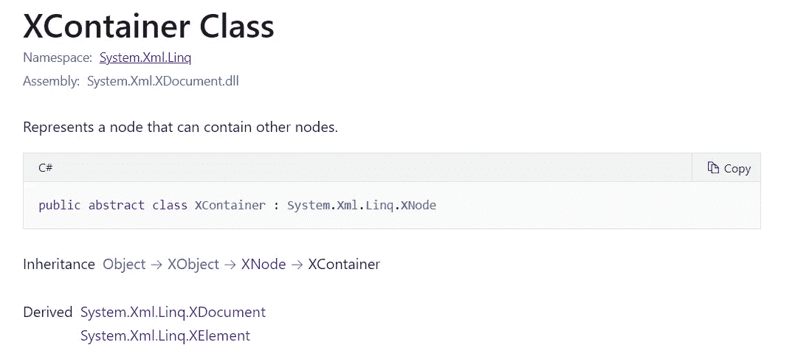
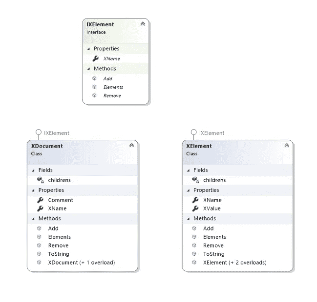
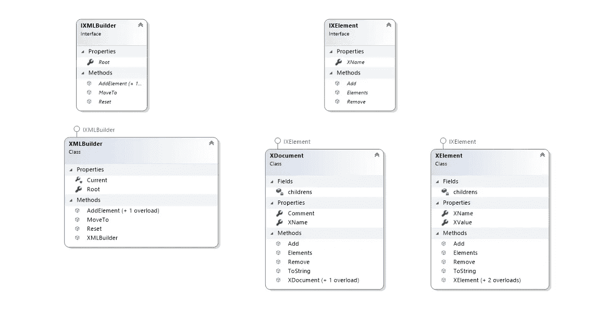

# 构建器和复合设计模式 C#

> 原文：<https://medium.com/nerd-for-tech/builder-and-composite-design-patterns-c-1cd1425a5f89?source=collection_archive---------5----------------------->


复合设计模式是一种常见的结构设计模式，它将对象组成一个树形结构，并提供一个接口来处理它们，就像它们是单独的对象一样。这种模式创建了一个树形结构，其中的对象继承自同一个基础，并在结构上提供了一个很好的抽象。

**在下列情况下应用此设计模式:**

*   在层次结构的顶部需要通用函数
*   要求统一处理复杂和个别的对象

**用途:**

*   在不破坏代码的情况下向结构中添加新元素保留了开闭原则

**真实单词示例:**

这种模式的常见用例是目录/文件夹结构、HTML 标签。JSON 结构、YAML 结构和 XML。的。net XElement 类是使用复合模式实现的。



来自微软官方网站的 XContainer 文档

XContainer 抽象类可以看作是基础，XDocument 和 XElements 都是从它继承的。XDocument 和 XElement 都可以被认为是复合的。你可以从[官方网站](https://docs.microsoft.com/en-us/dotnet/api/system.xml.linq.xnode?view=net-5.0)了解更多信息

**示例:**

在本例中，出于演示目的，实现了 XElement 的一个简化版本。

**类图:**



复合设计

***pixel element . cs***

这是一个复合接口，它描述了 XML 文档和 XML 元素的常见方法，如`Add()`和`Remove()` 。

```
using System;
using System.Collections.Generic;
using System.Text;namespace Composite
{
    public interface IXElement
    {
        string XName { get; }
        void Add(IXElement element);
        void Remove(IXElement element);
        List<IXElement> Elements(); }
}
```

***XDocument.cs***

XML 文档的实现，这有一个额外的属性来保存注释。这个类有两个构造函数，一个带有注释，另一个带有注释和参数列表，支持在创建时传递 XML 元素列表。

```
using System;
using System.Collections.Generic;
using System.Text;namespace Composite
{
    public class XDocument : IXElement
    {
        private readonly List<IXElement> children; public string XName { get; }
        public string Comment { get;  }
        public XDocument(string _comment, params IXElement[] items)
        {            children = new List<IXElement>();
            Comment = _comment;
            foreach (var _item in items) {
                children.Add(_item);
            }
        }
        public XDocument(string _comment)
        {
            children = new List<IXElement>();
            Comment = _comment;
        }
        public void Add(IXElement element)
        {
            children.Add(element);
        }
        public void Remove(IXElement element)
        {
            children.Remove(element);
        }
        public override string ToString()
        {
            var document = new StringBuilder().Append($"< !--{Comment}-->");
            document.Append("<Root>");
            foreach (var item in children) {
                document.Append(item.ToString());
            }
            document.Append(@"<\Root>");
            return document.ToString();
        }
        public List<IXElement> Elements()
        {
            return children;
        }
    }
}
```

***XElement.cs***

这是 XML 元素的实现。这个类有三个构造函数，它们是名称、值和元素参数列表的组合。这为调用者提供了创建带有或不带有内部元素的 XML 元素的灵活性。

```
using System;
using System.Collections.Generic;
using System.Text;namespace Composite
{
    public class XElement : IXElement
    {
        public string XValue { get; } private readonly List<IXElement> children; public string XName { get; } public XElement(string name)
        {
            XName = name;
            children = new List<IXElement>(); }
        public XElement(string name, string value)
        {
            XName = name;
            XValue = value;
            children = new List<IXElement>(); }
        public XElement(string name, params IXElement[] items)
        {
            children = new List<IXElement>();
            XName = name;
            foreach (var _item in items)
            {
                children.Add(_item);
            }
        }
        public void Add(IXElement element)
        {
            children.Add(element);
        }
        public void Remove(IXElement element)
        {
            children.Remove(element);
        }
        public override string ToString()
        {
            var document = new StringBuilder();
            document.Append($"<{XName}>");
            if (children.Count > 0)
            {
                foreach (var item in children)
                {
                    document.Append(item.ToString());
                }
            }
            else {
                if(XValue != null)
                document.Append(XValue.ToString());
            }
            document.Append(@"<\"+XName+">");
            return document.ToString();
        }
        public List<IXElement> Elements()
        {
            return children;
        }
    }
}
```

***main.cs***

在 main 方法中，通过将 XML 元素的注释和列表传递给构造函数来创建 XML 文档。观察在构造函数中传递元素层次结构的能力。

```
using Composite;
using System;namespace Main
{
    class Program
    {
        static void Main(string[] args)
        {
            XDocument document = new XDocument("This is the root element", 
                new XElement("child1", 
                    new XElement("child1.1", 
                        new XElement("child1.1.1", "1.1.1"))),
                new XElement("child2", "2"),
                new XElement("child3", "3"),
                new XElement("child4", "4"));
            var element5 = new XElement("child4", "5");
            document.Add(element5);
            Console.WriteLine(document);
            document.Remove(element5);
            Console.WriteLine(document);
        }
    }
}
```

**与其他模式的关系:**

在现实世界中，模式不是单独存在的，而是编织在一起为复杂的设计问题提供解决方案。

*   ***生成器*** :可以在创建复杂的树形结构时使用
*   ***迭代器*** :遍历复杂结构
*   ***Flyweight*** :创建对象时节省内存资源

上面的例子扩展了一个构建器来演示模式是如何协同工作的。上面的 XML 构造看起来有点混乱，所以添加了一个流畅的构建器来简化 XML 创建过程。

之前关于[构建器模式](https://sukithaj.medium.com/builder-design-pattern-fluent-interface-c-70cae9490a91)的文章。

**带生成器的类图**



带有生成器的类图

***ixmlbuilder . cs***

该接口提供了添加元素和重置结构的方法。

```
namespace Builder
{
    public interface IXMLBuilder
    {
        public XDocument Root { get; }
        IXMLBuilder AddElement(string name, string value);
        IXMLBuilder AddElement(string name);
        IXMLBuilder MoveTo(string name);
        IXMLBuilder Reset(); }
}
```

***XML builder . cs***

实现的建设者接口，其中有根文件和简单的逻辑添加元素。

```
using Composite;
using System;
using System.Collections.Generic;
using System.Linq;
using System.Text;namespace Builder
{
    public class XMLBuilder : IXMLBuilder
    {
        public XDocument Root { get; }
        internal IXElement Current { get; set; }
        public XMLBuilder(string comment) {
            Root = new XDocument(comment);
            Current = Root;
        }
        public IXMLBuilder AddElement( string name, string value)
        {
            Current.Add(new XElement(name, value));
            return this;
        }
        public IXMLBuilder MoveTo(string name)
        {
            List<IXElement> filtered = Current.Elements().Where(x => x.XName == name).ToList();
            Current = filtered.Count > 0 ? filtered[0] : Root;
            return this;
        }
        public IXMLBuilder Reset()
        {
            Current = Root;
            return this;
        }
        public IXMLBuilder AddElement(string name)
        {
            var temp = new XElement(name);
            Current.Add(temp);
            Current = temp;
            return this;
        }
    }
}
```

***main.cs***

使用构建器界面构建 XML 树的一种更简单的方法。

```
using Builder;
using Composite;
using System;namespace Main
{
    class Program
    {
        static void Main(string[] args)
        { XDocument xdocument = new XMLBuilder("This is the root element")
                .AddElement("child1")
                .AddElement("child1.1")
                .AddElement("child1.1.1", "1.1.1")
                .Reset()
                .AddElement("child2", "2")
                .AddElement("child2", "3")
                .AddElement("child2", "4")
                .AddElement("child2", "5")
                .Root; Console.WriteLine(xdocument);
        }
    }
}
```

讨论:

一些人认为，原始模式违反了 [***Liskov 替代原则***](https://en.wikipedia.org/wiki/Liskov_substitution_principle) 和 [***接口分离原则***](https://en.wikipedia.org/wiki/Interface_segregation_principle) 通过强制叶节点实现无意义的方法如`Add()`或`Remove()`。然而，本文提供的示例符合 ISP 和 LSP，因为`XElement`和`XDocument`已经实现了所有的抽象方法。

谢谢你，[德斯蒙德·哈里斯·费尔南多](https://medium.com/u/36cefa51daac?source=post_page-----1cd1425a5f89--------------------------------)和[迪努莎·坎南加拉](https://medium.com/u/702c7758a2a3?source=post_page-----1cd1425a5f89--------------------------------)审阅代码。

源代码可在 [git](https://github.com/sukitha/CompositePattern.git) 中获得，