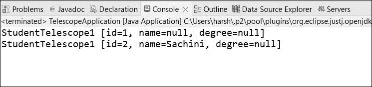
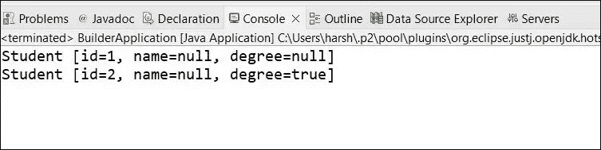

# 生成器设计模式

> 原文：<https://medium.com/nerd-for-tech/builder-design-pattern-7739283b137e?source=collection_archive---------3----------------------->

我们如何从类中创建对象？为此我们可以使用构造函数。我们可以有默认的构造函数和参数化的构造函数。当我们创建一个对象时，如果你有很多参数要传递，会发生什么？会发生什么，虽然有这么多的参数，但我们希望在大多数情况下传递 null。

## 这个问题有什么解决方法？

我们有两种解决方案，我们可以提供 setters。但问题是如果我们也想达到不变性。Setters 不适合。

然后，第二种选择是使用伸缩构造函数。什么是伸缩构造函数

# 伸缩式构造器

简单地说，*这是一个有多个构造函数*的类。每个构造函数调用层次结构中更具体的构造函数。

有 2 个实现来实现伸缩构造函数方法。

让我们得到学生，它有 3 个参数，如 id、姓名和学位。此外，创建学生对象时需要 id。

让我们进入伸缩构造函数的实现。

这样，首先我们将第一个参数传递给构造函数。然后下一个构造函数将传递前两个参数，然后下一个将传递所有 3 个参数。

我们也可以反过来实现。

在这个例子中，在第一个构造函数中，我们传递所有的参数并赋值。然后一步一步，下一个构造函数会说什么是空参数。

我们可以使用这些实现来创建具有多个构造函数的对象。

尽管这提供了一种解决方案，但这仍然是复杂，且存在一些问题。有时可能会导致 NullPointerExceptions。

因此，在这种情况下，我们有什么解决方法来节省我们的时间和处理的效率。是的，你可以用 **Builder 设计模式**来解决。这属于创造性设计模式。

构建器模式实现起来有些复杂。但是在实现了构建器模式之后，您可以轻松地创建带有多个参数的对象。

# 生成器设计模式

在这里，我们做的是，我们有一个学生类，我们保留另一个名为 Builder 的类来创建生成器。

通过这个演示，我们将对这个模式有更多的了解。

当我们谈到实现时，它看起来很复杂。但是一步一步理解起来很简单。

1).首先创建一个名为 **Student** 的类，包含 id、姓名和学位等属性。它与伸缩构造器演示相同。

2).现在，您需要有一个类来实现构建器。在我们的例子中，我们在学生类中实现了 Builder 类。所以作为第二步，你需要有一个名为 ***Builder*** 的*静态类。*

现在，我将描述构建器类内部。

**构建器类:**

I)在这里面，首先你需要有相同的属性集。

II)然后创建一个构造函数。->

有一件特别的事情要记住。这里可以有默认的构造函数。如果在创建对象时不强制赋予一些值，这完全没问题。但是在我们的例子中，我们假设当我们创建一个学生时，我们需要有一个 id。这意味着，我们强制学生类在创建时拥有 id 属性。因此，在我们的示例中，我们传递 id 并赋值。

III)现在 id 属性没问题。但是其他属性会发生什么。在这一步，我们给出答案。

这里，我们将创建两个不同的方法，每个方法设置特定的参数并返回相同的对象。

那么，这些方法的所有返回类型都是生成器类型。

IV)现在一切正常。但是我们想要一个学生对象。不是一个建设者的对象对不对？然后你需要做的是，你需要有方法来建立学生对象。

这一步我们做到了。这里我们有一个叫做 *build()* 的方法，它用生成器返回**新学生。返回类型是 Student，因为它返回 Student 对象。**

这只存在于我们的构建器类中。

3).但是我们对学生班级有异议。你能猜到吗？

是啊，没错。我们错过了学生的构造函数。因此，我们需要在 Student 中创建构造函数。您还记得 Builder 有 build()方法，它返回 Student 对象。但是它用生成器返回学生对象。因此，在这里，我们需要在创建构造函数时将 Builder 作为参数传递。

现在，我们可以分配从生成器传来的所有值。

这就是我们的构建器实现是如何创建的。现在，你可以去检查结果了。

你可以看到，它会在伸缩构造函数和构建模式中给出相同的答案。但是构建器模式比伸缩构造器更容易使用，效率也更高。你可以看到我们可以避免使用构建器模式的伸缩构造器。

在离开这一部分之前，我们可以看一些 java 构建器模式的例子。是的，那是 StringBuilder。

好的。我们学习了另一种设计模式。感觉如何，还是很难理解吗？

**代码示例:**

[https://github . com/harshani 2427/learn-with-krish/tree/master/Design % 20 patterns/Builder](https://github.com/harshani2427/learn-with-krish/tree/master/Design%20Patterns/Builder)

**参考文献**

[https://youtu.be/ubG_5_QnbkE?list = PLD-myte BG 3 x 86 I 3 uyaxwzkfvtuy 2g MDO](https://youtu.be/ubG_5_QnbkE?list=PLD-mYtebG3X86i3uyAXwZKfVtUy2gMDdo)