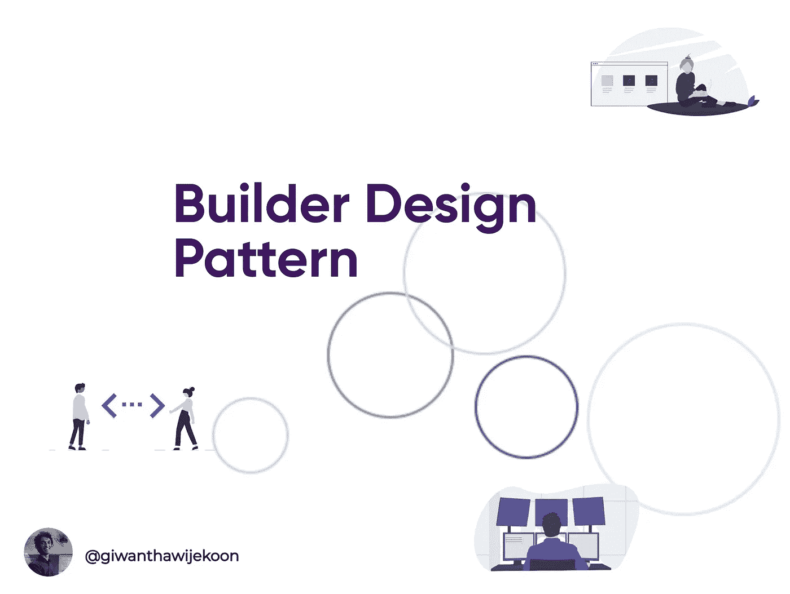
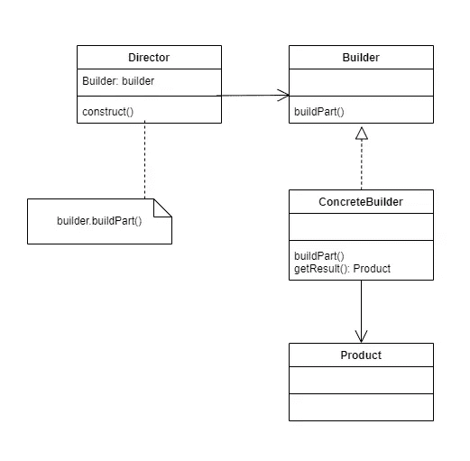
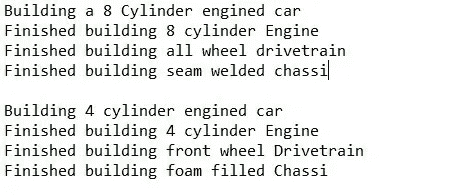

# 生成器设计模式

> 原文：<https://medium.com/nerd-for-tech/builder-design-pattern-c6909f974801?source=collection_archive---------6----------------------->

**生成器设计模式**是另一个**创造设计**模式，处理**对象创造机制**。

Builder 模式允许程序员使用简单的对象创建复杂的对象。它还将复杂对象的构造与它们的表示分离开来。因此，它将能够从同一施工过程中作出不同的表示。

我们来看下面的类图。

*   构建器-需要一步一步创建产品的抽象界面。
*   产品——需要生成的复杂对象。
*   concrete Builder——它有必要的指令，通过实现构建器接口来组装和构建产品的各个部分。
*   director-使用 Builder 的对象构造器。

让我们通过一个例子来看看构建器设计模式的实现。

假设我们想制造一辆汽车。为了主要制造一辆汽车，让我们采取以下步骤。

1.  构建引擎
2.  建造动力传动系统
3.  构建机箱

所以汽车是需要回归的最终产品。我们假设有一个抽象类叫做 CarBuilder。然后，我们需要做的是按照上面提到的顺序进行。对于该顺序，我们可以使用 CarDirector 类。CarClient 是讲述制造两辆汽车的人，一辆装有四缸发动机，另一辆装有八缸发动机。现在让我们看一下使用 java 实现这个场景。

这是给定程序的示例输出。

# 优势

*   尽量减少构造函数中的参数数量。
*   扩展程序员以改变或重用过程或产品。

# 缺点

*   需要为每个产品创建混凝土建设者。

希望这篇文章对你有帮助。

谢谢大家！

## **参考文献**

四人组设计模式