# 使用 Keras 构建一个基本的二元文本分类器

> 原文：<https://medium.com/nerd-for-tech/building-a-basic-binary-text-classifier-using-keras-4972a7c36616?source=collection_archive---------3----------------------->

作为使用 Python & NLTK 的自然语言处理的延续，本文试图探索如何在不使用递归神经网络(RNN)或长短期记忆(LSTM)的情况下构建二进制文本分类器

# 目录

1.  文本的人工神经网络
2.  单词嵌入
3.  利用人工神经网络构建文本分类器
4.  使用文本分类器的预测

# 文本的人工神经网络

我们知道人工神经网络善于处理数字，而自然语言处理的是文本。因此，在用文本数据训练模型之前，我们需要对输入数据进行分类，并尝试将单词表示为数字或向量。任何原始分类特征，如字符/单词标记、位置标签等。,.将被表示为一系列向量。

**单词嵌入:**一类技术，将单个单词表示为预定义向量空间中的实值向量。下面列出了一些流行的技术:

1.  二进制编码(一键向量编码)
2.  术语频率—反向文档频率(TF-IDF)
3.  Word2Vec 嵌入

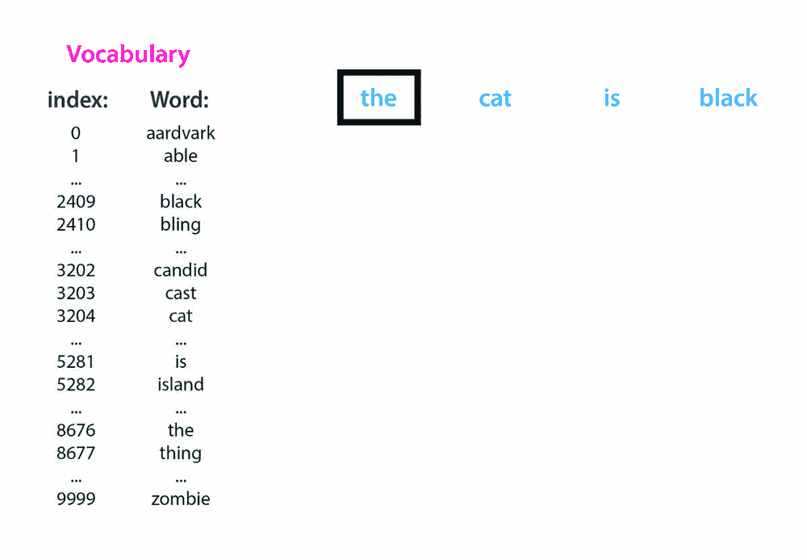

一键矢量编码的图示

在上面的例子中，给定 10，000 个单词的词汇表，每个单词被分配一个整数索引值(0- 9999)。现在有了这个单词到整数的映射，每个单词都可以表示为一个向量。例如，索引值为 3204 的单词 **cat 被编码为[0，0，0，…。，1，…，0，0]，其中 1 正好在位置 3204。**

现在，这个向量可以作为神经网络的输入，用于进一步的算法处理。

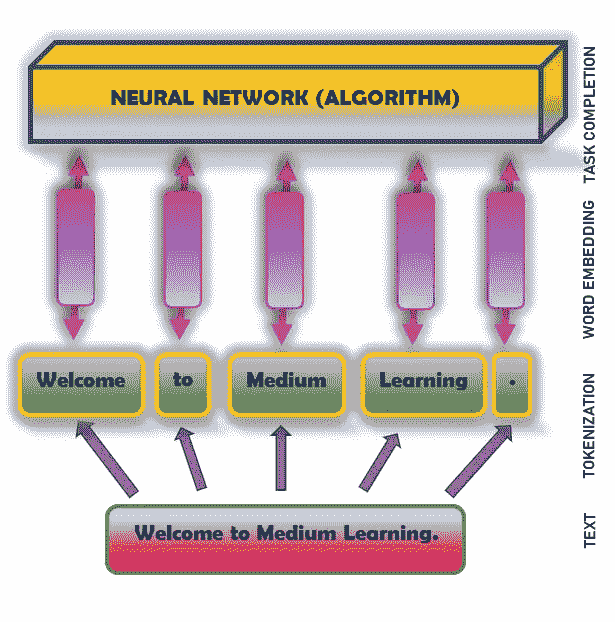

文本的人工神经网络

# 基于人工神经网络的文本分类器

我们现在将研究使用 Keras 的 ANN 文本分类器的实现。 [**Keras**](https://keras.io/) **:** 为人工神经网络提供 Python 接口的开源软件库。它支持多个后端神经网络计算引擎，如 Tensorflow、微软认知工具包、Theano 和 PlaidML。

导入 Tensorflow 和 Keras API。还要导入[**Numpy**](https://realpython.com/numpy-tutorial/)**—一个 python 库，它提供了简单而强大的数据结构:n 维数组。加载 Keras 提供的 [**IMDB 电影评论数据集**](https://keras.io/api/datasets/imdb) 。**

## ****IMDB 数据集:****

*   **总体数据集规模- 50，000 条评论**
*   **训练数据- 25，000 条带有情感标签的评论(正面/负面)**
*   **测试数据- 25，000 条评论**
*   **审查是预处理和索引的总频率。例如:如果索引为 3，则表示该数据中第三个最常用的单词。按照惯例，索引 0 用于编码任何未知/未识别的单词。**

**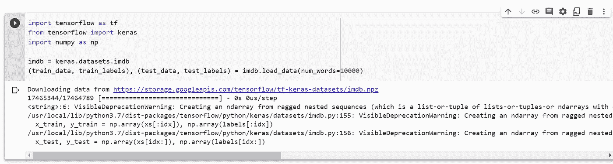**

**从 Keras 导入和加载 IMDB 数据集**

**数据集被加载并被分成分别带有训练( **train_data** )和测试( **test_data** )标签的训练( **train_labels** )和测试( **test_labels** )数据。参数 **num_words = 10000** 保留训练数据中出现频率最高的前 10k 个单词。为了保持数据的大小易于管理，我们会丢弃一些不常用的单词。**

**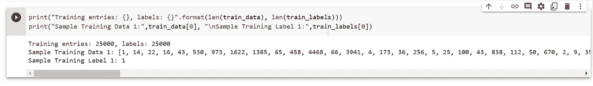**

**培训数据和标签**

**在上面的图像中，样本训练数据 1 示出了数据集的句子 1 的编码向量表示，其被标记为 1，指示它是正面评论。**

****填充:**使所有输入序列具有相同固定大小的过程。并非数据集中的所有序列都具有相同的长度。有些长，有些短。但是我们知道 ANN 只处理固定的相同大小的输入。因此，必须使用**keras . preprocessing . sequence . pad _ sequences()创建填充序列。**填充中使用的参数描述如下**

1.  ****训练数据/测试数据:**要填充的数据集**
2.  ****值:**表示填充发生的值。**
3.  ****填充:**需要填充的地方。当 padding = 'post '时，该值追加到后缀部分。如果未指定填充，默认填充出现在前缀部分。**
4.  ****maxlen:** 定义了句子中的最大字数，默认的最大句子长度由最长的句子定义。当一个句子超过最大字数时，它会删除或截断单词，默认情况下，它会删除句子开头的单词。**

**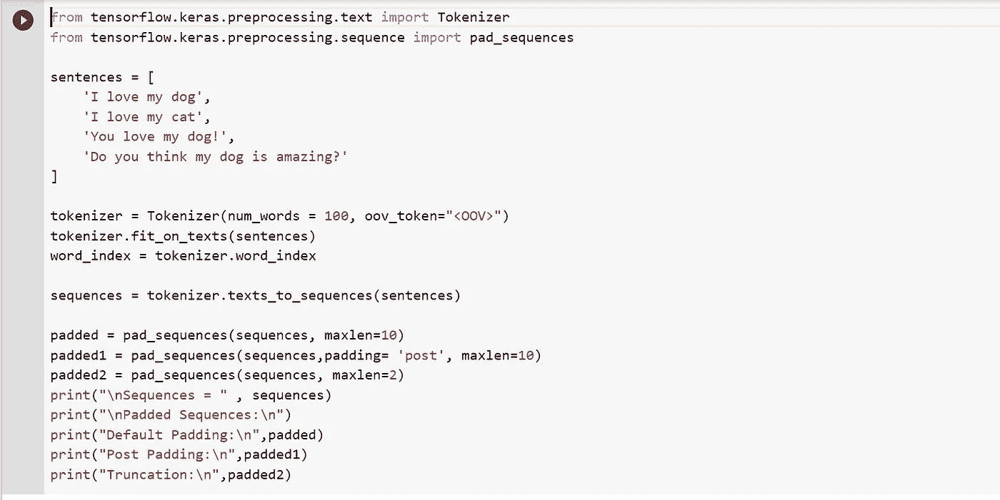**

**示例填充说明**

**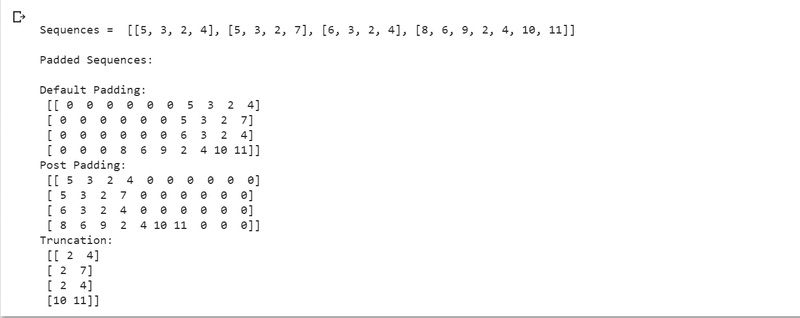**

**样本填充的输出**

**填充序列的结果非常简单。现在，您可以观察到已经填充到矩阵中的句子列表，其中矩阵中的每一行都有一个长度相同的编码句子。tokenizer 中的 **oov_token** 指定了无法识别的词汇外标记。**

**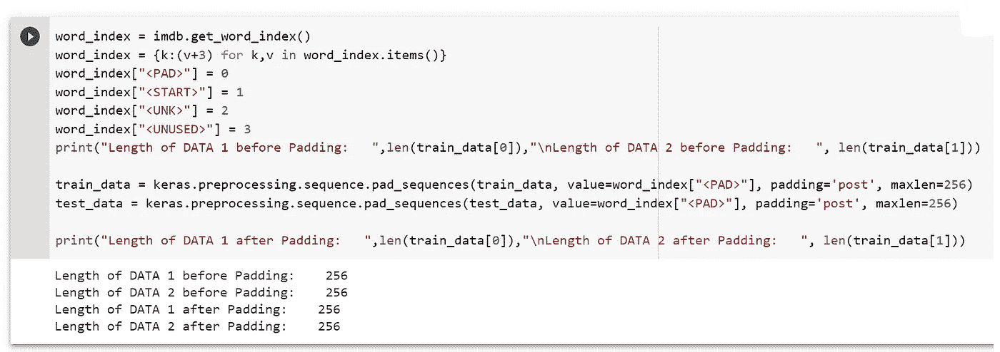**

**填充前后的数据长度**

**上面的代码使用 **imdb.get_word_index()获取单词索引列表。**字索引值 0、1、2 和 3 分别为填充值、起始值、未知值和未使用值保留。输出显示了**

**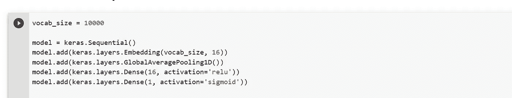**

**构建人工神经网络模型**

****vocab_size:** 用于定义输入形状的数据集的词汇计数(10，000)。**

****喀拉斯。Sequential():** 对一系列层进行分组——一个输入层、一个或多个隐藏层和一个输出层。**

****keras . layers . embedding():**接受整数编码的词汇表，其中包含单词索引(vocab_size)和向量维数(16)。这些向量是在模型被训练时学习的。嵌入层的输出形状将是(批处理、序列、嵌入)**

****keras . layers . globalaveragepooling1d():**通过对序列维度求平均，返回每个示例的固定长度输出向量。这使得模型能够以最简单的方式处理可变长度的输入。**

****keras.layers.Dense():** 它以-隐层和输出层的神经元数目，激活函数为自变量。在上面的代码中，隐藏层有 16 个神经元，输出层有一个神经元。输出层中密集单元(神经元)的数量是 1，因为在这种情况下，预测的输出将是 0(负)或 1(正)。**

****为什么 ReLU 为隐藏层？**不 ***饱和*** 为输入加权和的正值。如果输入是正数，函数返回数字本身，如果输入是负数，函数返回 0。**

****为什么输出层为 Sigmoid？**我们如何将一个实值(最后一个隐藏层 z 的线性组合)映射到一个概率，即 0 到 1 之间的一个数字？一个简单的解决方案是只考虑在 0 和 1 之间的那部分 z。所有负值将被映射到 0，而所有大于 1 的值将被映射到 1。**

****model.summary():** 打印模型的有用摘要，包括:**

*   **模型中所有层的名称和类型。**
*   **每层的输出形状。**
*   **每层的权重参数个数。**
*   **如果模型具有一般拓扑(下面讨论)，则每层接收的输入**
*   **模型的可训练和不可训练参数的总数。**

**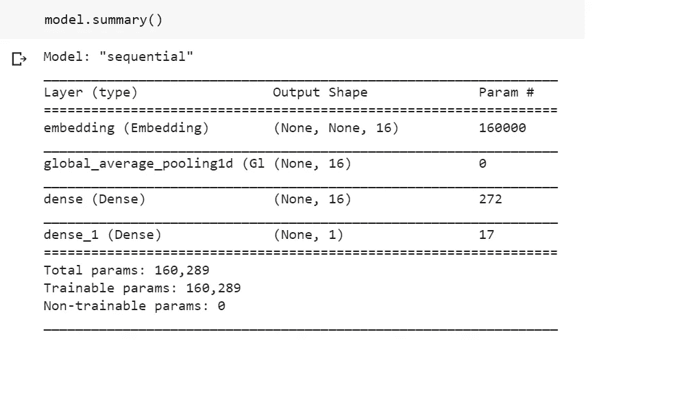**

**模型摘要**

****嵌入图层:****

**输入形状:2D 张量(批量大小，输入长度)。在这种情况下，(无，无)。**

**输出形状:3D 张量(batch_size，input_length，embedded_vector_dim)。在这种情况下，(无，无，16)**

****global _ average _ pooling 1d:****

**输入形状:来自嵌入层的 3D 张量。**

**输出形状:2D 张量(batch_size，input_dim)。在这种情况下，(无，16)。**

****致密层:****

**对于密集层代表**隐藏层**具有 16 个神经元和 ReLU 激活功能。**

**输入形状:来自池层的 2D 张量。(无，16)**

**输出形状:2D 张量(批量大小，单位数量)。(无，16)在上面的代码中。**

**对于密集层代表**输出层**具有 1 个神经元和 Sigmoid 激活函数。**

**输入形状:隐藏层的 2D 张量。(无，16)**

**输出形状:2D 张量(批量大小，单位数)。在这种情况下，(无，1)**

****各层参数计算:****

**嵌入层:vocab _ size * emb _ dim = 10000 * 16 = 160000**

****密集层，参数个数=输出大小*(输入大小+1)****

**隐藏层:16 * (16+1) = 16 * 16 + 16 = 272**

**输出层:1 * (16+1) = 16 + 1 = 17**

**然后使用带有 ADAM 优化器的 **model.compile()** 编译模型，损失函数为二进制交叉熵，因为输出为 0 或 1。参数 **metrics** 是模型在训练和测试期间要评估的度量列表。**

**然后，训练数据集被分成训练数据(0–9999)和验证数据(10000- 24999)。**验证集**是一组数据示例，用于调整分类器的超参数。模型会看到这些数据，但永远不会学习这些数据。**

**然后使用 **model.fit()对模型进行固定次数的训练。batch_size** 指定每次梯度更新的样本数。默认值= 32。**时期**被定义为“整个数据集的一次通过”。**

**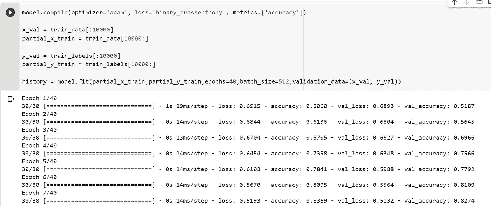**

**模型编译和培训**

**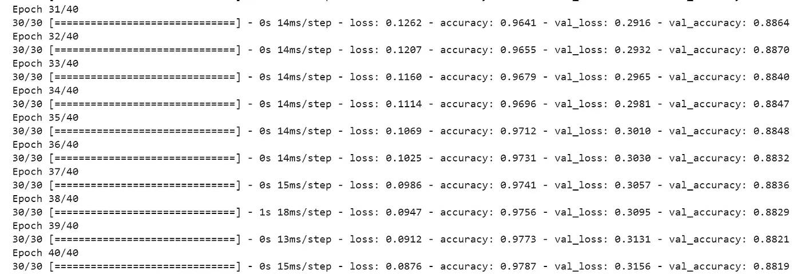**

**训练在达到 40 个纪元后完成。训练准确率为 97%，验证准确率为 88%。**

**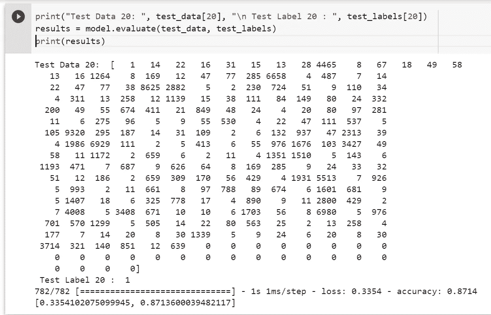**

**模型评估**

****模型评估:** model.evaluate()用于根据测试数据评估模型性能。这种相当简单的方法达到了大约 87%的准确率。使用更先进的方法，该模型应该接近 95%。**

****模型预测:**经过训练的模型现在可以使用 model.predict()来预测句子/评论的情感。以下代码显示了如何解码评论并预测测试数据中第 35 篇评论的情绪。0-负极& 1-正极**

**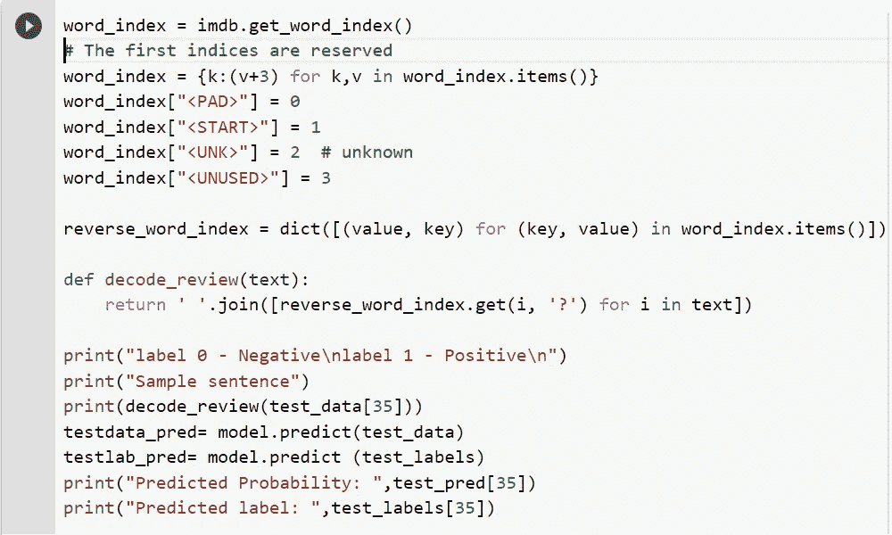**

**模型预测法**

**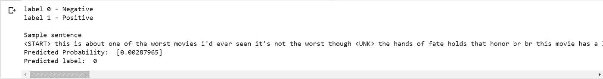**

**预测产量**

**因此第 35 次审查的测试数据"**这是关于最糟糕的电影之一……..**被**标记为 0** ，表示**预测为负**审查，预测概率为 0.0029**

**下面这段代码使用 matplot 库来绘制训练与验证准确性的关系图。**

**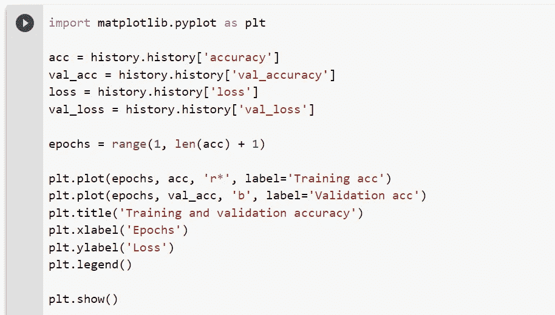**

**绘制图形的代码**

**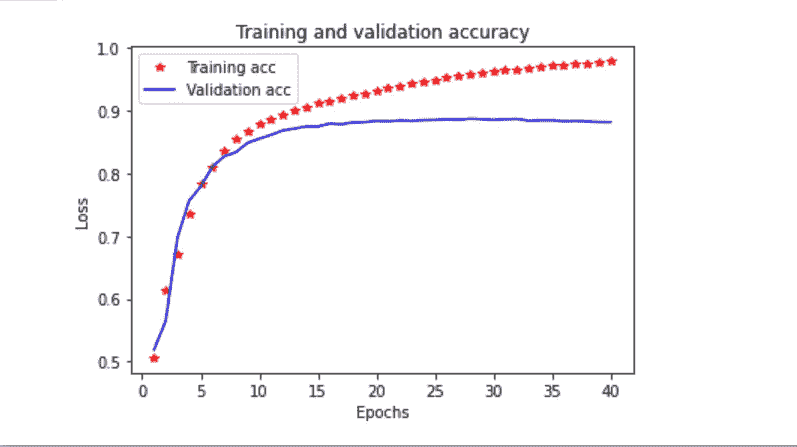**

**Hope 对使用 Keras 构建文本分类器有所了解。对于 Colab 代码，[点击此处](https://colab.research.google.com/drive/18DlRPLIr4q_3CzLfDQfpw_SUUu2wxQ4u?usp=sharing)**

# ****快乐学习****

## ****下一篇文章再见****