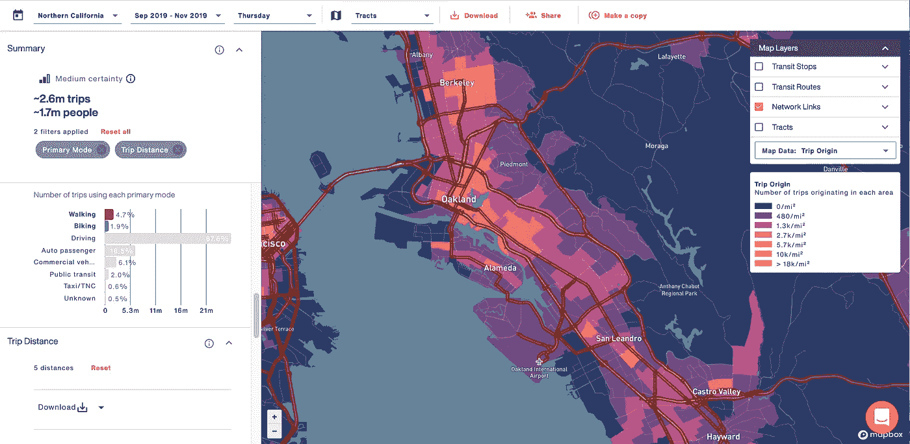
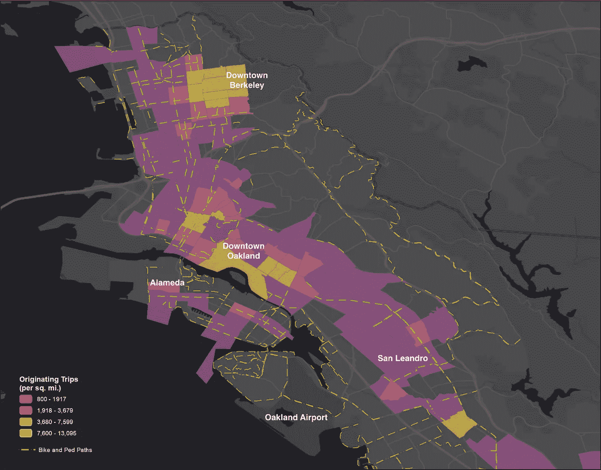

# 建设自行车向前的未来。

> 原文：<https://medium.com/nerd-for-tech/building-a-bike-forward-future-33603d66d4ee?source=collection_archive---------6----------------------->

照片:[克劳迪奥·施瓦茨](https://unsplash.com/@purzlbaum)

## 副本揭示了加州阿拉米达县的规划者可以建立替代基础设施，将被使用，有用和安全。

当汽车出行被自行车出行取代时，城市将减少拥堵，减少空气污染，改善交通安全。近年来，地方和地区政府已经认识到强大的自行车基础设施的好处，但资助新基础设施的财政资源有限，迫使规划者做出艰难的决定，即在哪里升级以满足现有和潜在的需求。传统工具，如实物清点和利益相关方外联，增加了成本和进度。

幸运的是，[复制品](http://replicahq.com)可以很容易地快速识别自行车旅行发生在哪里，以及可能没有车辆的人在哪里进行自行车旅行。还可以识别当前驾驶员可能转化为骑自行车者的高频率短距离 OD 对。

在阿拉米达县的这个视图中，我们用复制品向我们展示了至少一英里长的非机动行程。这个距离过滤器是基于这样的理论而添加的，即较长的自行车和步行行程可能反映了受约束的模式选择选项。有针对性地改善基础设施，使这些出行者受益，可以最大限度地提高安全性和缓解拥堵。

当我们沿着阿拉米达县自行车地图查看我们的过滤行程时，我们看到自行车道已经为几个自行车和行人活动频繁的地区提供了良好的服务，包括奥克兰市中心和伯克利市中心，以及该县南端大部分地区的良好覆盖。另一方面，我们在奥克兰市中心东南部的艾伦代尔和麦克斯韦尔公园以及更南边的卡斯特罗谷看到大量的非机动车出行。现有的自行车基础设施在这些地区相当有限。寻求将有针对性的改善与现有需求领域相匹配的规划者可能会关注这些社区。

*在过去的两年里，我们与****Caltrans****、加州空气资源委员会(****CARB****)和萨克拉门托地区政府委员会(****SACOG****)合作，为萨克拉门托地区提供移动数据和交通见解，我们很高兴能为加州的每个人带来同样的价值。*

***从 3 月 31 日起，加州所有公共部门员工都可以免费获得 Replica's Places and Trends 产品。*** [***今天报名立即访问***](http://replicahq.com/california) ***。***

*试验将包括进入两个复制地点大区域——北加利福尼亚和南加利福尼亚——覆盖整个加利福尼亚州和内华达州。这两个模型总共覆盖了 4200 万人。*