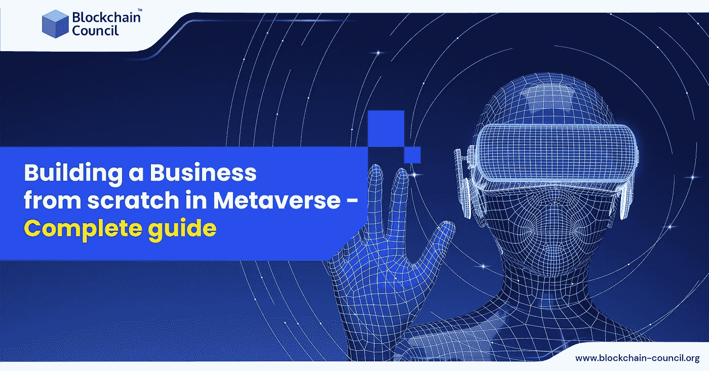

# 在元宇宙从零开始创业——完全指南

> 原文：<https://medium.com/nerd-for-tech/building-a-business-from-scratch-in-metaverse-complete-guide-d99ea1da8386?source=collection_archive---------10----------------------->

在彻底检查了为什么制定计划和参加元宇宙可以为您的企业带来利润的原因之后。在这篇文章中，我们将探讨可用的机会，例如 NFT 及其使用案例、进入元宇宙，以及为您的客户提供一个安全合法的环境。

现实世界和虚拟世界正在融合

长期以来，我们通过某种物理接触来发现、购买和/或消费商品和服务，例如去商店、参加活动或预订服务。一旦互联网出现，电子商务平台开始出现，并与线下部门竞争。数字购物包括浏览网站的 2D 界面，查看价格、描述和目录。

Covid 不可避免地改变了我们世界的许多方面。随着实体店面的消失，电子商务网站取代了它们，成为订购商品和送货上门的唯一方式。我们的社交互动仅限于通过社交媒体的沟通渠道。

COVID 也改变了我们的运营方式。我们不得不过渡到远程工作，这从根本上改变了企业的运作方式。每天，每个人都在参加一个聚会或者一个电话会议。我们不再能够在开放的办公环境中互动。整个娱乐业都停止了运营。巡回演唱会、体育赛事和其他活动被推迟。甚至制造业也受到了影响，全球范围内工厂关闭，工作岗位减少。

**在元宇宙成功创业的终极计划。**

根据最近的一项研究，元宇宙的价值可能从 2020 年的 470 亿美元增加到 2024 年的 8000 亿美元。这意味着仅在四年内就有超过 1000%的潜在增长率。那么，如何进入呢？让我们在这里了解一下:

**搞元宇宙活动调研**

构建未来的公司包括微软、Meta、Spatial、Decentraland、Roblox、Wilder World、The Sandbox 和 Highstreet。

作为一个品牌，审查市场和潜力需要你批判性地评估，而不仅仅是别人在做什么，技术是如何发展的，或者进入市场的渠道是什么。如果你想知道元宇宙和区块链是否能一起工作，你必须首先专注于解决你的客户正在经历的实际问题。目标不应该是在没有明确价值主张的情况下进入该行业。在接下来的五年里，构建每一层所需的技术将会显著进步，而这仅仅是个开始。

**元宇宙的游戏内推广**

创造营销和广告的过程即将改变。

像 LandVault(以前的混合)这样的企业让你在元宇宙和游戏平台上预订广告空间变得简单，使 NFT 科技能够在观众面前定位企业。与当前系统的标准游戏内广告方法相反，客户通常看到这些广告而不会干扰他们的游戏体验。

消费者，或者这个场景中的化身，以一种高效的方式被引入到业务中；这种影响类似于在繁忙的大街上逛街。

**与观众建立联系**

元宇宙的社区喜欢聚集、创造和探索。举办展览、活动、在线市场和其他活动来定位你的业务，似乎吸引了大量的人。2021 年，1070 万人在在线音乐服务 Wave 上观看了贾斯汀比伯的超宇宙音乐会，迪士尼计划在元宇宙创建一个主题公园。元宇宙值得关注的一个领域是娱乐和活动。

2020 年，Travis Scott 在集中的元宇宙游戏堡垒之夜中表演，吸引了 4580 万观众。除了卖东西，他还从中获利 2000 万美元。

**利用 NFTs**

来自 Valtech 的 Web3 研究员罗伯特·霍尔姆·汤姆森也强调了直接购买虚拟形象的方法在未来的流行。这表明只有在数字领域，数字产品才能被销售和消费。为了使这种元宇宙体验成为可能，NFT 是技术的一个关键组成部分。

如果你选择使用非功能性技术来开发数字体验，那么要高度重视创造价值，并提供与众不同的实用工具，让你愿意在公司投资。

考虑你的顾客欣赏你品牌的什么，并充分利用他们与你的联系。这个想法是为 NFT 持有者提供真正的价值。在这方面，社区的发展也至关重要。如果你通过引人入胜的讲故事和全面的发布计划来创造动力，你就会成功。

**关闭思路**

不确定如何建立你的市场战略或从哪里开始利用 1 万亿美元的机会？

请与我们联系，这样我们就可以检查我们可以帮助解决哪些用户问题，无限的潜力正等着您。接受我们的认证，成为认证[元宇宙专家](https://www.blockchain-council.org/certifications/certified-metaverse-expert/)。到目前为止，这些认证已经帮助了许多爱好者，他们现在已经在区块链领域建立了自己的事业，并在元宇宙和 Web 3.0 领域逐渐成长。