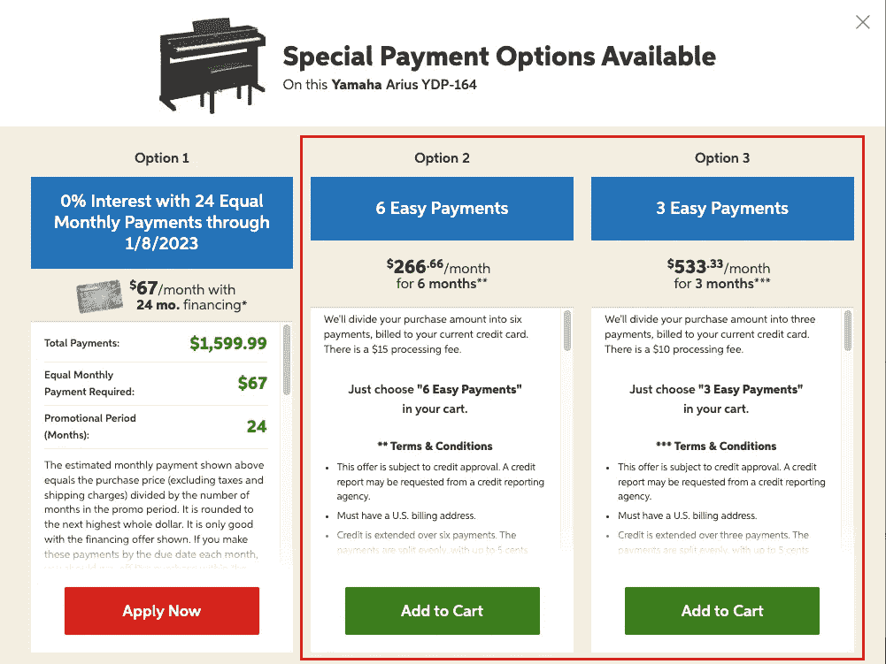
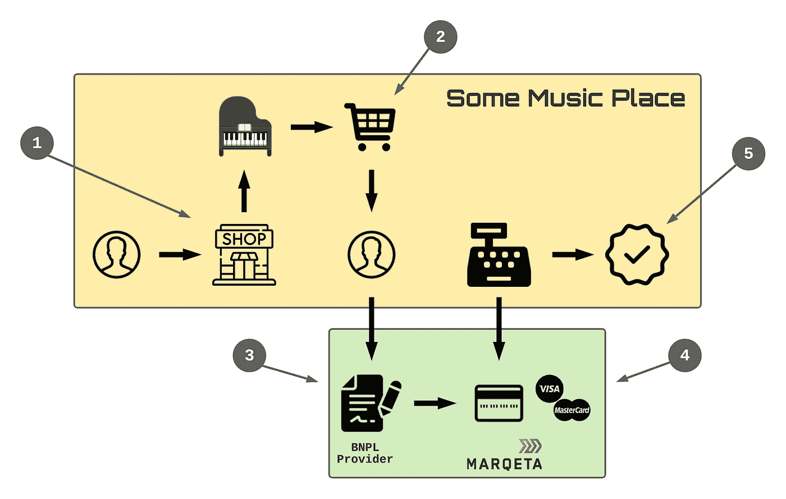
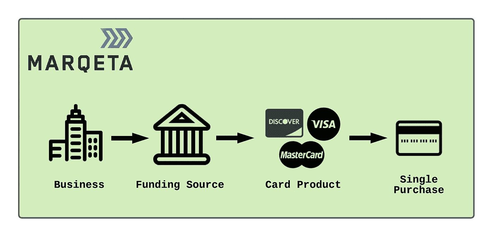
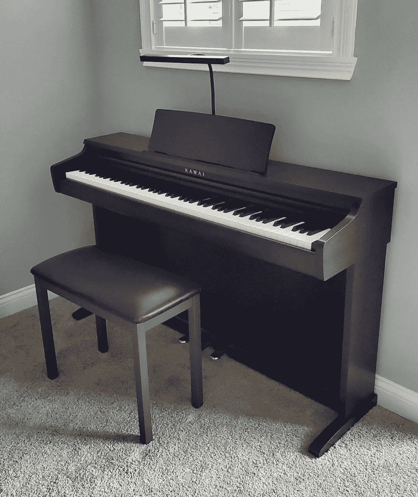

# 构建先买后付的解决方案

> 原文：<https://medium.com/nerd-for-tech/building-a-buy-now-pay-later-payment-solution-7e4d32a14d4e?source=collection_archive---------3----------------------->

在我的生活中，有一段时间音乐是我的主要关注点。高中毕业后，我决定和几个朋友一起尝试音乐事业。因为我没有羞耻心，这里有一张我当时的照片:

如果这些关于我的信息对你来说是新的，你可能会得出结论，成为摇滚明星的梦想并没有像我在 20 世纪 80 年代中期计划的那样实现。

这种渴望确实让我去了伯克利音乐学院，并在我大学毕业回到印第安纳后，在当地的一家录音室找到了一份工作。毕业后，我的科技生涯开始了，我的重心也改变了。我仍然为我的家人和朋友演奏音乐，但很久以前我就卖掉了我用来磨练技能的音乐设备。

去年秋天，我决定给我们的家添置一架钢琴。虽然我喜欢传统钢琴的声音，但我无法忍受这种乐器所需要的占地面积。我的重心变成了数码钢琴。

我在搜索产品时注意到，每个商家都为新购买的商品提供某种形式的“先买后付”(BNPL)选项。基本上，我会现在支付一部分购买价格，然后在接下来的六周内支付相等的款项。这是我发现的一个例子:

从技术的角度来看，我想知道 BNPL 解决方案是如何构建的，所以我开始更深入地研究这个主题。

# 向玛克塔报到

去年，我发现了 Marqeta 支付平台，并发表了以下文章:

[利用 Spring Boot 建立类似优步的支付服务](https://betterprogramming.pub/build-an-uber-like-payment-service-using-spring-boot-f6cfb45f67d8)

作为这一努力的一部分，我发现了一个文档完善且易于使用的 API。事实上，我写过一篇后续文章，介绍如何使用 Marqeta 服务创建奖励卡计划:

[我如何制作自己的奖励卡](/nerd-for-tech/how-i-built-my-own-rewards-card-c1806ac96bea)

在第二篇文章中，我发现 Marqeta 为您的业务或项目机会添加奖励卡提供了坚实的基础。

基于 Marqeta 平台的深度及其令人印象深刻的 API，我首先查看了那里，以确定他们的服务库中是否有与 BNPL 相关的东西。

事实证明，确实如此。

# 使用 Marqeta 设计 BNPL 解决方案

提供 BNPL 解决方案的 Marqeta 方法遵循以下流程:

1.  客户访问一些音乐场所(实体或在线)
2.  顾客找到一架钢琴并决定购买
3.  客户发现“现在购买，以后付款”是一个有吸引力的想法，并与 BNPL 提供商进行了互动。在这种情况下，它是一种叫做 Afterpay 的服务。
4.  获得批准后，Marqeta 平台会发行一张预先充值的虚拟卡，并立即用于购买
5.  客户在购买时没有支付全款就获得了钢琴的所有权，并在付款后分期偿还(技术上是贷款)。

无论这种交易是发生在传统音乐商店还是在线，流程都不会改变。销售流程允许客户选择一个 BNPL 选项，该选项驱动一个简短的工作流来为购买的确切金额请求短期信用额度。

如果获得批准，BNPL 提供商将利用 Marqeta 支付平台创建一个预先注资的虚拟卡，可用于单次购买。从商家的角度来看，这笔交易看起来与客户亲自提供借记卡或信用卡(Discover、Mastercard 或 Visa)没有什么不同。

事实上，我在“使用 Spring Boot 构建一个类似优步的支付服务”一文中介绍的流程仍然适用:

在这种情况下，资金来源和卡产品方面被链接到 BNPL 提供商，该提供商建立用于支付的卡。

然后，BNPL 提供商将确保收取剩余的款项，使商家和 Marqeta 能够专注于他们的业务职能。

# 诉讼后支付

在上面的例子中，市场领先的 BNPL 服务公司 [Afterpay](https://www.afterpay.com/en-US) 与 Marqeta 合作，让购买即时发生。自 2020 年 3 月以来，Marqeta 一直是 Afterpay 用来处理其令人印象深刻的增长和新产品创新的支付合作伙伴。你可以在这里了解他们的合作关系:

[Afterpay 选择 Marqeta 作为其美国支付合作伙伴](https://www.marqeta.com/blog/2020/03/05/afterpay-partners-with-marqeta)

为了了解 BNPL 期权在当今市场中的影响，请考虑以下与后付服务相关的统计数据:

*   1600 万顾客至少使用过一次 Afterpay
*   顶级客户每年使用 Afterpay 服务 48 次
*   90%申请 Afterpay 服务的人都获得了批准

对于提供 BNPL 选项的商家来说，购物车转化率增加 20%，平均订单规模增加 40%是很常见的。这些结论符合这样的假设，即今天的购物者非常有兴趣现在购买商品，以后再付款。

对于这些交易中的每一笔，Marqeta 平台都被用来提供无缝的支付体验，这进一步促进了积极的客户体验。

# 建设还是整合？

在上面的示例流程中，第三步主要关注与 Afterpay 服务的交互，超过 85，000 家商户(无论大小)选择了该服务作为他们的 BNPL 合作伙伴。该服务处理建立集中于单笔交易的短期信用额度的所有方面。然后，它负责确保债务在接下来的六周内通过四次等额支付得到偿还。

虽然 Marqeta 被用于初始交易的支付处理，但 Afterpay 服务的其余部分也相当复杂，这就提出了一个问题:我应该构建自己的类似 Afterpay 的服务，还是应该与类似 Afterpay 的服务集成？

我的建议是重新审视你的企业的目标。如果你推向市场的东西证明在内部处理这些项目是合理的，那么建立类似后付费服务所需的时间和材料就是要考虑的事情。如果不是这样，那么考虑整合一个类似 Afterpay 的服务，让你专注于你的业务重点和目标。

# 选择离职后薪酬

希望开始使用 Afterpay 的商家只需填写以下网址的在线表格:

 [## 商家入职门户

### 编辑描述

get.afterpay.com](https://get.afterpay.com/app/) 

从成本角度来看，预计每笔交易支付 30 美分(美元)和 4-6%的佣金。虽然交易费与 PayPal 等其他服务类似，但 Afterpay、PayPal 和主要信用卡之间的佣金最高。

商家应该牢记这些成本，并在推进后付费服务之前了解投资回报(ROI)。

# 靠自己前进

使用 Afterpay 等服务的替代方案是构建自己的 BNPL 解决方案。在这种情况下，Marqeta 服务的使用不会改变。这仍然是处理原始购买交易的推荐方法。

事实上，Marqeta 的流程保持不变。只有资金帐户所有者会发生变化:

不是客户提供资金来源(在购买时)，而是您的企业(创建自己的 BNPL 服务的企业)将建立资金来源，用于从参与的零售商处购买产品。

一旦完成购买，就要由你的企业来管理和跟踪所涉及的其他方面。要考虑的一些高级项目包括:

*   初次联系(客户同意条款)
*   请求和保护支付信息
*   跟踪付款计划
*   处理应付账款和收款
*   开发、支持和维护定制解决方案的成本

类似于利用 Afterpay 等服务的决策，企业应该评估构建竞争产品的成本，以估计该服务何时开始提供额外的收入流。

# 结论

从去年开始，我一直努力按照下面的使命宣言生活，我觉得它可以适用于任何 IT 专业人士:

> *“将您的时间集中在提供扩展您知识产权价值的特性/功能上。将框架、产品和服务用于其他一切。”*
> 
> *——j·维斯特*

在本例中，希望为客户提供灵活支付选项的商家可以利用后付费服务。他们也可以选择构建自己的 BNPL 服务，让 Marqeta 处理支付处理功能。这两种方法都利用现有的服务，让工程团队专注于满足他们自己的业务需求或要求。

但这并不是这个故事的结尾…

正如我在以前的出版物中发现的那样，Marqeta 提供了一个支付平台，为金融交易提供了一种不干涉的方法。在这种情况下，Marqeta 服务有助于让 Afterpay 这样的服务完成最初的购买，这样客户就可以顺利完成交易。这意味着 Afterpay 团队可以继续专注于在他们的应用程序中编写新的特性和功能，这完全符合我的使命宣言。

如果您的应用程序或服务有与支付相关的需求，并且您目前没有使用 Marqeta 平台，那么我强烈建议将该平台添加到您的供应商名单中进行审查。

在我的介绍中结束这个故事，尽管我的数码钢琴在网上有很多选择，但我最终还是从我家附近的当地商家 [Piano Solutions](https://www.pianosolutions.net/) 买了一架 [Kawai](https://kawaius.com/product/kdp120/) 数码钢琴:

在商店时，我有机会坐在一架[雅马哈 CFX](https://usa.yamaha.com/products/musical_instruments/pianos/premium_pianos/cf_series/index.html) 三角钢琴后面，这架钢琴的标价比我们全新的 2022 [日产探路者](https://www.nissanusa.com/vehicles/crossovers-suvs/pathfinder.html)高出四倍。虽然我不能决定 CFX 大钢琴是否值那么多钱，但我可以告诉你，这是我一生中最棒的钢琴演奏经历…它让我感觉自己像个摇滚明星。

祝你今天过得愉快！