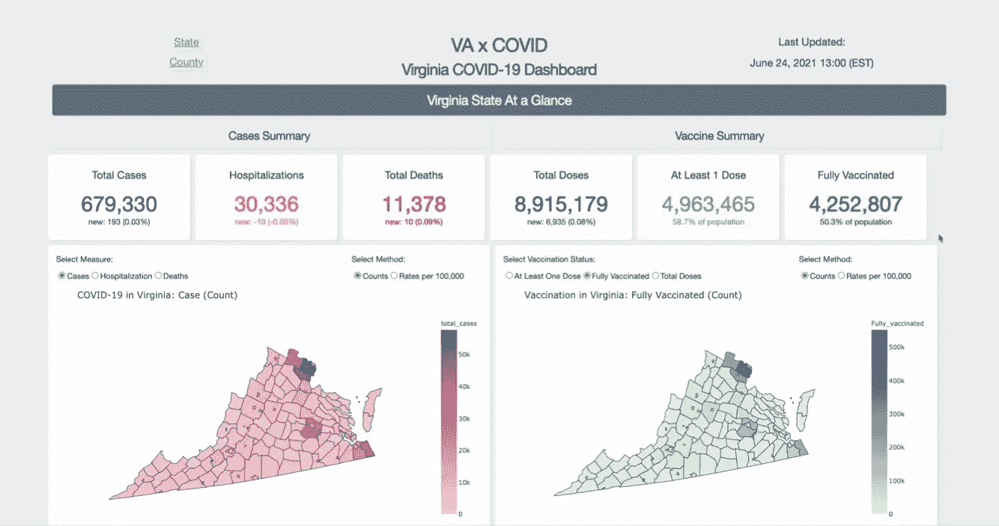
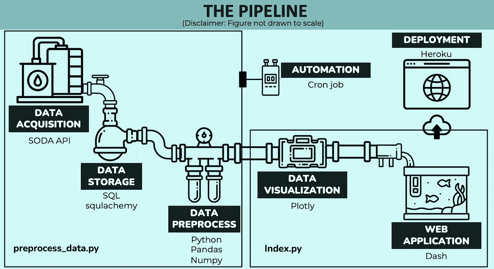
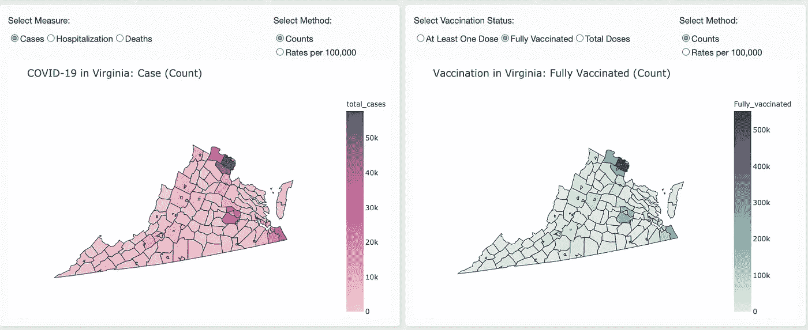
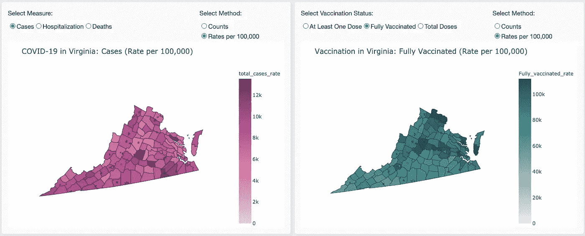
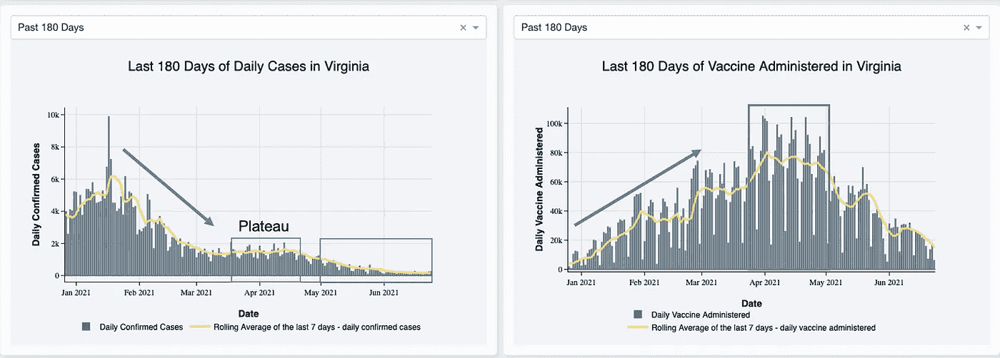
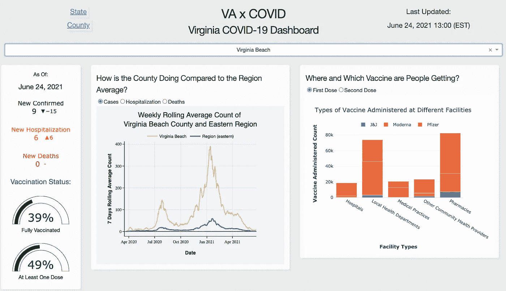
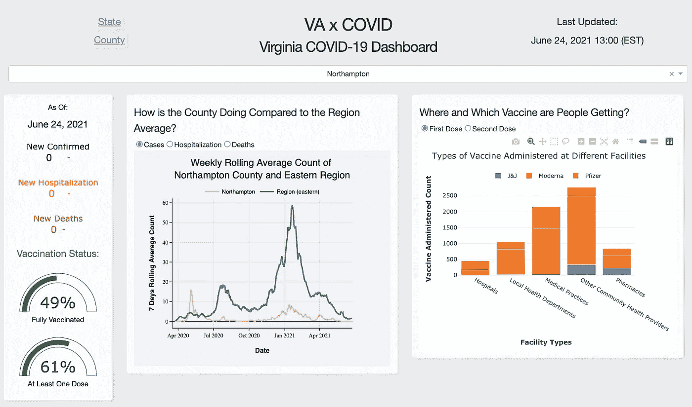

# 使用 Dash 为实时新冠肺炎病例报告和疫苗接种构建仪表板

> 原文：<https://medium.com/nerd-for-tech/building-a-dashboard-for-real-time-covid-19-case-reports-and-vaccinations-with-dash-2c0c5db77de?source=collection_archive---------12----------------------->

作者创建的仪表板产品的快照

除了预测模型之外，Dashboard 是释放数据力量的另一个好方法，它通过显示和可视化数据供领域专家分析。基于仪表板的思想，定期用新数据更新它可以反映实时数据可视化，从而产生更准确的分析。

对于我在 Metis 的最后一个项目，我们的任务是——使用通过任何方式获得的大规模数据集，设计一个端到端的数据存储和处理管道，在任何感兴趣的领域提供有用的服务。

因为我之前所有的项目都与新冠肺炎有某种联系，我想—

> 为什么不回想起新冠肺炎的数据？

***免责声明* :** *我是机器学习和博客的新手。因此，如果有任何错误，请让我知道。感谢所有反馈。*

# 动机

随着新冠肺炎的 Delta 变种在美国蔓延，CDC 和卫生保健专家警告疫苗接种不足的地区要为新的危险做好准备。在研究我目前所在州弗吉尼亚州的情况时，我意识到大多数情况下都有监控仪表板。虽然有一些疫苗接种仪表板，但它们与病例监测是分开的，如果用户想了解病例和疫苗接种之间的关系，这可能不方便。

所以这个项目的目标是**为一个仪表板建立一个管道，用实时数据可视化弗吉尼亚新冠肺炎病例报告和疫苗接种**。

# 数据

*   弗吉尼亚[疫苗管理数据集](https://data.virginia.gov/dataset/VDH-COVID-19-PublicUseDataset-Vaccines-DosesAdmini/28k2-x2rj)(截至 2021 年 6 月 24 日的 267，000 个数据点)和 [COVID 病例数据集](https://data.virginia.gov/Government/VDH-COVID-19-PublicUseDataset-Cases/bre9-aqqr)(截至 2021 年 6 月 24 日的 60，600 个数据点)来自弗吉尼亚开放数据。数据每天都在更新，所以数据库在不断增长。
*   弗吉尼亚各县人口的许可数据

# 工具

*   苏打 API
*   SQL，sqlachemy
*   蟒蛇(熊猫，numpy)
*   破折号
*   赫罗库
*   cron 作业

# 方法学

这个项目的主要思想是建立一个端到端的管道，将产生一个具有更新数据的仪表板。下面，我将展示管道的概况和细分:

## 管道概述

作者创建的管道可视化

1.  **数据采集** —通过 API 和 python 脚本采集数据
2.  **数据存储** —将采集到的数据存储到 SQL 数据库中，并通过 sqlachemy 进行访问
3.  **数据预处理** —数据清理和争论
4.  **数据可视化** —创建用于可视化和分析的绘图
5.  **网络应用** —使用 plotly 图形创建交互式仪表盘应用
6.  **部署** — App 随后被部署在 Heroku 上，供公众使用/演示。
7.  **自动化** —设置了一个 cronjob 来每天运行 python 脚本进行数据采集、存储和预处理，因此仪表板将反映实时数据。

# 关于 Dash

## Dash 是什么？

Dash 是一个开源 Python 库，用于创建 Plotly 提供的基于 web 的可视化应用程序。它非常适合构建仪表板、降价报告和任何数据可视化目的。

我不会在这里深入探究 Dash 是如何工作的，因为有很多很棒的文章和资源比我解释得更好。如果你想了解一下，这里有一些:

*   [使用 Plotly Dash 构建仪表板](/@jjsham/building-dashboard-using-plotly-dash-36bf94a1137)
*   [引入破折号](/plotly/introducing-dash-5ecf7191b503)
*   [破折号](https://dash.plotly.com/introduction)

## 我从使用 Dash 中学到了什么

*   代码更类似于 Flask(因为它与 Flask 集成在一起),而不是 Streamlit
*   对 HTML 和 CSS 有所了解会有所帮助(尤其是如果你想让仪表板看起来更漂亮的话)

出于好奇，我选择使用 Dash，因为我在以前的项目中已经构建了 Flask 并简化了应用程序。总的来说，我喜欢它易于使用，并给出了仪表板的外观。

# 结果

瞧啊。这是仪表板…

也可以在这里查看 app [！](https://vaxcovid.herokuapp.com/)

# 洞察力

使用仪表板产品，我从数据中得出一些初步的分析和见解。

弗吉尼亚各县的病例数和疫苗接种数

弗吉尼亚各县的病例和疫苗接种率

1.  **每 100，000 人的计数与比率(疾病测量)**

同一地区的报告和疫苗接种数量较高。这些地区实际上是城市，因此人口较多。

通过使用比率，我们看到了模式的变化，病例率较高的地区疫苗接种率较低，反之亦然。

2.**病例和疫苗接种的时间序列分析**

病例和疫苗接种的时间序列比较

比较病例和疫苗的时间序列，虽然我们不能推断有因果关系，但我们可以看到在疫苗接种增加后，病例有减少的趋势。在疫苗接种高峰出现后，病例数达到了下降的平稳水平。

显示弗吉尼亚海滩数据的仪表板

显示北汉普顿数据的仪表板

3.**同一地区县级对比**

去弗吉尼亚海滩看看，与地区平均水平相比，情况更糟。它接种疫苗的人口比例也较低。大多数人在药店购买辉瑞药品，所以这可能是外展项目可以研究的事情。

另一方面，同一地区的另一个郡，北汉普顿，比地区平均水平要好。也有较高比例的接种人口。他们中的大部分人正在与其他社区卫生服务提供者进行合作。

总体而言，仪表板显示，有些县的病例率高，疫苗接种率低，而且随着疫苗接种数量的增加，病例数呈下降趋势。此外，县仪表板可用于决定推广战略。

# 未来的工作

如果我有更多的时间，我会使用时间序列/预测建立一个预测模型，在应用程序上应用更多的过滤器，如日期和地区，并根据用户反馈(如果有的话)更新仪表板图表和视觉效果。

# 外卖食品

对我来说，这个项目最具挑战性的部分是挑选什么类型的图表放在仪表板上，为分析增加更多的价值。没有领域知识，可能会有点迷失。因此，我花了一些时间和精力来阅读这个项目的疾病测量方法。总是用各种方式学习！

总的来说，我喜欢做这个项目，构建仪表板，设计布局，并使它在视觉上更具吸引力。端到端的构建让我深入了解了数据科学项目的每个流程。作为我在 Metis 的最后一个项目，这是一个回到 SQL、总结我的学习和试验新工具的好方法。

感谢阅读:)希望这是有趣的和有见地的给你。

你可以在我的 GitHub [回购](https://github.com/crystal-ctrl/engineering_project)上找到我的项目工作。