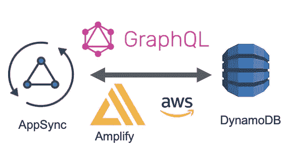
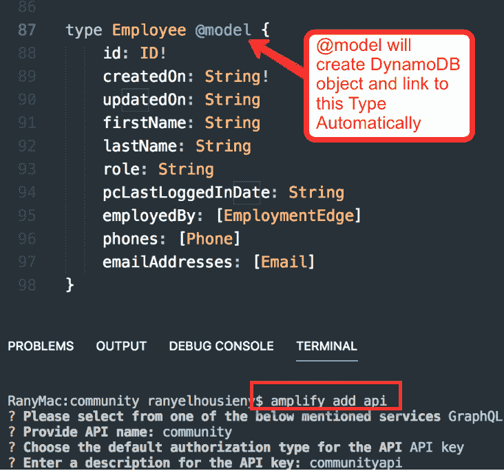
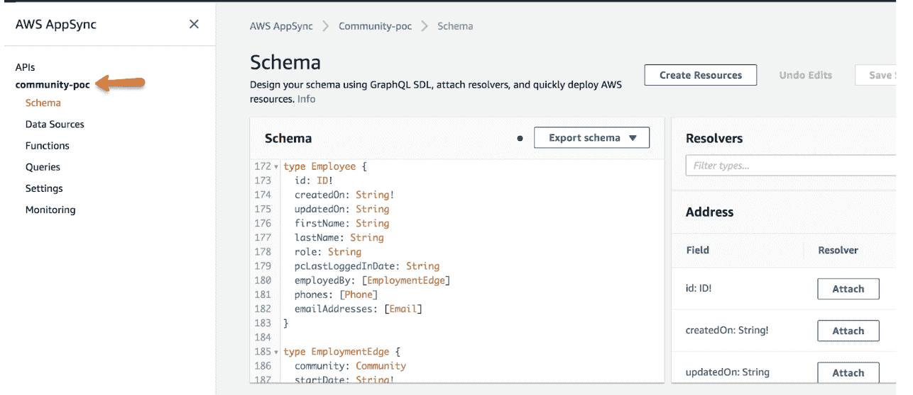
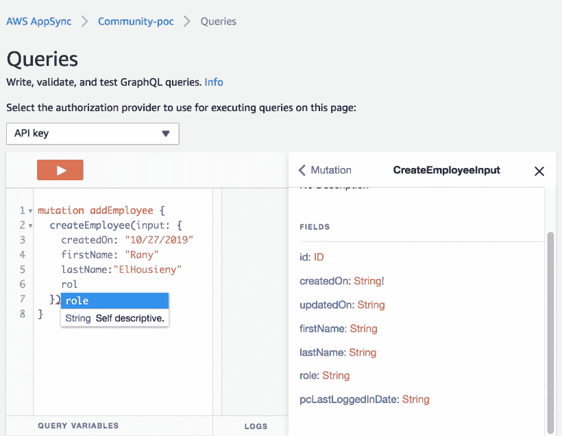
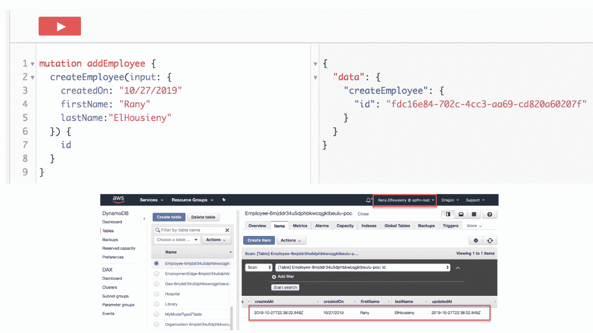

# 使用 AWS AppSync 和 Amplify 构建 GraphQL 微服务

> 原文：<https://medium.com/nerd-for-tech/building-a-graphql-microservice-with-aws-appsync-and-amplify-58883d16f472?source=collection_archive---------2----------------------->

由于我们创建了 REST 微服务，我想创建一个 GraphQL 微服务。AWS Amplify 和 AppSync 使得在几分钟内构建无服务器和无代码的微服务变得极其容易。展示差异的最佳方式是一起创建微服务。

 [## 使用 AWS Amplify 构建 AppSync GraphQL

### 在这篇短文中，我将解释我是如何使用 AWS Amplify 构建一个 GraphQL AppSync 端点的，并且我将…

www.linkedin.com](https://www.linkedin.com/pulse/building-appsync-graphql-using-aws-amplify-rany-elhousieny/) 

在这篇短文中，我将解释我如何使用 AWS Amplify 在工作中构建了一个 GraphQL AppSync 端点，并将使用截图进行解释(一张照片胜过一堆文字:)

最终代码可在以下网址找到

 [## ranyelhousieny/graph QL _ Microservice

### 此时您不能执行该操作。您已使用另一个标签页或窗口登录。您已在另一个选项卡中注销，或者…

github.com](https://github.com/ranyelhousieny/GraphQL_Microservice) 

以下视频中的详细演练:

在这个短视频中，我将解释我如何使用 AWS Amplify 构建了一个 GraphQL AppSync 微服务

以下是我在之前的视频中遵循的步骤

1.  安装 amplify cli

sudo NPM install-g @ AWS-amplify/CLI

**2。按照另一篇文章**中的解释创建一个 react 应用程序

npx 创建-反应-app graqhql-微服务

**3。完成后，进入目录，打开 VS 代码**

CD graqhql-微服务

代码。

**4。初始化放大器**

放大初始化

**5。添加 API**

放大添加 api

**6。将更改推送到 AWS 云**

放大推送

1.  在构建模式之后，您需要配置 Amplify 来将需要的文件注入到您的项目中
2.  运行“放大添加 api”来添加新的 API

3.使用“放大推送”将您的更改推送到云

神奇的是，这将构建您的模式、解析器和数据库表:

类型之外的表格

现在，您可以使用由 AWS 自动添加的 Mutation 来添加员工。

此外，正如您在上面的图片中看到的，文档是自动为您创建的，…太棒了:)

现在，您可以进入数据库并检查新员工

发布者

[phdᴬᴮᴰ雷尼·埃尔豪斯尼](https://www.linkedin.com/in/ranyelhousieny/)

高级经理软件工程师，AWS 解决方案架构师认证，PSM，ACSA，MIS，UPE，MSCA

仅从模式(类型)创建 AppSync 服务非常简单，只需几分钟