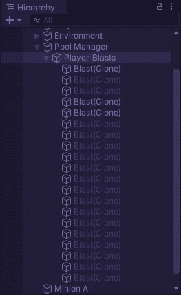
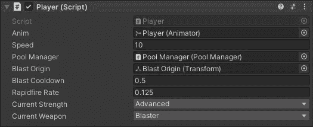
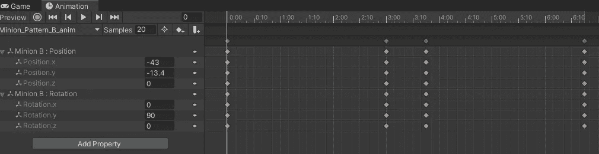

# 用 Unity 和 C#构建一个最小可行的产品

> 原文：<https://medium.com/nerd-for-tech/building-a-minimum-viable-product-with-unity-and-c-fbe724c09d72?source=collection_archive---------12----------------------->

## 奠定基础是第一要务

是的，是的，我知道。我差了一秒差距。

我在这款最新的 [2.5D 街机射击游戏](/nerd-for-tech/revisiting-the-arcade-shooter-2f8482164910)上的第一整天工作很有收获。我已经有了游戏的核心基础:穿越太空，射击也穿越太空的敌人，摧毁他们。我还没有写敌人还击的剧本，仍然没有爆炸(我们*不能忽视爆炸)。但我们的想法是从核心构建游戏，保持一切可扩展，这样我们就可以不断增加层次，直到我们实现一个最小的可行产品。*

什么是“最低可行产品？”

我很高兴我以为你会问这个。在我们的案例中，最小可行产品(MVP)是一个具有足够功能的构建，以在游戏开发周期的早期验证游戏理念。大家会玩吗？会很好玩吗？我们应该用 16 个不同的 boss 遭遇战和完全配音的过场动画来建立 8 个关卡吗？MVP 应该能够回答这些问题。我们本质上是在做一个完美的演示。

现在，这是一个认证项目，我正好有一个已经为我概述的 MVP。这是一个很大的列表，我不会在这个博客中解决所有的问题，但我的目标是在三天内完成 MVP，并留下两天时间添加一些我自己的有趣想法。

## 基础知识

玩家是明显的起点。我编写了一个非常简单的运动系统，将其绑定到上升和下降的触发动画，并设置输入系统。

然后我创建了一个对象池系统来保存爆能枪。

现在爆炸物体有自己的翻译指令，所以我可以很容易地测试它，但当我开始开发其他武器时，我们将把它改为刚体物理系统，武器给子弹施加力。这样我们就可以做一些有趣的事情，比如散布火力和瞄准射击，而不用为子弹的飞行编写一百万种方式。

我已经用 enum 为每种武器类型设置了三个等级的结构。武器威力也是玩家的生命值——受到伤害会降低武器威力，如果玩家在基本武器威力下受到伤害，他们会爆炸*。

**爆炸在即。*

好吧，但关于球员的事说够了。敌人有什么？

现在，敌人以两种简单的模式飞行。随着我们在波浪系统中的进展，我会添加更多复杂的图案。模式是动画，而不是脚本化的运动。

他们会在屏幕上以随机的间隔射击，用他们的镜头追踪玩家。

游戏屏幕的四周都有包围框，敌人在这里是不会受到伤害的(也不会开枪)。这是通过一个简单的名为 IConcealable 的接口来实现的，当敌人触发边界框上的碰撞器时，这个接口就会触发一个布尔。

敌人的行为被敌人的阶级所控制。基本敌人的每个变种都会有子类。我还没有决定老板们是否会使用主要的敌人职业，或者他们是否需要自己独特的剧本。我将会继续重新评估敌人类的范围，并在必要时将其分成子类。

游戏中所有可破坏的实体共享一个 IDamageable 接口，该接口强制它们实现一个破坏方法和一个健康属性。打碎东西很容易！

这就是一切。玩家可以飞行，射击和摧毁敌人。正式的街机射击游戏。明天，当我们进入构建 MVP 的第二天时，我会给你这个项目的下一个进度更新。