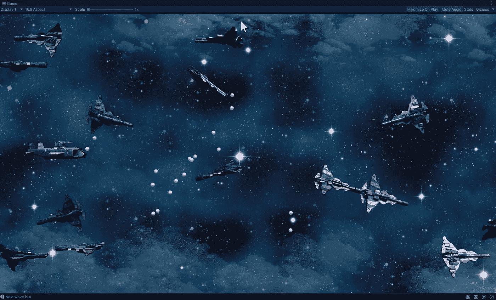
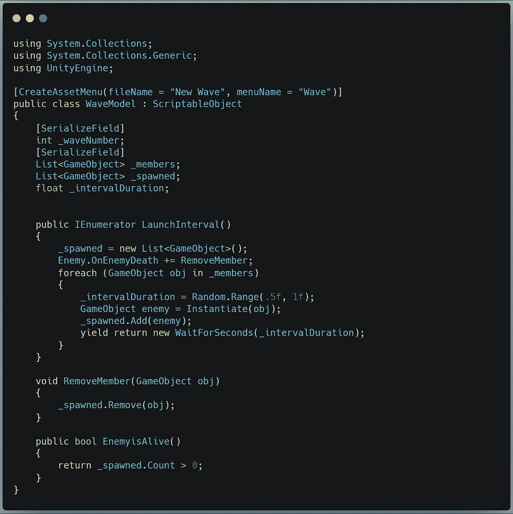
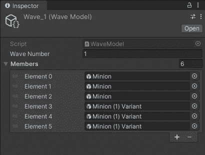
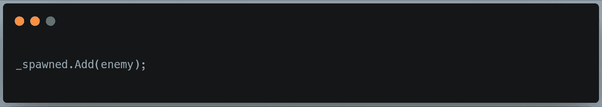
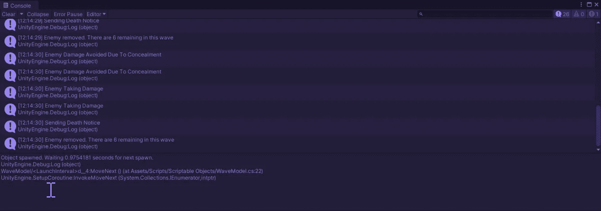
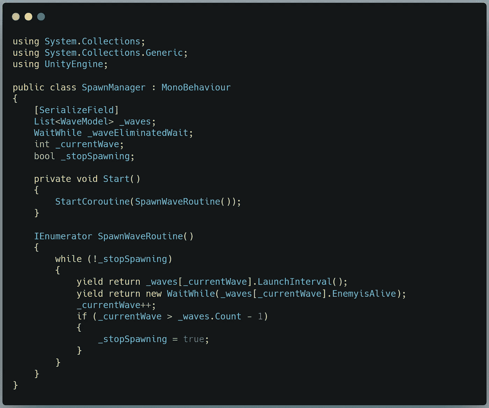
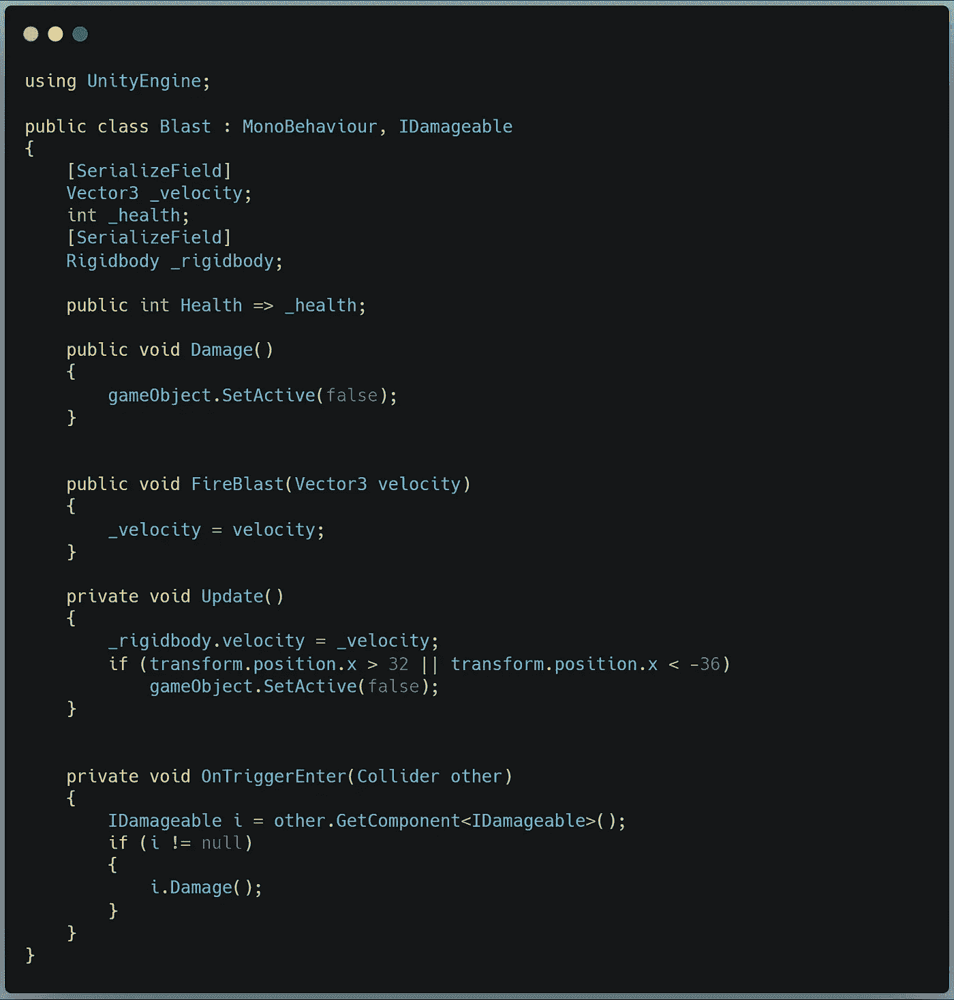
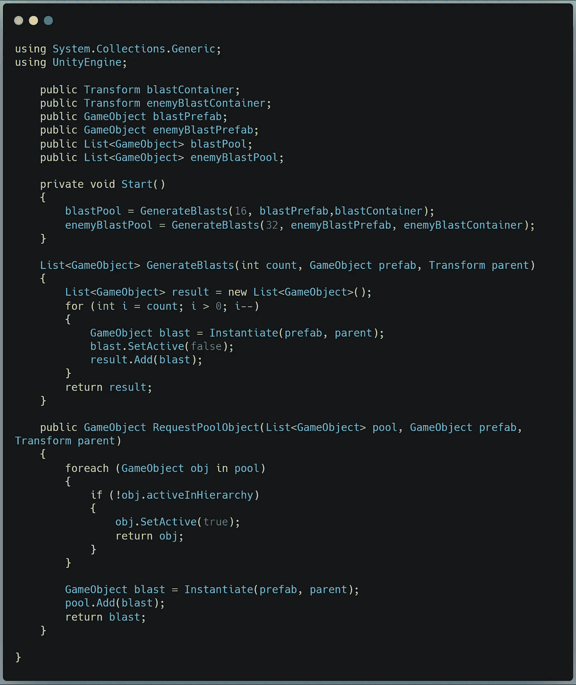
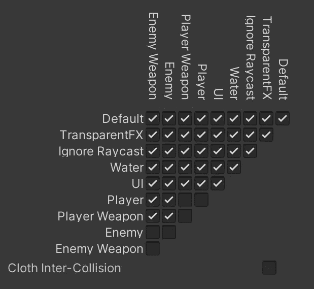

# 用 Unity 和 C#，pt 构建最小可行产品。2

> 原文：<https://medium.com/nerd-for-tech/building-a-minimum-viable-product-with-unity-and-c-pt-2-3283d4a48efc?source=collection_archive---------20----------------------->

## 让产卵管理器输出的不仅仅是沮丧

啊啊啊啊啊啊！

今天，我将写的是第二天(希望)构建一个完整的最小可行产品——在这种情况下，是一个 2.5D 街机射击游戏。我满怀希望地告诫大家，因为我几乎花了第二天的所有时间来构建和测试 Spawn Manager。我在波之间移动时遇到了一些问题——包括一个点，所有的波同时产生(见上图),但现在它工作了！让我们看看怎么做。

我首先制作了一个可脚本化的对象模板来表示一波敌人的信息和逻辑。如果你想更深入地了解可脚本化对象是如何工作的，这里有我写的一篇文章。今天，我将向您展示一些更高级的功能，包括我遇到的问题。

请看一下模板代码:

我为设计师定义了一个序列化的字段来存储他们想要的所有预置，一个列表来存储已经繁殖到场景中的敌人，以及一个时间间隔来间隔繁殖的敌人，这样敌人就不会掉在另一个上面。

我还定义了三个方法。第一个是协程，负责繁殖敌人。第二种方法是当敌人死亡时，将他们从活动列表中移除。第三个是一个 bool 函数，这样我们就可以在这波敌人全部死亡时向 SpawnManager 报告。

这是不言而喻的——但是占用了我一天一个小时的棘手问题在下面这条语句中解决了:

最初，我在 RemoveMember(GameObject obj)中使用 _members 列表。这是个错误。**可脚本化对象中敌人的序列化列表不包含敌人预设的衍生实例。**这对我来说并不直观。我认为 _members 列表就是我所需要的。但这给我留下了一个问题:

每杀死一个敌人，我的日志都会报告列表中还有 6 个敌人。过了一段时间，我才意识到这是因为这个列表是惰性的——只用来通知 LaunchInterval()协程我想要什么样的*种类的*对象，以及我想要它们的顺序。通过为繁殖的敌人添加第二个列表，我可以如实地向繁殖管理者报告哪些敌人是活着的。

说到这里，让我们看看那个种子管理器:

这里我保存了一个波对象的列表。SpawnWaveRoutine()是这个脚本的核心。在 while 循环中，我们首先让步，直到当前波的 LaunchInterval()协程结束。然后我们投降，直到敌人活着回来。我们迭代 wave 索引，然后检查新索引是否大于 wave 列表的计数——如果是，我们就完成了。如果没有，那么我们在下一个索引上再次运行循环。

仅此而已。

第二天我做的另一件事是将冲击波转换成基于物理的操作，而不是在静态向量上转换。

玩家或敌人可以调用一个公共的火焰爆炸(Vector3 velocity)方法来设置爆炸的速度。Update()方法将此速度应用于爆炸每一帧。如果它碰到一个易损坏的对象，它调用 objects damage 方法。

池管理器也需要更新:

现在，RequestPoolObject 方法包含了三个新参数，这样任何脚本都可以从特定的池中调用特定的对象(或者在池耗尽时创建它)。我们现在维护两个池:一个用于敌人射击，一个用于玩家射击。我大概会加一个敌人池，这样波浪就可以预装了。不过，这可能没有必要。我们走着瞧。

最后，我设置了物理层，使实体不能用自己的镜头把自己炸飞。

今天到此为止。明天我将为我完成 MVP 的最后冲刺编目，如果一切顺利的话，我们将在接下来的两天里添加绒毛和额外的有趣功能。