# 用 Unity 和 C#，pt 构建最小可行产品。3

> 原文：<https://medium.com/nerd-for-tech/building-a-minimum-viable-product-with-unity-and-c-pt-3-a22c5e04ec02?source=collection_archive---------14----------------------->

## 将最后几块放入拼图中

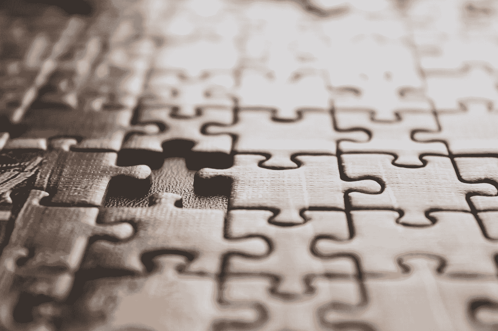

我开始这个系列的目标是在短短三天内为我的开发人员认证项目开发最小可行的产品，让我有两天时间来担心润色和额外的特性。我在这里告诉你，我没能完成…最后的 3%。这其实挺好的，对吧？我应该能在今天早上完成最后的 3%。

所以有两样东西不见了:用户界面和最终 Boss 最终攻击模式的动画。让我们看看其他的东西。

## 特殊效果

我以拼凑一些特效开始了这一天。值得注意的是:爆炸。

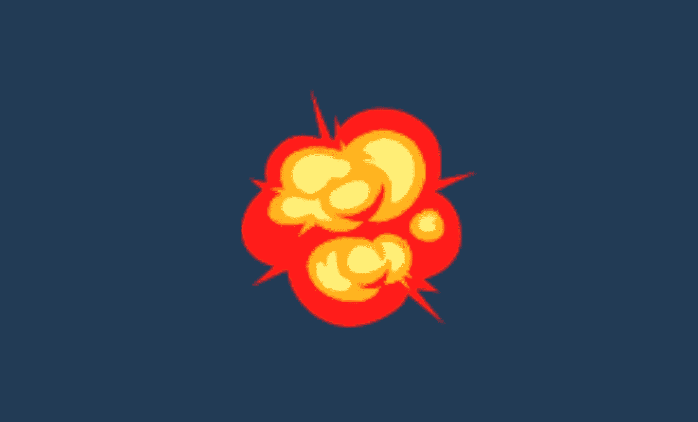

咔嘣！

敌人和玩家都将他们的爆炸作为子对象预先加载，并放置在对象的主体上。默认情况下，它们的精灵渲染器是空的，动画的精灵被加载到动画帧中。以下情况会引发爆炸:

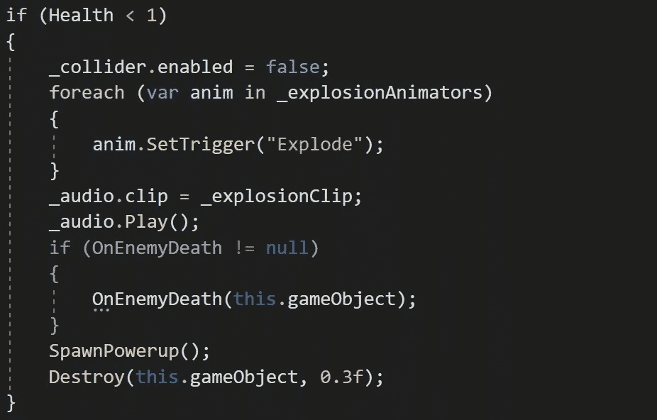

这个物体保存了它所有爆炸的列表，并在死亡时触发它们。EZPZ。

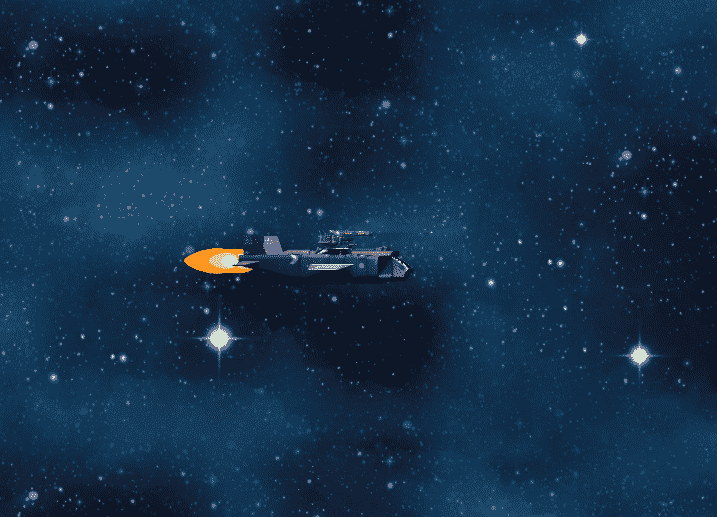

我还给敌人和播放器添加了音频组件，并从 https://freesound.org/下载了一些有趣的音效。

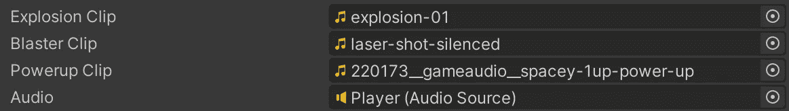

space-1up-power-up 是我的最爱！

我还为玩家添加了推进器动画和开机动画。

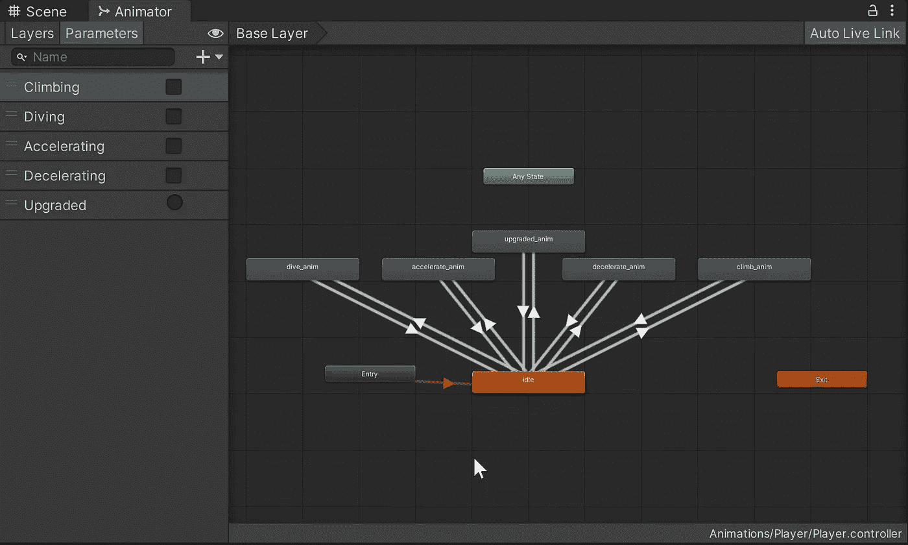

因此，当我们加速或减速时，推进器看起来好像在做更多/更少的工作。

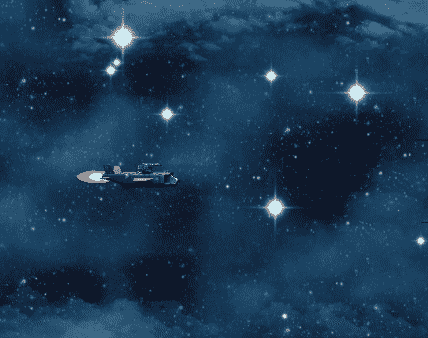

随着升级动画的出现，我在游戏中增加了能量，这将增加武器的强度(以及增加玩家可以承受的打击次数)。

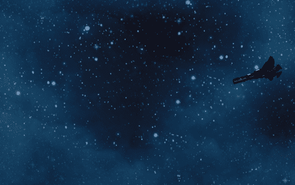

## 迷你老板遭遇

单子上的下一件事是做一个中级迷你老板。

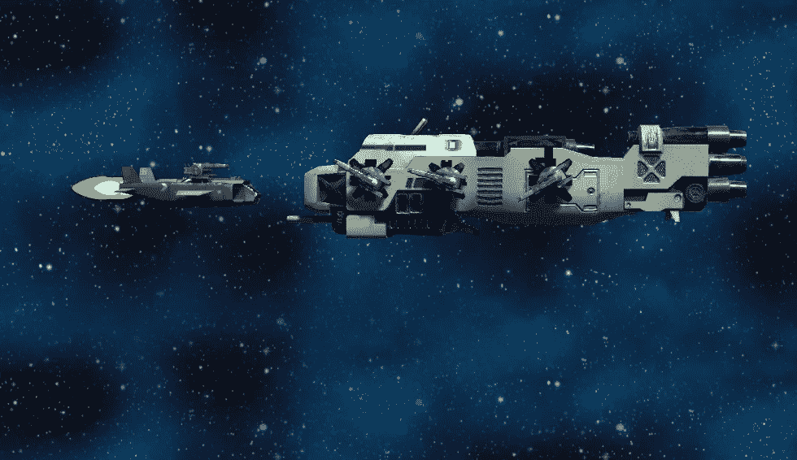

这个坏蛋有六个炮塔，当敌人利用屏幕外的掩护反复攻击然后撤退时，这些炮塔旋转以覆盖散布的射弹。

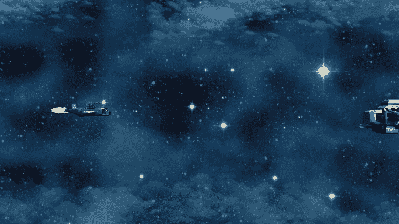

鬼鬼祟祟！

为了确保每次齐射的时机正确，我使用动画动作来调用 MiniBoss 类中的 fire 凌空()脚本。

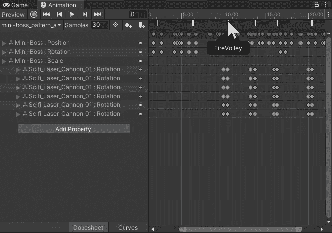

## 遭遇老板(第 1 部分，共 3 部分)

这是我一天时间用完的地方。我真的很想为此录制所有的动画，但我谨慎地决定优先考虑睡眠。听，听健康的选择！

总之，最后的 Boss *会分三个阶段*发生。在第一部中，无畏级的大部分安全地悬浮在屏幕之外:

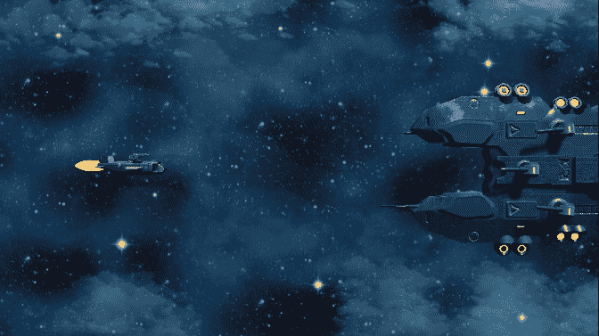

那些炮塔很难打，而且打得很狠！

三个炮塔追踪玩家的位置比跟班或迷你老板更准确。这些炮塔也和玩家有相同的强度等级，所以它们的爆炸开始是三个一组。他们不会像玩家那样随着伤害而降级——尽管这可能会随着我试图平衡遭遇而改变。

计划的其余部分非常简单:一旦玩家击败了这三个炮塔，他们将面对另一个发射奇异射弹的大炮塔。尽管如此，舰桥还是会停留在屏幕边缘的安全后方。最后，当大炮受到足够的伤害时，船的其余部分就会显露出来，玩家可以攻击舰桥(舰桥上有更多的炮塔)。摧毁舰桥后，整艘船将在火焰中沉没，并且会出现赢的游戏画面。

因此，完成那次遭遇和构建 UI 是我最小可行产品的最后两个元素。明天我会给你看完整的游戏，以及我今天有时间实现的任何附加功能。然后在周一我们将总结整个项目，我将展示我在周日添加的铃铛和哨子。

感谢阅读！