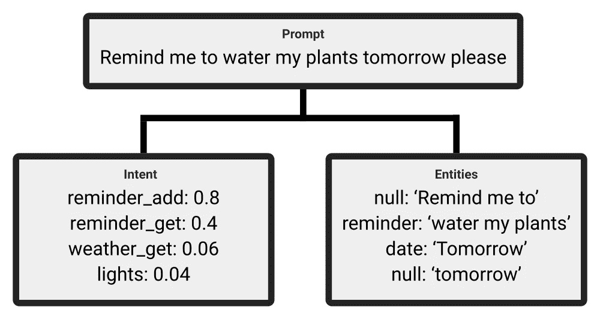
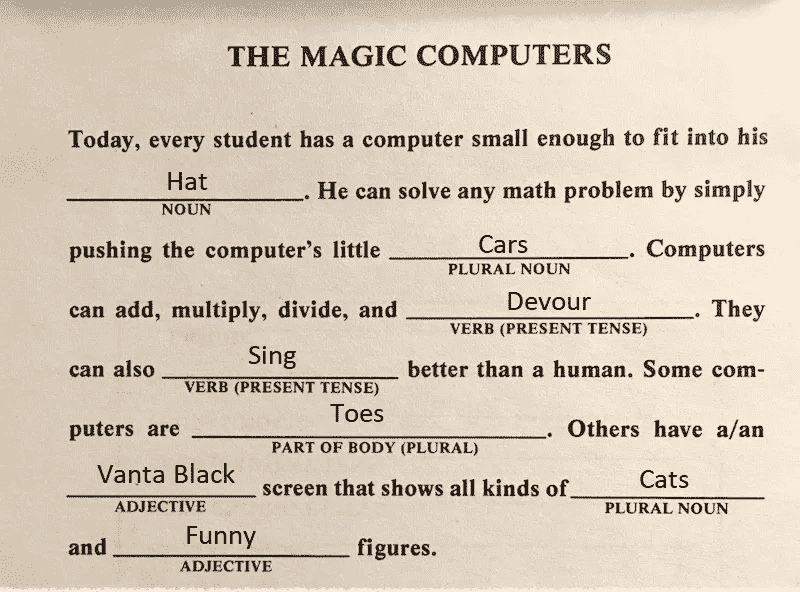
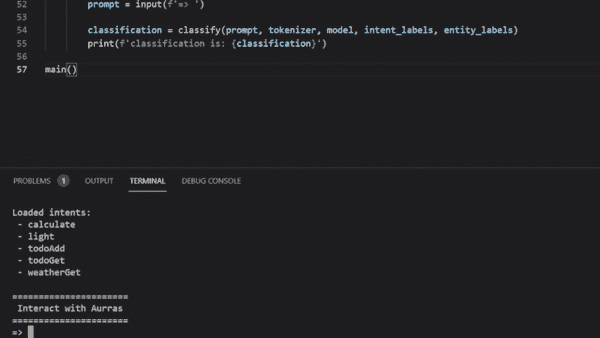

# 构建个人人工智能助手:第 1 部分

> 原文：<https://medium.com/nerd-for-tech/building-a-personal-ai-assistant-part-1-b73974f80c1?source=collection_archive---------1----------------------->

## 利用意图分类和实体抽取理解自然语言


托马斯·科尔诺斯基在 [Unsplash](https://unsplash.com?utm_source=medium&utm_medium=referral) 上拍摄的照片，经过编辑

Siri 是第一项让我真正“惊叹”的技术。能够自然地与计算机互动真的令人印象深刻。我想这种魅力在过去的十年里一直伴随着我。自然语言技术一直给我留下深刻的印象，不管它有效与否。这就是为什么我决定在过去的一个月里建立我自己的虚拟助手，名为[奥拉计划](https://github.com/Robert-MacWha/Project-Aurras)。

在接下来的三篇文章中，我将记录 Aurras 的核心组件是如何工作的。本文将关注数据准备。接下来的两个将分别关注意图分类和实体提取。这些系统放在一起，可以为大多数个人用例提供足够的交互。

# 虚拟助理的结构

这个虚拟助手，在基本层面上，将依赖于两个互锁的组件。意图分类以理解上下文，实体提取以定位含义。



## 意图分类

意图分类是**句子级别的**过程，它确定用户想要通过说出给定的句子来完成什么。举例来说，如果你要告诉你的虚拟助理“*请关灯，*”意图分类将分析该提示，并确定你打算发出“ *lights_off* ”命令。

## 实体提取

实体提取是**标记级**过程，定位与您的意图相关的关键词。例如，如果您发出提示“*打开楼下的灯*”，那么实体提取会将关键字**楼下**检测为**位置**。

> 开始前还有最后一件事。我准备了一个 Colab 笔记本，里面有这篇文章的所有代码，可以在这里找到。如果你对代码有问题，那么我推荐你看看 Colab 笔记本。如果做不到，请随时联系我，我会尽力帮助你。


# 数据集准备

在开始虚拟助手的工作之前，需要准备一个数据集。获取这个数据集的一个简单方法是寻找公共意图分类数据集，比如 rikhuijzer 的 Github 中的[这个](https://github.com/rikhuijzer/nlu_datasets/blob/master/data/chatbot/original/ChatbotCorpus.json)。然而，通过依赖预先制作的数据集，虚拟助手将被限制于仅理解存在于所述数据集中的命令。因此，我决定程序化地创建我自己的数据集。

## 程序数据集生成过程

创建自然语言数据集很困难，因为大多数时候，每个句子都需要手写。这对于我们的用例来说是不合适的。至少需要 1000 个数据点，而且要花很长时间才能写出这么多独特的句子。相反，可以利用句子的结构来促进程序生成。



为了生成数据集，需要找到产生句子的可靠方式。幸运的是，这个问题已经被 mad libs 的创造者解决了。Mad libs 是一种儿童游戏，玩家可以看到一组部分完成的句子。玩游戏的人在空白处填入正确类型的单词，如名字或动作。这就产生了个性化的故事。通过采用这种方法，可以从句子模板和词组的集合中生成数据集。

使用这种创建句子模板，然后填充缺失单词的方法，将极大地提高我们的数据生产率。例如，通过使用这三个句子模板，我能够生成超过 40 万个独特的句子。

*   什么是{ number } { math _ function } { number }
*   {prepend_request}计算{ number } { math _ function } { number }
*   {prepend_request}告诉我什么是{ number } { math _ function } { number }

为了增加多样性，大多数样本应该被丢弃，但是这种方法可以很容易地从这三个模板中生成一百个独特的句子。

## 用于程序数据集生成的代码

我已经写了代码，可以将句子模板转换成数据集。这段代码可以在**数据集生成**分支的[这里](https://github.com/Robert-MacWha/NLP-Intent-Classification/tree/Dataset-Generation)找到。如果您不想创建自己的数据集，那么下载 **resources** 文件夹并使用[预先存在的数据集](https://github.com/Robert-MacWha/NLP-Intent-Classification/blob/main/resources/data/train.csv)。这个预先存在的数据集包含以下**五种意向**的样本:

1.  计算
2.  光
3.  TodoAdd
4.  托多吉
5.  天气预报

可以按照自述文件中的说明添加更多示例。在继续本文之前，请随意添加更多示例，因为除了最终结果之外，它们不会影响任何东西。

# 意向分类概述

我知道我说过我们不会在本文中使用意图分类器，但是请耐心听我说。为了开始预处理步骤，首先必须理解预训练模型和记号化器之间的关系。

在 NLP 领域，预先训练的模型通常是庞大而复杂的。这意味着它们需要非常特定格式的输入数据。此外，由于大多数预训练模型使用不同的数据格式，因此必须编写代码来格式化它们所使用的每个 NLP 模型的数据集。为了解决这个问题，大多数 NLP 模型，实际上还有许多其他预先训练的模型，都带有标记化器。记号赋予器是处理所有格式问题以节省时间和减少出错几率的对象。

## 对数据集进行符号化

在使用意图分类数据集来训练模型之前，需要对其进行标记化。标记化是将我们的数据集转换成 NLP 模型可以理解的格式的过程:**number id**。

> 对于**更多关于标记化的信息**，我建议阅读[的这篇](https://huggingface.co/course/chapter2/4?fw=pt)文章。它对标记化给出了比我更好的解释。

为了将原始句子转换成它们的标记形式，使用了一个**标记器**。在这种情况下，标记器来自 [HuggingFace](https://huggingface.co/course/chapter2/4?fw=pt) 的 transformer 库。由于*distilbert-base-uncated*变压器将在模型中使用，因此这里也必须使用它的令牌化器。

要对数据集进行令牌化，必须首先将其加载到 python 中。还必须创建一个**记号赋予器对象**。

```
from transformers import DistilBertTokenizerFast
from ast import literal_eval
import pandas as pd
import json#* create the tokenizer
tokenizer = DistilBertTokenizerFast.from_pretrained('distilbert-base-uncased')#* load in the dataset
df_train = pd.read_csv('https://raw.githubusercontent.com/Robert-MacWha/NLP-Intent-Classification/Intent-Classification/resources/data/train.csv')# load json data
resp = requests.get('https://raw.githubusercontent.com/Robert-MacWha/NLP-Intent-Classification/Intent-Classification/resources/data/intent_labels.json')intent_labels = json.loads(resp.text)
intent_count = len(intent_labels)
```

一旦数据集被加载，标记器就可以用来将文本转换成数字输入 id。

```
inputs = tokenizer(
    list(df_train['words']),      # specify the string[] to tokenize
    max_length=128,               # custom padding
    padding='max_length',         # sets padding to the custom value
    return_attention_mask=True,
    return_token_type_ids=False,
    return_tensors='np'           # flag to return numpy array
)x_train_ids = inputs['input_ids']
x_train_attention = inputs['attention_mask']
```

记号赋予器将返回两个数组— *x_train_ids* 和 *x_train_attention* 。 *train_ids* 变量包含一组**标记化的句子**，可以直接输入到模型中。 *train_attention* 变量用于告诉模型哪些标记是填充的，哪些不是。因为记号赋予器使用了 128 的填充，所以所有较短的句子都将被附加 null 记号(0 ),直到它们达到那个长度。

```
# An example of a single sentence after being tokenizedprint(x_train_ids)
# the first 7 numbers are text IDs, while the rest are padding
# [7993, 170, 11303, 1200, 2443, 1110, 3014, 0, 0, 0, 0, 0, ..., 0]print(x_train_attention)
# ones denote parts of the sentence, zeros denote padded tokens/
# [1, 1, 1, 1, 1, 1, 1, 0, 0, 0, 0, 0..., 0]
```

因为注意力屏蔽告诉模型哪些标记是重要的，所以它允许模型只关注那些信息标记。

最后，用于标记化句子的 y_labels 需要被转换成**一个热标签**。这是使用 TensorFlow 的 *one_hot* 函数完成的，并且是必要的，因为模型的输出是一个热分类。

```
y_train_intents = tf.one_hot(df_train['intent_label'].values, intent_count)
```

最后，让我们打印出其中一个数据点，以确保一切都按计划进行。

```
# sample datapoint
print(f'Prompt:         {df_train["words"][0]}')
print(f'Token IDs:      {x_train_ids[0][:12]}...')
print(f'Attention mask: {x_train_attention[0][:12]}...')
print(f'One-hot Label:  {y_train_intents[0]}')# Prompt: can you calculate twelve point five plus two Token
# IDs: [101 2064 2017 18422 4376 2391 2274 4606 2048, 102 0 0]... 
# Attention mask: [1 1 1 1 1 1 1 1 1 1 0 0]... 
# One-hot Label: [1\. 0\. 0\. 0\. 0.]
```

就是这样！提示已被标记和填充，注意掩码与输入 id 匹配，标签是正确的。接下来的步骤是构建和训练一个意图分类转换器，但这是本系列的第二部分。我将在几天后发布它，所以如果你已经完成了这篇文章，请耐心等待并关注我，这样当我发布第二部分时你会得到通知。



下面先睹为快！

> 感谢阅读我的文章！请随意查看我的[作品集](https://tks.life/profile/robert.macwha#portfolio)，如果你有什么要说的，请在 [LinkedIn](https://www.linkedin.com/in/robert-macwha-0555141b6/) 上给我发消息，或者在 Medium 上关注我，以便在我发布另一篇文章时得到通知！

## 有用的链接

*   **Colab 笔记本**带代码进行数据预处理:
    [https://Colab . research . Google . com/drive/1 vpqa 35 swt bo 5 mz 6 miw 5n 8g 9 mllyqo 9n？authuser = 1 # scroll to = jpsujt9x 53-P](https://colab.research.google.com/drive/1VpqA35sWtbO5MZ6miw5N8g9mMlLyqO9n?authuser=1#scrollTo=JPsujT9X53-P)
*   **用于创建自定义意图分类数据集的代码库**包括文档:
    [https://github . com/Robert-MAC wha/NLP-Intent-Classification/tree/Dataset-Generation](https://github.com/Robert-MacWha/NLP-Intent-Classification/tree/Dataset-Generation)
*   **介绍**变形金刚，由 HuggingFace。对于本文，只有“*变压器型号*”部分是重要的:
    [https://huggingface.co/course/chapter1](https://huggingface.co/course/chapter1)
*   **介绍**给 tokenizers，by hugging face:
    https://huggingface.co/course/chapter2/4?fw=pt