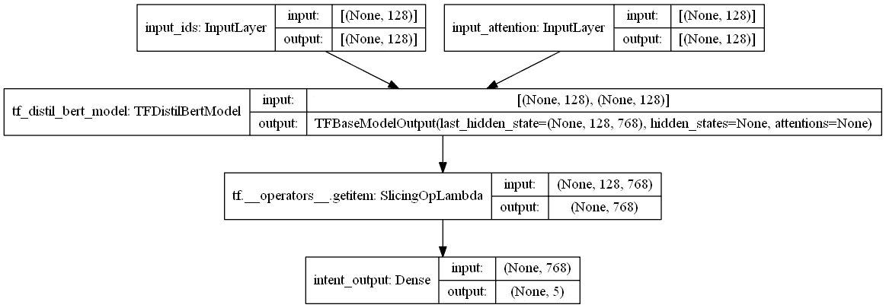
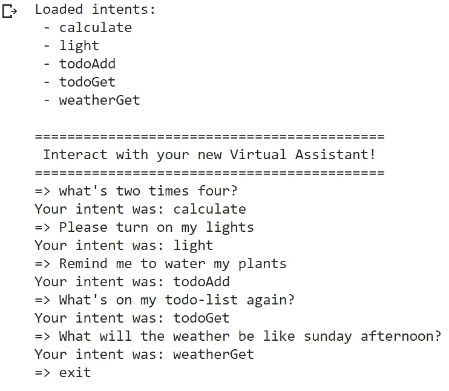

# 构建个人人工智能助手:第 2 部分

> 原文：<https://medium.com/nerd-for-tech/building-a-personal-ai-assistant-part-2-afb26c2a3b5b?source=collection_archive---------4----------------------->

## 利用意图分类和实体抽取理解自然语言——意图分类


托马斯·科尔诺斯基在 [Unsplash](https://unsplash.com?utm_source=medium&utm_medium=referral) 上拍摄的照片，经过编辑

欢迎回来！这是我正在撰写的关于构建个人虚拟助理的迷你系列的第二部分。我建议在开始这篇文章之前先阅读上一篇文章，因为它包含了重要的代码。如果你来自我之前的文章，很高兴再次见到你！是时候使用我们花了这么长时间准备和预处理的数据集了。是时候建立我们的模型了。

# 变形金刚(电影名)

我们的意图分类模型将由一个预训练的转换器和一些附加层组成。变形金刚是机器学习模型，特别擅长理解**自然语言**。这些模型发展了对语言的统计理解，这使得它们能够理解单词背后的含义。然而，变形金刚的缺点是它们通常很庞大，无论是在层数还是训练数据方面。例如，GPT-2 使用了超过 40GB 的原始训练数据。正因为如此，最好使用**预训**车型。

## 预训练模型

预先训练的变形金刚，如伯特，是已经接受过各种任务训练的变形金刚。这意味着其他人已经为我们完成了大部分培训工作。我们所需要做的就是微调模型，使其最适合我们的用例。在本文中，我将使用 distilBERT 作为我的预训练转换器。DistilBERT 是一个基于更大的 BERT 模型的转换器。通过使用 distilBERT 而不是 BERT，我们将有一个运行速度比**快 60%**的模型，而且几乎没有任何负面影响。

## 构建我们的模型



意图分类转换器的布局。

我们的意图分类模型将接受两个输入，*输入标识*和*输入注意。*这些输入由 tokenizer 生成，包含 distilBERT 的重要信息。两个输入的大小都是 128，这对应于我们在记号赋予器中指定的填充。

```
import tensorflow as tf
from transformers import TFDistilBertModel# define the input layers
input_ids_layer = 
tf.keras.layers.Input(
    shape=(128,),           # shape of 128 coresponds to the padding
    name='input_ids',
    dtype='int32',
)input_attention_layer = 
tf.keras.layers.Input(
    shape=(128,),           # shape of 128 coresponds to the padding
    name='input_attention',
    dtype='int32',
)
```

然后我们可以创建*distilbert-base-uncased*transformer，它是模型的核心。两个输入层都被输入到这个变换器中，这产生了*最后 _ 隐藏 _ 状态*层。该图层的大小为[ *batch_size，128，768* ]。DistilBert 接受我们的文本输入，并为每个令牌返回 768 个唯一向量。

```
# create the pre-trained model
transformer = TFDistilBertModel.from_pretrained('distilbert-base-uncased')# feed the inputs into the pre-trained model
# results in a layer of shape (
#    batch_size, 
#    sequence_length, 
#    hidden_size=768)last_hidden_state = transformer([
    input_ids_layer, 
    input_attention_layer])[0]
```

为了使我们的分类器更容易，我们将只使用第一批 768 个向量。我们使用第一批并不重要，这只是常规。然后，这一层将被输入到一个稠密层中，作为我们的输出。输出层应用 softmax 函数将标量输出转换为概率，以便我们可以比较每个意图分类的可能性。

```
# the cls token contains a condensed representation of the entire last_hidden_state tensor
cls_token = last_hidden_state[:, 0, :]# create the output layer
intent_output = tf.keras.layers.Dense(
    intent_class_count,
    activation='softmax',
    kernel_initializer=weight_initializer,
    kernel_constraint=None,
    bias_initializer='zeros',
    name='intent_output'
)(cls_token)
```

最后，可以定义一个 Keras 模型来包含我们所有的层。

```
# define the model
model = tf.keras.Model(
    [input_ids_layer, input_attention_layer], 
    [intent_output])print(model.summary())
```

对模型做的最后一件事是编译它。我发现与 [**分类交叉熵**](https://stats.stackexchange.com/questions/260505/should-i-use-a-categorical-cross-entropy-or-binary-cross-entropy-loss-for-binary#answer-410165) 损失函数配对的 [**亚当**](https://machinelearningmastery.com/adam-optimization-algorithm-for-deep-learning/) 优化器效果最好。尽管可以随意试验优化器，但是最好保持损失函数不变。

```
model.compile(
    optimizer = tf.keras.optimizers.Adam(learning_rate=5e-5),
    loss      = tf.keras.losses.CategoricalCrossentropy(),
    metrics   = [tf.keras.metrics.CategoricalAccuracy('categorical_accuracy')])
```

## 训练模型

在编译完意图分类模型后，您应该会得到一个类似于[这个](https://colab.research.google.com/drive/10h9idWFH5sromz6Oy41mq1HUirKI3Rb7?authuser=1#scrollTo=yQviC7KCdSQp)的脚本。在我们的数据集上运行 *model.fit* 在使用 **GPU** 运行时的 Google Colab 中每个历元需要大约四十秒。除非添加了许多新的意图，否则该模型往往会在两个时代后收敛。

```
#* train the model
history = model.fit(
    x = [x_train_ids, x_train_attention],
    y = [y_train_intents],
    epochs = 2,
    batch_size = 16,
    verbose = 1
)
```

需要注意的一点是，没有提供验证数据。这是因为通过交互可以更容易地看到模型的效果。通过与模型交互并主动寻找错误，可以将目标句子模板添加到训练数据集中。

# 结果

为了与模型进行交互，您首先需要编写一个快速交互脚本。由于这与本文的主题没有直接关系，我建议您从提供的 Google Colab 中复制最后两个[代码块](https://colab.research.google.com/drive/10h9idWFH5sromz6Oy41mq1HUirKI3Rb7?authuser=1#scrollTo=QIdUZj_zhwuG)。一旦在你的脚本中，运行整个程序，看看你的意图分类器工作的有多好。



与意图分类模型交互，测试每个意图。

如果你运气好的话，那么你的意图分类器应该可以第一次尝试。如果没有，下面是我遇到的几个问题。

*   **无法导入变形金刚:**用 pip 安装变形金刚库。这在 Colab 笔记本中也是需要的。

```
!pip install transformers
```

*   **Model not training:** 确保您使用的填充为 128，并且模型输入的形状为(128，)。
*   **训练时间长**:确认你的运行时使用的是 GPU。这可以在运行时>中改变运行时类型。
*   **损失低，但模型交互被破坏**:确保在分类函数中，您正在将令牌化的 model_input 从字典转换为数组。

```
model_input = [
    model_input['input_ids'], 
    model_input['attention_mask']]
```

这就是一切！既然已经完成了意图分类，为什么不尝试添加更多的功能，比如文本解析或实体提取呢？哦，等等——实际上我现在正在为这两个网站写文章！请务必关注我，这样当我发布这些内容时，你会得到通知，这样你就可以将这个虚拟助手变成一个可以与 Siri 或 Google home 相媲美的助手了！


下面先睹为快！

> 感谢阅读我的文章！请随意查看我的[作品集](https://tks.life/profile/robert.macwha#portfolio)，如果你有什么要说的，请在 [LinkedIn](https://www.linkedin.com/in/robert-macwha-0555141b6/) 上给我发消息，或者在 Medium 上关注我，以便在我发布另一篇文章时得到通知！

## 重要链接

*   **Colab 笔记本**带代码的交互意图分类模型:
    [https://Colab . research . Google . com/drive/10 H9 id wf H5 sromz 6 oy 41 m1 huirk i3 Rb 7？usp =共享](https://colab.research.google.com/drive/10h9idWFH5sromz6Oy41mq1HUirKI3Rb7?usp=sharing)
*   **用于创建自定义意图分类数据集的代码库**包括文档:
    https://github . com/Robert-MAC wha/NLP-Intent-Classification/tree/Dataset-Generation
*   **用于意图分类的代码库**—文档包括:
    [https://github . com/Robert-MAC wha/NLP-Intent-class ification/tree/Intent-class ification](https://github.com/Robert-MacWha/NLP-Intent-Classification/tree/Intent-Classification)