# 构建富文本编辑器:第 1 天

> 原文：<https://medium.com/nerd-for-tech/building-a-rich-text-editor-day-1-18771b9d4be2?source=collection_archive---------6----------------------->

## 项目结构|开发核心|识别关键子问题

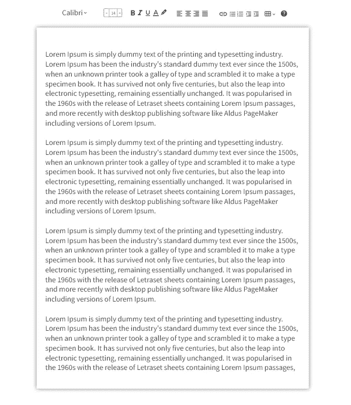

## [指标](https://svr8.medium.com/building-a-rich-text-editor-index-5d11d23c5111)

构建了两次编辑器后，我意识到有太多的东西在运行，我忘记了几分钟前我构建了什么。整个项目无休止的滚动和模糊的结构让我失去了注意力。在这篇文章中，我将在开始真正的开发之前，构建我的项目并确定关键的子问题。这只是为了防止我迷失在庞大的代码库中。

事实上，文本编辑器非常类似于制造一个机器人。当我把编辑当成机器人时，我会说机器人有一系列传感器和组件(键盘、鼠标和屏幕)，所以它知道是否有人告诉它做什么。所以，有一些数据流(像 click、mouseup、keydown 这样的事件)向机器人报告数据。它将分析来自所有 3 个设备的数据，并作出决定(事件处理程序)和执行的东西(反映在屏幕上的任何编辑)。

如果我把上面描述的行为放在构建网页的技术术语中，核心编辑器逻辑将有:

*   **事件处理程序部分:**接收所有通过 DOM 输入的数据流(键盘和鼠标)。
*   **自定义处理器:**解释组合并根据文档的当前状态做出决定。这意味着各种文档特性的高级实现。
*   **DOM 操纵器:**做出决定后，任何视觉上的改变都将通过一个操纵器来实现。
*   **实用程序:**这些是辅助功能，不会直接与键盘、鼠标或屏幕交互。它们主要是上述 3 个部分经常使用的一些操作的转储。

# 文件夹结构

我将从用`ng new text-editor`创建一个项目开始，并创建以下结构:

```
src
| assets
| | fonts
| | images
| | styles
|
| app
| | config
| | models
| | modules
| | | text-editor
| | | | components
| | | | | editor <- generated using angular cli
| | | | util
| | util
```

`assets` 文件夹非常直观。我在这里有所有的资源文件，比如 SVG、png，甚至全局样式，比如颜色主题。

`app`是所有源代码的根:

`config`:这里的文件只包含常量变量。

`models`:所有与编辑器相关的逻辑类都应该放在这里。这些模型永远不会直接与任何外部实体(如 DOM、鼠标或键盘)进行交互。它们表示文档的当前*状态*。

`modules`:这将包含角度模块。我们将有一个模块来包含所有的文档组件。每个模块都有一个保存所有组件的`components`目录和一个保存任何指令或服务的`util`目录。

`util`:我们可能需要额外的助手工具，这些工具不一定与文档的行为相关，例如，Rope 数据结构。如果我选择实现 Rope，我会把它放在这里。

# 开发模型设计

从哪里开始？！？！？！我通常从关注 UI 设计和任何已经开发的核心数据结构开始。

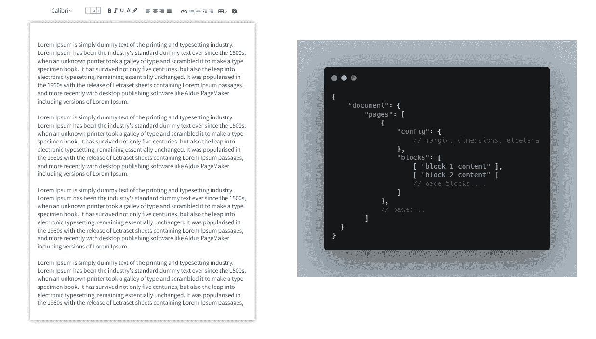

第 0 天设计

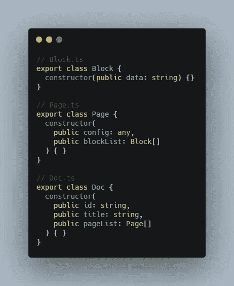

模型

我暂时将编辑工具留在标题中。我将从开发核心模型开始，并尝试将其链接到 DOM。我将在文档中添加一个`id` 和`title` 属性。这将使它很容易存储在数据库中，并帮助我在 DOM 中定位文档。让我们在模型下创建 *Block.ts* 、 *Page.ts* 和 *Doc.ts* 文件。

在我开始编辑我们的 angular 组件文本编辑器之前，我将组织一下结构，因为我相信这个文件会非常大。

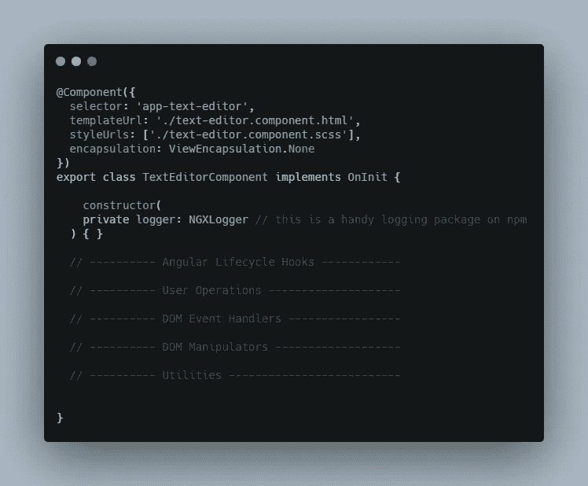

文本编辑器.组件. ts

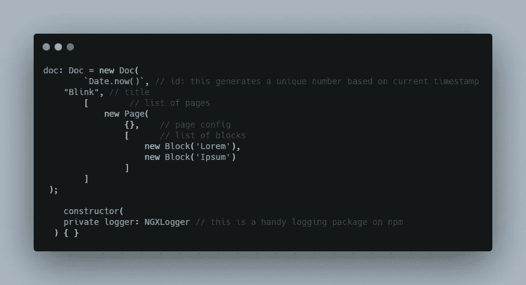

文本编辑器.组件. ts

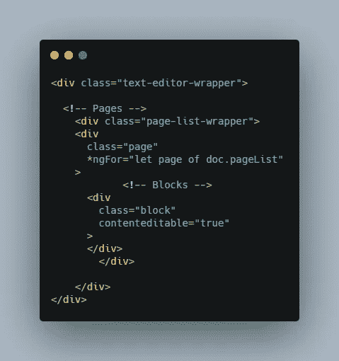

text-editor.component.html

这些部分就是上面 4 点中描述的部分。我已经将*自定义处理器*重命名为用户操作。像 *FindAndReplace* 这样的特性的所有高级实现都将放在这里。其他部分完全按照上述方式放置。因此，我将创建一个虚拟文档，并随时构建 HTML。

我不共享`.scss` 文件。会很漫长。w3schools.com 是我学习时尚的一站式服务点。

我这里有一页。但是，那两个虚拟块呢？我需要一些 getter setter 工具来设置 DOM 块中的数据。如果您检查这个页面上的页面元素，您将看到两个包含空内容的块 div。

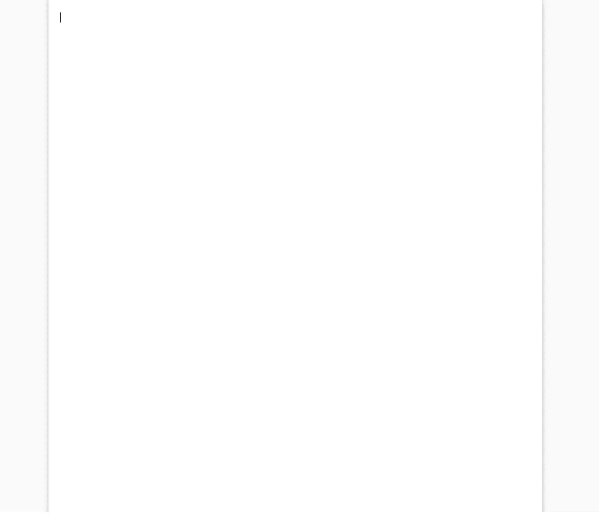

当前用户界面

为了完美地定位 div，我将为每个页面和块赋予惟一的 id。此外，我们需要一些工具将内容放入 DOM。

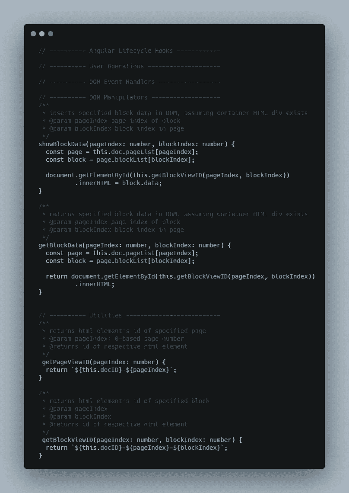

文本编辑器.组件. ts

我已经更新了块和页面的 div 以支持`ids` 和`indices`。


text-editor.component.html

请注意`(onCreate)`事件。Angular 不提供每次内容呈现时触发的事件。

因此，假设我使用`component.ts`文件中的 doc 对象更改块内容，它不会在这里得到反映。为了处理这个问题，我基于 StackOverflow 的回答创建了一个 on-create Angular 指令。不过创建这个有点棘手。

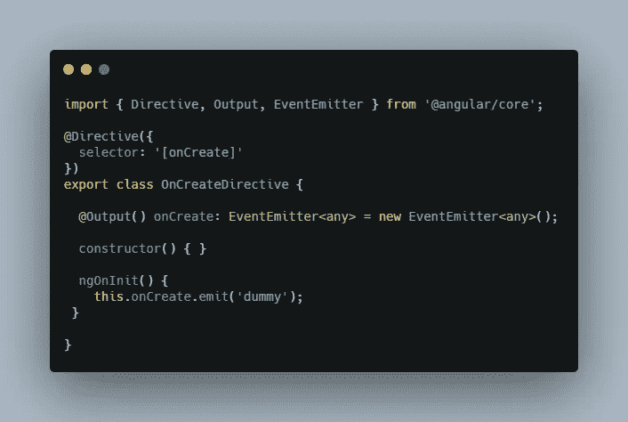

on-create.directive.ts

因此，每次我更新 doc 对象中的页面数组或块数组时，更改都会在这里得到反映。

这是我们的基地。现在应该可以正常工作了。我准备把我能想到的子问题列出来，在后面的文章里迭代解决。

# 子问题

**将换行符转换成块**

跟进[区块](https://svr8.medium.com/building-a-rich-text-editor-day-0-faca73c09e00)背后的动机，每次我按下回车键，它不应该扩大当前区块。相反，需要在当前块之后创建一个新块。我将添加一个简单的事件按键事件处理程序并实现它:

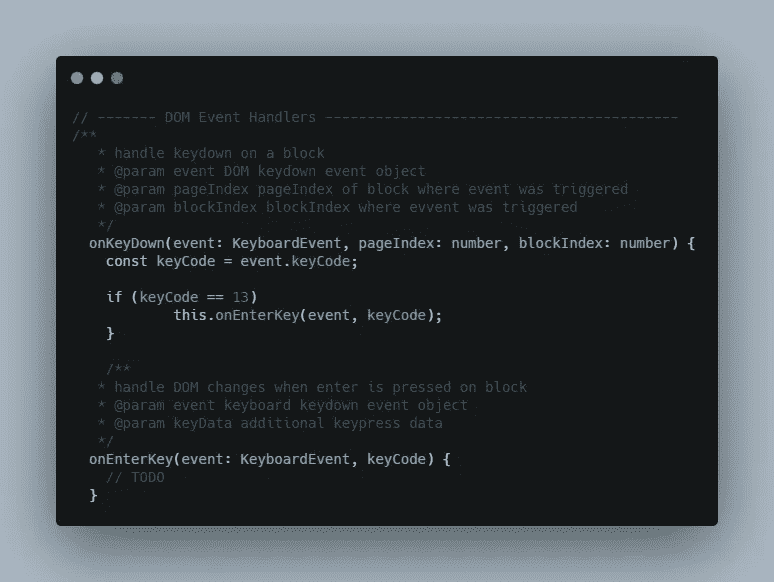

文本编辑器.组件. ts

**检测并触发页面内容溢出分页**

内容是动态的。我无法计算字符数和检查页面尺寸。

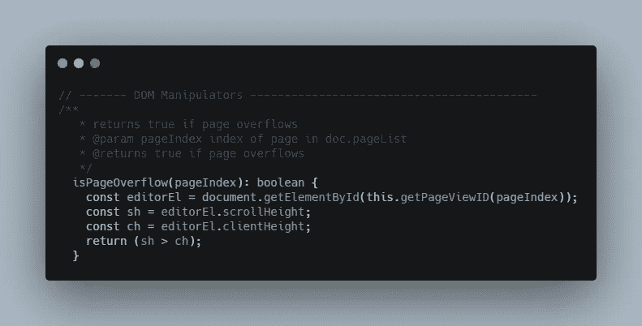

文本编辑器.组件. ts

一个可能的解决方案是检查 DOM 中每个块的高度，并将其与页面高度进行比较。但是等等。请注意，当 div 中的内容溢出时，滚动条会自动出现。通过 DOM APIs 本身肯定有某种机制。

DOM 已经提供了外部高度和内部滚动高度值。因此，比较它们的值是检查溢出的简单方法。

**检测并触发阻止块中的内容溢出**

如果你继续输入，你会看到一个区块垂直扩展，为更多的字符腾出空间。我认为这有点棘手。我不能在这里使用页面溢出的解决方案，因为块的高度永远不会相同。由于字体大小不同，它们的高度也不同。嗯，目前，我想不出解决办法。F.

**跨多个块的文本选择**

网页不允许我们一次选择多个 div。如果您开始选择文本并将鼠标移过多个块，您将无法选择其他块。必须有一种机制来检测鼠标移动和手动高亮块。我将创建一个鼠标对象`models/MouseData.ts`,稍后再对其进行优化:

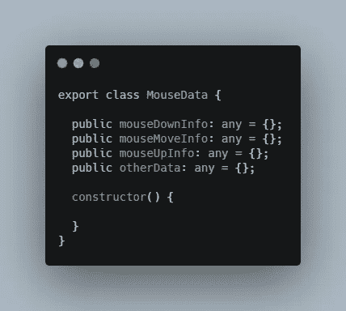

模型/鼠标数据. ts

暂时把它包起来。
拜拜。

## [下一篇文章](https://svr8.medium.com/building-a-rich-text-editor-day-3-ef3e8dc02516)