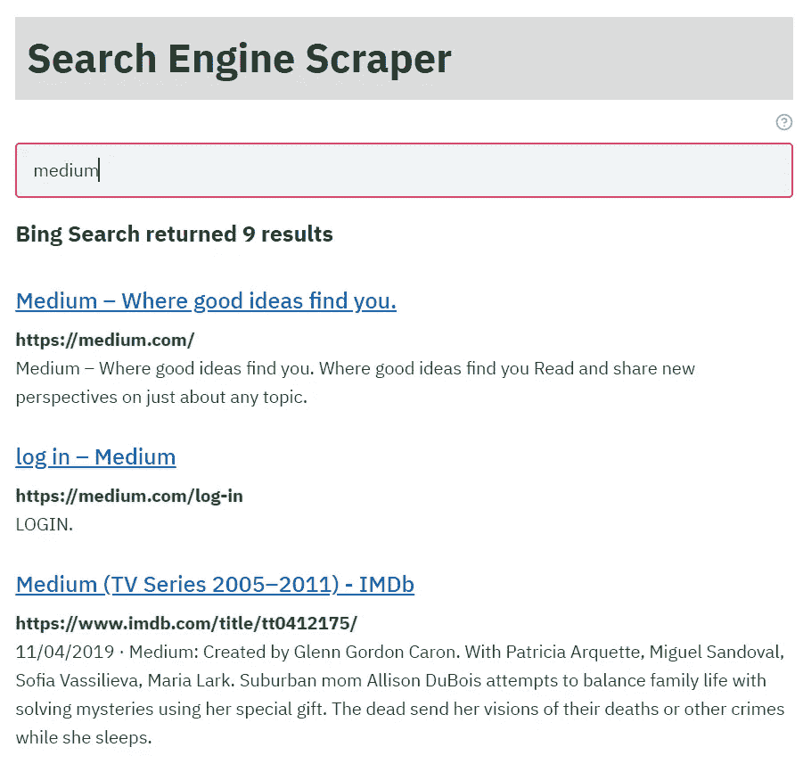
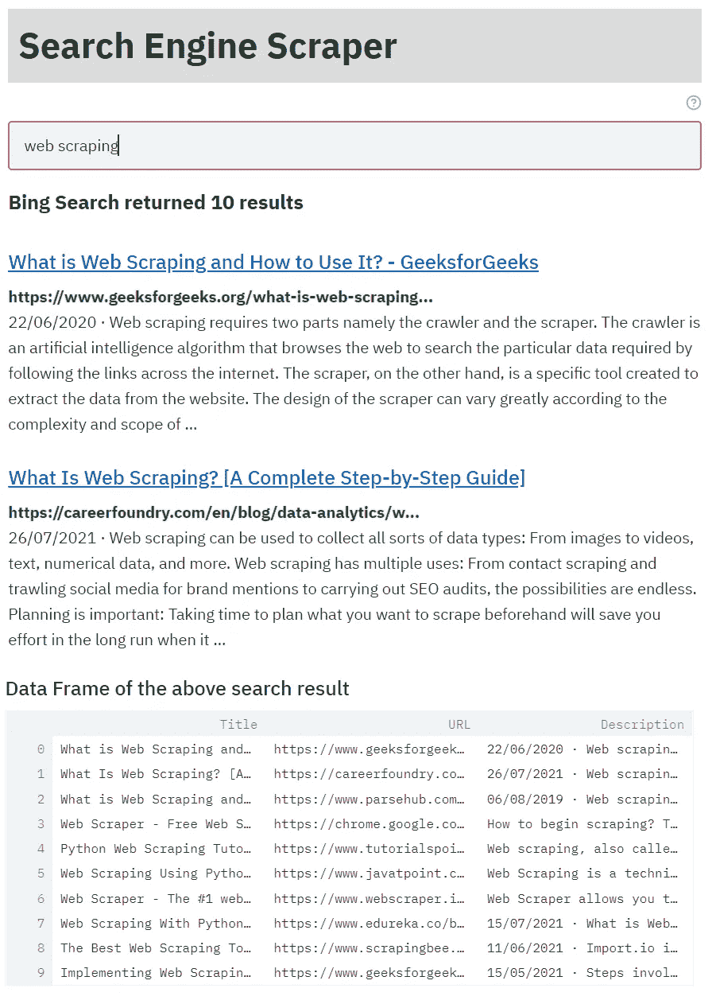
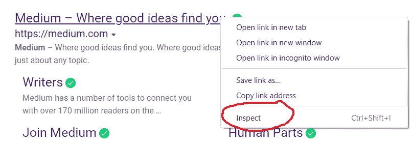
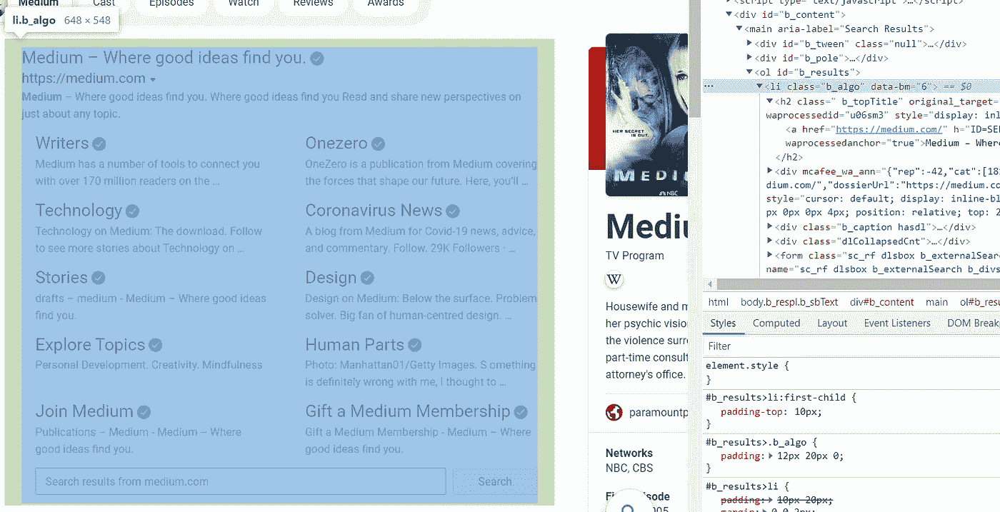

# 用 Streamlit 构建搜索引擎刮刀

> 原文：<https://medium.com/nerd-for-tech/building-a-search-engine-scraper-with-streamlit-b616e5bd293c?source=collection_archive---------1----------------------->

## Web 抓取是一种通过最少的人工努力从 web 上获取数据的有效技术



作者图片

## 网页抓取

Web 抓取使我们能够以最少的人工努力从 web 上获取数据。然而，这种技术必须小心使用，以免降低网站的性能。在继续之前，我们将讨论一些提示，以保护我们自己不被网站列入黑名单，从而降低其性能。

1.  我们不应该像 DDoS 攻击那样让网站的服务器超载，这是不道德的做法。如果我们让一个网站的服务器超载，我们可能会被列入黑名单。我们可以使用 Python 中的**时间**包的 **sleep()** 函数，在我们的请求之间给出随机暂停。
2.  我们必须不断更换用户代理。我们可以维护一个用户代理的 csv 文件，并经常切换它们。我们将在本文后面讨论更多关于用户代理的内容。
3.  我们必须继续保存收集到的数据。这可以确保当网站将我们列入黑名单时，我们的数据不会丢失。我们可以从最后保存的检查点重新开始擦除，而不是重新开始。
4.  如果可能的话，我们可以使用 Python 的 **selenium** 包，它使我们能够模仿人类的活动，如滚动、点击等。这可能会降低我们被列入黑名单的几率。
5.  我们必须仔细检查并遵守网站的“robots.txt ”,以识别禁止访问的页面以及不允许访问网站的用户代理。我们可以使用“domain/robots.txt”访问“robots.txt”。例如，我们可以使用[bing.com/robots.txt](http://bing.com/robots.txt)访问 bing.com 的 robots.txt。

## 搜索引擎刮刀

在本文中，我们将使用 BeautifulSoup 和 Streamlit 构建一个搜索引擎 scraper*。该应用程序将搜索字符串作为输入，从 Bing 的第一页抓取搜索结果并显示出来。该应用程序还会返回搜索结果的数据框。下面是 Streamlit 应用程序的 Python 代码，并使用注释进行了清楚的解释。

***本应用程序仅用于说明网页抓取的过程。强烈建议使用搜索引擎的 API 来提取搜索结果。网络抓取应该只是最后的手段。**

上述代码可以通过在本地机器的终端中执行以下命令来运行。

```
streamlit run filename.py
```

**filename.py** 是包含上述代码的 python 脚本文件。下面是我们执行命令后得到的输出截图。在这种情况下，包含 Python 脚本的文件的名称是**bing _ scrape _ streamlit . py**。因此，运行代码的命令如下所示。

```
streamlit run bing_scrape_streamlit.py
```

下面是在本地机器的终端中执行上述命令后，应用程序在本地浏览器中的输出。我们还可以在输出的底部看到结果的数据框。



作者图片

## 提取的搜索结果有什么用？

*   要查找公司列表的网站，假设(公司的)第一个搜索结果主要是公司的网站。这可以通过在公司列表上循环代码并存储从 API 请求中抓取的结果/响应来实现。大多数 API 也支持批量请求。然而，这可能需要一些进一步的验证，因为不是每个第一搜索结果都包含一个公司的网站。
*   找到人们/公司的社交媒体页面的 URL。这可以通过在搜索字符串中包含一个人/公司的名称和所需社交媒体网站的名称来实现。网站搜索可能更有帮助。
*   查找与某公司相关的最新消息。

上面提到的所有任务都需要大量的手动工作，这些工作随着要搜索的实体的大小而增加。因此，web 抓取/API 在很大程度上减少了这种手动工作。然而，需要人在回路中来验证结果。

我们将讨论一些在网络抓取初学者的头脑中可能出现的问题。

**1。什么是 requests.get()？**

requests 包使我们能够用 Python 处理 HTTP 请求。它的 **get()** 函数向 web 服务器发送查询并返回响应。

**2。什么是用户代理？**

用户代理描述正在使用的浏览器和操作环境。这使得网络服务器能够发送最适合我们的浏览器/设备的内容。移动设备上的浏览器与 Windows 系统上的 Google Chrome 有不同的用户代理。切换用户代理保护我们不被列入黑名单，因为 web 服务器从多个设备获得请求。

**3。什么是 BeautifulSoup？**

BeautifulSoup 解析 HTML/XML 文档，使我们能够从网页中提取数据。我们必须将请求响应的内容/文本传递给 BeautifulSoup 类进行解析。然后，我们可以提取网页的 HTML 脚本的元素/标签。

**4。我们如何选择正确的 HTML 标签？**

我们可以通过检查网页的源代码来识别正确的标签。**“inspect”**功能在所有流行的网络浏览器中都可用。我们将讨论如何**‘检查’**一个网页的源代码。

**第一步:**我们将右键单击网页中我们想要抓取的元素，并选择**‘Inspect’**。对于搜索引擎抓取器，我们希望抓取一个搜索结果的标题、URL 和描述。因此，我们将右键单击第一个搜索结果中的 URL。



作者图片

**第二步:**我们必须选择一个标签(父标签)，嵌入所有我们想要刮取的标签(子标签)。例如，我们需要抓取搜索结果，所以我们将选择一个父标签，嵌入附加到单个搜索结果的所有标签。在下图中，< li class="b_algo" >嵌入了附加到单个搜索结果的所有标签。现在，我们可以通过单独处理每个< li class="b_algo" >(搜索结果)来从< li class="b_algo" >中提取每个子标签。

我们不应该只选择

## (搜索结果的标题)或

(搜索结果的描述)。这可能会选取页面中除了与搜索结果相关联的那些之外的其他

## 和

。这也可能使我们很难将一个列表

## 映射到一个列表

。



作者图片

因此，网络抓取帮助我们减少从网络上获取数据所需的人工劳动。如果网站的结构保持不变，我们可能会多次使用相同的代码从网站中提取数据。从网页中提取 HTML 脚本的代码对于所有网站都是相似的。不同的是从 HTML 脚本中清理和提取所需数据的过程。

然而，我强烈推荐使用搜索引擎 API 来提取搜索结果。网络抓取应该只是最后的手段。即使你选择了网络抓取，也必须在不降低网站性能的情况下进行，并且只能用于提取公开信息。