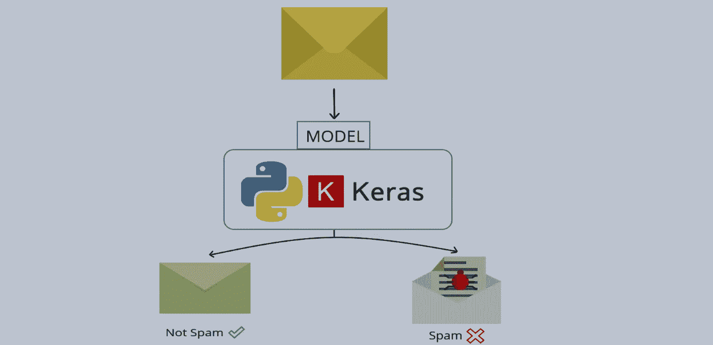
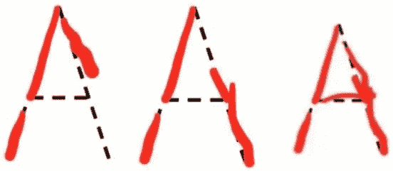
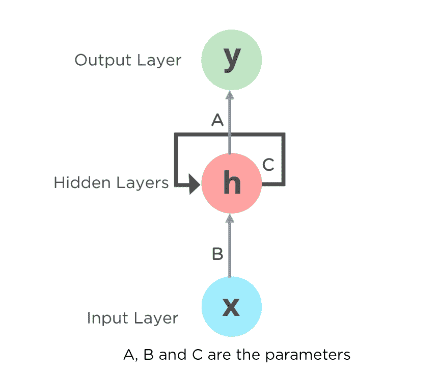
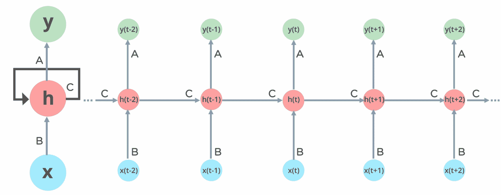
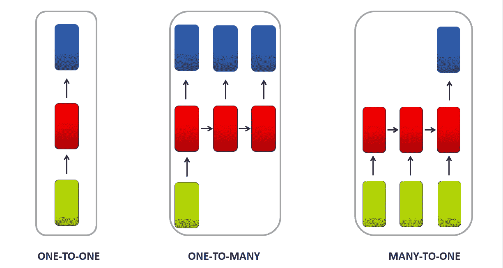
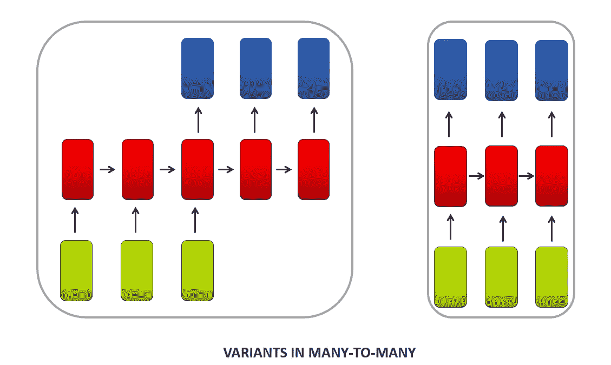
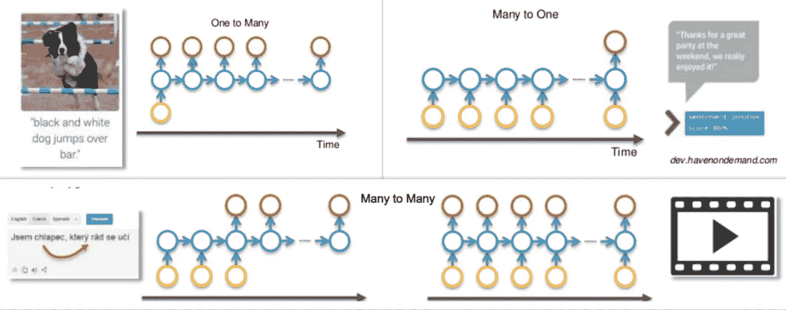
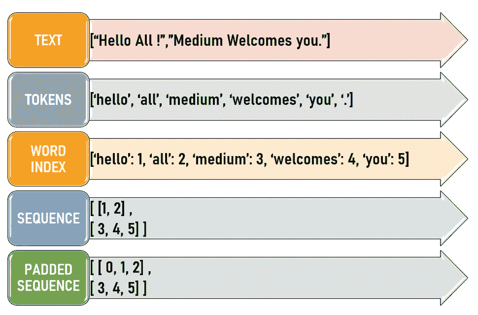

# 使用 RNN 构建文本分类器

> 原文：<https://medium.com/nerd-for-tech/building-a-text-classifier-using-rnn-57b546d3d35a?source=collection_archive---------5----------------------->

在我们的[最后一个故事](/nerd-for-tech/natural-language-processing-using-python-nltk-5c1804d0962d)中，我们讨论了在不使用 RNN 的情况下构建文本分类器。在本文中，我们将讨论使用递归神经网络(RNN)来构建文本分类器。

使用 RNN 的垃圾短信分类

# 为什么是 RNN &为什么不是安？

让我们想象一下，当我们第一次被教在练习纸上写字母 A 时，我们会做这样的事情。

练习字母 A

在书写本身的过程中，我们会意识到笔正在移出线条，笔画必须改变。所以如果可能的话，我们会在适当的时候擦掉或者至少改变钢笔的方向。这正是递归神经网络(RNN)所做的。

传统的神经网络将处理一个输入，并移动到下一个输入，而不管它的**序列**。人工神经网络完成该过程，并通过[反向传播](https://machinelearningmastery.com/gentle-introduction-backpropagation-time/)计算误差。与人工神经网络不同，人工神经网络本质上是在过程开始时给出反馈。RNNs 适应[通过时间的反向传播(BPTT)](https://machinelearningmastery.com/gentle-introduction-backpropagation-time/) ，因为该模型是时间的并且处理时间序列/序列数据。传统的前馈神经网络不能理解这一点，因为每个输入都被假设为彼此独立，而在时间序列/序列数据中，每个输入都依赖于前一个输入。与前馈神经网络不同，rnn 可以使用其内部状态(记忆)来处理输入序列。

# 递归神经网络(RNN)

递归神经网络(RNN)是具有内部存储器组件的前馈神经网络的推广。RNN 本质上是递归的，因为它对每个数据输入执行相同的函数，并且当前输入的结果依赖于先前的计算。产生输出后，它被复制并传输回循环网络。

将人工神经网络转换为神经网络

神经网络不同层中的节点被压缩以形成单层递归神经网络。a、B 和 C 是网络的参数。

全连接递归神经网络

**x-输入层，h-隐藏层，y-输出层& A，B，C-影响模型输出的参数**。

**x(t-1)，x(t)，x(t+1)，…。-分别在时间步长 t-1、t、t+1 的输入向量**。如果 **h(t)** 是时间步长 t 的当前新状态，那么 **h(t-1)** 是时间步长 t-1 的旧状态。

在任何给定时间 t，当前输入将是在 **x(t)和 x(t-1)** 的输入的组合。在任何给定时间的输出被取回到网络以改进输出。

# 递归神经网络的类型(RNN)

根据 RNN 接收的输入数量和产生的输出数量，RNN 可以分为以下任何一种类型。

RNN 的类型

RNN 的类型(续)

# RNN 类型的应用

普通神经网络(甚至 CNN)的一个问题是，它们只能处理预先确定的大小:它们接收固定大小的输入，产生固定大小的输出。rnn 是有用的，因为它们让我们既有输入又有输出的可变长度序列。

**一对多:**它接受一个输入，产生许多输出。例如**图像字幕**，其中它采用一幅输入图像并产生一系列文本字幕。

**多对一:**它接受一系列输入，只产生一个输出。例如**情感分析**，其中它将连续文本作为输入，如电影评论，并产生情感作为输出，如评论是正面的还是负面的。

**多对多:**这接收顺序输入并产生顺序输出。有两种情况:在第一种情况下，例如**语言翻译**它采用一种语言的顺序输入，并产生所述翻译语言的顺序输出。在第二种情况下，例如**视频字幕**，其中视频被转换成图像序列并用文本序列加字幕

RNN 类型的应用

# 使用 RNN 的垃圾短信分类器

现在让我们开始使用 RNN 构建一个文本分类器。关于预处理文本的详细视图，[点击此处](/nerd-for-tech/natural-language-processing-using-python-nltk-5c1804d0962d)。文本预处理的基础是说明。

文本预处理的步骤

垃圾短信分类数据集可以从 [UCI 知识库](https://archive.ics.uci.edu/ml/machine-learning-databases/00228/)下载。

1.  导入必要的包。
2.  用熊猫下载阅读数据集，做一些探索性的数据分析来理解。
3.  添加一个简单的单词云功能来显示垃圾邮件中的常用单词。这让我们知道在每一类中什么样的单词占主导地位。要创建单词云，首先将类分成两个数据框 data_ham 和 data_spam
4.  通过分成训练和测试数据集来准备用于训练的数据集，并且如上所述预处理包含消息(spam/ ham)的文本列。X_train & X_test 是训练和测试数据集中的消息，y_train & y_test 是它们对应的 spam (1) / ham (0)数字标签
5.  从 keras 添加一个 [SimpleRNN 层](https://keras.io/api/layers/recurrent_layers/simple_rnn/)。
6.  模型被编译并生成摘要。该模式现在被训练 50 个历元，但是当它达到最小验证损失时会提前停止。这是通过使用 EarlyStopping()并将其传递给 model.fit()中的回调参数来实现的。
7.  在用测试数据进行预测之后，生成分类报告(具有精确度、召回率、F 分数和支持度)和混淆矩阵以供分析。
8.  现在，当模型性能看起来不错时，作为模型构建的最后一步，保存训练好的模型和记号赋予器。保存标记化器可确保您能够以在训练期间处理数据集的相同方式处理新数据集。Python pickle 库可以用来保存 tokenizer。
9.  最后一步是加载模型和标记器，并使用它来预测新消息。如果是垃圾邮件，预测的输出将为 0，如果是垃圾邮件，预测的输出将为 1。

访问完整的 [COLAB 代码](https://colab.research.google.com/drive/1CVZ4NTO3NRYNDV1MWxvx5Y5HKtgt0OCo#scrollTo=kEWCZzSO_Sa4)。

# 谢谢&快乐学习