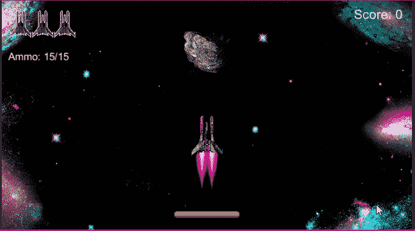
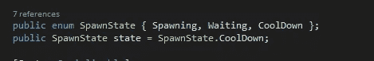
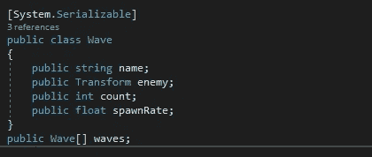
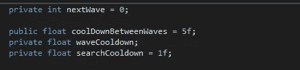
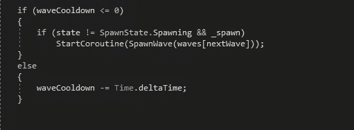
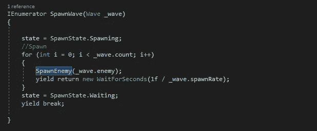
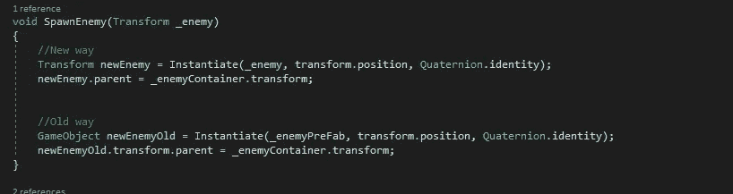
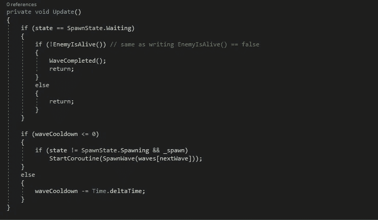
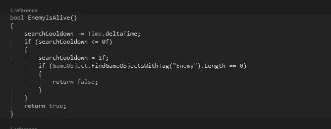
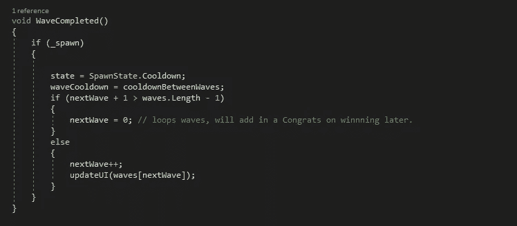

# 建造一个波浪系统

> 原文：<https://medium.com/nerd-for-tech/building-a-wave-system-f52cacddb685?source=collection_archive---------12----------------------->

## 目标:为我们的游戏制作一个波浪系统。

现在我们有敌人不断滋生，更好的是有一波又一波的敌人，随着浪潮的推进，慢慢变得更难对付。系好安全带，这将是一个漫长的过程。

我们可以使用枚举来存储敌人处于什么状态，可以是产生敌人，等待玩家杀死敌人，或者是在开始产生更多敌人之前的冷却时间。我们将 wave 将其状态作为该类型存储在 enum 的另一个变量中。

从冷却开始，在波浪开始前给一点时间，就像波浪被加入前一样。

现在添加一个保存所有波浪数据的地方，波浪名称，一个存储敌人的转换，一个在波浪中产卵的敌人数量，以及一个我们希望他们产卵的速度。我们可以将所有这些存储在一个类中，然后创建一个该类的数组，这样数组中的每个元素都有所有的信息。

你需要把系统。Serializable，这样我们就可以在检查器中看到元素。

只需要几个变量。剩下的就是知道我们现在在哪一波(从 0 波开始)，两波之间的冷却时间，一个是冷却时间还剩多久，一个是我们寻找还活着的敌人时的冷却时间。

如果您想要在每个 wave 上显示 wave 名称，您将需要一个对 UIManager 的引用

首先，将需要检查是否波冷却时间大于或等于 0，如果是和国家还没有产卵，开始产卵下一波。如果冷却时间没有结束，那么我们可以使用 else 语句从冷却时间中减去时间，使其成为 5 秒的计时器。

所有这些看起来都有点像这样。

现在来看看这个 SpawnWave 协程。在 IEnumerator 中，使用 Wave _wave 输入，我们将把状态更改为产卵，这样它就不会一次被调用多次。接下来，我们要经历敌人的繁殖，我们可以使用一个 for 循环，并使用我们从 wave 类中得到的敌人计数来计算我们繁殖敌人的次数。在一个敌人产生后，我们可以设置一个冷却时间，这样他们就不会同时产生了。我们可以这样做，用 1 除以我们的 wave 产卵率。在所有东西都生成之后，我们可以将状态改为等待，并跳出协程。

到了产卵的地方。这一个我们可以从我们的老产卵方法。

如你所见，没什么需要改变的。

现在我们从冷却到产卵，然后产卵到等待。下一步是从等待到冷却，我们完成了。回到更新方法，因为我们想继续检查是否有敌人留下，但也高于波冷却时间。首先要检查的是我们处于什么状态，如果是等待，那么继续。接下来，我们要检查敌人是否死了，波是否完成，我们是否可以返回，如果有敌人活着，尽管我们可以返回，这将阻止波冷却被调用。

哦，看看另外两种方法！

让我们从检查敌人是否活着开始。因为我们想检查敌人是否活着，我们将使用 bool 而不是正常的 void，这让我们返回 true 或 false。接下来，我们要开始减少搜索的冷却时间，这样我们就不会让寻找敌人的游戏超负荷，没有人喜欢滞后峰值。然后我们可以检查搜索冷却时间是否小于 0，如果是，将搜索冷却时间重置为 1。接下来，检查任何带有“敌人”标签的游戏对象，如果没有找到，则返回 false。在方法的末尾将返回 true 确保了如果冷却时间还没有到 0，它将被再次调用，直到冷却时间到 0。

最后是当波浪完成时。因为如果玩家死了，敌人会被杀死，这个方法会被调用，而我们不希望这样。首先检查 _spawn 是否为真(在旧方法中，如果玩家死亡，则停止产卵),如果为真，则我们可以继续。将状态更改为冷却，并将波冷却更改为波之间的冷却。之后，我们要检查下一波是否大于 1 小于波数。如果为真，则没有移动波，因此循环或显示“你赢了”屏幕，否则增加下一波，并可选地用下一波更新 UI。

完成后，又增加了一个功能。一如既往地记得测试一切都在工作，并看到你在下一个！