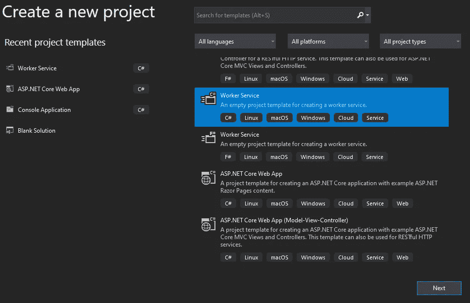
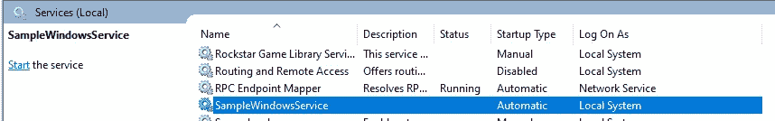

# 使用构建 Windows 服务。网络核心

> 原文：<https://medium.com/nerd-for-tech/building-a-windows-service-using-net-core-fdc68901b12f?source=collection_archive---------2----------------------->

如果你想定期工作，Windows 服务可能是一个好的解决方案。我必须重复一些短语，我想把它们发送到我的手机上。我想我不能为此创建一个移动应用程序。还有，我不喜欢手机编程。我正在使用 Slack 应用程序，我想我可以通过 Slack 发送它们。我找到了一篇关于 Slack 集成的文章，并创建了我的应用程序。出版对我来说是个问题。我没有服务器，我只有一台个人电脑。当时我以为我可以把我的应用作为 Windows 服务来使用。我想解释一下如何创建一个 Windows 服务。

首先，创建一个新的工人服务。NET 核心项目。

将下面的包安装到您的项目中。

*   微软。扩展。托管
*   **微软。extensions . hosting . windows services**
*   Serilog。AspNetCore

更改 Program.cs CreateHostBuilder()方法。

我们调用 **UseSerilog()** 方法将日志写到文件中。我们调用了 **UseWindowsService()** 方法，因为我们想使用 worker 服务作为 Windows 服务。

打开 Worker.cs 文件。

在这里你可以做任何事。发消息，发邮件，备份数据库等。

为日志记录创建一个 txt 文件。打开 appsettings.json 并添加这些配置设置。

不要忘记正确地改变路径。否则，您将看不到文件中的日志。

# 发布工人服务项目

打开控制台并转到您的项目目录。

运行以下命令:

您将在项目中看到 bin \ release \ netcoreapp3.1 \ publish 目录。打开发布文件夹时，可以看到项目的 exe 文件。

我们现在将创建一个新的 Windows 服务。以管理员身份打开控制台，在发布的项目目录下运行创建服务命令。

打开“服务”时，您将看到您的 Windows 服务。

当您重新启动电脑时，它会自动启动。因为我们在创建 Windows 服务时使用了 start= auto。如果你愿意，你可以第一次手动启动它。您将在日志文件中看到日志。

如果您不使用您的服务，您可以通过以下命令将其删除:

> sc 删除“您的服务名称”

此外，您可以查看[这个](https://github.com/emreerkoca/article-samples/tree/master/ArticleSamples/SampleWindowsService)存储库。