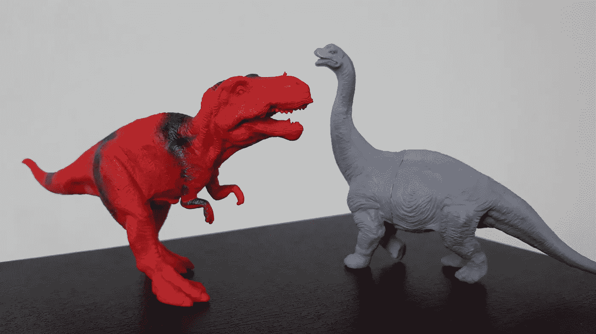
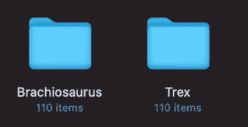
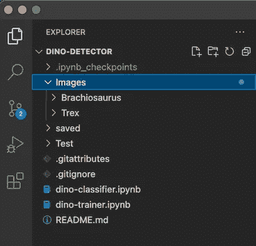
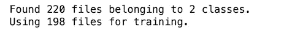
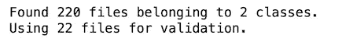
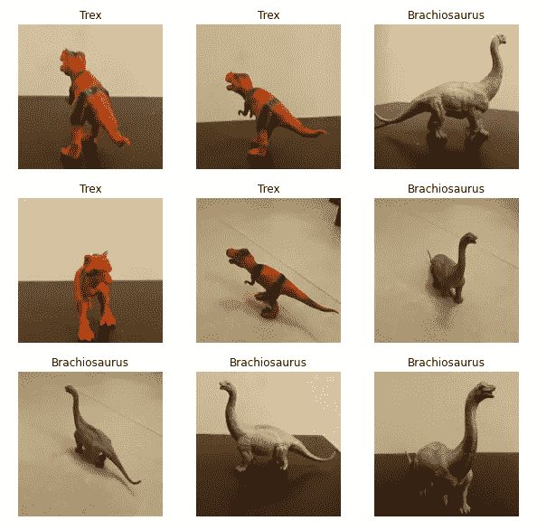
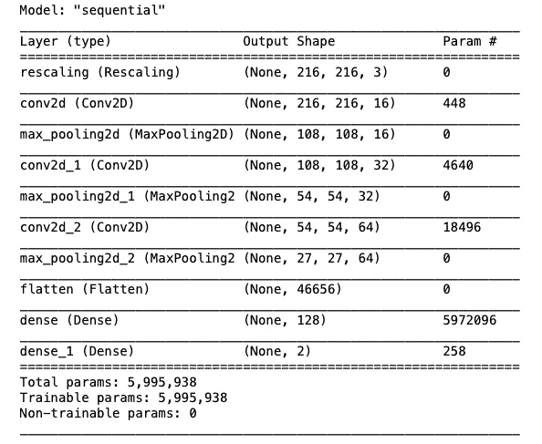
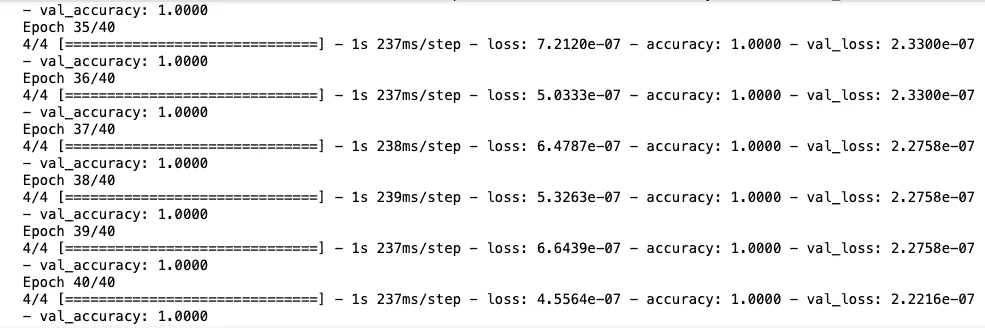
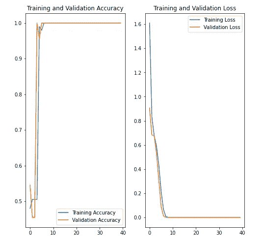
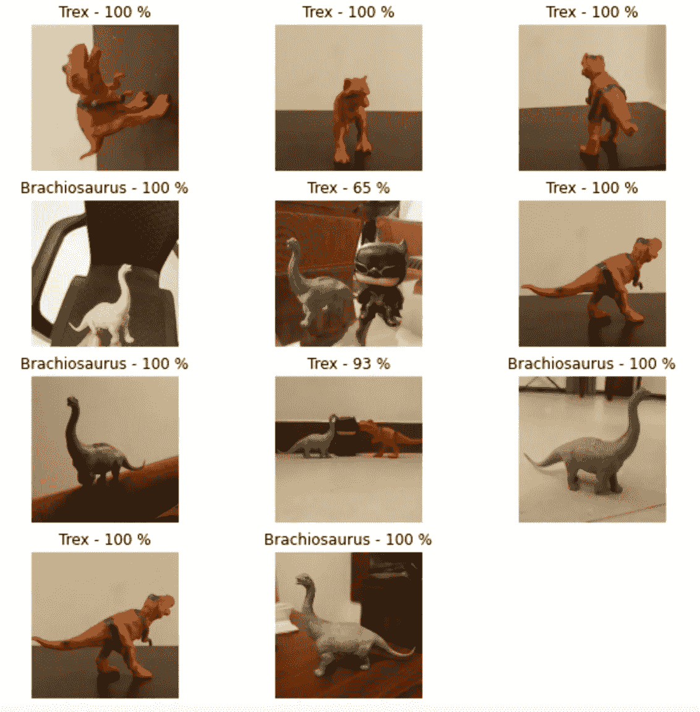

# 用 TensorFlow 构建图像分类器

> 原文：<https://medium.com/nerd-for-tech/building-an-image-classifier-with-tensorflow-3e12c1d5d3a2?source=collection_archive---------9----------------------->



我想尝试使用 **TensorFlow** 解决一个简单的图像分类问题。我的意图是从零开始，涵盖建立机器学习模型过程中的所有步骤，包括数据准备、模型创建、训练和最终用于推理。

我正在为这个项目寻找两件不同的物品，无意中发现了我儿子的玩具恐龙收藏。红色的**暴龙**和银色的**腕龙**引起了我的注意，它们是这个项目的好选择。

## 数据准备

与任何其他机器学习项目一样，准备训练数据是第一步。在这种情况下，问题要简单得多，因为我只是要训练模型只对这两种玩具进行分类。因此，我认为每个对象的大约 100 张图像足以训练模型。

为了简单起见，我将相机设置为拍摄长宽比为 1:1 的照片，或者换句话说，2160 x 2160 像素的正方形图像。拍照时，我确保恐龙是从不同的角度拍摄的。此外，我将它们与两种不同的背景放在一起，以消除训练模型中对背景的不必要的偏见。最后，我给每个玩具拍了 110 张照片，总共 220 张。



照片组织成两个独立的目录，以两种恐龙命名

我把这些照片组织成两个子文件夹，分别以各自的恐龙种类命名。这很重要，因为我计划使用 **Keras** 到中的**image _ dataset _ from _ directory**方法从磁盘中的目录结构创建数据集。这种方法会自动用相应的文件夹名称标记每个子文件夹中的图像。

因为这是一个比较容易解决的问题，我认为使用高分辨率图像是一种矫枉过正。因此，我决定将所有照片的大小调整为原始大小的 10%，最终得到了一堆 216 x 216 像素的图像。

## 发展环境

我已经有了一个用 **Python 3.8** 和 **TensorFlow 2.4** 配置的虚拟环境。为此，我使用了一个 **Jupyter** **笔记本**，因为在笔记本上编写这样的项目代码要容易得多。

我在一个名为“**图像”、**的父文件夹中组织了包含训练图像的子文件夹，并为我用于推断的照片创建了一个单独的**测试**图像文件夹。此外，我创建了两个笔记本文件——一个用于数据加载、模型创建和训练，而另一个用于推理。



VS 代码中的项目文件夹结构

## 导入依赖项

然后是时候做一些编码了！

首先，我导入了脚本所需的所有依赖项。

```
import **matplotlib.pyplot** as **plt**
import **numpy** as **np**
import **os**
import **PIL**
import **pathlib**import **tensorflow** as **tf**
from **tensorflow** import **keras**
from **tensorflow.keras** import **layers**
from **tensorflow.keras.models** import **Sequential**
```

## 创建数据集

我声明了一些在我的代码中有用的全局变量。 **pathlib** 中的 **path** 方法帮助我通过 **data_dir** 变量访问 **Images** 文件夹中的文件。由于有 220 个图像，我最初将批处理大小定义为 **55** ，这只是数据集的四分之一。另外，我声明了两个常量来保存**图像** **高度**和**宽度**参数。在这篇文章的后面，你会看到这些参数在起作用。

```
**data_dir** = pathlib.Path('**Images**')
**batch_size** = 55
**image_height** = 216
**image_width** = 216
```

我在 **Keras** **API** 中使用了**image _ dataset _ from _ directory**方法来创建和加载数据集。首先，我在 **validation_split** 参数的帮助下，使用图像的 **90%** 创建了**训练数据集**。由于这个方法在默认情况下会打乱数据集，所以我不必显式地设置 **shuffle** 参数。

在 Jupyter notebook 中成功执行后，该方法返回以下输出。



训练数据集创建摘要

类似地，我使用剩余的 10%图像创建了验证数据集，如下所示。



验证数据集创建摘要

## 探索数据集

我想检查数据集是否准确地从各自的文件夹名称中导出了类名，以及图像是否正确加载。我通过执行下面的代码做到了这一点。

在这里，我阅读了训练数据集，并通过前 9 个标签和图像循环。输出如下所示。



训练数据集中的前 9 幅图像和各自的标签

## 定义模型

然后是创建模型的时候了！

我使用 Keras API 的 **Sequential** 类对这个模型中的层进行顺序分组。顺序模型更适合于像这样的简单问题，因为我不打算在模型或其层中处理多个输入或输出。

我定义了一个非常基本的架构模型，只有 3 个卷积层，每个卷积层后面都有一个最大池层。来自最后卷积和最大池层的输出被平坦化，并被馈送到具有 128 个神经元的全连接层。这一层之后是最后一层，它只有两个节点，代表要预测的两个对象类。

该模型的代码如下。

你可能会注意到，在进入第一个卷积层之前，我已经使用一个单独的层重新缩放了图像。像素数据通常在 0–255 的 RGB 通道值范围内。这种重新调整背后的想法是通过将每个值转换为 0-1 范围内的相应值来标准化像素数据。

可以使用下面的代码查看这些层的摘要。

```
model.summary()
```



model.summary()方法输出

## 编译模型

在定义了模型之后，是时候编译它了。

这里我使用了 **Adam** 优化方法和**稀疏分类交叉熵**损失函数用于模型。

## 训练模型

**fit** 方法用于训练模型，我将训练数据集、验证数据集和**时期的数量**传递给它。之后又跑了 40 个纪元的训练。

该模型在执行不到 10 个时期后就开始实现 100%的训练和验证准确性。这立即表明，我可以不用节省 40 个纪元来训练这个模型。



## 可视化培训绩效

我使用下面的代码绘制了两个图表，并可视化了整体训练表现。第一个示出了训练和验证的准确性，而另一个示出了相对于执行的时期数的训练和验证损失。



训练和验证准确性以及相对于所执行的时期的相应损失

## 使用模型进行推理

然后是使用模型进行推理的有趣部分！

由于本例中的模型仅用于对两个特定玩具的图像进行分类，所以我使用了一些它们的照片，这些照片在之前的训练集或验证集中没有使用过。

我编写了以下代码来打印测试图像以及模型的相应预测。每个预测都显示为恐龙名称和置信度百分比的组合。



具有百分比置信度的模型的预测

## 结论

你可能会注意到，这个模型在对这两个玩具进行分类时表现得相当好。然而，在一个例子中，它将腕龙归类为暴龙——也许是被同一张照片中的“蝙蝠侠”形象搞混了。此外，它将这三个玩具的图片归类为 Trex，置信度为 93%。虽然在这样一个简单的分类器中看到这样的问题并不奇怪，但通过进一步增强训练数据集和调整超参数，结果仍然可以得到改善。