# 使用包围盒回归在 TensorFlow 中构建对象检测器

> 原文：<https://medium.com/nerd-for-tech/building-an-object-detector-in-tensorflow-using-bounding-box-regression-2bc13992973f?source=collection_archive---------0----------------------->

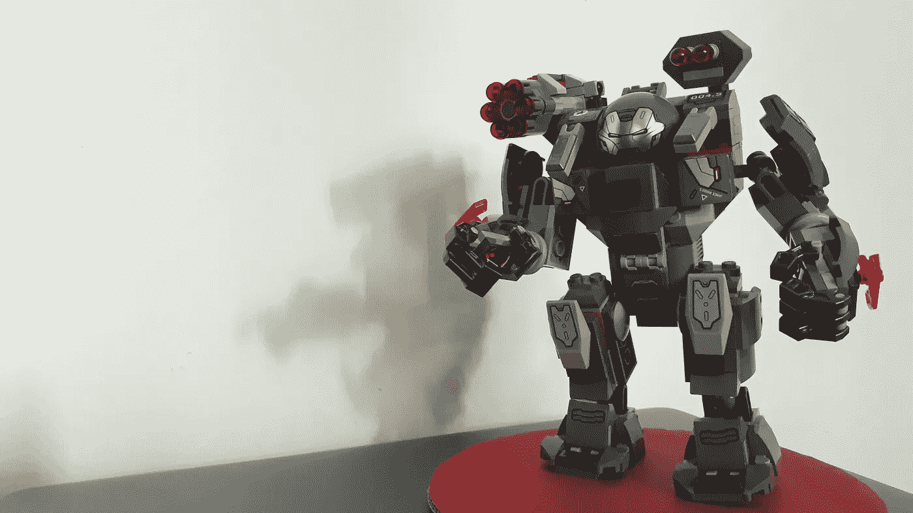

作者图片

目标检测是对图像中的目标进行分类和定位。换句话说，它是由**图像分类**和**物体定位**组合而成。为图像分类建立一个机器学习模型更简单，我已经在我的一篇帖子[中描述过了。然而，图像分类器不能准确地说出对象在图像中的位置。为了实现这一点，我们需要建立一个神经网络，除了对图像进行分类之外，它还可以定位图像中的对象。在这篇文章中，我将描述如何通过解决这两个问题来建立一个用于物体检测的神经网络。](/nerd-for-tech/building-an-image-classifier-with-tensorflow-3e12c1d5d3a2)

## 要检测的对象

因为我的意图是从头开始构建模型，而不需要在数据准备上花费太多时间，所以我选择了我能想到的最简单的对象。我的选择是用一块纸板做一个简单的红色视觉标记。由于视觉标记只是一个 2D 形状，可以捕捉它的不同角度是有限的，因此训练集所需的图像数量有限。为了简单和便于操作，我把视觉标记做成圆形和手掌大小。


用一张纸板制成的视觉标记

## 模型的架构

在深入研究实现细节之前，我想向您描述一下模型的架构。首先，我的目标是推断两个答案:

*   不管图像中是否有物体
*   这个物体到底在哪里

为了解决第一个问题，我可以使用图像分类器——一个具有两个输出神经元的卷积神经网络。这些输出神经元中的一个可以代表物体的存在，而另一个可以代表物体的不存在。换句话说，图像分类器的输出是不同对象类别之间的概率分布——或者在这种情况下，是对象的**存在** (" **圆**")或**不存在** (" **非圆**")。然后，可以通过在输出图层应用 Softmax 函数来确定概率最高的类。

解决第二个问题完全不同。我想要的是通过在物体周围画一个边界框来定位它。为此，我必须找到边界框左上角和右下角的像素坐标。这意味着我的神经网络必须计算出图像中这两点的 x，y 坐标。我可以通过设计一个在输出层有 4 个神经元的卷积神经网络来做到这一点，这 4 个神经元代表 4 个数值坐标值。

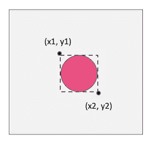

接下来的挑战是使用单个神经网络实现这两个目标。一方面，解决方案的图像分类器部分将输出神经元的值视为概率分布。然后它挑选概率最高的一个，把它的标签作为答案。另一方面，解决方案的对象定位部分需要 4 个输出神经元来给出实际的边界框坐标。因此，神经网络很难训练其完全连接的密集层来同时满足这两个要求。因为，优化分类的权重和偏差会危及本地化的输出，反之亦然。

这个问题的解决方案是设计一个具有两个分支输出的神经网络。由于这两个问题的特征提取必须同等执行，所以我将卷积层设为公共的和可共享的。然而，在卷积层之后，我将网络分为两部分，每一部分都有自己的密集层和输出层，以实现两种不同的结果。

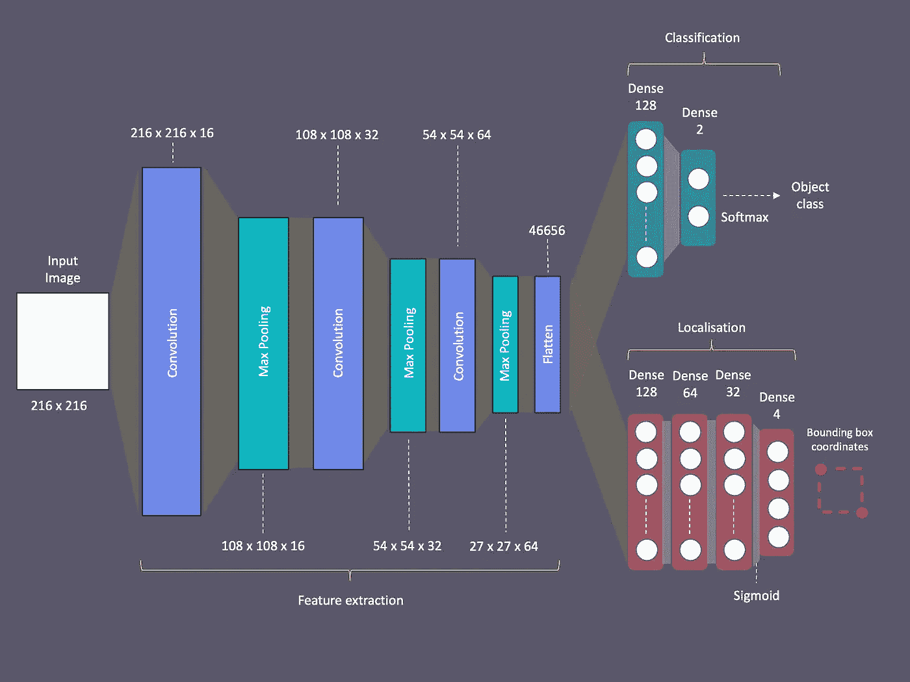

双输出神经网络的结构

这个架构允许我用不同的损失函数和激活函数来训练这两个头或分支。此外，这允许我使用不同的数据集分别训练它们。我将在这篇文章的后面描述我是如何做到这一点的，以及为什么这么做很重要。

## 数据准备

与任何其他机器学习项目一样，数据准备也是这里的关键。首先，我将我的相机设置为 2160 x 2160 的分辨率来捕捉方形图像。然后，我拍摄了大约 126 张视觉标记的照片，将它放在图像框内的不同位置，并放在离相机不同的距离。此外，我采取了不同的背景。训练数据集中的这些变化有助于模型最终实现更准确的预测。

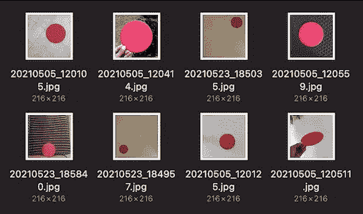

训练图像集的一部分

我又拍了 62 张没有视觉标记的照片。这样做是为了训练模型来识别标记的缺失。然后我将所有照片的分辨率调整为 216×216 像素，因为没有必要使用更高分辨率的图像来识别这样一个简单的物体。

## 图像注释

下一步是使用边界框注释视觉标记。与图像分类器不同，这是构建对象定位器的重要一步。为此，我使用了名为 **VoTT** 的免费开源注释工具。

首先，我在 VoTT 中创建了一个名为“视觉标记检测器”的项目，并创建了源连接和目标连接，分别指向我的计算机中源图像和生成的注释的文件夹位置。

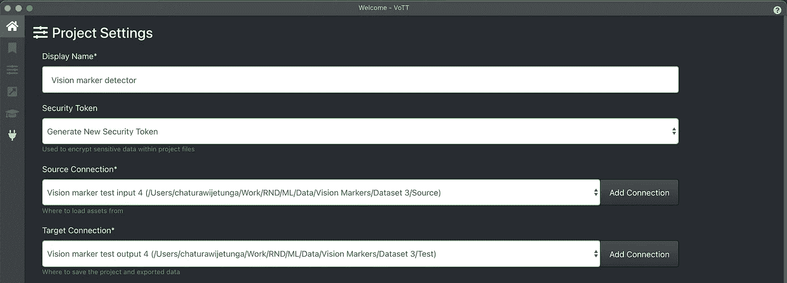

在 VoTT 中为注释任务创建项目

此外，我创建了一个名为“Circle”的标签(label ),用于注释图像中的视觉标记。

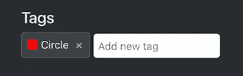

添加了一个名为“圆”的标签

接下来是注释图像的不那么有趣的任务时间了！

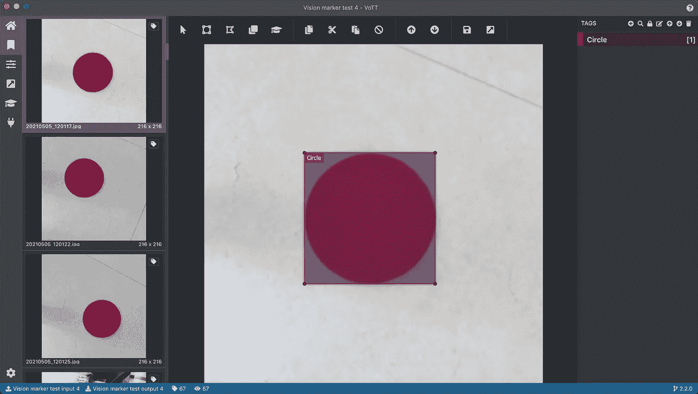

VoTT 中的注释示例

没有视觉标记的照片在这里被跳过了。我将在这篇文章的后面描述我是如何在训练中使用这些图片的。然而，我确保**导出设置**中的以下设置也被设置为生成未分配(未标记)图像的注释 XML 文件。

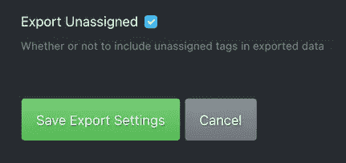

设定为也导出未分配的图像

在注释图像的繁琐任务之后，我使用 VoTT 中的导出选项将所有注释导出为 **PASCAL VOC** 格式。

## 组织文件夹结构

我将图像和相应的注释 xml 文件分成两组——一组表示训练集，另一组表示验证集。

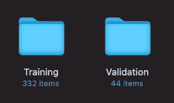

训练和验证图像+注释 XML 文件

然后，我将它们移动到项目文件夹结构中名为“Images”的父文件夹中。

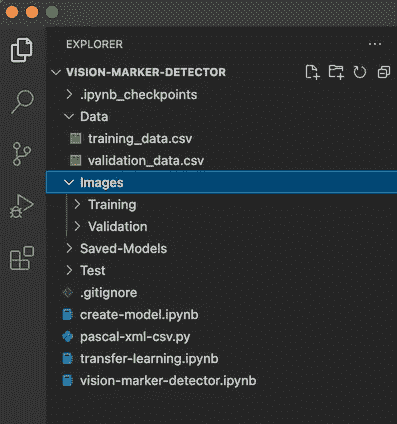

VS 代码中的项目文件夹结构

## 创建数据集

除了图像及其标签之外，在准备用于训练对象检测器的数据集的过程中，使用边界框坐标也很重要。为此，我使用了一个 python 脚本，它读取 VoTT 生成的所有 xml 文件，并为训练和验证数据集生成两个 **CSV** 文件。我以这样一种方式编写了这个脚本，我可以通过将配置变量— **SKIP_NEGATIVE** 设置为 True 或 False 来运行它，以排除或包含负图像(其中没有对象的图像)。

然后，我编写了以下代码，通过读取上述步骤生成的 **training_data.csv** 文件来创建训练数据集。这里我创建了 3 个列表——第一个是图像数据数组列表，第二个和第三个列表分别是相应的边界框坐标和图像标签。

我也使用了相同的代码来加载验证数据集。然后我使用下面的代码将列表转换成 numpy 数组。

```
train_images = np.array(train_images)
train_targets = np.array(train_targets)
train_labels = np.array(train_labels)validation_images = np.array(validation_images)
validation_targets = np.array(validation_targets)
validation_labels = np.array(validation_labels)
```

在训练模型时，train_images 数组被用作 **Keras** **API** 中 **Model** 类的 **fit** 方法的**输入数据**参数(或参数 **x** )。然后，数组 train_targets 和 train_labels 在字典中一起用作 fit 方法的**目标参数**(或参数 **y** )。在这篇文章的后面，你会注意到这一点。

## 构建模型

然后是建立模型的时候了！

首先，我将必要的依赖项导入到脚本中。

```
import **matplotlib.pyplot** as **plt**
import **numpy** as np
import **os**
import **PIL**
import **tensorflow** as tffrom tensorflow import **keras**
from tensorflow.keras import **layers**
from tensorflow.keras.models import **Sequential**
import **pathlib**
import **pandas** as pd
from PIL import **Image** 
from PIL.ImageDraw import **Draw**
```

我以变量的形式创建了一些配置参数，并定义了用于模型的类的数组。

```
**width** = 216
**height** = 216
**num_classes** = 2**classes** = ["**Circle**", "**No-Circle**"]
```

然后我写了定义模型的代码。首先，我定义了输入层，然后是一个重缩放层，将像素数据转换到数值范围 0–1。然后我创建了卷积层，将一层的输出链接到下一层的输入。我用前缀“ **bl_** 命名所有这些卷积层，目的是以后使用这个前缀来抓取它们。

第二，按照之前讨论的架构，我通过输入卷积层的展平输出来定义分类分支层。在这里，我只添加了两个密集层——一个有 128 个神经元，最后一个只有 2 个神经元，对应于我们必须预测的两个类别标签。而且，我给分类分支的图层加了前缀“ **cl_** ”。

第三，我定义了定位分支层，再次输入卷积层的展平输出。这里，我添加了 4 个单独的密集层，神经元数量递减，最后一层有 4 个神经元，对应于用于预测的 4 个边界框坐标值。该分支中的层以前缀“ **bb_** 命名。

最后，通过传递输入层和两个输出分支来创建模型类。这是我们将两个输出分支焊接到基础模型的地方。

```
**model** = tf.keras**.Model**(**input_layer**,
           outputs=[**classifier_branch**,**locator_branch**])
```

该模型的概要如下所示

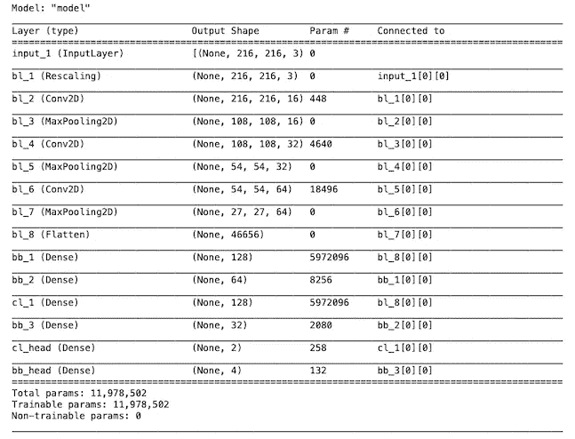

## 编译模型

由于两个输出分支被设计成实现两种不同的结果(一个输出概率分布，另一个预测实际的边界框值)，因此有必要为每个分支设置适当的损失函数。我对分类头使用了**稀疏分类交叉熵**损失函数，对定位器头使用了**均方误差(MSE)** 。我通过定义下面的字典实现了这一点。

然后我把它和 Adam 优化方法结合起来，编译了这个模型。

```
model**.compile**(loss=**losses**, optimizer='**Adam**', metrics=['accuracy'])
```

## 为本地化训练模型-包围盒回归

正如我在模型架构部分所描述的，我的计划是首先为对象本地化训练模型。在训练的这一部分期间，模型的定位分支将执行边界框回归，然后将调整其权重和偏差以优化边界框预测。

这里重要的是，我只使用了带注释的图像(只使用了具有视觉标记的图像)来训练模型的定位部分。我通过在运行数据集生成代码之前运行 CSV 生成脚本，并将 SKIP_NEGATIVES 参数设置为 True 来实现这一点，如上面的数据集创建一节所述。

在训练定位分支时跳过负图像(没有视觉标记的图像)的原因是，否则它会影响边界框预测的准确性。因为我们必须设置虚拟边界框坐标值——例如(0，0) (0，0)用于负图像，如果我们也在训练数据集中使用它们的话。例如，如果我们在训练集中使用正面和负面图像进行训练，下图显示了本地化分支的训练性能。

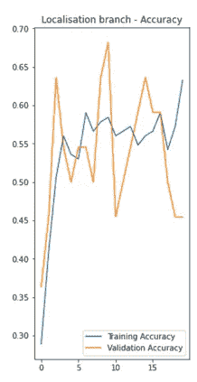

当用负面图像训练时，验证准确度低得多

然而，仅使用正图像来训练定位分支的不利之处在于，它给出了负图像的假阳性。但是因为我不想依赖定位分支来确定视觉标记的存在或不存在，所以这对我来说不是问题。

我使用了下面的代码，它为两个指定分支的训练和验证目标定义了两个字典对象— **cl_head** 和 **bb_head** 。在这里，您会注意到标签数组用于分类分支，边界框坐标数组用于定位分支。

```
trainTargets = {
    "**cl_head**": train_labels,
    "**bb_head**": train_targets
}validationTargets = {
    "**cl_head**": validation_labels,
    "**bb_head**": validation_targets
}
```

我最初将**时期的数量**设置为 **20** 并将**批次大小**设置为 **4** 。然后我运行下面的代码来训练模型。

```
history = **model.fit**(**train_images**, **trainTargets**,
             validation_data=(**validation_images**, **validationTargets**),
             batch_size=4,
             epochs=training_epochs,
             shuffle=True,
             verbose=1)
```

下图显示了两个分支机构的培训绩效。

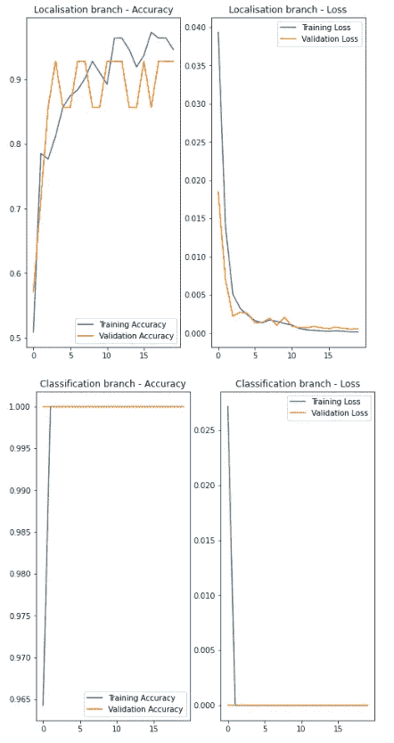

您会在上面的图表中注意到，本地化分支的表现相当不错。然而，分类分支所达到的精确度好得令人难以置信。它的表现是不可信的，因为迄今为止它还没有看到任何负面的图像。这将意味着模型(它的分类部分)将总是把它看到的东西分类为“视觉标记”，因为它从未见过没有它的任何东西。

然而，即使在这个阶段，该模型仍然能够准确地预测边界框。

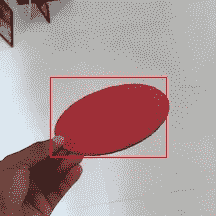

但话说回来，当用于负面图像时，它会产生假阳性，如预期的那样给出一些随机的边界框坐标。

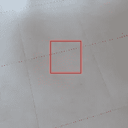

这就是我接下来想通过训练分类分支来解决的问题。

## 为分类训练模型

然后是时候训练模型的分类分支了。

这里的区别是，我们需要使用正面和负面图像来训练分类器，因为模型需要学习图像的存在和不存在，以正确分类它看到的图像。

为了实现这一点，我再次运行 CSV 生成脚本，不过这次将 SKIP_NEGATIVES 参数设置为 False。这将生成包含正负图像记录的 CSV 文件。对于负片图像，它创建了边界框坐标全为零的记录，并分配了标记—“**非圆**”作为标签。

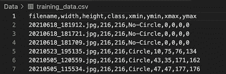

包含正面和负面图像的 CSV 文件

创建新数据集的其余步骤与创建用于培训本地化分支的数据集相同。

在第二阶段训练模型之前，我做的另一件重要的事情是保留卷积层和定位分支已经训练好的权重和偏差。因为，否则使用不同的图像集进行新一轮的训练可能会危及这些层已经训练好的权重和偏差，从而导致性能下降。解决方案是在使用新数据集训练分类分支之前，冻结卷积图层和边界框分支。

我通过使用它们各自的前缀抓取基础层和本地化分支层并将每个层的**可训练**属性设置为**假**来实现这一点。

```
for layer in model.layers:
    if layer.name.startswith('**bl_**'):
        **layer.trainable** = **False**

for layer in model.layers:
    if layer.name.startswith('**bb_**'):
        **layer.trainable** = **False**
```

在此步骤之后，模型中有大量的**不可训练**参数。这在模型的摘要中是可见的。

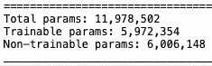

模型中 6M+不可训练参数

然后，我使用第二个数据集，包括积极和消极的图像来训练模型。由于基础层和本地化分支层被冻结，所以基本上只能训练本地化层。如下图所示，分类分支的训练性能在仅仅 20 个时期内还不算太差。

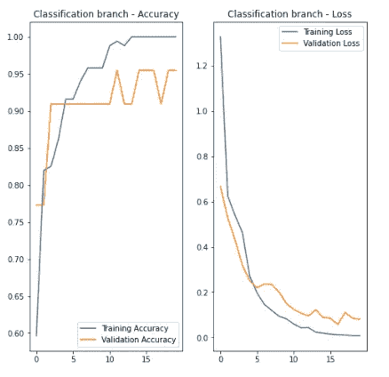

## 使用模型进行对象检测

接下来是使用模型做一些预测的有趣部分。

我使用了一组新的有和没有视觉标记的照片来测试一些预测。这里，定位器输出总是给出一个边界框，即使其中没有视觉标记。但是这在应用中不是问题，因为我们总是可以首先依赖分类输出，以知道对象在图像中是否存在，然后如果不存在就避免绘制边界框。我在 Jupyter 笔记本上显示下面的图片和它们的边框时使用了同样的技术。


视觉标记检测器的检测

## 结论

这个练习向我证明，我们可以从头开始构建一个简单的单类对象检测器，而不依赖于大型的预训练模型。其次，双输出架构和使用不同数据集的两阶段训练是实现这一结果的关键。该模型给出了一些假阳性和假阴性，但这主要是由于有限的训练数据集和非最佳超参数。通过调整 hyper 参数和使用更大的训练数据集，我们将能够获得更好的结果。