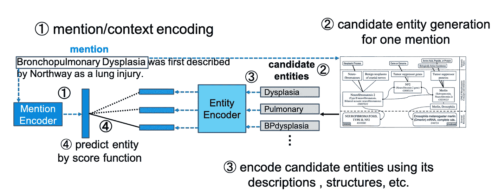
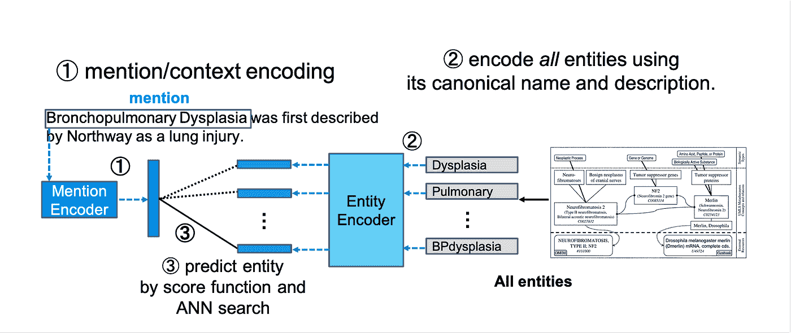
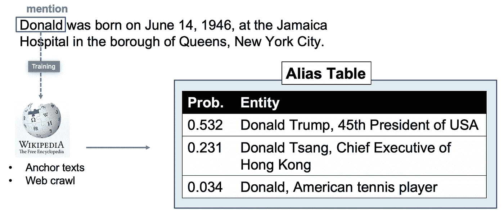
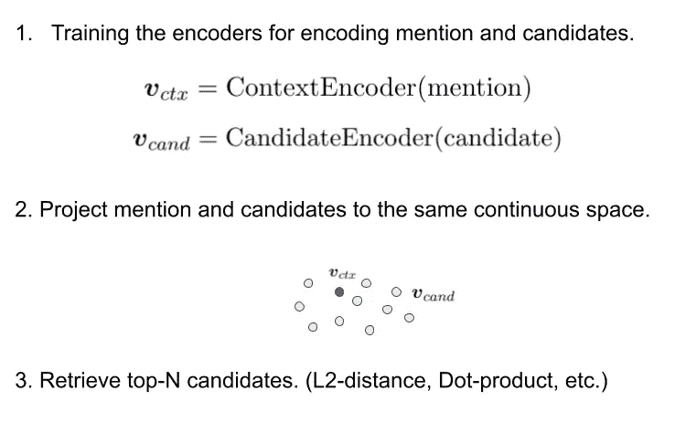
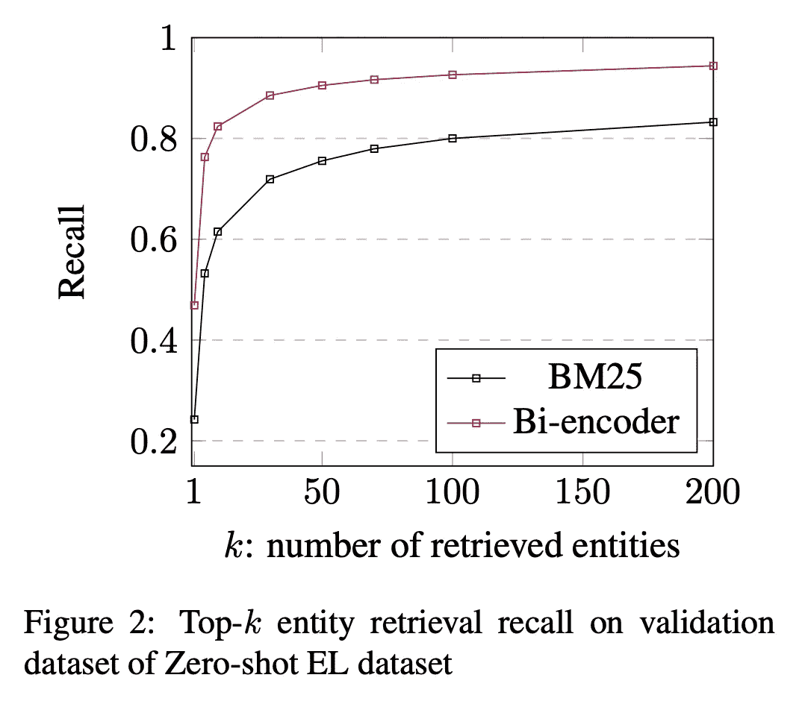
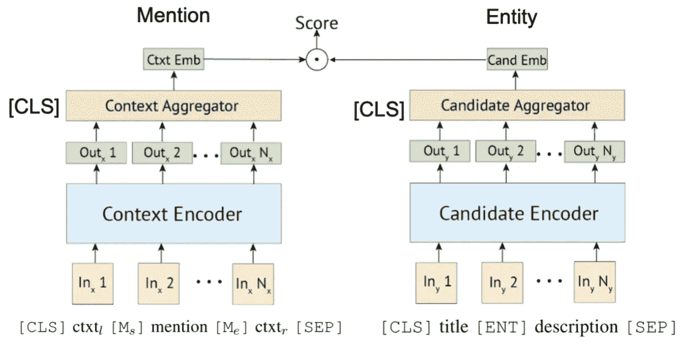
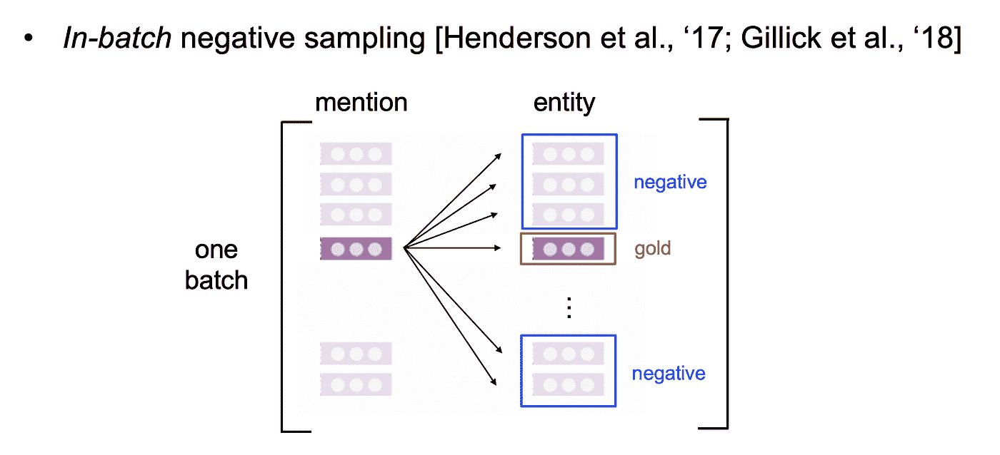
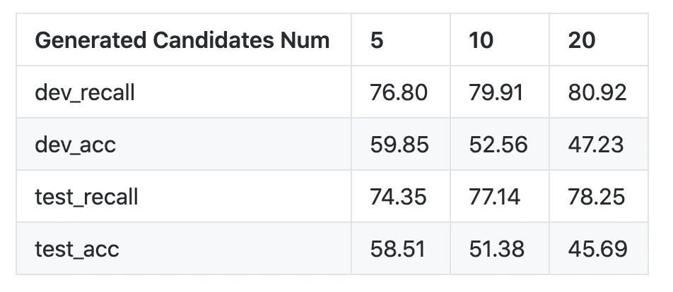
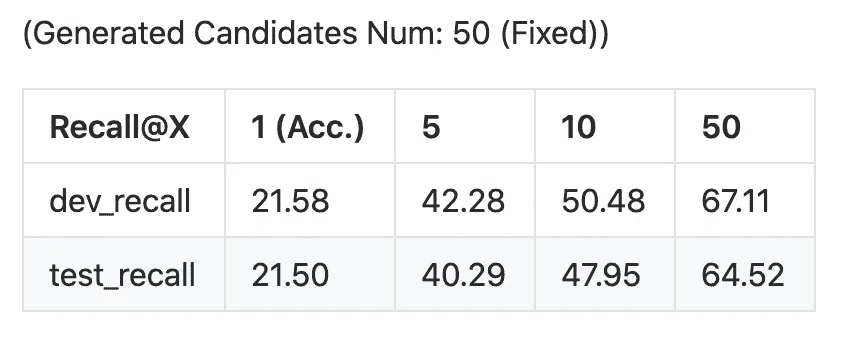

# 构建基于变压器的实体链接系统

> 原文：<https://medium.com/nerd-for-tech/building-bi-encoder-based-entity-linking-system-with-transformer-6c111d86500?source=collection_archive---------3----------------------->

## 历史和逐步指南。

具有双编码器的实体链接系统

【**更新于 2021 年 4 月 18 日**】你可以在自己的 Colab-Pro 环境下运行实验。详情见 [**此处**](https://github.com/izuna385/Entity-Linking-Tutorial/blob/main/docs/Colab_Pro_Tutorial.md) 。

# **历史**

**实体链接(EL)** 是将文档中的一系列文本(称为提及)映射到知识图中的实体的任务，被认为是自然语言理解和应用中最重要的任务之一。

例如，当一个用户在聊天机器人对话中说，“我今天看到了独立日，它非常令人兴奋，”没有人会认为这是周年纪念日。

这只是一个例子，但是实体链接对于后续与 NLP 相关的问题是一个非常重要的任务。

在本文中，我们将创建两个简单的基于双编码器的实体链接系统。前者基于基于表面的候选生成(CG)，后者基于近似最近邻搜索(ANNSearch)。

基于表面基 CG 的双编码器实体链接系统

基于人工神经网络搜索 CG 的双编码器系统

直到 2019 年，实体链接模型都是通过向神经网络输入提及和实体之间的字符串相似度、维基百科中的共现统计数据(早期论文中称为 *priors* 的功能)、提及存在的上下文等来训练的。

由于将知识库中的所有实体与每个提及进行比较需要很高的计算成本，因此先前的工作使用这样的统计，或*别名表*来生成候选项；即过滤实体以考虑每个提及。(山田等，2016；加内亚和霍夫曼，2017；乐和蒂托夫，2018；曹等，2018)。

为了使别名表有效，它必须包含目标文档中出现的大量提及。由于 Wikipedia 及其丰富的锚文本注释可用于创建别名表，这对于从通用文档链接实体来说不是问题。相比之下，在专业领域建立有效的别名表既困难又昂贵，因为维基百科对这些领域的覆盖范围往往不够，而且很难找到大型的特定领域锚文本语料库。

如果目标提及/文档在一般领域中，则有可能从来自维基百科和网络爬行的大量成员-实体对统计地构建大型别名表。

当别名表不可用或覆盖范围有限时，可以通过提及和实体之间的表面相似性来生成候选项(Murty et al .，2018；朱等，2019)。然而，通过其表面相似性来捕获所有可能的提及实体是极其困难的，如果不是不可能的话，尤其是在生物医学文献中，其中实体通常表现出不同的表面形式(Tsuruoka 等人，2008)。例如，出现在 St21pv 数据集中的提及 rs2306235 的黄金实体(Mohan 和 Li，2019)是 PLEKHO1 基因。然而，这个实体在基于表面的候选生成中很可能被忽略，因为它不与 rs2306235 共享单个字符。

基于双编码器的检索。

为了减轻对别名表的依赖，Gillick 等人(2019)提出使用近似最近邻(ANN)搜索。虽然他们的方法成功地避免了使用别名表，但它需要大量上下文化的提及实体对来进行训练，这在专业领域中很少见。Wu 等人(2019)证明了双编码器在类似的设置下仍然适用于实体候选生成，例如 Logeswaran 等人(2019)提出的零炮实体，但精度仍然远远低于一般领域，在这种设置下需要进一步的研究。

引自[吴等，19 年](https://arxiv.org/abs/1911.03814)。

在本文中，我们将使用双编码器实现实体链接。我们将实现两种类型的候选生成，一种基于表面形式，另一种使用近似邻域搜索。

# **源代码**

源代码在这里。【https://github.com/izuna385/Entity-Linking-Tutorial】T5

# **数据预处理**

写在上面的源代码。本文使用 BC5CDR(李等(2016))数据集对模型进行训练和评估。

BC5CDR 是为 BioCreative V 化学和疾病提及识别任务创建的数据集。它包含 1，500 篇文章，其中包括 15，935 篇化学文章和 12，852 篇疾病文章。参考知识库是 MeSH，几乎所有的提及在参考知识库中都有一个黄金实体。

在本文中，我们在并行处理中使用 scispacy 对 Pubtator 格式的文档进行预处理。这是用于预处理的工具。
https://github.com/izuna385/PubTator-Multiprocess-Parser
https://github.com/izuna385/ScispaCy-Candidate-Generator

# **模型和评分**

转换器用于对提及和实体进行编码。引自 [Humeau 等人，2010 年](https://arxiv.org/abs/1905.01969)。

模型和候选实体的编码器是一个非常简单的结构。我们将使用从链接目标范围和周围单词块编码的嵌入。我们还将使用从实体名称和描述中生成的嵌入。

# **候选人生成**

对于基于表面的 CG，我们使用 ScispaCy 有两个原因。第一是我们正在研究的数据集 BC5CDR 属于生物医学领域，第二是 ScispaCy 本身有一个表面的基于表单的候选生成功能。对于基于人工神经网络的 CG，我们将使用 faiss。

# **训练**

为了在用 BERT 训练时保存负样本，我们在这里使用批内负采样。

在这种学习方法中，可以通过增加批量来更严格地训练编码器，但这也增加了所需的 GPU 资源。在这个实验中，我们已经证实，即使批量大小为 16，训练也是可能的🙂。

# **评估和结果**

我们使用两种方法生成候选项:表面形式和近似邻域搜索，但最终预测使用两者的提及和实体嵌入的内积。

*   基于表面的 CG

*   基于人工神经网络的 CG

# **讨论和进一步指示**

基于表面形式的候选生成的最终正确答案率约为 50%。在这种情况下，我们使用内积进行最终预测，但实际上，曲面相似性是预测中的另一个重要特征。除了嵌入之间的评分之外，还可以考虑准备一个考虑字符相似性的评分函数。

此外，本研究使用的数据集只有 10000 个左右，仅为 Gillick 等人使用的数据数量的 1/10000，由此可以推断，我们的模型成功地将上下文和实体信息编码到嵌入中。

# **GitHub 库**

*   [https://github.com/izuna385/Entity-Linking-Tutorial](https://github.com/izuna385/Entity-Linking-Tutorial)
*   另外，如果你对实体链接更感兴趣，你可能也会喜欢
    [https://github.com/izuna385/Entity-Linking-Recent-Trends](https://github.com/izuna385/Entity-Linking-Recent-Trends)

请随时联系或提出问题！

## **参考文献**

1.  [用于命名实体消歧的单词和实体嵌入的联合学习](https://www.aclweb.org/anthology/K16-1025.pdf)
2.  [深度联合实体消歧与局部神经关注](https://www.aclweb.org/anthology/D17-1277.pdf)
3.  [通过对提及之间的潜在关系建模来改进实体链接](https://www.aclweb.org/anthology/P18-1148/)
4.  [神经集体实体链接](https://arxiv.org/abs/1811.08603)
5.  [用于细粒度实体分类和链接的分层损失和新资源](https://www.aclweb.org/anthology/P18-1010/)
6.  [LATTE:生物医学实体链接的潜在类型建模](https://arxiv.org/abs/1911.09787)
7.  [通过最小化模糊性和可变性来规范生物医学术语](https://www.ncbi.nlm.nih.gov/pmc/articles/PMC2352870/)
8.  [学习实体检索的密集表示](https://arxiv.org/abs/1909.10506)
9.  [通过读取实体描述进行零炮实体链接](https://arxiv.org/abs/1906.07348)
10.  [可扩展零炮实体链接与密集实体检索](https://arxiv.org/abs/1911.03814)
11.  [BioCreative V CDR 任务语料库:化学疾病关系抽取资源](https://www.ncbi.nlm.nih.gov/pmc/articles/PMC4860626/)
12.  [多编码器:快速准确的多句子评分的变压器架构和预训练策略](https://arxiv.org/abs/1905.01969)