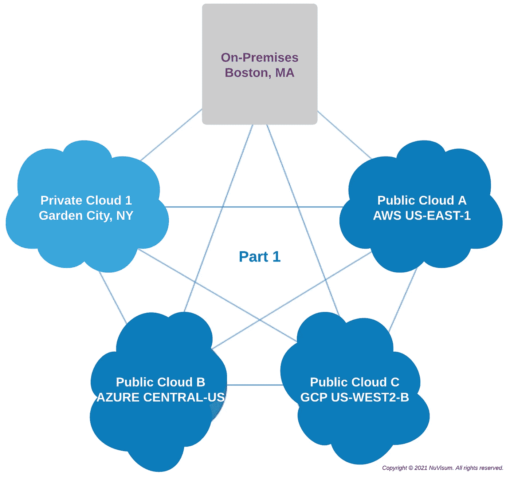
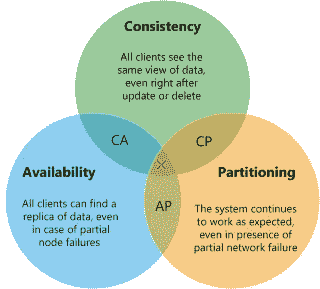
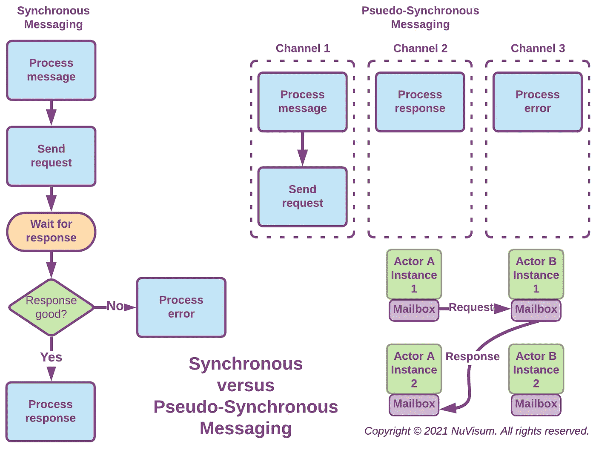
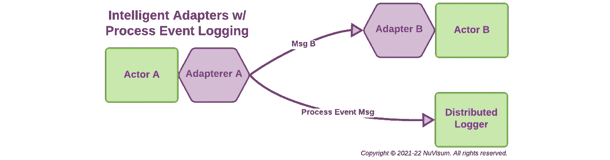
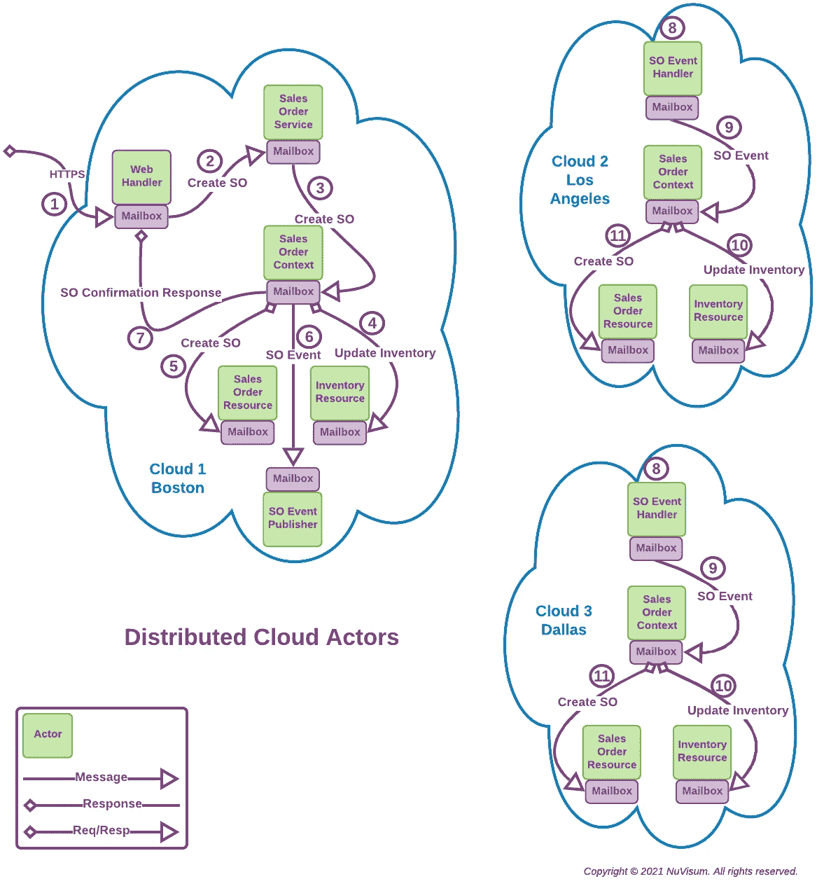

# 多重云应用:第 1 部分

> 原文：<https://medium.com/nerd-for-tech/building-cloud-native-apps-part-1-393d250cf107?source=collection_archive---------0----------------------->

## 掌握演员模型

为云环境开发可靠的、可扩展的应用程序要比想象中困难得多。在这里，我们描述了一个经过验证的架构，该架构创建了一个多云应用程序框架，以应对管理跨多云集群的分布式数据的更严峻挑战——可靠性和自动故障转移、高性能和自动扩展，以及接近实时的数据一致性。这是六个部分中的第一部分，描述了如何以最小的挫折和错误构建多云应用程序。如果这很有趣，请继续阅读。

近年来，像 [Kubernetes](https://kubernetes.io/) 这样的容器和容器编排器极大地简化了多云、可靠、可伸缩、分布式系统的开发。应用程序必须设计为利用这些技术，这不是偶然发生的。为了利用这些技术使构建多云应用程序变得更容易，一个好的第一步是学习和掌握 ***Actor Model*** 。

# 演员模式是什么？

[**参与者模型**](https://en.wikipedia.org/wiki/Actor_model) 最初被设想为一个计算模型，其中*参与者*作为一个通用的并发计算原语。Actor 模型最有趣的地方在于，早在云计算出现之前，它就是专门为*设计的，并且已经被证明能够满足*多云应用的基本需求——并发性、故障转移和扩展。早在 1973 年，该模型最初是为多核、内存、集群计算环境设计的，其许多基本计算目标与云相同。严肃的多云应用程序开发人员现在将它作为微服务模型来工作，以满足当今的需求。

演员可以成为构建多云应用的乐高积木(T21 ),因为它们简单、有意义，并且可以很容易地组合在一起构建更大的东西。这种简单性和直观性使得以参与者为构建块来设计和构建复杂的应用程序变得更加容易。参与者是小的、可测试的、可部署的、可执行的代码单元，它们:

1.  通过执行业务规则和逻辑对消息做出反应。
2.  当其他 actor 实例需要告诉它们(事件)或要求它们做(请求)某些事情时，向它们发送消息。
3.  在模型的一些实现中创建和管理其他 actor 实例。在 Cloud Actor 模型中，使用 Kubernetes 以不同的方式处理这些功能。

Actor 实例是*可重入*和*线程安全*。actor 实例完成工作所需的一切要么在它所响应的消息中，要么在它所连接的持久资源中。参与者不使用锁，所以他们不会被死锁。在他们众多的角色中，演员可以是*微服务*、*微服务客户端*、*事件发布者*、*事件处理者*、*消息代理者*、*分布式日志记录者*、*错误处理者*、*上下文处理者*、*资源处理者*和 *Web 服务器*。随着我们的继续，我们将更详细地探讨他们如何履行这些角色。

使用 actors，通过*消息传递*进行通信，作为多云应用的基本构建模块，简化了云网络并发处理的执行，并且:

1.  启用并发而不诉诸锁。
2.  使用协作参与者对消息做出反应，改变持久状态，并相互发送消息来实现应用程序功能。
3.  为实现应用程序故障转移和扩展提供了基础。
4.  支持伪同步(请求-响应)和异步(事件)消息传递(在云中，参与者本质上是异步的，但是我们将在后面看到它们可以模拟同步行为)。

> 正如这里所描述的，Actor 模型是一种微服务模型，旨在用于实现业务功能和读取、过滤、转换和写入持久数据的应用程序部分，实际上是应用程序功能的分布式云托管服务器端，而不是构成这些应用程序前端并将用户连接到服务器端的网络连接客户端。如今，前端通常通过 UI/UX 技术实现，并作为移动、桌面或 Web 浏览器应用程序部署。通常，这些应用程序一次支持一个用户，并且没有固有的可伸缩性问题。然而，它们很大程度上受到它们所连接的服务器的可靠性、延迟和可伸缩性的影响——这是 Actor 模型的领域。

# 扩展演员模型

因为容器和容器编排简化了过去写入单个角色的并发性、故障转移和伸缩的许多挑战，并且因为现代消息流具有 20 世纪 70 年代不存在的功能，所以可以扩展角色模型来利用这些功能。我们将使用术语，*云演员模型，*来表示扩展的演员模型。在云 actor 模型中，Actor 实例位于 *pods* 中的*容器*中，并通过 Kubernetes *部署进行部署。*

云参与者模型的一个有趣的属性是它坚持了*智能端点、哑管道*的概念。当使用该模型时，组成我们通常认为的*框架*的组件本身就是分布式参与者，并且通过与所有云参与者相同的自组织原则进行管理。

**C *ontainer 技术不需要云来运行，Kubernetes 在传统的内部数据中心也能很好地工作。***

尽管它仍然是 actor 模型，但是已经引入了一些专门的 Actor 类型来创建云 Actor 模型。这些新的参与者类型提供了构建块，有助于创建支持云的应用程序。

*   **代理**角色是连接各个角色的粘合剂，通过组织它们之间的消息传递，并作为*断路器*来减轻级联错误情况。*代理是唯一有状态的参与者，管理云参与者模型的故障转移、伸缩和自组织功能。*当代理运行时，它向所有其他可到达的代理广播它的存在。代理跨云集群联合，并相互共享状态信息。一个小的代理代理在每个 actor pod 中作为一个 sidecar 存在，以便于 actor 注册和使用最优代理传递消息。代理接收寻址到特定 actor *type* 的消息，并将它们路由到该 actor 类型的最佳实例的物理地址。一个 ***邮箱*** 与每个单独的 actor 实例配对，为 actor 缓冲传入的消息，并代表 actor 实例发送消息并与代理服务器通信。本文介绍了代理和邮箱。即将到来的 *M* 多云*应用:第二部分，使用消息和代理*，涵盖了我们为什么以及如何使用它们的更多细节。
*   智能适配器参与者专门负责数据验证、格式化、过滤和转换。适配器参与者的行为主要由声明性规则指定，而不是由命令性代码指定。智能 adaprer 具有 1 至 n 个输入通道和 1 至 n 个输出通道，可以与其他适配器链接在一起，用于更复杂的消息处理。适配器作用于在 actor 实例之间移动的消息。即将推出的*多云应用:第 4 部分，使用智能适配器*，涵盖了智能适配器参与者以及如何和为什么使用它们。
*   **上下文处理器** actors 是通过逻辑视图创建、读取、写入和删除数据的应用程序接口。他们可以使用单个资源处理程序或多个资源处理程序。上下文处理程序向应用程序参与者实例呈现逻辑数据模型，并通过 REST API 与资源处理程序进行交互，以物理方式映射、存储和检索物理数据模型中的数据。*上下文处理程序及其相关的资源处理程序为应用程序的其余参与者完成了分布式数据管理(故障转移、伸缩、复制、一致性)的重任。*
*   **资源处理器**角色是物理数据模型的应用程序适配器。上下文处理程序使用它们来将资源映射到持久存储和从持久存储映射资源，非常像对象关系映射器(ORM)，例如 [Hibernate](https://hibernate.org/orm/) ，将对象映射到关系数据库和从关系数据库映射对象。资源处理程序是通过 REST API 访问的。*资源是驻留在非易失性系统存储中的东西，如文件、键值存储和数据库。*
*   **事件发布者**演员将事件消息发布到 Kafka 这样的分布式流队列系统。它们通过*主题*向事件队列发送事件消息。发布者对他们的订阅者一无所知，他们把流媒体队列的技术细节留给了排队软件。
*   **事件处理器**参与者订阅指定*主题*的消息队列。处理程序按顺序从队列中读取每条消息，并将其转发给适当的应用程序执行元实例。
*   **事务备忘录**参与者确认分布式事务的完成。当被激活时，它们检查完成日志条目(在固定的时间或经过的时间)，如果没有找到，就抛出一个错误事件。
*   **分布式记录器**参与者将错误和应用程序消息记录到适当的分布式日志中。如果错误消息类型定义了错误处理程序，错误也会被转发到该错误处理程序。在网络分区或持久资源出现故障后，还可以重放分布式日志以恢复状态。*分布式记录器是满足多云应用* ***可观测性需求*** *的关键组件。*
*   **错误处理程序**参与者针对需要的错误消息类型组织适当的补救措施，例如，可能危及最终一致性并需要解决和/或报告的资源处理程序错误。
*   **集群桥**参与者在云集群之间移动消息，实施和加强集群间安全性，并优化集群间消息传递。*这对卡夫卡的表演尤为重要。*
*   **Web Handler**actor 是 [**Web 服务器**](https://en.wikipedia.org/wiki/Web_server) ，它们接受同步请求(https://)并将它们路由到适当的应用程序 actor 实例。它们等待来自处理参与者实例的匹配异步响应消息，并将其返回给同步请求者，或者超时并返回一个 HTTP 错误。Web 处理程序是内部边缘角色，支持从云应用程序外部访问。*Web 处理程序可用于向外部应用程序公开安全的同步消息传递(包括 REST APIs)。*
*   **web socket Handler**actor 是[**web socket**](https://en.wikipedia.org/wiki/WebSocket)**服务器**，它们接受异步消息(wss://)并将它们路由到适当的应用程序 actor 实例。如果 WebSocket 处理程序收到响应消息，它会匹配并将其发送给原始请求者。超时由请求者处理。WebSocket 处理程序是*内部边缘*角色，支持从云应用程序外部进行访问。WebSocket 处理程序可用于实现进出外部应用程序的安全全双工消息传递。
*   **嵌入式 GUI 客户端** actors 为设计用于与云 actors 模型服务器交互的应用程序提供 GUI 客户端功能。GUI 客户端角色提供了使用 [HTML](https://en.wikipedia.org/wiki/HTML) 、 [CSS](https://en.wikipedia.org/wiki/CSS) 和 [JavaScript](https://en.wikipedia.org/wiki/JavaScript) 来创建应用程序 GUI 的能力。诸如[*React*](https://reactjs.org/)*或[*Angular*](https://angular.io/)*之类的 JavaScript 库/框架能够很好地实现连接到云演员模型的 GUI 组件。嵌入式 GUI 客户端是从外部访问云应用的*外部边缘*角色。*任何使用 TCP/IP 套接字的客户端应用程序都可以是云参与者模型应用程序的客户端。***
*   ****stranger facade**为[*stranger Fig 模式*](https://docs.microsoft.com/en-us/azure/architecture/patterns/strangler-fig) 实现了基于规则的 facade**，并且可以在成熟应用逐渐转变为多云应用时，将传统 API 调用重定向到新的支持云的应用。****

> ****在不使用参与者模型的情况下，可以并且经常实现多种云应用。这重要吗？这很重要，而且非常重要。多云应用旨在利用混合云提供的自动化部署、扩展、可靠性和故障转移功能。最终的想法是，通过增加软件组件之间的隔离，我们可以快速且独立地交付系统的离散部分，并且通过利用容器和容器编排，我们可以交付高度的水平可伸缩性和容错性。应用程序组合、可部署单元和资源访问方法的旧模式并没有促进我们需要的可伸缩性和容错性。这要求我们从相对单一或分层的应用程序转移到可部署和无状态的容器化组件，例如 Cloud Actor 模型。****

# ****Kubernetes 术语****

****因为创建 Cloud Actor 模型是为了利用 Kubernetes 提供的容器编排功能，所以 Kubernetes 术语可以使描述该模型变得更容易。*我们知道许多读者已经熟悉 Kubernetes，可能想跳过这一部分。*****

*****这些定义由*[***Linode***](https://www.linode.com/docs/kubernetes/beginners-guide-to-kubernetes)*提供。*****

*   ****编排是计算机系统、软件、中间件和服务的自动化配置、协调和管理。它利用自动化任务来执行流程。对于 Kubernetes，容器编排自动化了容器的所有供应、部署和可用性；负载平衡；容器之间的资源分配；和集群的健康监控。****
*   ******容器**类似于虚拟机。它们是轻量级的独立运行时，共享操作系统的资源，而不必自己运行完整的操作系统。容器消耗很少的资源，但是包含执行它们所包含的应用程序映像所需的完整信息集，比如文件、环境变量和库。****
*   ******容器化**是一种使用微服务在容器中运行分布式应用的虚拟化方法。将应用程序容器化需要一个基础映像，该映像可用于创建容器的实例。一旦应用程序的映像存在，就可以将其推送到一个集中的容器注册中心，Kubernetes 可以使用它在集群的 *pods* 中部署容器实例。****
*   ******豆荚**是 Kubernetes 建筑的最小单元，可以被视为一种容器的包装。每个 Pod 都有自己的 IP 地址，通过该地址它可以与群集中的其他 Pod 进行交互。通常，一个 Pod 只包含一个容器，但是如果这些容器需要共享资源，那么一个 Pod 可以包含多个容器。如果 Pod 中有多个容器，这些容器可以通过 localhost 相互通信。****
*   ******服务**将相同的 pod 组合在一起，以提供一致的访问方式。例如，一个人可能有三个服务于一个网站的 pod，所有这些 pod 都需要在端口 80 上可访问。服务可以确保在该端口可以访问所有的 pod，并且可以在这些 pod 之间进行流量负载平衡。此外，服务可以允许从互联网访问应用程序。每个服务都有一个 IP 地址和一个相应的本地 DNS 条目。此外，服务跨节点存在。如果您在一个节点上有两个复制窗格，在另一个节点上有一个附加的复制窗格，则该服务可以包括所有三个窗格。****
*   ******部署**能够保持一定数量的副本单元正常运行。部署还可以通过滚动更新的方式更新这些窗格，使其类似于所需的状态。例如，如果想要将容器映像更新到较新的版本，可以创建一个部署，控制器将逐个更新容器映像，直到达到所需的状态。这确保了在更新或更改 pod 时不会停机。****

# ****CAP 定理****

********

****[**CAP 定理由 Nader Medhat**](/nerd-for-tech/understand-cap-theorem-751f0672890e) 提供****

> *****当我们构建使用持久数据的分布式应用程序时，我们必须时刻注意* [CAP 定理](/nerd-for-tech/understand-cap-theorem-751f0672890e) *。它不像 s* 光速*在物理世界中那样是一个绝对的限制器，但是我们忽视它是危险的。可行的*多云*架构在选择折衷方案时总是需要考虑到这一点。*****

# ****执行元实例和地址****

*****在云 actor 模型中，每个 Actor 实例位于一个* **容器** *中，一个 Kubernetes* **pod** *中。这些 pod 可通过 Kubernetes* **服务** *进行寻址，并通过 Kubernetes* **部署** *进行部署。*****

****每个 actor 类型都有一个名称和版本，这是其唯一的逻辑地址。一个 actor 类型在尽可能多的不同云集群中拥有尽可能多的单个实例，以满足其期望的冗余、吞吐量和延迟需求。每个实例都有一个可以到达的物理地址(网络 IP 地址和端口)。****

****参与者实例通过消息代理*将消息传递给其他参与者实例*。代理的工作是将逻辑角色地址映射到最有可能最大化吞吐量和最小化延迟的实例的物理地址。通过这种方式，actor 实例的位置透明性得以维护，从而使代理能够管理延迟、故障转移和伸缩。*传递到同一个 Kubernetes pod 内的 actor 实例的消息不通过代理，而只通过 actor 实例的附加邮箱。*****

> ****通过代理在 actor 实例之间传递的消息必须满足两个强制性标准:1)必须经过数字签名，2)必须经过加密(通常是 TLS)。任何不符合这些标准的消息都会被消息代理记录为错误并丢弃。否则，云参与者模型应用程序将无法在潜在的全球网络环境中确定消息的合法性，并且将容易受到恶意干扰。****

# ****演员生命周期****

****当 Kubernetes 激活一个 pod 时，pod 的代理将执行以下操作:****

1.  ****它向任何可到达的代理广播它的存在，并向第一个响应的代理注册。*代理是联合的，并且彼此共享参与者实例注册数据。*****
2.  ****然后，它向该代理注册其所有的参与者类型(能够对外部消息做出反应的类型)。****
3.  ****最后，它开始一个周期性的循环，每 n 毫秒向它注册的代理发送一个心跳消息。*如果该代理未能响应 n 个连续的心跳消息，则代理代理重复步骤 1 到 3。*****

****如果代理代理向其注册的代理在 n 毫秒内未能从代理接收到心跳消息，代理的注册数据将从代理的注册表中清除。如果 broker 代理仍然存在，下次它发送心跳消息时，将会收到错误响应，并重复步骤 1 到 3。****

> ****参与者类型和消息代理之间的关系是自组织的，不需要预先配置。随着 Kubernetes pods 上线，其中的演员类型在最近的经纪人处注册。如果一个 pod 不再可达，它的参与者将自动从其代理的注册表中删除。如果一个代理不再可达，它的参与者类型将被注册到一个新的代理。联合代理相互共享状态变化，并且总是以最低的延迟(从他们的角度来看)将消息路由到角色实例。****

****关于演员的生命周期，有几点值得强调****

*   ****执行元实例仅在对消息做出反应时执行规则和逻辑。****
*   ****Actor 实例是绝对*可重入*和*无状态*。它们一次只对一条输入消息作出反应，并且不记得以前处理过的消息。对输入消息做出反应所需的所有数据都必须在消息本身或持久数据存储中。****
*   ****一个 actor 实例可以用不同的规则和逻辑集(通道)对不同的消息类型做出反应。****
*   ****Actor 实例有 1 到 n 个输入消息通道。每种消息类型对应一个通道。通道封装了 actor 实例将用来处理消息的一组规则和逻辑。*通道也用于对来自其他参与者的伪同步响应做出反应。*****
*   ****Actor 实例有 1 到 n 个输出消息通道。每个参与者类型有一个通道，他们可以向该通道发送消息。这对于根据规则和逻辑将消息传递给多个和/或不同的目标执行元类型非常有用。****
*   ****相同类型的 Actor 实例是完全可以互换的。这是实现故障转移和扩展所必需的。对消息的伪同步响应甚至可能不是由发送原始伪同步请求的同一个 actor 实例处理的。事实上，在一个更大的应用活动中，Kubernetes 可能会让 pods 进入或退出服务。*此可互换性规则的唯一例外适用于上下文和资源处理程序，其底层数据存储可能需要复制以实现冗余或响应性，并且在其自身处理中可能是同步的。这将在接下来的*多云应用:第 5 部分——使用分布式数据*中进行更深入的讨论。*****

# ****异步和伪同步消息传递****

****我们已经讨论了 actor 实例通过消息传递进行通信，而不是通过函数调用、方法调用或远程过程调用(RPC)进行通信。出于许多原因——有些与消息传递对系统性能的影响有关——在云角色模型中，消息传递主要是异步的。一个 actor 实例不会等待响应，所以它不会占用可执行线程。这对性能来说很好，但实际上，我们用计算机做的很多事情都涉及请求和响应。云角色模型是如何处理的呢？****

********

****云角色模型通过使用*伪同步*消息传递来处理它——其中响应角色实例向请求角色类型实例发送*响应类型*消息，请求角色类型实例将使用辅助通道来处理该消息类型。因为 actor 实例是无状态的，所以请求 actor 类型的任何实例都可以完成这项工作，并且没有人需要等待响应。之所以称之为伪同步，是因为从用户的角度来看，它完全像一个普通的请求-响应，但是它的机制是完全异步的。****

*****一些特殊的角色类型，比如上下文和资源处理器，在它们相互之间的消息传递中必须是同步的。*****

# ****参与者和智能适配器****

****在 Cloud Actor 模型中，适配器是随着时间的推移而变得可用的一系列消息。适配器可以被认为是传送带上的项目，一次处理一个，而不是成批处理。智能适配器是一个充当*管道*和*过滤器*的角色，它将一个角色实例的消息流连接到另一个角色实例。过滤器对通过管道的每个消息应用本地转换。****

****数据管理的大部分工作是清理、验证、过滤、组合和转换数据。消息或消息流的传递提供了一个绝佳的机会来执行声明性规则，以便通过使用智能适配器来验证和操作这些消息的数据有效负载。智能适配器可以链接在一起以实现规则，甚至实现到一个或多个附加适配器的分支。****

****智能适配器是高度可重用的组件。例如，任何需要确保客户记录有效且格式正确的参与者都可以使用带有规则规范的 CustomerRecordValidator 适配器来验证和转换客户记录的内容。如果客户记录的格式或规则发生变化，通常只需要更新和重新部署 CustomerRecordValidator 适配器参与者，以便将这些变化传播到使用客户记录的任何地方。****

********

****使用智能适配器有以下好处:****

*   ****很容易将系统的整体输入/输出行为理解为单个适配器行为的简单组合。****
*   ****它们支持重用，因为智能适配器可以应用于应用程序中需要相同消息类型和转换的任何地方。****
*   ****系统可以很容易地维护和增强，因为新的适配器可以添加到现有的流中，旧的适配器可以被改进的适配器替换。****
*   ****它们自然支持并发执行。****

# ****声明式(低代码)角色开发****

****参与者的简单性和他们对消息处理的关注使他们成为低代码开发工具的主要候选人。工具应该从一个 GUI 应用程序开始，引导开发人员收集每种特定角色类型的规范。规范可以保存为 JSON 格式，以便 Velocity 模板引擎可以将它们与适当的程序模板结合起来，生成可编译的源代码模块。使用 JVM 支持的任何源语言都很容易，比如 Java 或 Kotlin，但这是实现的选择。****

****低代码技术有许多内在的好处:****

*   ****低代码 GUI 工具使得跨开发团队应用通用的设计模式和技术变得更加容易，并使特定用例的规范集合标准化，减少了引入错误的机会。新的和改进的设计模式可以通过最少的培训经济地引入。****
*   ****由经验证的规范扩充的模板程序减少了引入错误的机会，并且当检测到错误时，可以在模板级别频繁地纠正它们，并且重新生成相关的源模块。****
*   ****统计数据表明，错误是由编写的代码行数造成的。我们必须写的代码越少，我们产生的错误就越少。****

# ****测试演员****

****即使在最好的情况下，软件测试也可能是一项复杂、困难、耗时的工作。如何测试数百个(甚至数千个)跨多个云集群交互的可执行组件(参与者)？云演员模型有一个答案——[*前置条件*](https://en.wikipedia.org/wiki/Precondition) 和 [*后置条件*](https://en.wikipedia.org/wiki/Postcondition) 由智能适配器强制执行。****

****智能适配器验证、过滤和转换参与者接收和发送的消息中的数据。他们可以断言传入消息的前置条件和传出消息的后置条件。当检测到无效状态时，智能适配器会发布一条错误消息，该消息由分布式记录器获取，如果为错误消息类型指定了错误处理程序，则该记录器会调用错误处理程序，而不是将消息传递给参与者。如果被调用，指定的错误处理程序将协调所需的任何清理或补救操作。****

****这种方法保证了应用程序消息和数据的状态与智能适配器中声明的规则相匹配，并且参与者可以始终假定输入数据是干净和有效的——同时在所有组件上有效和连续地执行单元测试，无论这些组件在哪里使用。分布式记录器和错误处理器确保可以报告在多云中任何地方发生的异常情况，以便进行分析和补救。 ***随着 Kubernetes 在各种部署中展开变更，问题可以被快速识别并回滚，以免对整个应用程序造成危害。*******

# ****一个多云参与者示例****

****下图显示了如何将云参与者和资源结合起来交付应用程序功能。当使用云参与者模型时，任何参与者都可以与驻留在任何连接的云集群中的任何其他参与者进行交互。显然，距离和网络带宽会对性能产生影响。****

********

****Cloud Actor Web 应用程序的外观和感觉与任何其他实现良好的 Web 应用程序一样。Web Handler actor 嵌入了一个高效、轻量级、预配置的开源 Web 服务器。虽然 Web 处理程序可以提供静态内容，但是在这个例子中，我们主要关注动态数据的处理。它是这样工作的:****

1.  ****Web 处理程序参与者接收到创建新销售订单的 HTTP 或 API 请求。****
2.  ****Web 处理程序构建 CreateSalesOrder 消息，并将其发送给 SalesOrderService 执行元。****
3.  ****SalesOrderService 执行元验证消息，并向 CreateSalesOrder 消息添加任何必要的说明，然后将其发送给 SalesOrderContext 执行元。****
4.  ****SalesOrderContext 执行元格式化 UpdateInventory 消息并将其发送给 InventoryResource 执行元，后者随后更新库存数据库并返回结果。****
5.  ****收到来自 InventoryResource 执行元的肯定响应后，SalesOrderContext 执行元向 SalesOrderResource 执行元发送 CreateSalesOrder 消息，后者将订单添加到 SalesOrder 数据库并返回结果。****
6.  ****在成功地将 SalesOrder 添加到其数据库中之后，SalesOrderContext 参与者向 SalesOrderEventPublisher 发送一条消息，该消息将 SalesOrderEvent 发布到“sales-order”主题。****
7.  ****SalesOrderContext 角色将处理的结果发送给 Web 处理程序，然后 Web 处理程序响应最初的请求者——完成 Cloud 1 活动。****
8.  ****在本例中，SalesOrder 和 Inventory 数据库被镜像到 Clouds 2 和 cloud 3 中，它们都有 SalesOrderEventHandler 的实例。它们的 SalesOrderEventHandlers 订阅“销售订单”主题，当事件到达时，它们将它作为消息发送给指定处理它的参与者。****
9.  ****SalesOrderEventHandlers 执行元验证消息，并向 CreateSalesOrder 消息添加任何必要的说明，然后将其发送给 SalesOrderContext 执行元。****
10.  ****SalesOrderContext 执行元格式化 UpdateInventory 消息并将其发送给 InventoryResource 执行元，后者更新库存数据库并返回结果。****
11.  ****收到来自 InventoryResource 执行元的肯定响应后，SalesOrderContext 执行元向 SalesOrderResource 执行元发送 CreateSalesOrder 消息，后者将订单添加到 SalesOrder 数据库并返回结果。****

*****完成这些步骤后，云 1、2 和 3 上的销售订单和库存数据库共享一致的状态，并可用于故障转移和/或负载平衡。作为多主镜像，这些数据库中的每一个都可以由本地应用程序更新，并且更改将传播到其他副本。*****

> ****云参与者模型不仅可以在云中实现应用程序功能。它还可以提供管理分布式、位置透明的镜像数据存储库所需的构造块，以完全满足云提供自动化扩展和故障转移的承诺。****

# ****过渡到云参与者模型****

****使用 Cloud Actor 模型构建新的应用程序可以是一项令人惊讶的无痛工作——一旦你对自己正在雕刻的新粘土有了感觉。然而，我们都面临的最常见和最困难的软件工程和管理挑战之一是将关键应用程序从旧的架构模式迁移到新的架构模式，例如，从整体或分层模型迁移到更具云能力的云参与者模型。由于其细粒度的、解耦的组件模型，及其在逻辑和物理数据模型之间映射的能力，云角色模型可以通过 [*扼杀者 Fig 模式*](https://docs.microsoft.com/en-us/azure/architecture/patterns/strangler-fig) 简化转换，正如最初由[马丁福勒](https://martinfowler.com/)所描述的。福勒写道:****

*****“扼杀者无花果的种子在寄主树的上部树枝中发芽，并逐渐沿着树向下生长，直到它们在土壤中扎根。许多年后，它们会长成奇异而美丽的形状，同时勒死并杀死作为它们宿主的树。”*****

********

******扼杀者无花果树******

****这个比喻给我留下了深刻的印象，它描述了重写一个重要系统的一种方式。我职业生涯的大部分时间都在重写关键系统。你会认为这很容易——只要让新的做旧的就行了。然而，它们总是比看起来复杂得多，充满风险。巨大的交接日期迫在眉睫，压力正在增加。虽然人们喜欢新功能(总有新功能)，但旧功能必须保留。即使是老的 bug 也经常需要添加到重写的系统中。****

****另一条路是在旧系统的边缘逐渐创造一个新系统，让它在几年内慢慢成长，直到旧系统被扼杀。做到这一点听起来很难，但我越来越觉得这是一种尝试不够的事情。马丁·福勒****

****因此，如果一个旧的应用程序符合 [*扼杀者 Fig 模式*](https://docs.microsoft.com/en-us/azure/architecture/patterns/strangler-fig) 的标准，那么向云角色模型的过渡可能比人们想象的更容易。****

# ****包扎****

****我们希望这篇文章能够让你开始思考，在你构建严肃的、改变游戏规则的应用程序时，云参与者模型如何帮助实现多云计算的承诺——减少很多挫折和戏剧性。****

****Cloud Actor 模型是设计、构建和部署多云、可靠、可扩展的分布式应用程序的良好起点，但是，我们的工具箱中还需要其他东西。本文是 6 篇系列文章的第一篇，*构建多云计算应用*。其他的是:****

*   *******多云应用:第二部分，消息传递和代理-*** 消息传递实现*松耦合*，也可以实现*动态耦合*。使用*代理*的动态耦合为实现负载平衡、故障转移和动态伸缩提供了一个非常强大的机制。代理也可以是实现*自组织*系统的重要机制。这是我们讨论这个架构如何以及为什么使用它们的地方。我们还讨论了现代分布式消息技术如何每秒处理数百万条消息。****
*   *******多云 app:第三部分，用自组织管理复杂性——***复杂性是大型分布式系统成功实施的首要限制因素。它是大型微服务和 API 管理实现的致命弱点。随着事物(API、服务、资源)的数量以及它们之间的联系的增长，复杂性呈指数级增长。大多数系统中实施的自顶向下的分级控制不适合处理这种复杂性。这是我们讨论这个架构如何以及为什么实现自组织的地方。****
*   *******多云应用:第 4 部分，使用智能适配器-*** 数据处理的大部分工作是清理、验证、过滤、组合和转换数据。消息或消息流的传递提供了一个绝佳的机会来执行声明性规则，通过使用智能适配器来验证和转换这些消息的数据有效负载。这是我们讨论这个架构如何以及为什么使用它们的地方。****
*   *******多云应用:第 5 部分，使用分布式数据-*** 云计算为分发、访问和管理数据提供了巨大的能力。但是，在仍然提供可靠性、可伸缩性、并发性和一致性的同时，应对延迟和网络分区并不是一个微不足道的挑战。它需要的技巧和技能并不是人们通常理解的。这就是我们讨论这个架构如何管理云中的分布式数据的地方。****
*   *******多云应用:第 6 部分，整合所有内容-*** 这是我们将所有概念整合在一起设计一个*非常简单的*销售订单系统的地方，就像人们可能在任何电子商务网站上看到的那样。我们将使用云参与者模型并执行以下步骤:1)定义应用程序需求，2)设计数据库，3)定义外部 API，4)定义所需的消息和智能适配器，以及 5)设计所需的参与者。然后，我们将展示如何将组件部署到多云环境中。****

****当我们发布每一个新的部分时，我们将更新它的项目符号作为文章的链接。****

********

******~ ~ ~ ~ ~ ~ ~ ~ ~ ~ ~ ~ ~ ~第 1 部分结束，共 6 部分~ ~ ~ ~ ~ ~ ~ ~ ~ ~ ~ ~ ~ ~ ~ ~ ~ ~******

# ****附录 A:多云架构要求****

****任何云计算架构都应该满足的 10 个基本目标:****

1.  ******最大限度降低应用实施和维护、配置、部署、管理和运营的复杂性**。复杂性增加了任何软件实现工作的风险和成本——尤其是那些涉及组织对新的和不熟悉的领域的尝试。*未能满足这一要求是云实施最常失败的原因。这个列表中的大多数其他需求都是为了支持它而存在的。*****
2.  ****确保没有适当的**认证和授权**就不能访问或修改运行时服务或资源。保证服务之间的所有通信(消息)都经过数字签名和加密。如果不满足这一要求，对分布式应用程序中涉及的任何网络或服务的任何破坏都可能破坏该应用程序的所有部分。****
3.  ****确保可以部署多个相同的服务和资源，并且可以实现从服务和资源到相似服务和资源的自动故障转移。如果不能满足这一要求，实施任何有效的故障转移策略都会变得复杂而昂贵。****
4.  ****确保可以指定和监控服务和资源所需的**性能**参数。提供自动化的运行时工具来修改可执行服务和资源的数量和/或位置，以满足那些指定的参数。*如果不能满足这一要求，实施任何有效的扩展策略都会变得复杂而昂贵。*****
5.  ****保证一个服务或资源对其他服务和资源的物理**位置透明性**。如果不能满足这一要求，实施任何有效的扩展或故障转移策略都会变得复杂而昂贵。****
6.  ****访问和**管理复杂的分布式数据**并向应用程序呈现该数据的集成逻辑模型。*如果不满足这一要求，实施应用功能以及混合新旧数据将变得更加复杂和昂贵。*****
7.  ****优化同步(请求-响应)和异步(事件)消息传递。如果不满足这一要求，实现预期的性能目标将会非常复杂和昂贵。*同步和异步通信都是满足完整的分布式数据用例集所必需的。*****
8.  ******管理有关分布式数据一致性、可用性、分区容差和延迟的网络限制和折衷**。*如果不满足这一要求，实施任何有效的可靠性和性能管理策略都会变得复杂而昂贵。*****
9.  ****呈现一个一致的、图形化的、声明性的和**低代码的开发和管理环境，同时允许在开发人员需要时使用现代编程语言。*如果在实现应用程序功能时不满足这一要求，开发人员的工作效率将会受到吸收和应用新技术所需的学习曲线的负面影响。*******
10.  ****向应用程序开发人员展示高功能、一致且**有用的 API**。*如果不满足这一要求，在实现应用程序功能时，开发人员的工作效率将受到吸收和应用新技术所需的学习曲线的负面影响。*****

# ****附录 B:分布式系统设计的原则****

****[*从 2006 年 3 月 14 日的新闻发布会上为 AWS S3(简单存储服务)推出的*](https://press.aboutamazon.com/news-releases/news-release-details/amazon-web-services-launches-amazon-s3-simple-storage-service) *，由* [***【沃纳·威格尔】***](https://en.wikipedia.org/wiki/Werner_Vogels)****

****亚马逊使用以下分布式系统设计原则来满足亚马逊 S3 的要求:****

1.  ******放权**。使用完全分散的技术来消除扩展瓶颈和单点故障。****
2.  ******异步**。这个系统在任何情况下都会进步。****
3.  ******自治**。该系统的设计使得各个组件可以根据本地信息做出决策。****
4.  ******地方责任**。每个单独的组件负责实现其一致性；这从来都不是同龄人的负担。****
5.  ******受控并发**。操作被设计成不需要或需要有限的并发控制。****
6.  ******容错**。系统将组件故障视为正常操作模式，并在无中断或中断最小的情况下继续操作。****
7.  ******受控平行度**。系统中使用的抽象具有这样的粒度，即并行性可用于提高恢复或引入新节点的性能和健壮性。****
8.  ******分解成小的、容易理解的构件**。不要试图提供一个为所有人做所有事情的单一服务，而是构建一些小组件，这些组件可以用作其他服务的构建块。****
9.  ******对称性**。系统中的节点在功能上是相同的，不需要或只需要很少的特定于节点的配置就可以运行。****
10.  ******简约**。系统应该尽可能简单，但不能再简单了。****

# ****附录 C:架构是关键****

****1984 年 9 月， [**艾伦·凯**](https://en.wikipedia.org/wiki/Alan_Kay) 写道:*“原子似乎相当无辜。然而，生物学证明，简单的材料可以形成极其复杂的组织，能够动态地自我解释和自我改变。他们中的一些人甚至认为！因此，很难否认计算机材料的某些精神可能性，因为软件的强项同样是简单组件的动态构造。计算机“只能做它们被编程做的事情”，但受精卵试图变成婴儿也是如此。尽管如此，发现一个能产生心态的建筑的困难不能被夸大。在 DNA 的特性及其表达的机制被阐明之前，生物学的研究已经进行了几百年，揭示了活细胞是一个过程中的结构。此外，分子生物学的优势在于研究一个已经组合在一起并正在工作的系统；对于* [***软件***](https://drive.google.com/file/d/1gX0iASOlzxmggRXjGCPP1AVRCkdLhTK1/view) *的作者来说，计算机就像一瓶原子，等待着他必须发明一种架构来塑造，然后从外部给人留下深刻印象。”*****