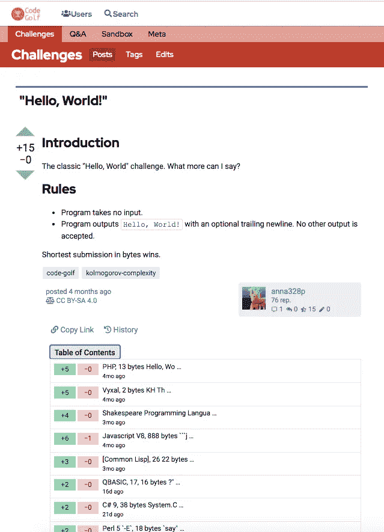
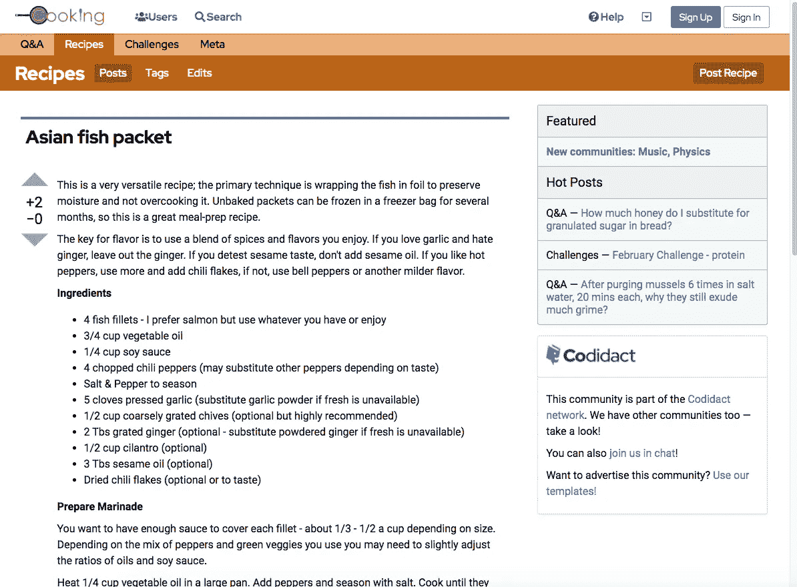
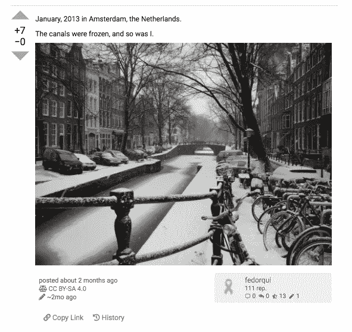
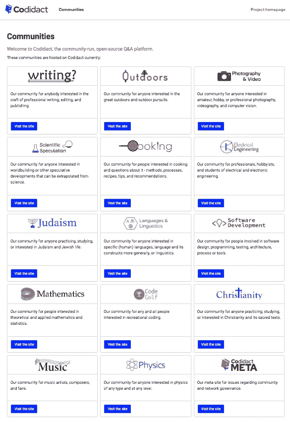

# 构建 Codidact 社区

> 原文：<https://medium.com/nerd-for-tech/building-codidact-communities-1b9e0895373e?source=collection_archive---------12----------------------->

coda CT 的团队领导 ArtOfCode 最近写道[构建 coda CT:不仅仅是技术](https://words.artofcode.co.uk/building-codidact/)。它是这样开始的:

> 在过去的 18 个月左右的时间里，我一直致力于《T2》的编码工作。我们从无到有，规划我们想要做的事情，建立系统，开始工作，改变路线，重新开始工作，切换系统，一路上欢迎和失去了一大批团队成员。上个月，我们处理了不到 500 万个请求和 50GB 的数据——这不是很大的规模，但肯定比我们团队中任何人处理过的任何事情都要大得多。一路走来，我们都学到了很多:我们的团队仍然很小，我们都有其他的承诺；虽然每个人都有自己擅长的事情，但我们都必须学习一些其他领域的知识，以便能够相互支持。

Art 写了平台和团队的演变，以及当宏伟计划与现实接触时发生的事情。在这篇文章中，我将重点关注社区方面——人、网站、功能、不断发展的需求以及我一路走来学到的东西。

我是莫妮卡·塞利奥，Codidact 的社区负责人。

# 起初

我是在 2019 年 10 月或 11 月才知道 Codidact 项目的。在接下来的几个月里，我们会谈论[我们将要建造什么](https://meta.codidact.com/posts/276296)以及我们将如何建造它，但与此同时，我们的社区迫切需要一个新家。

写已经被栈交换事件破坏了。社区领导希望迁移到 coda CT，但当时 coda CT 只是一个想法。2019 年 12 月，我们设置了一些“临时”软件，并导入了他们的大部分内容，因此他们可以在这里继续他们的社区。我们承诺在 Codidact 准备好之前用那个临时代码托管它们，然后把它们转移过来。我们从一开始就对我们的社区做出了承诺，为我们在构建 Codidact 方面的合作奠定了基础。

# 社区不会迁移；它们会碎裂

当我们开始写作时，我们认为这是“紧急疏散”。一些顶级用户已经退出了 Stack Exchange。我们担心如果我们等待，我们会失去与更多人的联系。当我们建立 Codidact 社区时，活跃用户试图传播消息。

堆栈交换阻碍了这一努力，这是他们作为平台所有者的权利，但更大的挑战是惰性。一个社区不是一个单一的有机体；它是所有参与其中的人的组合。当人们准备放弃沉没成本和克服惯性时，他们会在不同的时间达到临界点。除非有什么事情迫使这个问题发生(比如当前的主机关闭)，**社区不会走到一起，因为*人*不会走到一起** r

SE 的一些人马上搬到了 Codidact 社区。一些人在等待和观望。有些人退出了以前的社区，但也没有转移到 coda CT——他们只是走了。我认为有一些人两者都参与了，至少最初是这样。我认为，很多人很少参与关于社区的“元”讨论，甚至现在也不知道 Codidact 社区——他们仍然在那里，可能想知道一些以前多产的贡献者发生了什么。联系每个人很难，回想起来，我们应该更快地把重点放在建立新社区上。

人们很容易忘记，积极讨论社区运营和未来计划的人只占社区成员的一小部分。一个社区既需要活跃的成员，也需要临时的成员，既需要那些想了解运营细节的成员，也需要那些只想知道如何解决当前面临的问题的成员。我们没有吸引足够的后者，这阻碍了社区的发展。我们需要更多地关注新的可能性，而不是拯救所有旧的问题和答案。

# 社区是平台开发的合作伙伴

到 2020 年 6 月，也就是 7 个月后，我们已经建立了 6 个社区，学到了一些技术和面向社区的经验，并对我们决定作为基线采用的“临时”代码进行了一系列改进。大约在同一时间，有两个社区找到了我们，他们都已经在其他地方召集了感兴趣的参与者。我们能够在几天之内建立这两个平台，并且它们仍然处于活动状态。

其中一个叫[犹太教](https://judaism.codidact.com)，问我们是否可以内置一个他们已经在其他地方使用的引用用户脚本。这被证明是困难的，但是他们随后发现了一个我们可以更容易插入的工具。在我们做了代码审查之后，我们能够为他们添加它。几个月后，当 [Code Golf](https://codegolf.codidact.com) 社区要求我们支持不同的重要用户脚本时，我们能够添加他们需要的东西，这样每个人都可以使用它。这就是答案目录的由来。我们与社区合作，了解他们的需求，他们帮助我们找到解决方案。

我们根据自己的经验，对服务于我们的社区和参与者有自己的想法。我们从早期就已经获得了关于关键特性的广泛意见。但是**你永远无法预测所有的事情。我们的社区知道该平台仍在开发和演变中；虽然这意味着并非所有事情都已经完成，这可能会有点令人沮丧，但这也意味着我们可以与我们的社区一起努力，创造我们不知道重要的东西。**

> 因为我们和我们的社区一起工作，他们会放我们一马，有时甚至会贡献代码。我们是合作伙伴，而不是提供商和用户。这种合作帮助我们所有人建立更好的工具和更强大的社区。培养这种合作精神至关重要。

# 重新思考数据导入

因为我们想到了写作，第一个社区，作为一个撤离，我们从 Stack Exchange 中导入了大部分帖子，并为人们在我们的社区中声明他们的工作建立了一种方式。我们希望人们能够从他们停止的地方继续。我们接下来的三个社区中有两个紧随其后，也导入了内容。接下来的社区开始了新的生活。

我，我认为团队中的大多数人，现在认为这些批量进口是一个错误。特别是在开始的时候，访问者看到的网站看起来更像是克隆的；新的、本地的、原创的内容太容易被埋没了。加入 coda CT 并声称他们的帖子的人经常改进它们，这使得 coda CT 的副本比原件更好，但这还不够突出。与此同时，很多人从来没有创建过账户，所以我们有很多在 Codidact 上没有人关注的帖子。我们依恋旧事物，而关注新事物会更好。

大规模导入一年后，写作开始删除没有人做过任何事情的导入帖子——声明、编辑、投票。当这个完成后，我们希望结果会更新鲜，更有吸引力。

我认为选择性进口仍有一席之地，但 T2 有重新开始的价值。如果你想在 Codidact 上回答其他平台上的问题，你可以用你自己的话重新问这个问题，然后回答它。或者你可以写一篇博文或一个维基页面，这些选项都可以在 Codidact 上找到。**我们社区上的帖子应该是我们社区上的*人*投资的。**

# 拓展和增长:我们最大的挑战

我们现在有十几个社区，都是通过一个有点非正式的提议过程创建的。当一个提案有一个坚实的范围*和*“足够”的参与者来完成它时，我们会尝试进行集体评估，但这在很大程度上是一项正在进行的工作。我们使用的是判断，有时是直觉，而不是经过验证的指标。我们还没有*经过*验证的指标。[我们希望与我们的社区一起努力改进。](https://meta.codidact.com/posts/279903)

我们的社区正在做一些伟大的事情(当我们没有他们需要的工具时让我们知道)。我的问题得到了很好的答案，并试图为其他人提供好的答案。我看到我们的社区创造了非正式的挑战，这样人们即使没有问题也可以分享。我们的[电气工程](https://electrical.codidact.com/)社区有论文和 Q & A，并且[软件开发](https://software.codidact.com/)接受代码评审的请求。[烹饪](https://cooking.codidact.com/)有菜谱。我对这些新的共同学习方式感到兴奋。

我们的社区仍然很小。一些人或多或少的活跃会有所不同，尤其是在开始的时候。活跃产生活跃，不活跃产生不活跃。我们没有拥有成千上万推特粉丝或博客读者的人。我们的社区一次成长一个人，通常是通过个人拓展或口口相传。我们需要找到接触更多人的方法，我们需要为加入我们的人提供良好的体验。我们如何做到这一切，有时会让我夜不能寐。

# 一天比一天好

我们已经完成了很多，我为我们的团队和我们的社区感到骄傲。在平台和社区发展方面，我们还有很多工作要做，我们欢迎帮助和投入。我们在我们的[网络元社区](https://meta.codidact.com/)上有积极的讨论，我们欢迎对我们的[开源项目](https://github.com/codidact/qpixel)的贡献者和我们的[社区](https://codidact.com/)的参与者。

我们还在学习。我还在学习。在其他地方多年的中庸经验让我为一些事情做好了准备，但在其他方面，我正在不断学习。有些课程可以很好地移植，比如如何以欢迎的方式给出建设性的反馈。其他的挑战是新的，比如帮助小的新社区有一个积极的开端。

我认为，如果今天比昨天更好，明天可能比今天更好，那么我们就在正确的轨道上——一起建设，由社区建设，为社区建设，边建设边学习。

