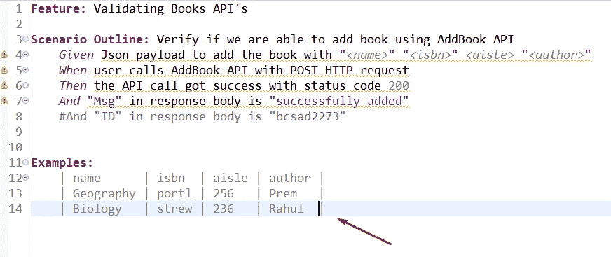
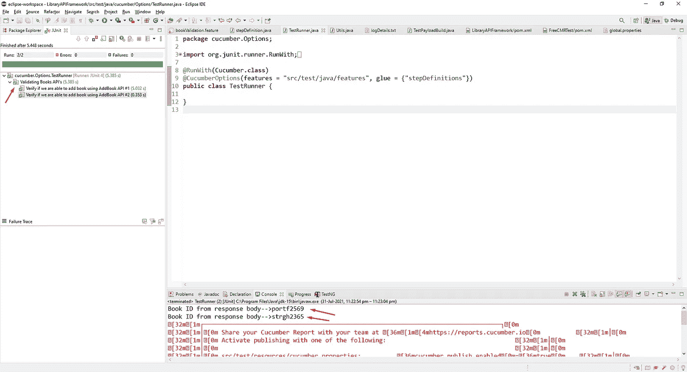
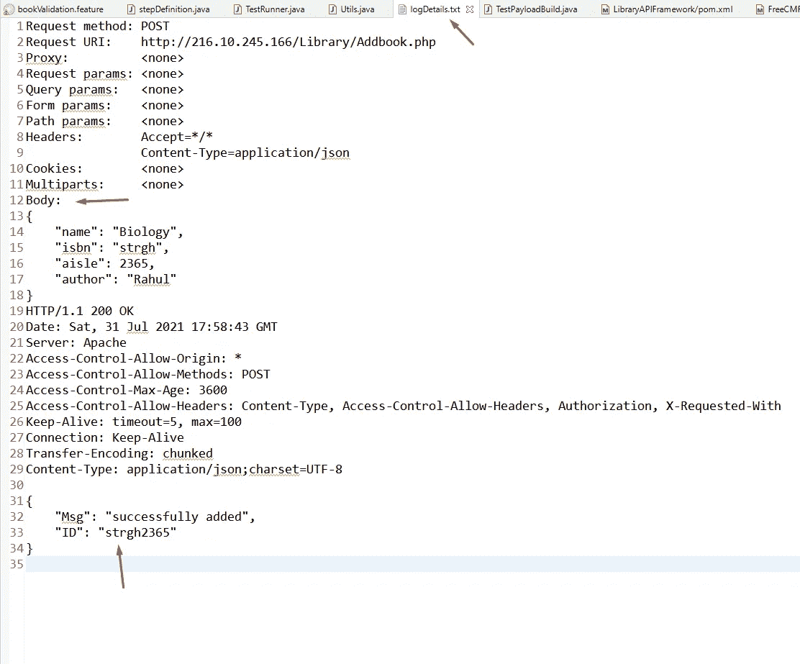
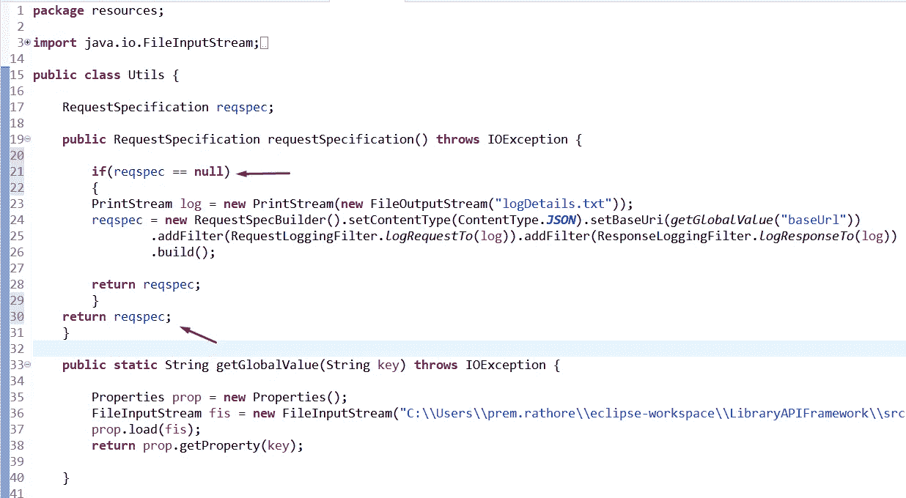
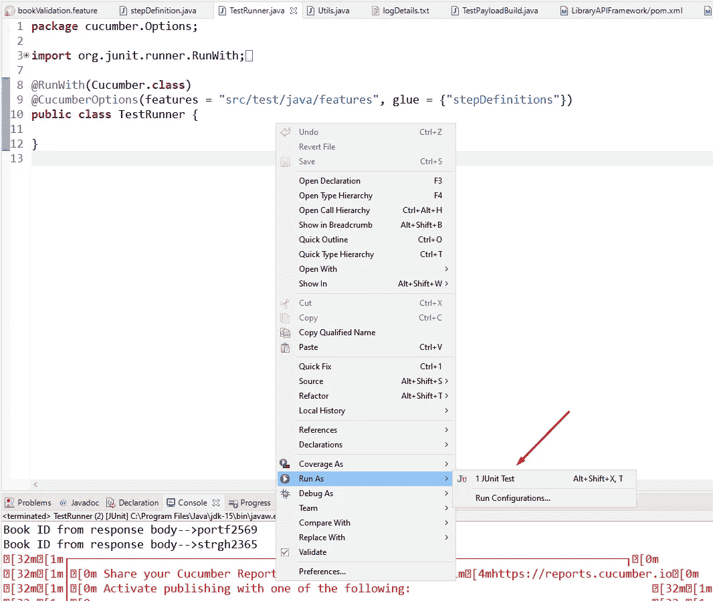
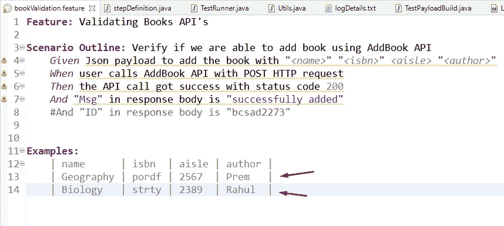

# 从头开始构建黄瓜 BDD API 测试框架:第 5 部分

> 原文：<https://medium.com/nerd-for-tech/building-cucumber-bdd-api-testing-framework-from-scratch-part-5-c4e7445d4eec?source=collection_archive---------7----------------------->


在上一部分中，我们看到了如何动态驱动数据。在这一部分，我们将看到如何用多个数据集来参数化我们的测试。

每当您构建一个自动化测试时，您应该使用多个数据集来测试它，以确保它是工作还是失败。

现在我们需要在 ***例子下再添加一行*** 关键字。



现在，一般来说，当你想通过 excel 实现同样的事情时，你必须编写大量的代码来扫描每一行，从每一行中，它必须挑选数据并触发测试，但这不是黄瓜的情况。

现在，如果您运行这个测试，它将自动使用两个不同的数据集运行两次。确保您更改了 ISBN 和过道信息，否则它会在控制台输出中抛出 404 错误。

现在让我们用 Test Runner 类来运行测试



您还可以看到它给出了两个 id，因为我们从特征文件传递了两组信息。

现在，让我们看看日志文件中的测试用例细节。



如您所见，我们的日志文件只显示了一组数据的信息，它用 ***代替了*** 第二组数据信息。

为了防止数据替换，我们需要在 ***Utils 类*** 中提供 ***if 条件*** ，我们也将所有信息记录在日志文件中。



我们还要求将请求规范变量设为静态，这样它就不会创建另一个实例，而是在整个类中使用同一个实例，以防止在 ***if 条件中出现空指针错误。***


让我们再运行一次测试用例，检查日志文件中是否记录了所有内容。在您运行测试用例之前，确保更改了 ***ISBN 和过道*** 信息。



下面，我粘贴了日志文件和特征文件图像中的所有信息，以验证数据是否匹配。

```
Request method: POSTRequest URI: http://216.10.245.166/Library/Addbook.phpProxy: <none>Request params: <none>Query params: <none>Form params: <none>Path params: <none>Headers: Accept=*/*Content-Type=application/jsonCookies: <none>Multiparts: <none>Body:{“name”: “Geography”,“isbn”: “pordf”,“aisle”: 2567,“author”: “Prem”}HTTP/1.1 200 OKDate: Sat, 31 Jul 2021 18:47:02 GMTServer: ApacheAccess-Control-Allow-Origin: *Access-Control-Allow-Methods: POSTAccess-Control-Max-Age: 3600Access-Control-Allow-Headers: Content-Type, Access-Control-Allow-Headers, Authorization, X-Requested-WithKeep-Alive: timeout=5, max=100Connection: Keep-AliveTransfer-Encoding: chunkedContent-Type: application/json;charset=UTF-8{“Msg”: “successfully added”,“ID”: “pordf2567”}Request method: POSTRequest URI: http://216.10.245.166/Library/Addbook.phpProxy: <none>Request params: <none>Query params: <none>Form params: <none>Path params: <none>Headers: Accept=*/*Content-Type=application/jsonCookies: <none>Multiparts: <none>Body:{“name”: “Biology”,“isbn”: “strty”,“aisle”: 2389,“author”: “Rahul”}HTTP/1.1 200 OKDate: Sat, 31 Jul 2021 18:47:03 GMTServer: ApacheAccess-Control-Allow-Origin: *Access-Control-Allow-Methods: POSTAccess-Control-Max-Age: 3600Access-Control-Allow-Headers: Content-Type, Access-Control-Allow-Headers, Authorization, X-Requested-WithKeep-Alive: timeout=5, max=100Connection: Keep-AliveTransfer-Encoding: chunkedContent-Type: application/json;charset=UTF-8{“Msg”: “successfully added”,“ID”: “strty2389”}
```



现在一切都在按预期工作。因此，我们已经通过优化 ***Utils 类*** 中的代码修复了数据替换问题，同时，我们看到了如何使用多个数据集运行测试用例。

并且， [*这里的*](https://github.com/Premsing/LibraryAPIFramework) *是到 GitHub 仓库下载代码的链接。*

感谢阅读。