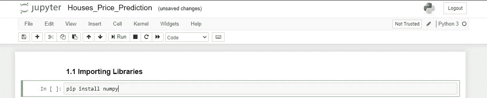
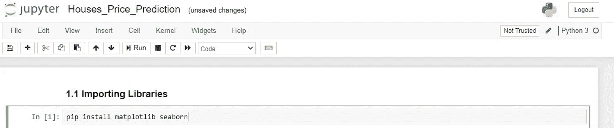
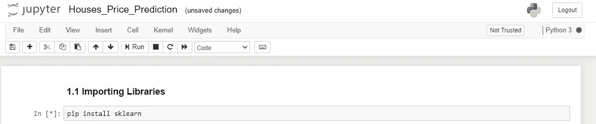
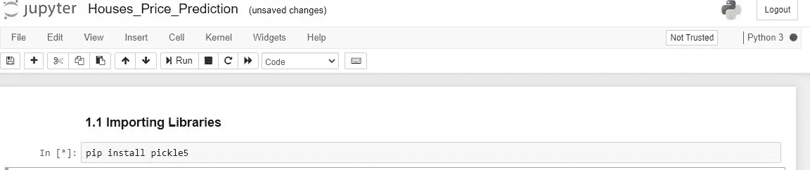
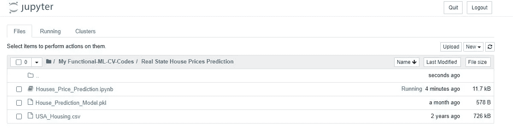

# 构建机器学习模型

> 原文：<https://medium.com/nerd-for-tech/building-deploying-machine-learning-model-using-pickle-d5ad5c979acd?source=collection_archive---------1----------------------->

*我们都知道，机器学习在今天的商业、工业和教育中变得越来越流行，每个人都想学习机器学习，因此，本文将拓展您对机器学习和数据科学的理解。*

> 让我们开始讨论如何在 python-jupyter 笔记本的帮助下构建一个简单的机器学习模型，然后将其部署为 web、桌面和 android 应用程序的后端。

首先，你需要下载 [Anaconda Navigator](https://docs.anaconda.com/anaconda/install/windows/) ，并按照官方下载页面给出的说明进行安装。然后运行 jupyter-notebook。

> 我们将使用 jupyter-notebook，并需要在转向建筑模型之前安装一些库。下面列出了库。

**1-Numpy:** 来源于两个词 Num 的意思是“数值”，py 的意思是“Python”，用于处理数组，用于快速处理，用于数学运算。已经下载了 anaconda 安装。如果没有，请用下面的命令下载它，

```
pip install numpy
```



Numpy 库安装

**2-Pandas:** 用于读取、制作、写入来自不同资源的数据集，并自行制作数据集。用下面的命令下载它，

```
pip install pandas
```


熊猫图书馆装置

3-Seaborn & Matplotlib: 最流行和最有用的数据可视化库。您可以使用下面的命令下载它们，

```
pip install matplotlib seaborn
```



Matplotlib & Seaborn 库安装

**4-Sklearn:** 最流行和最有用的库之一，支持几乎所有的机器学习算法，如分类、回归、聚类等。你可以用下面的命令下载它，

```
pip install sklearn
```



Sklearn 库安装

现在，我们将转向建筑模型，让我们一步一步地开始。

**Pickle5:** 用于部署机器学习模型。你可以用下面的命令下载它。

```
pip install pickle5
```



泡菜库安装

**步骤 1:** 导入必要的库。

```
import numpy as np             //used for working with arrays
import pandas as pd            //used for reading dataset
import seaborn as sns           //use for attractive visualization
from sklearn.linear_model import LinearRegression // importing model
from sklearn.model_selection import train_test_split 
                        //for splitting of test and train.
import pickle5 as pickle   //used for deploying machine learning model
```

**步骤 2:** 读取数据集。您可以从链接下载数据集，然后需要将它粘贴到 jupyter-notebook 文件所在的目录中，然后读取它。

```
data = pd.read_csv(‘USA_Housing.csv’)   // read csv dataset
```

**第三步:**使用熊猫进行预处理。

```
data.head()    //checking first five rows of data
data.tail()    //checking last five rows of data
data.info()  //checking null or not null values/information of data
data.columns  //checking features and target variable in data
data.describe()
```

**步骤 4:** 使用 seaborn 实现数据可视化。

```
sns.pairplot(data) 
//plotting all features except string/alphanumeric/alphabetic features
```

因为我们没有大量数据，所以简单的可视化将最大限度地清楚了解数据，但有时数据太大，所以在预处理中，我们需要了解更多的内部数据，而不是我们需要更多的可视化。你可以从[链接](https://matplotlib.org/gallery/index.html)中找到如何可视化数据。

**步骤 5:** 选择特征和目标变量。

```
X = data[[‘Avg. Area Income’, ‘Avg. Area House Age’, ‘Avg. Area Number of Rooms’,‘Avg. Area Number of Bedrooms’, ‘Area Population’]]             //FeaturesY = data[‘Price’] ## Target Variable
```

我们选择价格作为目标变量，因为我们需要预测房价。

**第六步:**将数据拆分成列车&测试。

```
X_train,X_test,Y_train,Y_test = train_test_split(X,Y,test_size = 0.2,train_size = 0.8, random_state = 1)
```

我们将数据分为训练和测试，其中测试规模= 20%，训练规模=80%。

**步骤 7:** 将训练数据拟合到机器学习模型中

```
LR = LinearRegression() //create an instance for LinearRegression
LR.fit(X_train,Y_train) //fit data in model
```

**步骤 8:** 现在，测试模型有了测试数据。

```
from sklearn.metrics import r2_score,mean_absolute_error,mean_squared_error
                      //importing accuracy library.predict = LR.predict(X_test)
```

**步骤 9:** 现在，我们将检查已建模型的准确性、r2 分数等

```
print(“Accuracy of Linear Model will be = “,r2_score(Y_test,predict))
```


准确度= 91%

我们的模型准确率为 91%，这意味着我们的模型是最好的，现在我们将使用 pickle 部署它。

**步骤 10:** 使用 pickle5 部署模型。

```
pickle.dump(LR, open(“House_Prediction_Model.pkl”, ‘wb’))
```

运行上面的命令后，您可以在文件目录中看到创建了一个名为“House_Prediction_Model.pkl”的 pickle 文件。



Pickle 文件创建视图。

> 这就是关于构建和部署机器学习模型的所有内容，您可以自己尝试构建不同的机器学习模型，并使用 pickle 部署这些模型。

*项目 Github* [*链接*](https://github.com/RizwanMunawar/Houses-price-prediction-machine-learning-)

*以上就是关于“构建机器学习模型”的全部。您可以在自己的数据上尝试这样做。*

*   *从视频创建数据集:* [*文章链接*](/nerd-for-tech/extraction-of-frames-from-a-single-video-2b9fdd901208)
*   *为定制训练标注数据:* [*文章链接*](/nerd-for-tech/labeling-data-for-object-detection-yolo-5a4fa4f05844)
*   *列车 YOLO-v5 月自定义数据:* [*文章链接*](/nerd-for-tech/how-to-train-yolov5-on-custom-data-9983a545e509)
*   *如何修剪和稀疏 yolov 5:*[*文章链接*](/nerd-for-tech/how-to-prune-sparse-yolov5-da19e1d84a6)
*   *yolov 5 的超参数如何工作:* [*文章链接*](https://chr043416.medium.com/how-hyperparameters-of-yolov5-works-ec4d25f311a2)

**关于我:**

我有超过 1 年半的软件开发工作经验。目前，我是一名软件工程师，通过使用零售分析、建立大数据分析工具、创建和维护模型以及加入引人注目的新数据集，为我们的客户改进产品和服务。

以前，我是 Spark 基金会的计算机视觉实习生，在那里我获得了分析来自不同开源平台(包括 Kaggle、Google Images、Open Images 等)的视觉数据的经验。，并在这些数据上训练不同的深度学习模型。

*   [*在 LinkedIn 上和我联系*](https://www.linkedin.com/in/muhammadrizwanmunawar/)
*   [*与我协商*](https://www.upwork.com/services/product/consultation-1477666319161577472?ref=project_share)
*   [*我的 yolov5 服务*](https://www.upwork.com/services/product/you-will-get-image-classification-projects-using-machine-learning-with-python-1323963101029052416?ref=project_share)

***如有任何问题，欢迎在下方评论***