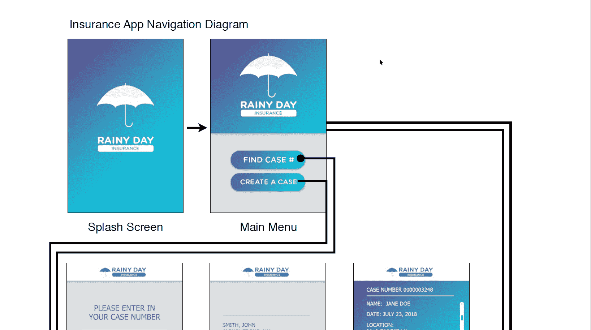
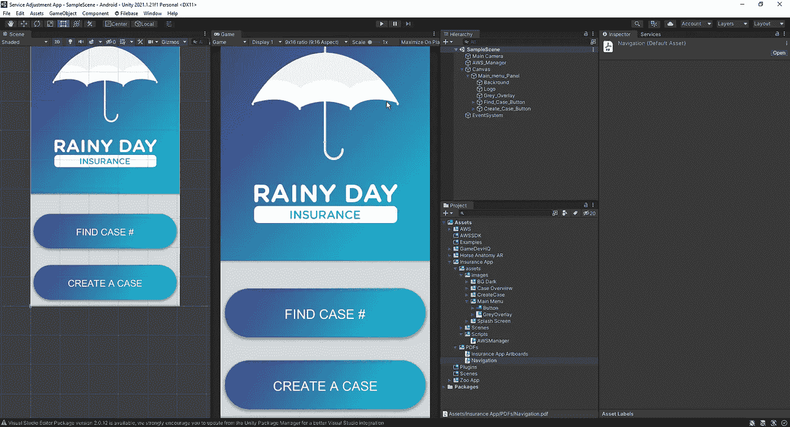
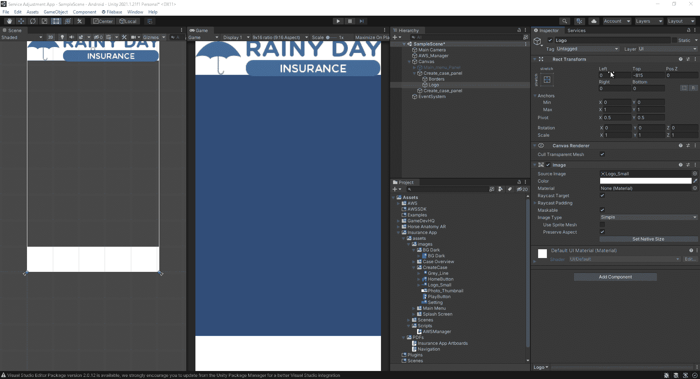
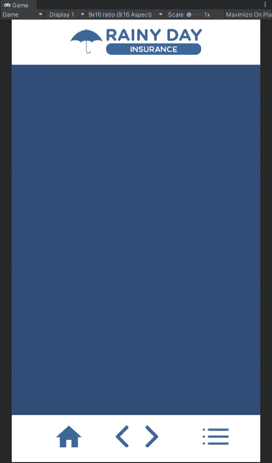
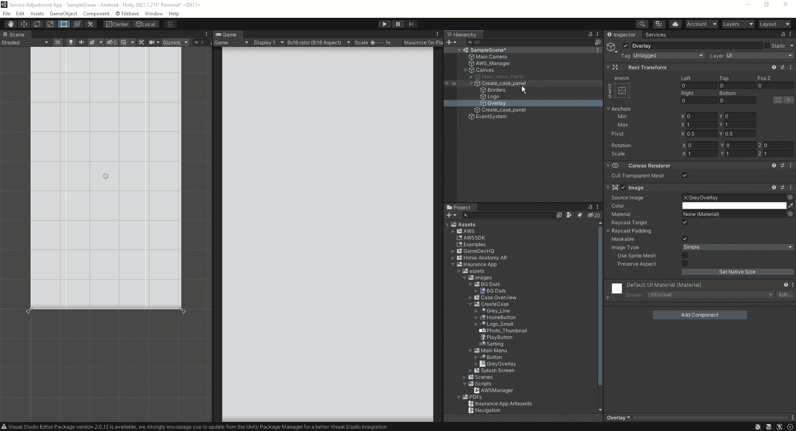

# 使用 Unity 构建企业应用

> 原文：<https://medium.com/nerd-for-tech/building-enterprise-apps-with-unity-1250fb0f507e?source=collection_archive---------5----------------------->

让我们暂时离开游戏，看看如何在 Unity 中构建企业应用。
首先，我们将着眼于构建一个保险应用程序，让用户能够找到他们的案例#或创建一个案例。为了构建它，通常会有一些画板和导航系统，作为程序员，我们需要遵循:

因此，让我们开始构建我们将要使用的面板。第一个面板将是我们的主菜单:

正如我们所看到的，我们添加了一个画布，创建了主菜单面板，并使用提供给我们的资源来创建菜单。接下来，让我们看看如何制作下一个面板:

对于我们的下一个面板，我们将创建一个基础面板，我们可以使用它作为其他面板的图层。由于我们将在各种面板中使用相同的设计，因此浪费时间在多个面板上创建相同的基本设计是没有意义的。正如我们在上面看到的，对于徽标，我们可以通过调整它与左右两侧边缘的距离来调整它在面板顶部的大小:

可以用来创建指向右边的箭头的一个小技巧是在变换中将比例设置为-1:

完成覆盖面板后，我们可以开始为将要使用的其他面板创建布局:

接下来，当我们使用面板的覆盖图时，我们希望确保它位于列表的顶部，这样我们在它下面构建的所有内容都会显示在我们的屏幕上:

最后，我们将得到这样的下一个面板。当我们处理文本时，我们会希望确保在选项中，我们设置它以使文本溢出，允许我们遵循给我们的期望设计。
现在，我们已经完成了为应用程序创建面板的流程，下次我们将了解如何在应用程序中创建的不同面板之间创建功能。